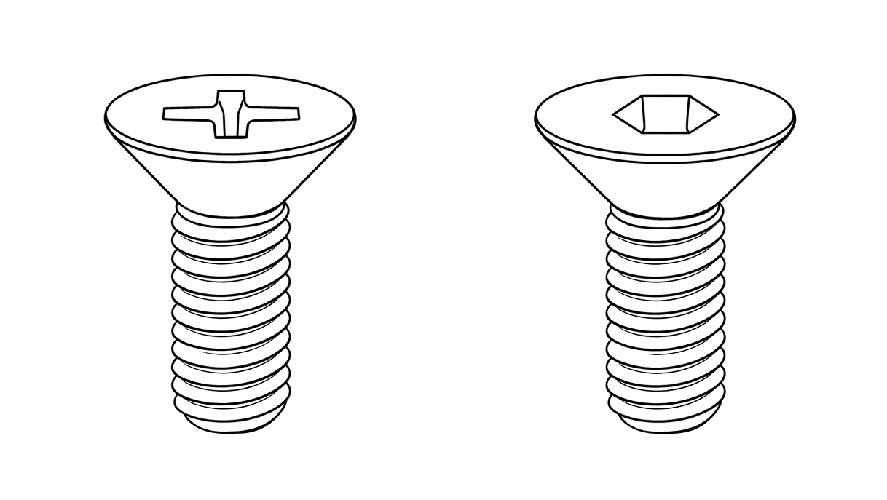
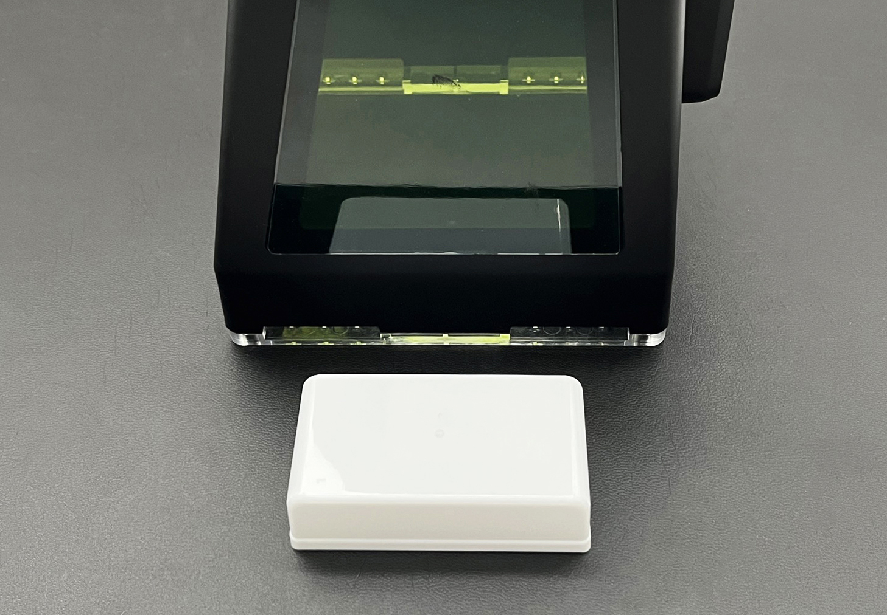
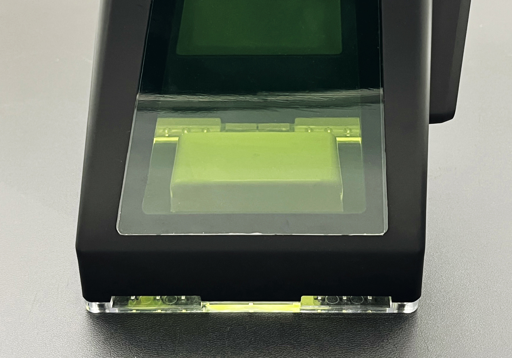
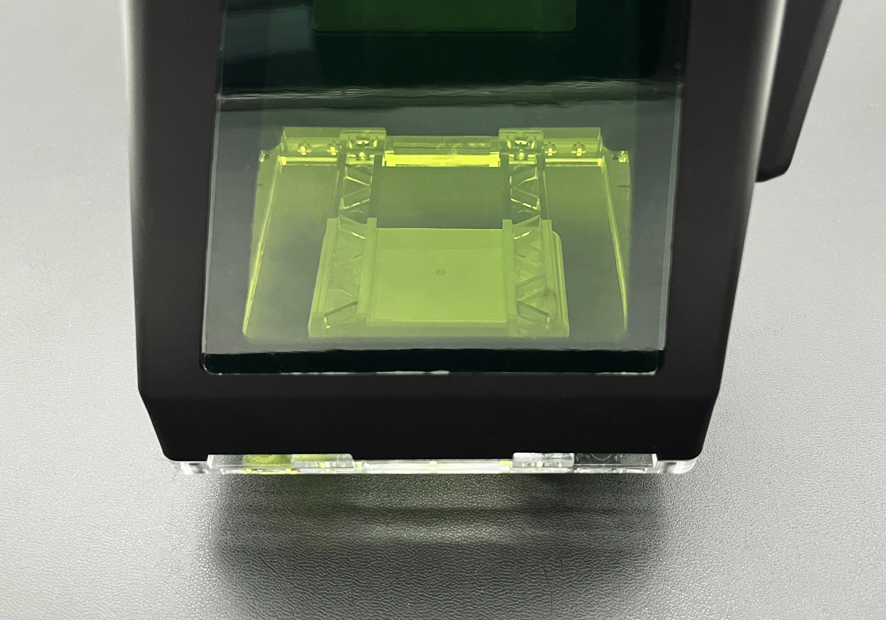
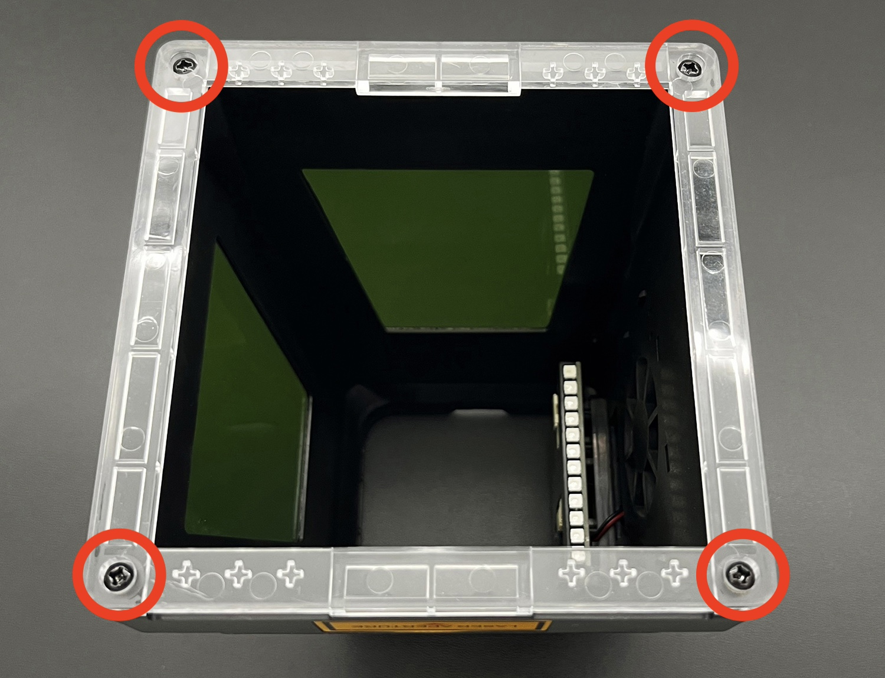
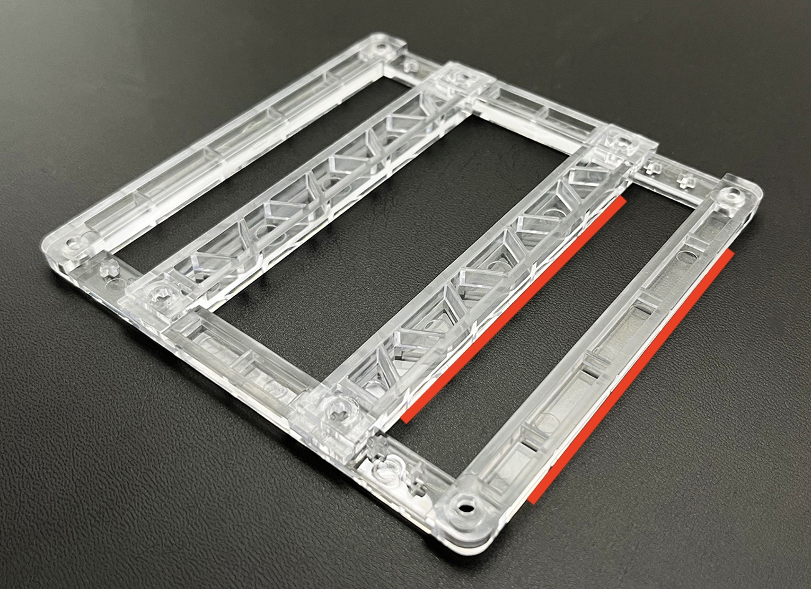

# ハードウェアセットアップ

## カバー取り付け方法

カバーを取り付ける際は、本体の電源を必ずお切りください。

カバーの凹部と、ハンドガンのトリガー側にある突起を合わせて差し込みます。

付属の「十字穴付き皿小ねじ」または「六角穴付き皿小ねじ」を使用して固定します。お好きな方をお使いください。 
使用中にネジが緩まないよう、必ず確実に固定してください。固定が不十分な場合、接触不良の原因となることがあります。

## インナーフレーム取り付け方法

カバーの開口部より小さいワークに加工する場合、焦点距離を適切に確保することが難しくなくなります。
このような場合は、標準カバーに取り付いているベースフレームにインナーフレームを組み込んで使用します。

通常の開口幅は110mmです。 
インナーフレームを使用すると 95 / 80 / 70 / 60 / 50 / 40 mm の幅に段階的に調整できます。

<table class="noframe" style="width:auto" >
<tr>
<td style="padding:0"></td>
<td style="width:5px"></td>
<td style="padding:0"></td>
</tr>
</table>

標準カバーからベースフレームを取り外し、ベースフレームの十字マークにインナーフレームの穴を合わせてしっかりとはめ込みます。フレームの底面が揃う向きで取り付けてください。 
再度ベースフレームを標準カバーに取り付けます。ベースフレームの取り付け向きに注意してください。

<table class="noframe" style="width:auto" >
<tr>
<td style="padding:0"></td>
<td style="width:5px"></td>
<td style="padding:0"></td>
</tr>
</table>

加工を行う前に、加工範囲がフレーム内に収まっていることを必ずご確認ください。

