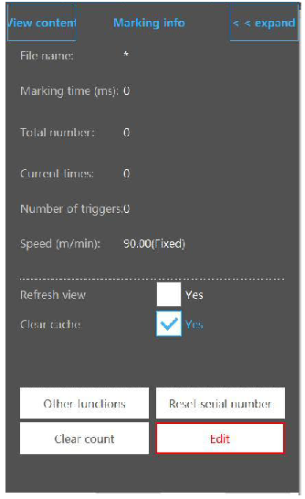

# 1. ホーム

メイン画面は図1-1のとおりです。

## 1.1. ログイン

ログインボタンをクリックすると、パスワード入力画面がポップアップ表示されます。

ログインパスワード：123 
※管理者の初期パスワードです。異なる権限でシステムにログインすることもできます。

## 1.2. システムステータスバー

システムステータス表示
: マーキングシステムの動作状態やエラー情報などを表示します。

更新（Refresh）
: 飛行マーキング中に情報をオンライン更新することができます。オンライン更新には2つの方式があります。
1つ目は「システムキャッシュを2回行った後にマーキング内容を更新する」方式です。オンライン更新をクリックすると、システムはもう一度マーキングを実行し、その内容を1回更新します。修正後の内容がマーキングされます。
2つ目は「リアルタイム更新」です。オンライン更新をクリックすると、システムの次回マーキングが修正後の内容になります（高速生産ラインでは、リアルタイム更新により打刻抜けが発生するおそれがあります）。

フォーカスライト（Focus light）
: 赤色フォーカス用の赤色ライトチューブをシステムに接続している場合に使用します。つまり、2本の赤色ライトを接続します。

ガイドライト（Guide light）
: 赤色ガイド光で、データのマーキングエリアをプレビューします。

テスト（Test）
: 現在選択されているデータのマーキング時間をテストします。マーキング後、ステータスバーでマーキング時間を確認できます。

マーキング情報（Marking info）
: ボタンをクリックすると、下記の画面がポップアップ表示されます。

内容表示（View content）
: 現在のマーキング内容を表示します。

ファイル名（File name）
: 現在マーキング中のファイル名を表示します。

マーキング時間（Marking time（S））
: 現在のファイルのマーキング時間。

現在回数（Current times）
: スタートコーディングをクリックしてからのマーキング回数をカウントします。

速度（Speed（m/min））
: 現在のエンコーダが取得したラインの実速度、またはシステムで設定したシミュレート速度を表示します。

表示更新（Refresh view）
: マーキング中に、画面上の表示内容をリアルタイムで更新します。

キャッシュクリア（Clear cache）
: オンライン更新機能を使用する際に、マーキング済み内容の以前の状態をリアルタイムでクリアするかどうかを設定します。
チェックされていない場合、システムは2回分のキャッシュ後にマーキングを更新します。システムは内容を2回マーキングし、その後、修正された内容でマーキングを更新します。
チェックされている場合はリアルタイム更新となり、オンライン更新をクリックした後、システムの次回マーキングが修正後の内容になります（高速生産ラインでは、リアルタイム更新により打刻抜けが発生するおそれがあります）。

アラームクリア（Clear alarm）
: アラーム情報をクリアします。

シリアル番号リセット（Reset serial number）
: 生産を停止せずにシリアル番号をリセットできます。

カウントクリア（Clear count）
: 現在回数または総回数をクリアします。

編集（Edit）
: オンライン編集機能です。マーキング中にクリックすると編集画面に戻り、データを修正した後、オンライン更新機能をクリックします。

スタート／一時停止マーキングボタン
: 加工の開始や一時停止を行います。

## 1.3. 編集バー

精度（Precision）
: 上下左右、またはロータリーボタンを1ステップ回したときに各ポイントが移動する距離や角度を設定します（単位：mm／deg）。

オブジェクト追加（Add object）
: マーキングする対象を追加します。追加できるものには、テキスト、ポイント、ライン、円、矩形、バーコード、QRコード、グラフィック、ディレイヤー、出力ポートなどが含まれます。

### 1.3.1. 文字の追加

テキストボタンをクリックすると、テキスト編集画面に入ります。

上へ移動（Move up）
: データの順序を調整し、前方へ移動します。

下へ移動（Move down）
: データの順序を調整し、後方へ移動します。

編集（Edit）
: 固定テキスト、シリアル番号、日時、ファイル読み込み、シフトコード、外部データ、ランダムコードなどを編集します。

削除（Delete）
: 追加した内容を削除します。

改行（Line change）
: 枝分かれさせて情報を追加します。

管理（Management）
: 変数を管理します。

#### 1.3.1.1. 固定テキストの追加

コンテンツ編集画面に入ると、システムは空の固定テキストを自動的に1つ生成します。編集をクリックするとテキストボックスがポップアップし、空白部分をクリックするとキーボードが表示されます。新しく固定テキストを追加する必要がある場合は、固定テキストボタンをクリックして追加します。デフォルトの内容は「TEXT」です。

**固定テキストの編集**

固定テキスト「TEXT」を選択し、編集ボタンをクリックして編集画面に入ります。

内容ボックスをクリックするとキーボードがポップアップします。

フォント（Font）
: テキストフォントを選択します。ドットマトリクスフォント、シングルラインフォント、ダブルラインフォントから選択できます。

文字高さ（Word height）
: フォントの高さ。

文字幅係数（Word width factor）
: デフォルト値は1で、値を変更することでフォントの幅を変更します。

文字間隔（Spacing）
: 文字同士の間隔。

行間隔（Line spacing）
: 同一テキスト内の各行同士の間隔。

配置モード（Alignment mode）
: 同一テキスト内の複数行の整列方法。

「ファイルへ保存」「タイムスタンプ」「ファイル保存」
: 記録機能であり、使用状況を記録します。

#### 1.3.1.2. シリアル番号の追加

シリアル番号ボタンをクリックすると、デフォルト内容「0000」のシリアル番号が追加されます。

**シリアル番号の編集**

シリアル番号を選択し、編集ボタンをクリックすると、次に示すシリアル番号編集画面がポップアップ表示されます。

| 項目 | 説明 |
|:--:|---|
| 名称 |  現在のシリアル番号名（初期値は空欄） |
| 開始値 | この値からカウントを始めます。 |
| 終了値 | この値でカウントが終了します。 |
| 現在値 | 現在のカウントです。 |
| 加算値 | 加算値を設定します。 |
| 桁数 | 桁数を設定します。 |
| 先頭記号 | 先頭番号を設定します。 |
| Custom base |  ［Set］をクリックして設定画面に入ります。図のように20進数システムを設定すると、シリアル番号が009まで進んだ後、00A、00B、00C…00Jまで進み、その後010に進みます。クイックフォーマット切替により、データ形式を素早く切り替えることができます。例えば「ABCモード」に切り替えると、シリアル番号は 00A、00B、00C… のように表現されます。 |
| Change method |  変更方法として、自動モードと手動モードがあります。 |
| 加工回数 | 単一のシリアル番号の繰り返し加工数を設定します。 |
| 現在の回数 | 現在のシリアル番号の刻印回数です。 |
| サイクル | 生産中にシリアル番号を自動リセットするかどうかの設定であり、チェックを入れることで機能が有効になります。 |
| 番号のリセット | チェックボックスをオンにすると、シリアル番号が生産サイクル内でリセットされます。 |
| Control signal output | 使用しません。 |
| Reset mode |  シリアル番号を開始値にリセットするか、スプレー回数をリセットするかを選択できます。 |
| Timing reset |  リセット時刻を設定します。図に示すように、コード印字処理中にシリアル番号を毎日14:22:14に定期的にリセットする、といった設定が可能です。 |

**Change method**

<TODO:外部IO説明修正>
| 項目 | 説明 |
|:--:|---|
| Automatic mode |  シリアル番号が自動的に次の値へ進みます。 |
| Manual way |  外部IO入力によって、次の値へ進めます。 |

#### 1.3.1.3. 日付／時刻の追加

日付／時刻ボタンをクリックすると、次に示すように、システムの日付／時刻が追加されます。

<table class="noframe">
<tr>
<td style="padding:20px"></td>
<td style="padding:20px"></td>
</tr>
</table>

**日付／時刻の編集**

日付／時刻を選択し、編集（Edit）ボタンをクリックすると、次に示す日付／時刻編集画面がポップアップ表示されます。

| 項目 | 説明 |
|:--:|---|
| 形式の選択（Select the format） | システム内蔵の日時フォーマットが用意されており、そのまま選択して使用できます。 |
| 形式の修正（Modify the format） | 日時フォーマットを編集します。区切り記号や、年月日の並び順などを変更できます。 |
| 時刻オフセット（Time offset） | 年・月・日・時・分・秒を現在時刻を基準として増減させることができます。例えば、「日」の値に1を加えると翌日、「日」の値を -1 にすると前日となります。他の項目も同様です。 |
| カスタム形式（Custom format） | カスタマイズした時間変数の表現を設定します。下図のように［Enable customization］をクリックしてカスタマイズを有効にし、下の「年」などを選択してフォーマットを編集します。 |
| 保証期間（日）（Warranty period（days）） | この期間中に日付／時刻を編集する場合、システムは自動的にカスタム形式を既定の設定として使用します。 |

#### 1.3.1.4. ファイル読込

ファイル読込ボタンをクリックし、テキストファイルまたはExcelファイルを選択して空のファイル項目を追加します。

**テキストファイルの編集**

「Text Read（テキスト読込）」を選択し、Editボタンをクリックすると、ファイル読込の編集画面がポップアップ表示されます。

| 項目 | 説明 |
|:--:|---|
| Select file | ファイルパスの後ろにある選択ボタンをクリックすると、（システム内またはUSB内の）ファイルパス画面がポップアップするので、読み込むファイルを選択します。 |
| Line number | 現在マーキングしているテキストの行番号。 |
| Cycle | テキストファイルを循環してマーキングするかどうかを設定します。最後の行までマーキングした後、自動的に最初の行から再びマーキングを開始します。 |
| Add GS1 Leading | 顧客専用のファイルと組み合わせて使用します。 |

**Excelファイルの編集**

「Excel Read（Excel読込）」を選択し、Editボタンをクリックすると、Excel読込の編集画面がポップアップ表示されます。

| 項目 | 説明 |
|:--:|---|
| Select file | ファイルパスの後ろにある選択ボタンをクリックすると、（システム内またはUSB内の）ファイルパス画面がポップアップするので、読み込むファイルを選択します。 |
| Line number（row） | 現在マーキングしている行番号。特定の行を指定して選択できます。 |
| Field name（col） | テーブルに複数列がある場合、マーキングする列を選択できます。 |
| loop | 循環マーキングを行うかどうかを設定します。ファイルの最後の行までマーキングした後、自動的に最初の行から再びマーキングを開始します。 |
| Fixed line mode | 特定の1行のみを繰り返しマーキングするモードです。 |
| Repeat count | 単一行を何回繰り返しマーキングするかの回数。 |
| Current repeat | 単一行の繰り返しマーキングが、現在何回実行されたかを示します。 |

#### 1.3.1.5. プランの追加

Planボタンをタップして新規Planを作成し、Editボタンをタップしてコードスキップ情報を編集します。

| 項目 | 説明 |
|:--:|---|
| Add | スキップコードのリストを追加します。 |
| Delete | スキップコードのリストを削除します。 |
| Edit | タイミングスキップコード情報を編集します。 |
| File format | 編集対象として、システム内部のファイルまたはUSB内のファイルを選択できます。 |

たとえば、下図左の画面でEditボタンをクリックすると、下図右に示すスキップコード内容の編集画面に入ります。ここでスキップコード情報と開始時刻を修正します。

この例では、00:00:00～12:00:00 の間は「A」を印字し、12:00:00～00:00:00 の間は「B」を印字する、というプラン情報を示しています。

<table class="noframe">
<tr>
<td style="padding:20px"></td>
<td style="padding:20px"></td>
</tr>
</table>

#### 1.3.1.6. 外部データの追加

通信機能です。ご利用の際は弊社サポートまでお問い合わせください。

#### 1.3.1.7. ランダムコードの追加

システムがマーキング用のデータをランダムに生成します。Editをクリックするとランダムコード編集画面に入ります。

| 項目 | 説明 |
|:--:|---|
| フォーマット | 数字は「*」、小文字は「a」、大文字は「A」で表します。 |
| Change by day | 同じ日は固定のランダムコードを使用し、翌日になると新しいコードに変更されます。 |
| 更新 | ランダムコードを再生成します。 |

例：`***aaaAAA` の場合、3桁の数字・3文字の小文字・3文字の大文字を組み合わせたランダムコードとして認識されます。

### 1.3.2. 描画

描画機能には、直線、点線、点、円、矩形などが含まれます。

#### 1.3.2.1. ドットの追加

描画機能でDotボタンをクリックします。上の図のように、ホーム画面の変更ボタンでそのパラメータを変更できます。また、下図に示すように、設定 → マーキングパラメータで「ポイントパルス出力」または「ポイント時間出力」を選択することもできます。

#### 1.3.2.2. ラインの追加

描画機能のLineボタンをクリックすると、通常の直線、ミシン目用の点線、円形のミシン目線、点状のミシン目線などを追加できます。

#### 1.3.2.3. 直線の追加

ラインタイプを「直線」に設定し、図2-19および図2-20に示すように線の長さを設定します。

#### 1.3.2.4. ミシン目線（tear line）の追加

ミシン目線のタイプには、点線・円・点などがあり、図2-21のように各セルの直径や間隔を設定します。

<TODO:再構成>

#### 1.3.2.5. 円の追加

描画メニューのCircleボタンをクリックすると、円を追加できます。

#### 1.3.2.6. 矩形の追加

描画メニューの矩形（Rectangle）ボタンをクリックすると、矩形を追加できます。

#### 1.3.2.7. グラフ（画像）の追加

Graphボタンをクリックすると、図2-24に示す追加画面がポップアップします。サポートされる形式は dxf、plt、jpg、png、bmp です。

