# クイックスタート

この章では、ログインから加工、保存、終了までの基本操作を順番に説明します。

## 本体の起動

電源ケーブルをコンセントに接続し、本体側面の電源スイッチをオンにします。緊急停止ボタンが押されいる場合は矢印の向きに回して解除してください。

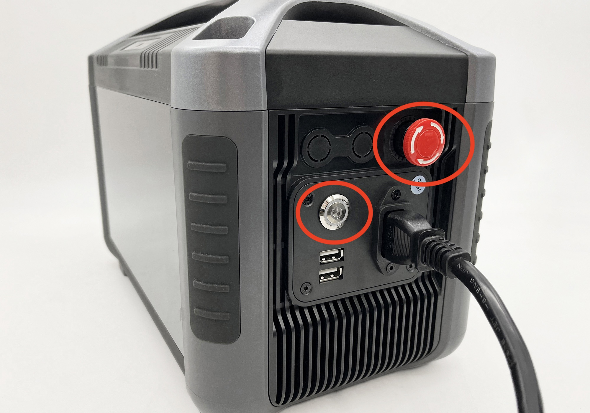

## ログイン

ログインボタンをタップするとログインダイアログが表示されます。必要に応じてログインを行なってください。

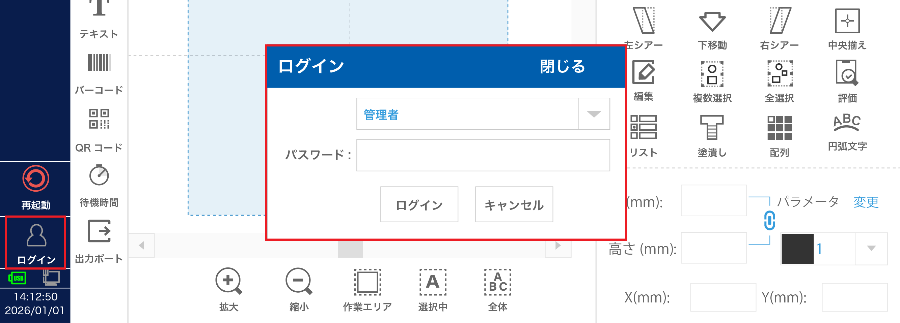

管理者の初期パスワードは「123」です。 

ログインユーザー（または未ログイン）ごとに操作を制限することも可能です。詳細は [ユーザー管理](#ユーザー管理) をご確認ください。

## 新規ファイルの作成

メニューバーの「新規」ボタンをタップして新規ファイルを開きます。

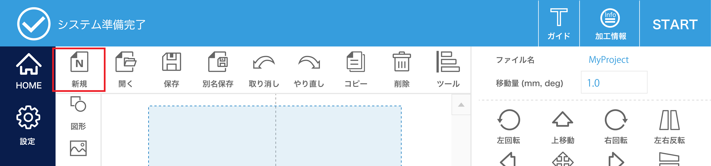

「編集中のファイルを保存しますか？」と表示された場合、「OK」をタップすると現在のファイルの変更内容が保存されます。「キャンセル」をタップすると変更内容が破棄されます。

## データ作成

オブジェクトの作成

ここでは一例として、刻印ごとに「ABC0000」「ABC0001」「ABC0002」... とカウントアップしていくテキストオブジェクトを作成します。
この場合「ABC」という 固定テキスト要素 と「0001, 0002, 0003, ...」とカウントアップする シリアル番号要素 を組み合わせて実現します。

「テキスト」要素は固定文字列を表現します。「シリアル番号」要素は加工ごとにカウントアップを行う可変文字列を表現します。
その他、各要素の詳細は [テキスト](#テキスト) をご確認ください。

**加工例**

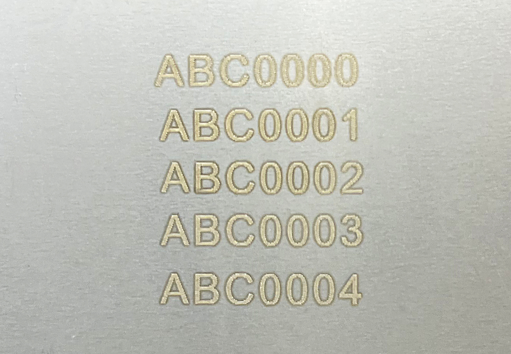

**テキストオブジェクトの作成**

オブジェクトパネルにある「テキスト」アイコンをタップします。

テキストオブジェクトを新規作成すると、「テキスト」要素が自動的に登録されています。

文字列リストにある該当の「テキスト」要素を選択し、「編集」ボタンをタップします。
表示されたダイアログの入力フォームに「ABC」と入力して「OK」ボタンをタップします。（大文字を入力する場合は`Caps`を有効にします）

<!-- 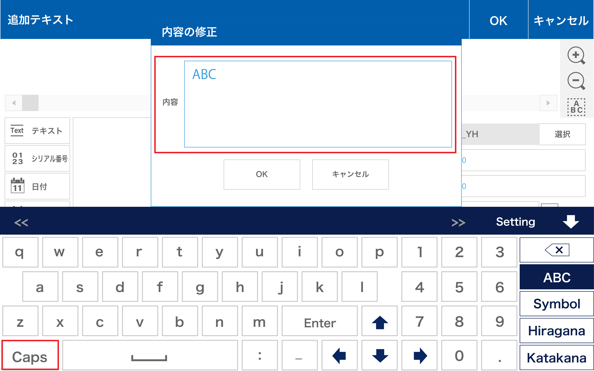 -->

<table class="noframe">
<tr>
<td style="padding:0px">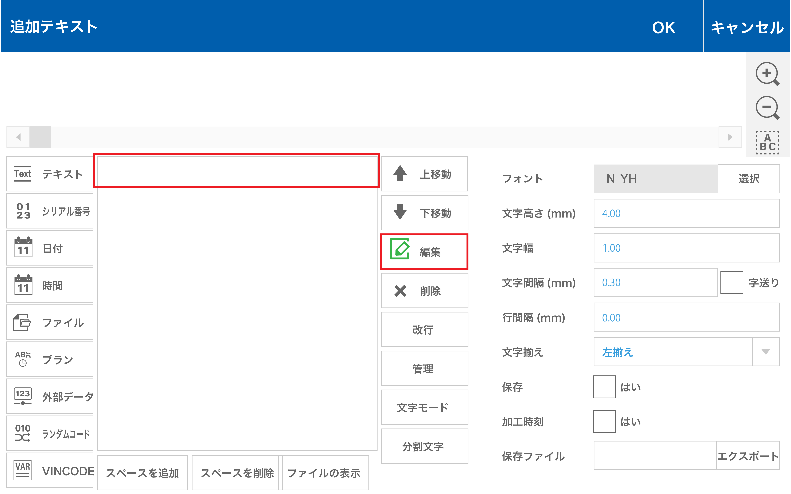</td>
<td style="padding:0px; width:5px"></td>
<td style="padding:0px"></td>
</tr>
</table>

次に「シリアル番号」要素を追加します。「シリアル番号」をタップすると文字列リストに追加されます。
プレビューには各要素が連結された文字列が表示されます。

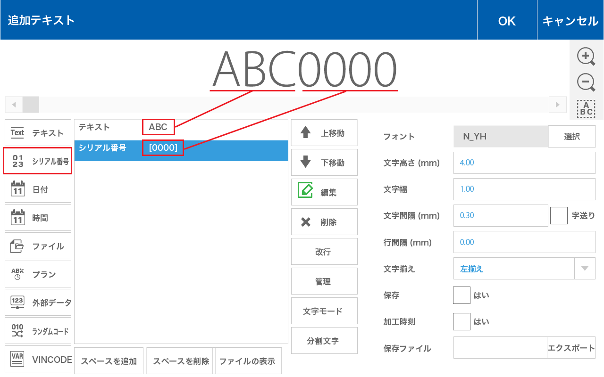

**フォントの編集** 

フォントの「選択」ボタンをタップし、「輪郭線」フォントから「Arial Unicode MS」を選択します。

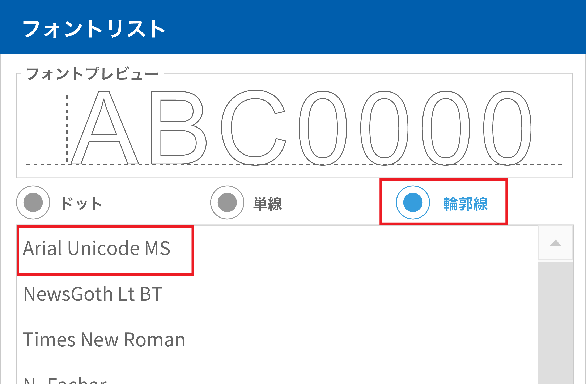

テキスト修正ダイアログ画面右上の「OK」ボタンをタップしてホーム画面に戻ります。

オブジェクトの編集

ここでは作成したオブジェクトに対して位置や大きさの調整、塗りつぶしなどの設定を行います。

**オブジェクトの選択** 
グラフィックビューに表示されているテキストオブジェクトをタップすると、オブジェクトが選択状態になります。
選択状態のオブジェクトは緑色の枠線が表示されます。（プリセットの「点」オブジェクトを除く）

**位置の調整** 
テキストオブジェクトが選択された状態で、位置を X:0 / Y:0 に設定します。 
※コントロールパネルの「中央揃え」をタップすることでも同等の操作が可能です。

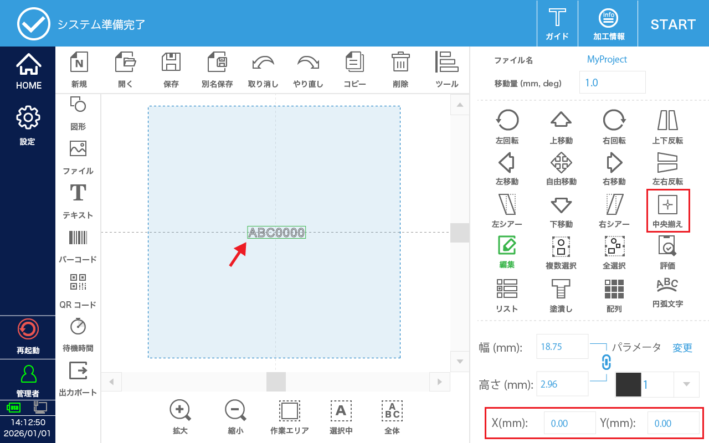

**塗潰し設定** 
テキストオブジェクトが選択された状態で、コントロールパネルの「塗潰し」をタップします。
表示されたダイアログで下記の設定を行います。パラメータの詳細は  [塗りつぶし](#塗りつぶし)  をご確認ください。

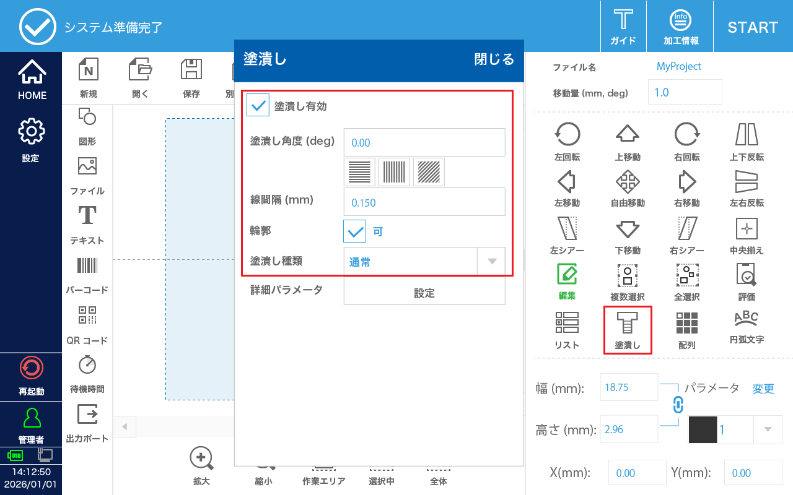

<!-- 

| 項目 | 設定 |
|:---:|:--:|
| 塗潰し有効 | 有効 |
| 塗潰し角度 | 0.00 度 |
| 線間隔 | 0.15 mm |
| 輪郭 | 有効 |
| 塗潰し種類 | 通常 |

 -->

<!-- 設定を行うと、グラフィックビューに塗りつぶされた状態のテキストが表示されます。 -->

## パラメータ設定

コントロールパネルの パラメータ「変更」ボタンをタップします。表示されたパラメータ設定画面で加工パラメータを設定します。各設定項目の詳細は [加工パラメータ](#加工パラメータ)  をご確認ください。

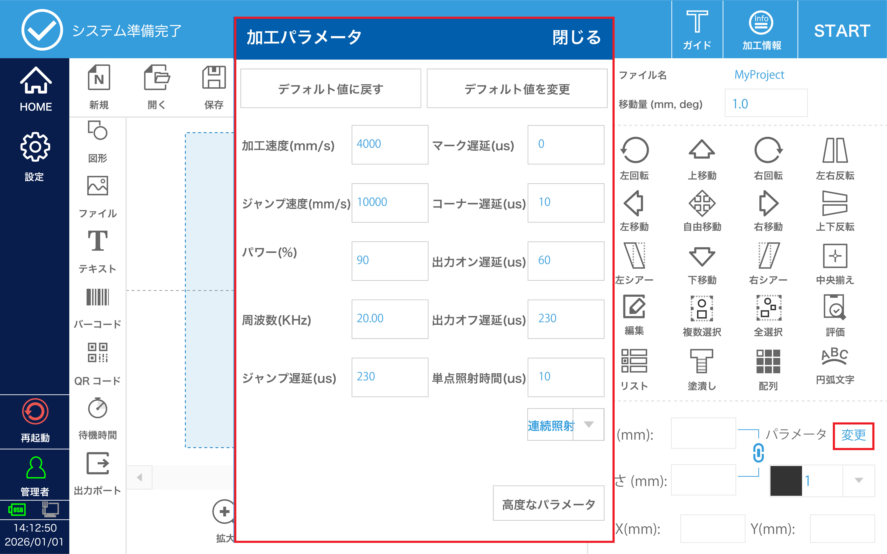

**参考パラメータ表**

| 項目 | ステンレス（参考） | MDF（参考） | ABS樹脂 |
|:---:|:--:|:--:|:--:|
| 加工速度 | 1000 | 100 | 2000 |
| パワー | 60 | 50 | 20 |
| 周波数 | 30 | 50 | 30 |

加工パラメータは加工素材や加工内容、要求品質等に応じて調整を行なってください。

## 加工操作

<table class="noframe">
<tr>
<td style="padding:0px">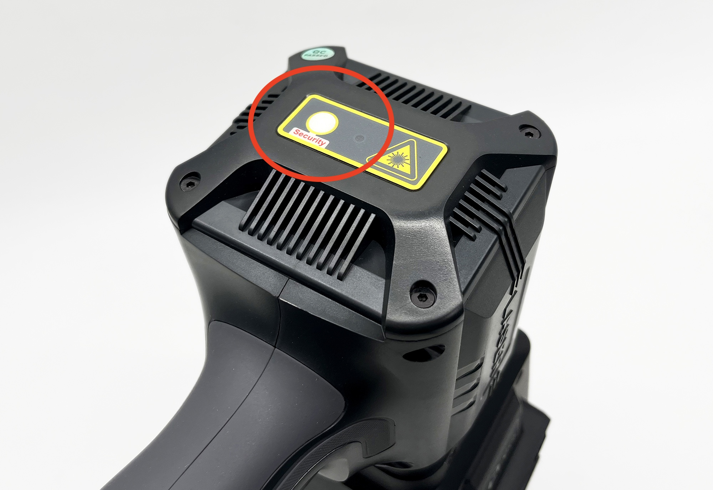</td>
<td style="padding:0px; width:5px"></td>
<td style="padding:0px">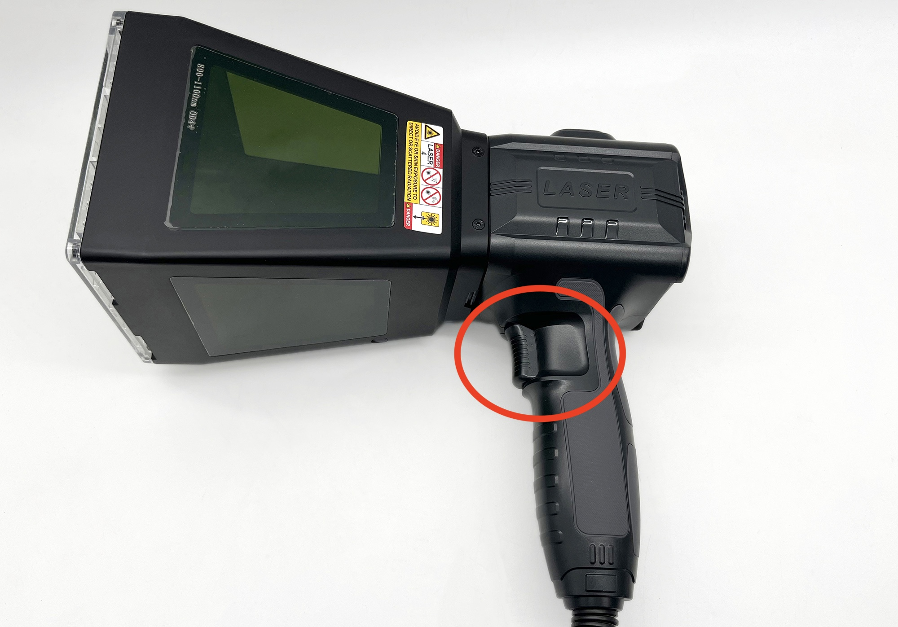</td>
</tr>
<td style="text-align:center;">起動ボタン</td>
<td></td>
<td style="text-align:center;">トリガー</td>
</table>

ハンドガンを地面に向けた状態で起動ボタンをオンにし、手で保持しながら素材に押し当てます。
次に、ステータスバーの「START」ボタンをタップし、マーキングモードに切り替えます。 

**操作モード**

 

**マーキングモード**

マーキングモードでは、ハンドガンのトリガーを引くと加工が開始されます。ハンドガンを倒したり、人体に向けたりしないよう十分に注意してください。 

また、操作モードやハンドガンの起動ボタンがオフの状態でも、テストマーキングや強制照射などの機能ではレーザーが照射される場合があります。モードや起動スイッチの状態だけで安全と判断せず、操作前に必ず照射方向・周囲の安全を確認してください。

赤色のガイド光で刻印位置を確認しながら、配置を微調整してください。

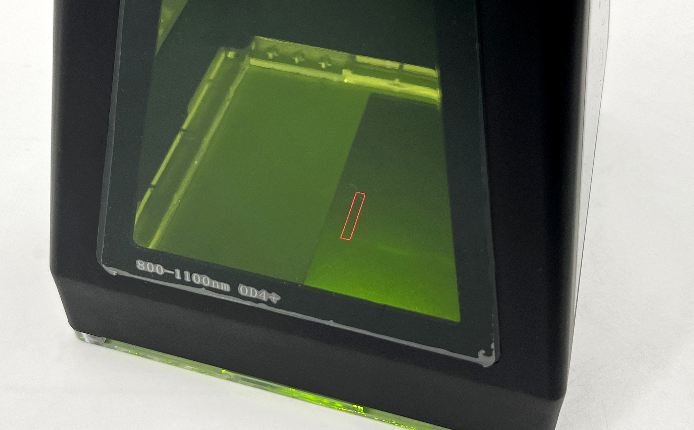

トリガーを引くと加工が始まります。加工中はハンドガンをしっかり保持し、揺れないように注意してください。 
位置を変えながら複数回刻印を行うと、刻印ごとにシリアル番号がカウントアップされます。

加工が終わったら、ステータスバーの「STOP」ボタンをタップしてマーキング状態を解除します。

## データ保存

作成したファイルを内部に保存します。
メニューバーの「保存」または「別名保存」をタップし、ファイル名を入力して「OK」をタップします。

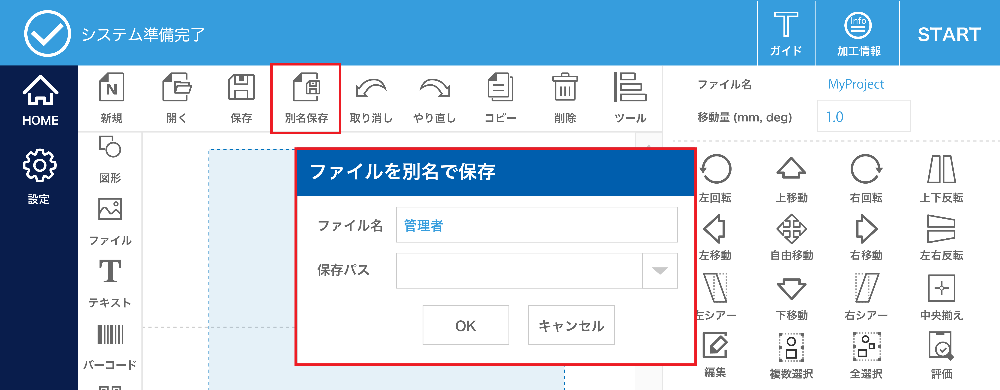

## 終了操作

本体側面の電源ボタンを切ります。ハンドガンも同時にオフになります。