# 1. ホーム

メイン画面は図1-1のとおりです。

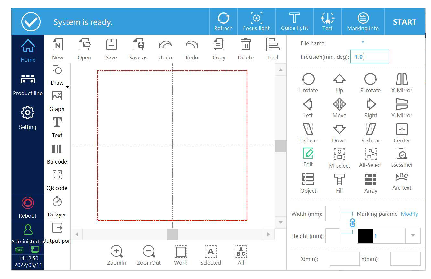

## 1.1. ログイン

ログインボタンをクリックすると、パスワード入力画面がポップアップ表示されます。

ログインパスワード：123 
※管理者の初期パスワードです。異なる権限でシステムにログインすることもできます。

## 1.3. 編集バー

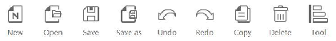

オブジェクト追加（Add object）
: マーキングする対象を追加します。追加できるものには、テキスト、ポイント、ライン、円、矩形、バーコード、QRコード、グラフィック、ディレイヤー、出力ポートなどが含まれます。

### 1.3.1. 文字の追加

テキストボタンをクリックすると、テキスト編集画面に入ります。

上へ移動（Move up）
: データの順序を調整し、前方へ移動します。

下へ移動（Move down）
: データの順序を調整し、後方へ移動します。

編集（Edit）
: 固定テキスト、シリアル番号、日時、ファイル読み込み、シフトコード、外部データ、ランダムコードなどを編集します。

削除（Delete）
: 追加した内容を削除します。

改行（Line change）
: 枝分かれさせて情報を追加します。

管理（Management）
: 変数を管理します。

#### 1.3.1.1. 固定テキストの追加

コンテンツ編集画面に入ると、システムは空の固定テキストを自動的に1つ生成します。編集をクリックするとテキストボックスがポップアップし、空白部分をクリックするとキーボードが表示されます。新しく固定テキストを追加する必要がある場合は、固定テキストボタンをクリックして追加します。デフォルトの内容は「TEXT」です。

**固定テキストの編集**

固定テキスト「TEXT」を選択し、編集ボタンをクリックして編集画面に入ります。
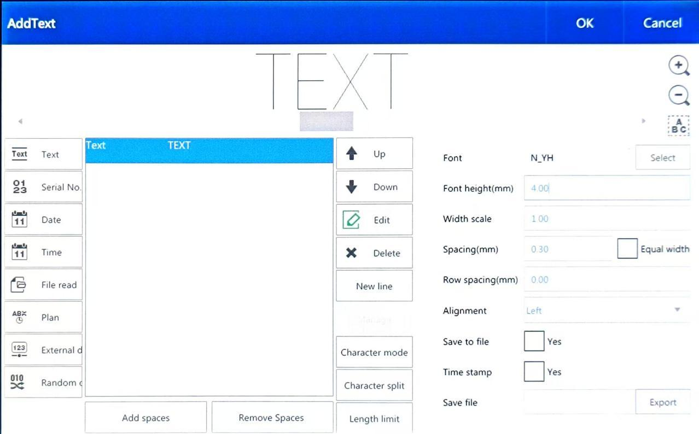

内容ボックスをクリックするとキーボードがポップアップします。

フォント（Font）
: テキストフォントを選択します。ドットマトリクスフォント、シングルラインフォント、ダブルラインフォントから選択できます。

文字高さ（Word height）
: フォントの高さ。

文字幅係数（Word width factor）
: デフォルト値は1で、値を変更することでフォントの幅を変更します。

文字間隔（Spacing）
: 文字同士の間隔。

行間隔（Line spacing）
: 同一テキスト内の各行同士の間隔。

配置モード（Alignment mode）
: 同一テキスト内の複数行の整列方法。

「ファイルへ保存」「タイムスタンプ」「ファイル保存」
: 記録機能であり、使用状況を記録します。

#### 1.3.1.2. シリアル番号の追加

シリアル番号ボタンをクリックすると、デフォルト内容「0000」のシリアル番号が追加されます。

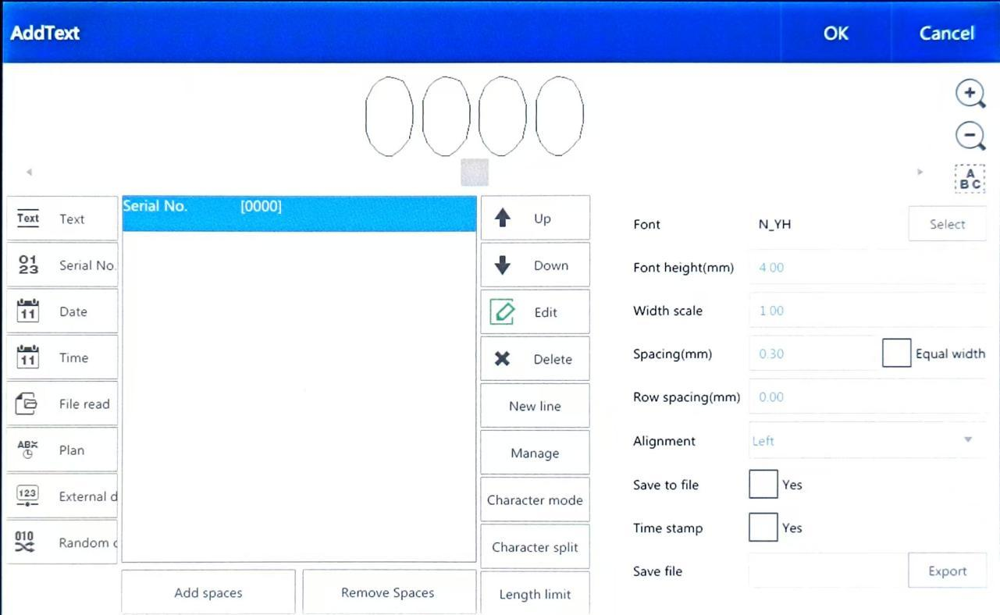

**シリアル番号の編集**

シリアル番号を選択し、編集ボタンをクリックすると、次に示すシリアル番号編集画面がポップアップ表示されます。

| 項目 | 説明 |
|:--:|---|
| 名称 |  現在のシリアル番号名（初期値は空欄） |
| 開始値 | この値からカウントを始めます。 |
| 終了値 | この値でカウントが終了します。 |
| 現在値 | 現在のカウントです。 |
| 加算値 | 加算値を設定します。 |
| 桁数 | 桁数を設定します。 |
| 先頭記号 | 先頭番号を設定します。 |
| Custom base |  ［Set］をクリックして設定画面に入ります。図のように20進数システムを設定すると、シリアル番号が009まで進んだ後、00A、00B、00C…00Jまで進み、その後010に進みます。クイックフォーマット切替により、データ形式を素早く切り替えることができます。例えば「ABCモード」に切り替えると、シリアル番号は 00A、00B、00C… のように表現されます。 |
| Change method |  変更方法として、自動モードと手動モードがあります。 |
| 加工回数 | 単一のシリアル番号の繰り返し加工数を設定します。 |
| 現在の回数 | 現在のシリアル番号の刻印回数です。 |
| サイクル | 生産中にシリアル番号を自動リセットするかどうかの設定であり、チェックを入れることで機能が有効になります。 |
| 番号のリセット | チェックボックスをオンにすると、シリアル番号が生産サイクル内でリセットされます。 |
| Control signal output | 使用しません。 |
| Reset mode |  シリアル番号を開始値にリセットするか、スプレー回数をリセットするかを選択できます。 |
| Timing reset |  リセット時刻を設定します。図に示すように、コード印字処理中にシリアル番号を毎日14:22:14に定期的にリセットする、といった設定が可能です。 |

**Change method**

<TODO:外部IO説明修正>
| 項目 | 説明 |
|:--:|---|
| Automatic mode |  シリアル番号が自動的に次の値へ進みます。 |
| Manual way |  外部IO入力によって、次の値へ進めます。 |

#### 1.3.1.3. 日付／時刻の追加

日付／時刻ボタンをクリックすると、次に示すように、システムの日付／時刻が追加されます。

<table class="noframe">
<tr>
<td style="padding:20px">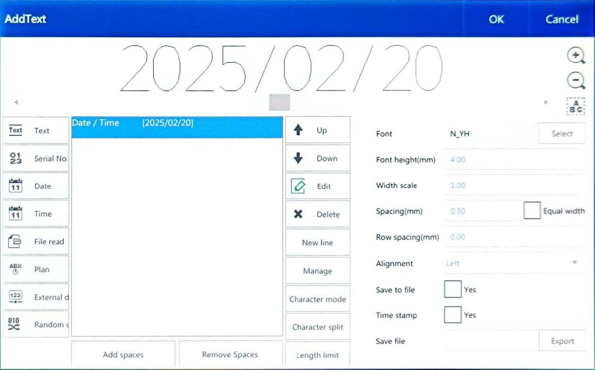</td>
<td style="padding:20px">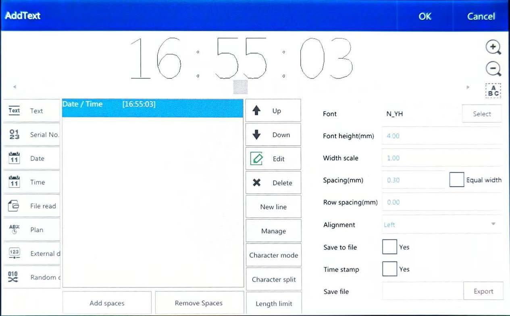</td>
</tr>
</table>

**日付／時刻の編集**

日付／時刻を選択し、編集（Edit）ボタンをクリックすると、次に示す日付／時刻編集画面がポップアップ表示されます。

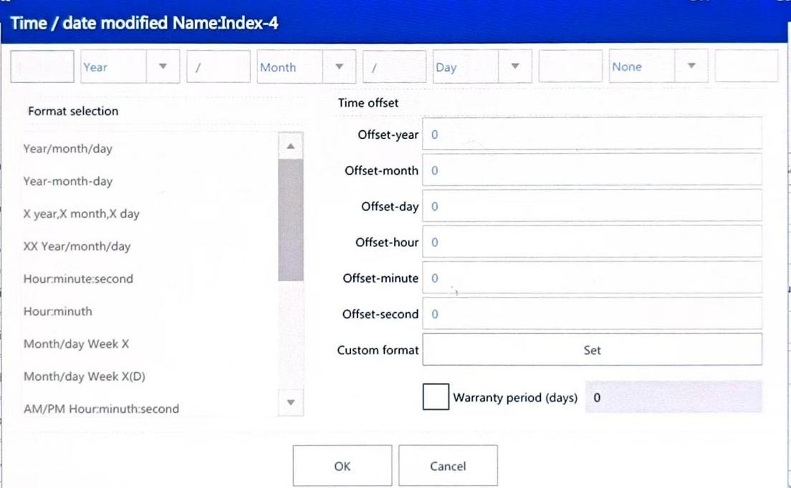

| 項目 | 説明 |
|:--:|---|
| 形式の選択（Select the format） | システム内蔵の日時フォーマットが用意されており、そのまま選択して使用できます。 |
| 形式の修正（Modify the format） | 日時フォーマットを編集します。区切り記号や、年月日の並び順などを変更できます。 |
| 時刻オフセット（Time offset） | 年・月・日・時・分・秒を現在時刻を基準として増減させることができます。例えば、「日」の値に1を加えると翌日、「日」の値を -1 にすると前日となります。他の項目も同様です。 |
| カスタム形式（Custom format） | カスタマイズした時間変数の表現を設定します。下図のように［Enable customization］をクリックしてカスタマイズを有効にし、下の「年」などを選択してフォーマットを編集します。 |
| 保証期間（日）（Warranty period（days）） | この期間中に日付／時刻を編集する場合、システムは自動的にカスタム形式を既定の設定として使用します。 |

#### 1.3.1.4. ファイル読込

ファイル読込ボタンをクリックし、テキストファイルまたはExcelファイルを選択して空のファイル項目を追加します。
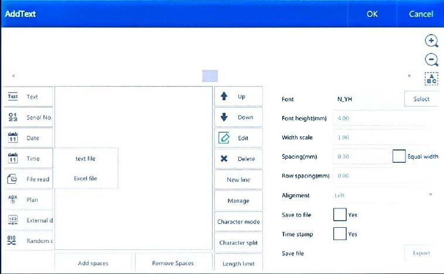

**テキストファイルの編集**

「Text Read（テキスト読込）」を選択し、Editボタンをクリックすると、ファイル読込の編集画面がポップアップ表示されます。

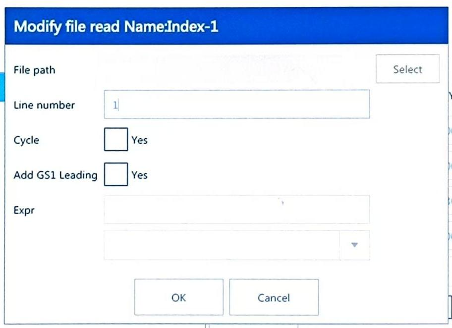

| 項目 | 説明 |
|:--:|---|
| Select file | ファイルパスの後ろにある選択ボタンをクリックすると、（システム内またはUSB内の）ファイルパス画面がポップアップするので、読み込むファイルを選択します。 |
| Line number | 現在マーキングしているテキストの行番号。 |
| Cycle | テキストファイルを循環してマーキングするかどうかを設定します。最後の行までマーキングした後、自動的に最初の行から再びマーキングを開始します。 |
| Add GS1 Leading | 顧客専用のファイルと組み合わせて使用します。 |

**Excelファイルの編集**

「Excel Read（Excel読込）」を選択し、Editボタンをクリックすると、Excel読込の編集画面がポップアップ表示されます。

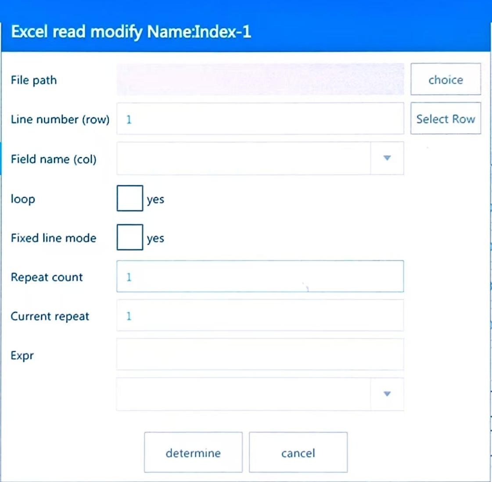

| 項目 | 説明 |
|:--:|---|
| Select file | ファイルパスの後ろにある選択ボタンをクリックすると、（システム内またはUSB内の）ファイルパス画面がポップアップするので、読み込むファイルを選択します。 |
| Line number（row） | 現在マーキングしている行番号。特定の行を指定して選択できます。 |
| Field name（col） | テーブルに複数列がある場合、マーキングする列を選択できます。 |
| loop | 循環マーキングを行うかどうかを設定します。ファイルの最後の行までマーキングした後、自動的に最初の行から再びマーキングを開始します。 |
| Fixed line mode | 特定の1行のみを繰り返しマーキングするモードです。 |
| Repeat count | 単一行を何回繰り返しマーキングするかの回数。 |
| Current repeat | 単一行の繰り返しマーキングが、現在何回実行されたかを示します。 |

#### 1.3.1.5. プランの追加

Planボタンをタップして新規Planを作成し、Editボタンをタップしてコードスキップ情報を編集します。

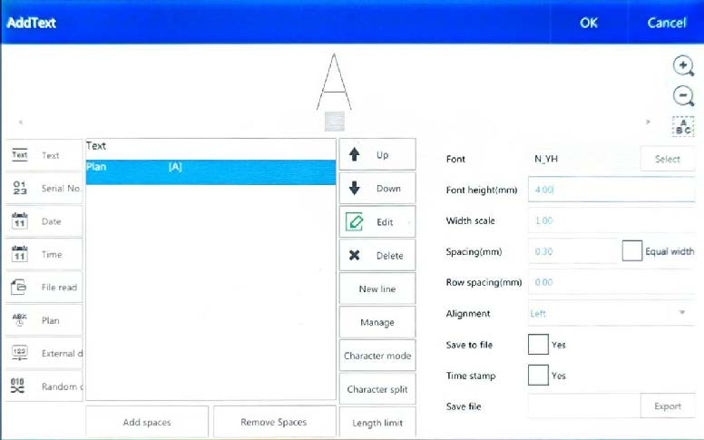

| 項目 | 説明 |
|:--:|---|
| Add | スキップコードのリストを追加します。 |
| Delete | スキップコードのリストを削除します。 |
| Edit | タイミングスキップコード情報を編集します。 |
| File format | 編集対象として、システム内部のファイルまたはUSB内のファイルを選択できます。 |

たとえば、下図左の画面でEditボタンをクリックすると、下図右に示すスキップコード内容の編集画面に入ります。ここでスキップコード情報と開始時刻を修正します。

この例では、00:00:00～12:00:00 の間は「A」を印字し、12:00:00～00:00:00 の間は「B」を印字する、というプラン情報を示しています。

<table class="noframe">
<tr>
<td style="padding:20px"></td>
<td style="padding:20px">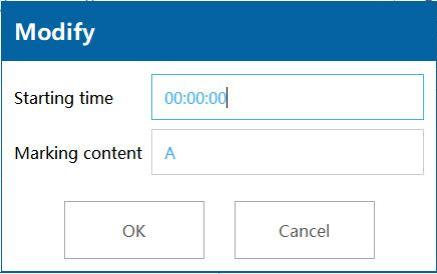</td>
</tr>
</table>

#### 1.3.1.6. 外部データの追加

通信機能です。ご利用の際は弊社サポートまでお問い合わせください。

#### 1.3.1.7. ランダムコードの追加

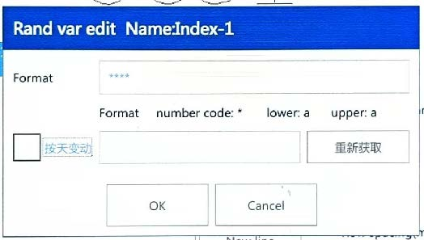

システムがマーキング用のデータをランダムに生成します。Editをクリックするとランダムコード編集画面に入ります。

| 項目 | 説明 |
|:--:|---|
| フォーマット | 数字は「*」、小文字は「a」、大文字は「A」で表します。 |
| Change by day | 同じ日は固定のランダムコードを使用し、翌日になると新しいコードに変更されます。 |
| 更新 | ランダムコードを再生成します。 |

例：`***aaaAAA` の場合、3桁の数字・3文字の小文字・3文字の大文字を組み合わせたランダムコードとして認識されます。

### 1.3.2. 描画

描画機能には、直線、点線、点、円、矩形などが含まれます。

#### 1.3.2.1. ドットの追加

描画機能でDotボタンをクリックします。上の図のように、ホーム画面の変更ボタンでそのパラメータを変更できます。また、下図に示すように、設定 → マーキングパラメータで「ポイントパルス出力」または「ポイント時間出力」を選択することもできます。

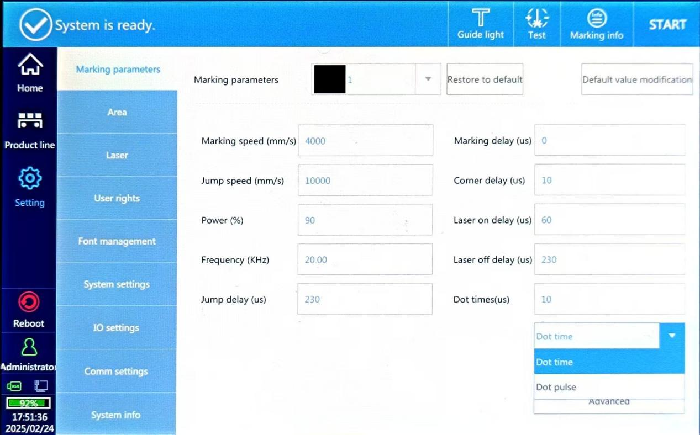

#### 1.3.2.2. ラインの追加

描画機能のLineボタンをクリックすると、通常の直線、ミシン目用の点線、円形のミシン目線、点状のミシン目線などを追加できます。

#### 1.3.2.3. 直線の追加

ラインタイプを「直線」に設定し、図2-19および図2-20に示すように線の長さを設定します。

#### 1.3.2.4. ミシン目線（tear line）の追加

ミシン目線のタイプには、点線・円・点などがあり、図2-21のように各セルの直径や間隔を設定します。

<TODO:再構成>

#### 1.3.2.5. 円の追加

描画メニューのCircleボタンをクリックすると、円を追加できます。

#### 1.3.2.6. 矩形の追加

描画メニューの矩形（Rectangle）ボタンをクリックすると、矩形を追加できます。

#### 1.3.2.7. グラフ（画像）の追加

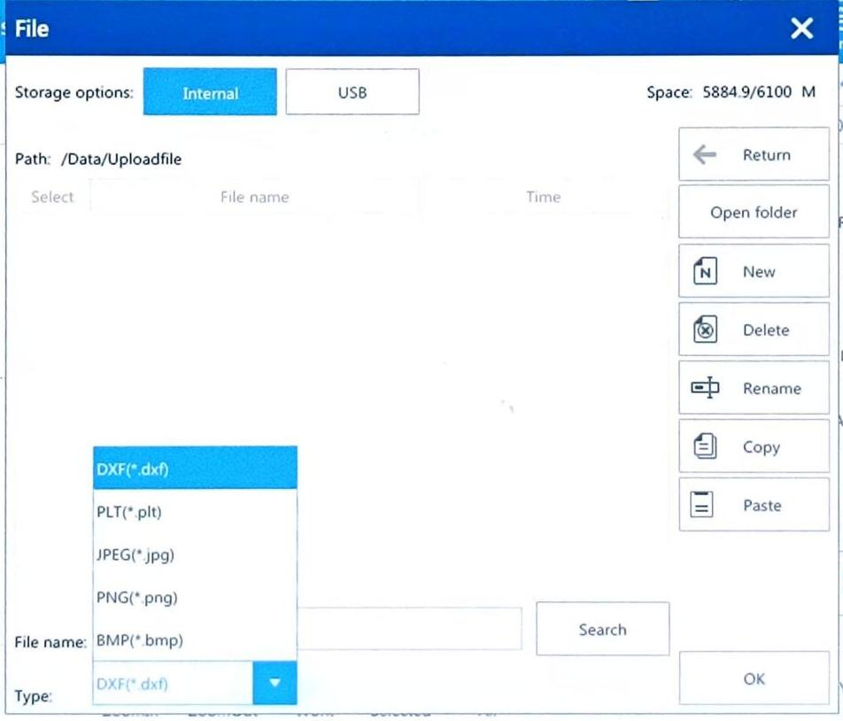

Graphボタンをクリックすると、図2-24に示す追加画面がポップアップします。サポートされる形式は dxf、plt、jpg、png、bmp です。

#### 1.3.2.8. バーコードの追加

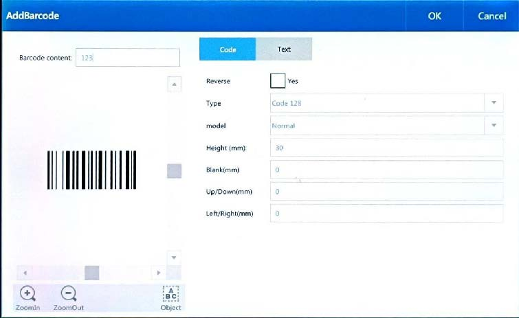

バーコードボタンをクリックすると、内容編集画面がポップアップします。デフォルトの内容は「123」のQRコードです（図2-25）。

Code
Reverse：チェックを入れるとバーコードが反転コード（白黒反転）になり、その場合はバーコードの周囲に枠線を設定する必要があります（下図のように）。
（通常）／（反転＋枠あり）

<table class="noframe">
<tr>
<td></td>
<td></td>
</tr>
<tr style="text-align:center;">
<td>通常</td>
<td>反転 + 枠あり</td>
</tr>
</table>

Type：バーコード種別の選択。Code 2-of-5 Interleaved、Codebar、Code 128、Code 39、Code 93、UPC-A、UPC-E、EAN-14、ITF-14、EAN128、EAN-13などから選択できます。

Model：バーコードモードの選択。Normal と GS1（Code 128 と EAN128のみ対応）があります。

Height：バーコードの高さ。

Blank：枠線がある場合に、バーコードと枠線との間の距離。

Up/Down：バーコードの上下端に枠線を追加し、その本数を設定します。

Left/Right：バーコードの左右端に枠線を追加し、その本数を設定します。

Text
Display text：チェックを入れると、バーコード内容の文字列を表示します。

Font：文字のフォント。

Mark parameters：表示テキストのマーキングパラメータを個別に変更します。

Font fill：フォントの塗りつぶしパラメータ。

Char height：文字の高さ。

Width scale：文字の幅。

Char space：文字間隔。

Line spacing：行間。

Horizontal offset：テキスト内容の水平方向オフセット。

Vertical offset：テキスト内容の垂直方向オフセット。

Align orientation：テキストの配置方向。上下方向および左右方向の整列方法を指定します。

Alignment：同一オブジェクト内での複数行の整列方法。上揃え／下揃え／中央揃えなど。

「Save to file」「Time stamp」「Save file」は記録用の機能で、通常は使用しません。

Content modification：Textの後ろにある内容ボックスをクリックすると、図2-26に示すコンテンツ追加画面に入ります。設定完了後、OKをクリックするとバーコードが追加されます（図2-27）。
図2-25
図2-26
図2-27

Fill type modification：Fillをクリックすると、塗りつぶしタイプの編集画面に入ります。塗りつぶしタイプには Spot（点）、Line（線）、Circle（円）、Ordinary（通常）、Multipoint（多点）があります（図2-28）。
図2-28

Spot、Line、Circle、Multipoint 塗りつぶし：
Fill typeで Spot／Line／Circle／Multipoint を選択すると、線の間隔やインデントを変更できます。

通常塗りつぶし（Ordinary filling）：
塗りつぶしタイプを Ordinary に設定します（図2-29）。「Enable fill」にチェックを入れると、塗りつぶし角度、塗りつぶし線の間隔、枠を付けるかどうかを設定できます。

Fill type：
Optimization：塗りつぶし線をZ字状に走査します。
Ordinary：ペンの進行方向に沿って下方向へ塗りつぶします。
Arch filling：弓形（アーチ状）の軌跡で塗りつぶします。

その他のパラメータ：線塗りつぶしの詳細を調整します（図2-30）。
図2-29
図2-30

Evenly distributed：塗りつぶし線の間隔を均等に分配します。

Margin：塗りつぶし線と有効枠との距離。

Straight indent：塗りつぶし線と有効枠との直線方向のインデント量。

Boundary ring number：枠線（輪）の本数。

Ring spacing：枠線同士の間隔。

Multiple fills：塗りつぶしを行う回数。

Every offset：前回と次回の塗りつぶし線のオフセット角度。

Distribution value：任意に設定する塗りつぶし線間隔の分布値。

#### 1.3.2.9. QRコードの追加

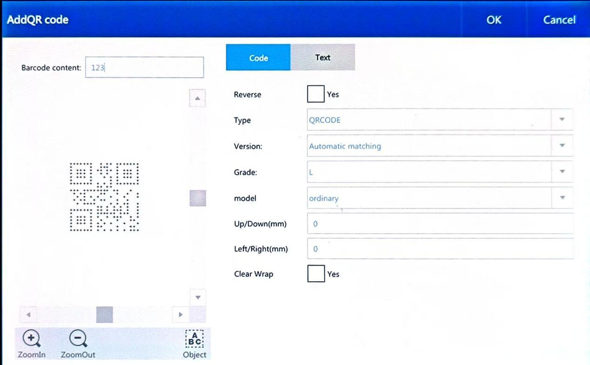

ホーム画面のQRコードボタンをクリックすると、QRコード編集画面に入ります。デフォルトの内容は「123」のQRコードです（図2-31）。
図2-31

Code
Reverse：チェックを入れるとQRコードが反転（白黒反転）します。反転させる場合は、通常上下左右にそれぞれ1マスずつ、合計4辺の枠線を追加する必要があります。比較例は下図のとおりです。
（通常）／（反転＋枠あり）

<table class="noframe">
<tr>
<td></td>
<td></td>
</tr>
<tr style="text-align:center;">
<td>通常</td>
<td>反転 + 枠あり</td>
</tr>
</table>

コントラストが十分でない場合、バーコード（QRコード）を反転表示にし、さらに外枠を追加する必要があります。例：白いフタに黒いQRコードを印字する場合は反転不要ですが、茶色のフタに印字する場合は反転と枠線の追加が必要です。

Type：選択可能なタイプは、QRCODE、PDF417、DATAMATRIX、Micro QR Code、Chinese-Sensible です。

Version：QRコードのバージョン（サイズ）。

Grade：2次元コードの誤り訂正レベル。4段階あり、レベルが高いほど認識率は高くなりますが、その分噴射時間（マーキング時間）が長くなります。

border：追加する枠線の本数。例：1なら1ユニットの枠、2なら2ユニットの枠となります。

QRコードタイプにDATAMATRIXを選択した場合、コードのモードを「Ordinary」と「GS1」に切り替えることができます。

GS1を選択すると「Parameter data error, please reselect（パラメータデータエラー、再選択してください）」というメッセージが表示されます。OKをクリックした後、バーコード内容をクリックしてGS1データ追加画面に入ります。Addをクリックして、図のようにモジュールの1つを選択します。その後、ExitをクリックしてQRコード画面に戻り、モードを一旦Ordinaryに切り替えてから、再度GS1に切り替えます。

Text
Display text：QRコードの内容文字列を表示します。

Font：QRコード内容のフォントを選択します。

Mark parameters：表示テキストのマーキングパラメータを個別に変更できます。

Font fill：フォントの塗りつぶしパラメータ。

Char height：文字の高さ。

Width scare：文字の幅。

Char space：文字間隔。

Line spacing：行間。

Horizontal offset：テキスト内容の水平方向オフセット。

Vertical offset：テキスト内容の垂直方向オフセット。

Align orientation：テキストの整列方向。上下方向・左右方向の整列を指定します。

Alignment：同一オブジェクト内の複数行の整列方法。上揃え／下揃え／中央揃えなど。

「Save to file」「Time stamp」「Save file」は記録用の機能で、通常は使用しません。

Content modification：Textの後ろにある内容ボックスをクリックすると、図2-32に示すコンテンツ追加画面に入ります。設定後、OKをクリックするとQRコードの追加が完了します（図2-33）。
図2-32
図2-33

QRコードの塗りつぶし
Fillをクリックし、図2-34に示すバーコード塗りつぶし方法を選択します。
図2-34

Fill type：バーコード（QRコード）の塗りつぶし方法を選択します。Spot、Line、Circle、Ordinary、Multipoint から選択できます。

Spot fill：
内容が「ABCDEFG1234567980」のQRコードを追加し、Fill type で Spot fill を選択します（図2-35）。
図2-35

Line filling：
内容が「ABCDEFG1234567980」のQRコードを追加し、Fill type で Line filling を選択します。例えば、行間：0.2mm、インデント：0.1mm と設定した場合の例を図2-36に示します。行間や縁の間隔を変更（行間：1mm、インデント：0.2mm）した例を図2-37に示します。
図2-36
図2-37

Circle filling：
内容が「ABCDEFG1234567980」のQRコードを追加し、行間：0.1mm、インデント：0 と設定して Fill type で Circle fill を選択します（図2-38）。行間やマージンを変更（行間：0.5mm、インデント：0.05mm）した例を図2-39に示します。
図2-38
図2-39

Ordinary filling：
内容が「ABCDEFG1234567980」のQRコードを追加し、Fill type で Ordinary fill を選択します（図2-40）。

「Enable fill」にチェックを入れると、図2-41のように塗りつぶし角度、線間隔、有効枠の有無、線の塗りつぶしタイプ（バーコード塗りつぶしタイプと同様）を変更できます。QRコードの仕上がり例を図2-42に示します。
図2-40
図2-41
図2-42

Other parameter：図2-43に示す各種パラメータです。
図2-43

Evenly distributed：塗りつぶし線の間隔を均等に分配します。

Margin：塗りつぶし線と有効枠との距離。

Straight indent：塗りつぶし線と有効枠とのインデント量。

Boundary ring number：枠線（リング）の本数。

Ring spacing：枠線同士の間隔。

Multiple fills：塗りつぶしを行う回数。

Every offset：前回と次回の塗りつぶし線のオフセット角度。

Distribution value：塗りつぶし線の間隔を任意に分布設定する値。

Multi-point filling：
内容が「ABCDEFG1234567980」のQRコードを追加し、行間：0.1mm、インデント：0mm と設定して Fill type で Multipoint fill を選択します。さらに行間や縁の間隔を変更（行間：0.5mm、インデント：0.05mm）した例が図に示されています。

#### 1.3.2.10. ディレイヤーの追加

ホーム画面のDelayerボタンをクリックすると編集画面がポップアップし、ディレイ装置の時間を設定できます。この機能はスタティック機能に対してのみ有効です。ディレイ装置はマーキング対象オブジェクトより前に追加する必要があり、図2-44に示すように、オブジェクトリスト内でディレイ装置の位置を調整できます。
図2-44

<TODO:機能確認>

#### 1.3.2.11. 出力ポート

出力時間と出力ポートを設定します。この機能はカスタマイズされた機種向けの機能です。

<TODO:おそらく削除>

