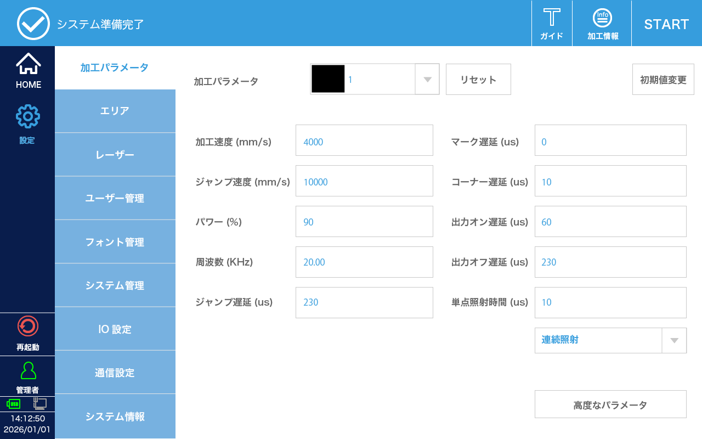
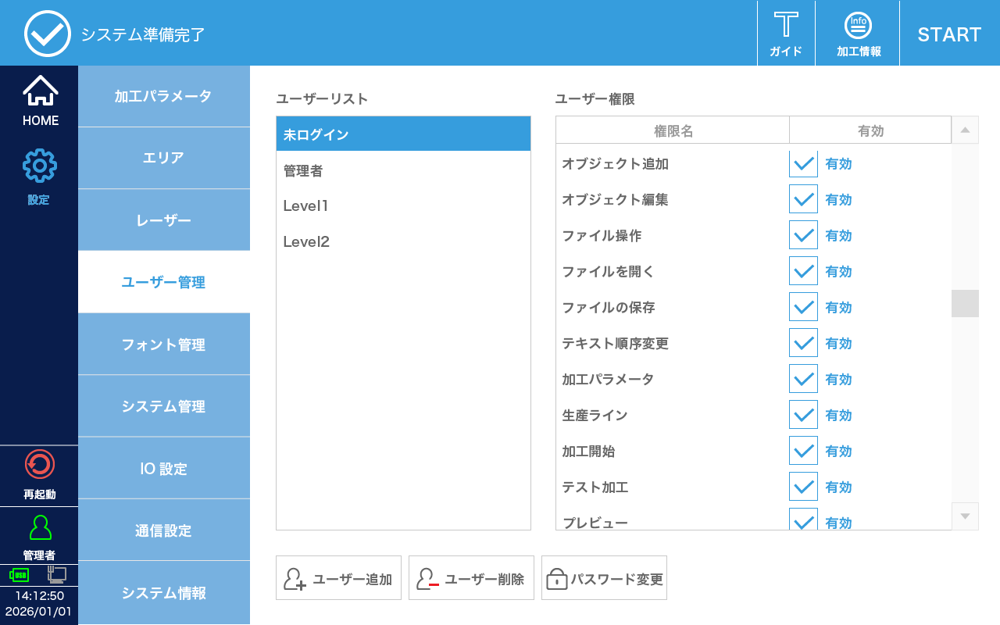
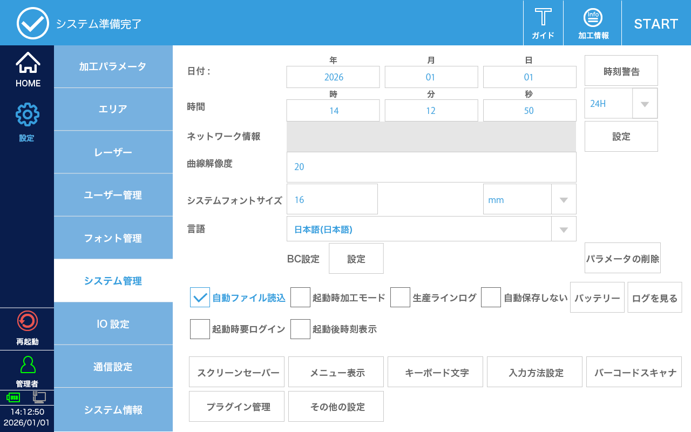

# 設定

## 加工パラメータ

マーキングファイルが読み込まれた状態で、画面左の「設定」→「加工パラメータ」 を選択すると、現在の加工ファイルのパラメータを変更できます。デフォルト値の変更も可能です。

| 項目 | 説明 |
|:---:|---|
| 加工速度 | 加工速度（mm/s）を設定します。レーザー光が加工対象物の表面を走査する速度を示します。 |
| ジャンプ速度 | レーザー光の出力を伴わない移動時の速度（mm/s）を設定します。一般的には印字速度の2倍程度に設定します。 |
| パワー | レーザーの出力（%）を設定します。値が大きいほど出力が大きくなります。発信機の保護のため、通常使用では **90％以内に設定することを推奨します。** |
| 周波数 | レーザーの周波数（単KHz）を設定します。 |
| ジャンプ遅延 | ジャンプ後に加工を開始するまでの遅延時間（μs）を設定します。 |
| マーク遅延 | この項目は通常は使用しません。0 に設定します |
| コーナー遅延 | 折り返し時の遅延時間（μs）を設定します。 |
| 出力オン遅延 | レーザー出力を開始するまでの遅延時間（μs）を設定します。 |
| 出力オフ遅延 | レーザー出力を停止するまでの遅延時間（μs）を設定します。 |
| 単点照射時間 | 単点の照射時間（μs）を設定します。フォントがドットフォントの場合や、「点」オブジェクトおよびドット配列QRコードを使用する場合などに使用されます。 |
| 照射モード | 単点の照射モードを選択します。 連続照射：設定した点照射時間の間、レーザーを連続照射します。 パルス照射：パルス単位で照射します。加工箇所への熱影響を抑えたい場合に使用します。 |

高度なパラメータ

この項目は使用しません。

**遅延設定について**

加工品質が満足いかない場合、遅延時間の設定を改善することで加工品質が改善される場合があります。
加工結果を観察し、下記に該当する場合は該当の遅延パラメータを調整してください。

<!-- 一般的に 出力オン遅延 と 出力オフ遅延 の長さは、加工時間には大きな影響を与えません。
まずはこの二つの項目を最適化し、その後に ジャンプ遅延、*終端遅延？*、コーナー遅延 などの遅延を調整することを推奨します。
特に ジャンプ遅延 および 終端遅延 を大きめに設定することで改善されるケースがあります。 -->

一般的に 出力オン遅延 と 出力オフ遅延 の長さは、加工時間には大きな影響を与えません。
まずはこの二つの項目を最適化し、その後に ジャンプ遅延、コーナー遅延 を調整することを推奨します。
特に ジャンプ遅延 を大きめに設定することで改善されるケースがあります。

**ジャンプ遅延 が短すぎる場合**
: ジャンプ遅延 が短すぎると、ジャンプ後にスキャンヘッドの位置が安定する前に最初のマーキングが開始され、このような振動（ぶれ）現象が発生します。

**ジャンプ遅延 が長すぎる場合**
: ジャンプ遅延 が長すぎると、マーキング品質に顕著な変化はありませんが、マーキング時間だけが長くなります。

**出力オン遅延 が短すぎる場合**
: 出力オン遅延 が短すぎると、パスの開始時点でスキャンヘッドが所定の速度に達していない状態でレーザーが照射されるため、加工ラインの始点が焦げたような状態になります。

**出力オン遅延 が長すぎる場合**
: 出力オン遅延 が長すぎると、パス始点でレーザー光が遅れて照射されるため、加工ラインの始点がマーキングされません。

**出力オフ遅延 が短すぎる場合**
: 出力オフ遅延 が短すぎると、スキャンヘッドがパス終端に達する前に、次の加工動作の制御によってレーザーが消灯してしまいます。その結果、各加工ラインが最後までマーキングされなくなります。

**出力オフ遅延 が長すぎる場合**
: Laser off delay が長すぎると、スキャンヘッドがパス終端に到達した後もレーザーが照射され続けます。その結果、加工ラインの終端部分が焦げたようになります。

<!-- **マーキング遅延 について**
値を大きくしても顕著な品質変化はありませんが、値が大きいほどマーキング時間は長くなります。 -->

**コーナー遅延 が短すぎる場合**
: コーナー遅延 が短すぎると、スキャンヘッドがパス終端に達していない状態で次の動作制御が開始され、折り返し部分に丸みが生じます。

**コーナー遅延 が長すぎる場合**
: コーナー遅延 が長すぎると、次の動作制御の開始時にスキャンヘッドの動作が非常に遅くなり、折り返し部分が焦げたようになります。

## エリア

### ガルバノミラーのキャリブレーション

表示領域

| 項目 | 説明 |
|:---:|---|
| 可動範囲 | 現在のレンズにおける最大可動範囲を設定します。 |
| 加工範囲設定 | 運用上の加工範囲を設定します。安全のため可動範囲より小さく設定されています。 |
| 軸設定 | X軸に対応する軸番号を設定します。 |

補正

ここではレンズの歪み補正の値を設定できます。

補正方法については[レンズの校正方法](#レンズの校正方法)をご参照ください。

| 項目 | 説明 |
|:---:|---|
| 反転 | 軸の向きを反転させます。 |
| 樽型 | 樽型・糸巻き型の歪みを補正する調整値です。 |
| シアー型 | シアー型の歪みを補正する調整値です。 |
| 台形型 | 台形の歪みを補正する調整値です。 |
| スケール | スケールを補正する調整値です。図形サイズと加工サイズから補正値を自動計算する機能が備わっています。 |

動作確認

レーザーが照射されます。この項目を操作する前に周囲の環境や加工素材の設置状況を十分に確認してください。

| 項目 | 説明 |
|:---:|---|
| テスト加工 | レーザー照射を行い、補正用のテストパターンを加工します。 |
| 連続トリガ | デバッグ用の機能です。使用しません。 |
| パラメータ | テストパターンの加工パラメータを設定します。 |

レーザーテスト

レーザーが照射されます。この項目を操作する前に周囲の環境や加工素材の設置状況を十分に確認してください。

強制発行機能ではレーザーが正常に発光しているかをテストできます。この機能は光路の調整やキャリブレーションにも使用できます。 **「強制照射」** をタップするとレーザーが出力され、レーザーを停止するには **「消灯」** ボタンをタップする必要があります。（自動停止しません） 
大変危険ですので、本体の非常停止ボタンの位置を確認した上で十分に注意して使用してください。

ガイド

ここでは位置確認で使用される赤色のガイド光のキャリブレーションを行うことができます。
なお、ここで設定した項目は「保存」ボタンをタップすると反映されます。

| 項目 | 説明 |
|:---:|---|
| フレーム表示 | 有効の場合、全ての加工オブジェクトを含むバウンディングボックス（矩形）を表示します。無効の場合は各オブジェクトのアウトラインを表示します。 |
| ガイド表示速度 | 赤色ガイド光の走査速度を設定します。 |
| フライモード | フライトマーキングの開始位置のみを表示します。長文刻印カバーを使用する場合に設定します。 |
| 赤色光パラメータ | 赤色ガイド光に関するパラメータを設定します。 |
| 位置 | ガイド光によるプレビュー表示の各軸オフセット値を設定します。 |
| 縮尺 | プレビュー表示の縮尺を設定します。 |
| 回転 | プレビュー表示の回転角を設定します。 |
| 焦点 | この項目は使用しません。 |

補正方法については〇〇をご参照ください。<TODO:トラブルシューティング等>

赤色ガイド光のキャリブレーション方法

赤色ガイド光のキャリブレーション方法は次のとおりです。

1. 新規プロジェクトに矩形を追加し、実際に加工を行います。
2. 赤色ガイド光をクリックし、オフセットやズームの設定値を調整して、赤色ガイド光の表示と実際にマーキングされた図形が完全に一致するように合わせます。

<!-- 赤色ガイド光のフォーカス調整方法は次のとおりです。

1. 赤色フォーカスには2つの赤色光源が必要です。1つは固定、もう1つは調整可能な赤色光とします。
2. 「Red light focus adjustment」にチェックを入れ、上下左右の4つのボタンを調整して、2つの赤色光が完全に重なるように合わせます。 -->

パラメータ管理

作成した補正パラメータは保存・読み込みが可能です。保存時はUSBメモリに保存されるため、あらかじめUSBメモリを本体に接続してください。

## レーザー

**この項目は変更しないでください。**

## ユーザー管理

この項目では、操作を行うユーザーごとに権限とパスワードを設定できます。この操作を行うには管理者ユーザーでログインしてください。

**設定例**

対象となるユーザーの権限から「オブジェクト追加」「オブジェクト編集」「ファイル操作」の3つの機能のチェックを外します。
その後、管理者ユーザーをログアウトし、対象ユーザーでログインすると制限された機能（各種ボタン）はグレー表示になり、使用できなくなります。

また、ユーザーは必要に応じて追加・削除・パスワード変更を行うことができます。

<!-- <table class="noframe">
<tr>
<td></td>
<td></td>
</tr>
</table> -->

## フォント管理

システム内のフォントを管理します。フォントの追加、削除、エクスポートが可能です。

フォント追加後はシステムが自動的に再起動します。

## システム設定

ここではシステム全般の設定を行うことができます。**設定の変更を行う場合は再起動が必要です。**

| 項目 | 説明 |
|:---:|---|
| 日付 | システムの日付を設定します。 |
| 時間 | システムの時刻を設定します。 |
| ネットワーク情報 | この項目は使用しません。 |
| 曲線解像度 | 輪郭線フォントに対して有効な設定です。解像度を高くするほどマーキング時間は長くなります。フォントの曲線が十分に滑らかでない場合は、解像度を少し上げることで改善できる場合があります。 |
| システムフォントサイズ | システムフォントのサイズを設定します。 |
| System unit | 長さの表示単位を mm/inch から選択できます。 |
| 言語 | システムの表示言語を選択できます。 |
| 自動ファイル読み込み | 起動時に前回使用したファイルを開くか尋ねます。 |
| 起動時加工モード | 起動後、自動的にマーキングモードに移行します。 |
| 生産ラインログ | この機能は使用しません。 |
| 自動保存しない | チェックを入れると、加工時にファイルが自動保存されなくなります。 |
| 起動時要ログイン | 起動時にログインを強制します。 |
| 起動後時刻表示 | 起動後にシステム時刻を表示します。 |

| 項目 | 説明 |
|:---:|---|
| バッテリー | 本製品ではこの設定は使用しません。 |
| ログを見る | ログファイルの内容を確認できます。 |
| スクリーンセーバー | スクリーンセーバーの設定を行うことができます。 |
| メニュー表示 | チェックを入れた機能をステータスバーまたはサイドバーに表示できます。詳細は下記を参照してください。 |
| キーボード文字 | 既存のキーボードにない記号を追加できます。「シンボル追加」をタップするとUnicodeコード入力画面に入ります。追加したい文字のUnicodeを入力してください。 追加した文字は、キーボード上の「more」ボタンをタップすると表示されます。 |
| 入力方法設定 | キーボードに表示する入力方式を設定します。キーボードには最大4種類の入力方式を同時に表示できます。 |
| バーコードスキャナ | バーコードスキャナやキーボード入力を有効にします。テキストの外部データ要素を使用する場合に設定します。 |
| プラグイン管理 | プラグインの削除・追加・有効化を行うことができます。通常使用しません。 |
| その他の設定 | この機能は使用しません。 |

メニュー表示

主な設定項目は下記の通りです。その他の設定項目は本製品では使用しません。

| 項目 | ボタン機能 |
|:---:|---|
| ガイドライト | 赤色ライトでガイド表示します。 |
| テスト加工 | マーキング状態の有無に関わらず、ボタンをタップした瞬間にレーザーが照射されます。 現在選択されているデータをマーキングします。マーキング後、ステータスバーでマーキング時間を確認できます。 |
| 生産ライン | オプションの長文刻印カバーを使用する場合に設定します。 |
| 中央座標 | 中央揃えを行った際の基準点（中央座標）を設定します。 |

## IO 設定

この項目は使用しません。

## 通信設定

この項目は使用しません。

## システム情報

システムの関連情報が表示されます。

<!--  -->

<!-- ### アップデート

アップデートでは、システムのアップグレード、起動画面（ブートインターフェース）の変更、および本体画面左上に表示される画像の変更を行うことができます。

システムアップグレードの手順は次のとおりです（最初に管理者としてログインしてください）。

1. アップデートファイルをUSBメモリに保存し、そのUSBメモリを本体に挿入します。
2. 「System update」をクリックすると、図4-33のようなポップアップ画面が表示されます。
3. 「Select」をクリックすると、図4-34のようなポップアップ画面が表示されます。
4. 「USB」をクリックしてアップデートファイルを選択し、［OK］をクリックしてから［Start Update］をクリックすると、アップデートが完了します。
-->
