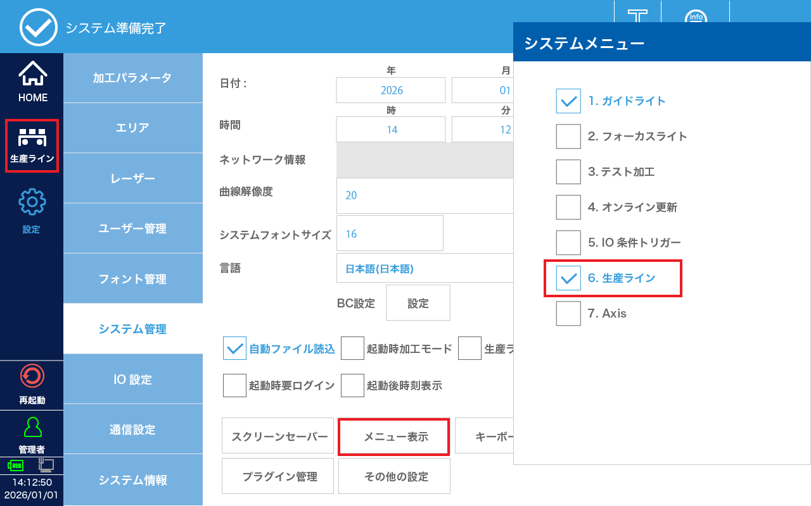
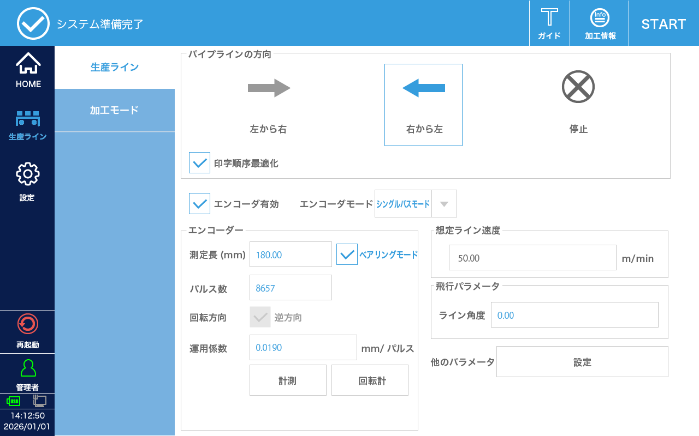
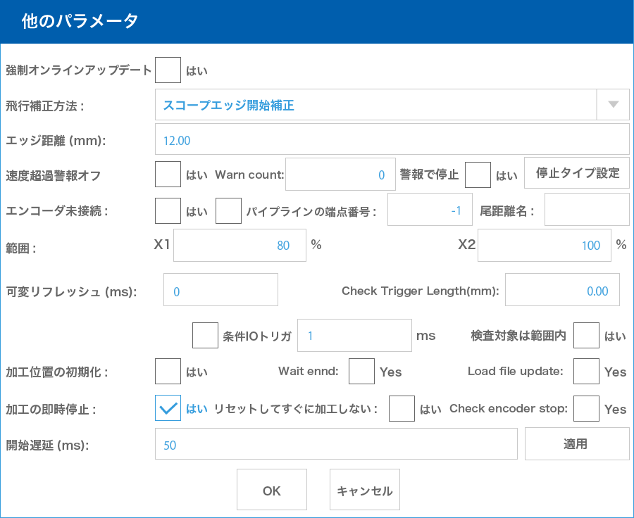
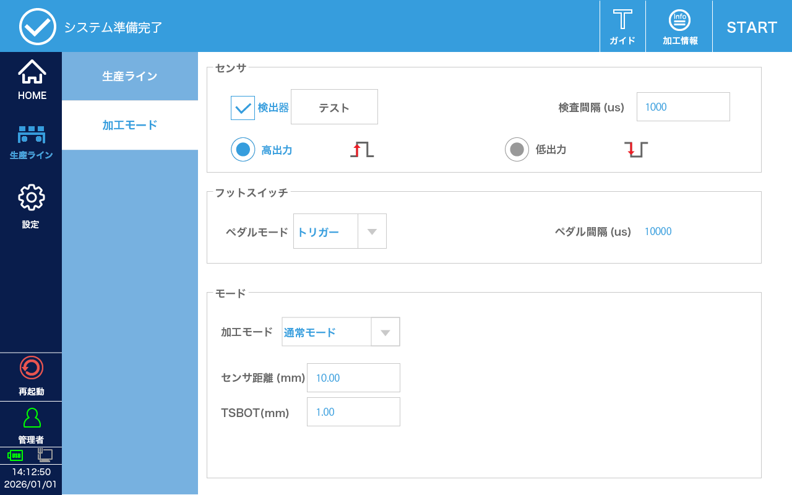

# オプション

## 長文刻印カバー

長文刻印カバーを使用して加工範囲を超える長いテキスト刻印する場合は、システムの設定を変更する必要があります。

まず、「設定 > システム設定 > メニュー表示」で **生産ライン** を有効にします。有効にすると左メニューに「生産ライン」が追加されます。

生産ライン

| 項目 | 設定 |
|:---:|---|
| パイプラインの方向 | 右から左 |
| 印字順序最適化 | 有効 |
| エンコーダ有効 | 有効 |
| エンコーダモード | シングルパスモード |
| 測定長（mm） | 180.0 |
| ベアリングモード | 有効 |
| パルス数 | 8657 |
| 飛行係数 | 0.0190 |

**生産ライン - その他の設定**

| 項目 | 設定 |
|:---:|---|
| 加工の即時停止 | 有効 |

加工モード

| 項目 | 設定 |
|:---:|---|
| 検出機 | 有効 |
| 高出力・低出力 | 高出力 |
| ペダルモード | トリガー |
| 加工モード | 通常モード |