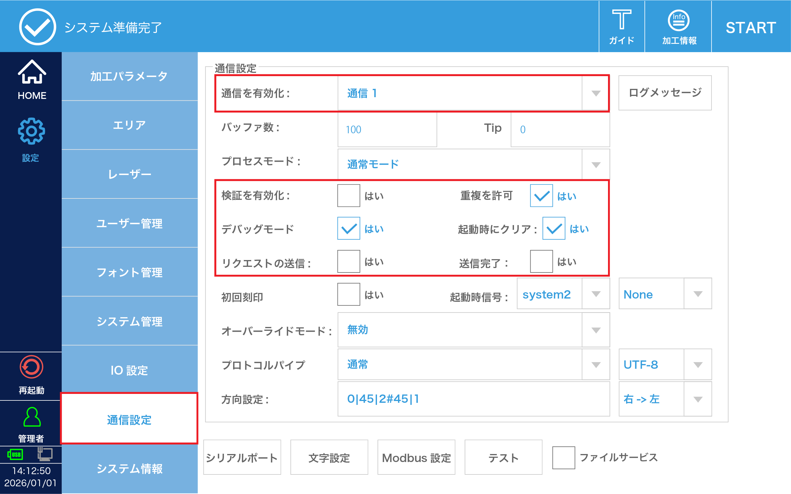
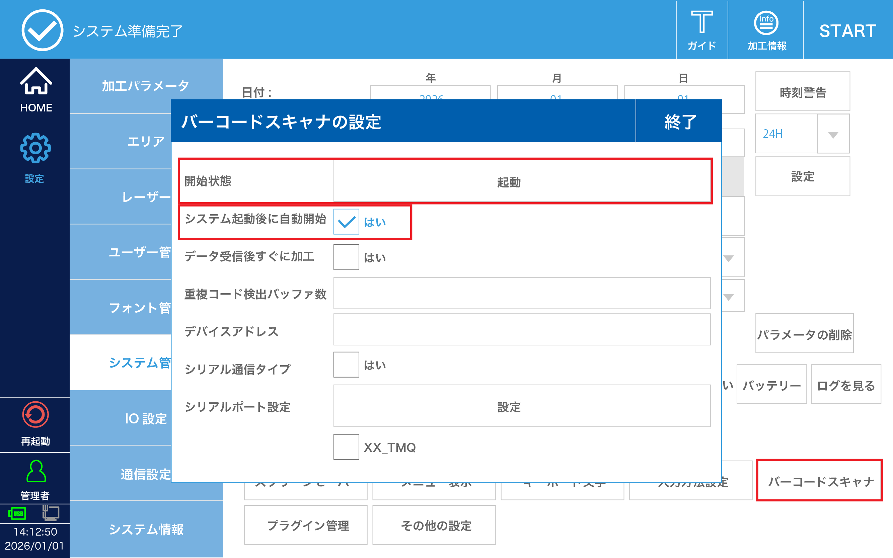
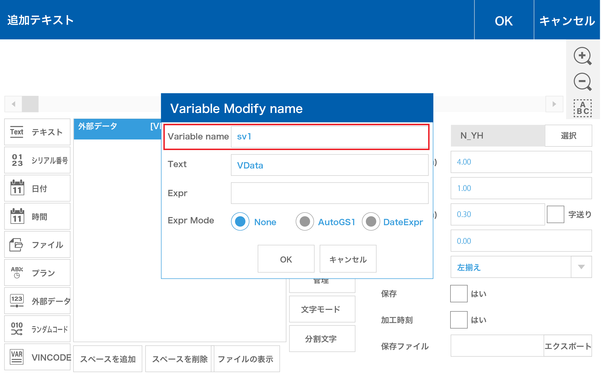
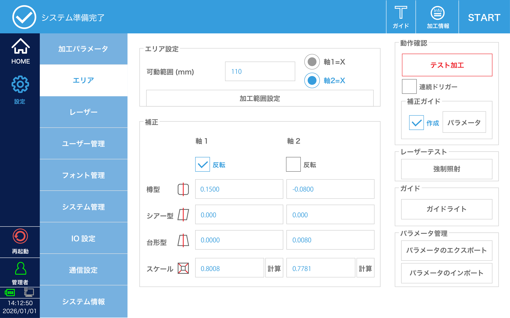
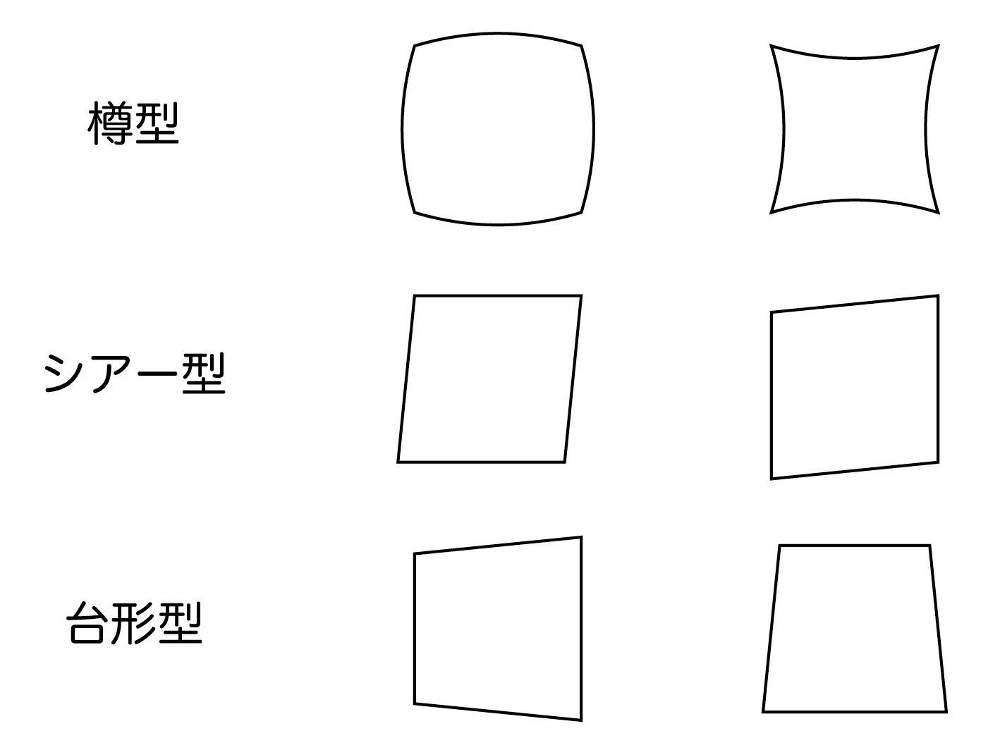

# 付録

## バーコードスキャナの使い方

バーコードスキャナを使用する場合は、システムの設定を変更する必要があります。

### 設定方法

通信設定

1. バーコードスキャナを加工機のUSBポートに接続します。
2. 設定 > 通信設定を開き、各項目を設定します。

 項目 | 設定 |
|:---:|---|
| 通信を有効化 | 通信1 |
| 重複を許可 | 有効 |
| 起動時にクリア | 有効 |
| デバッグモード | 有効 |

※設定を行ったら、「再起動」をタップしてデバイスを再起動してください。

システム設定 - バーコードスキャナ

 項目 | 設定 |
|:---:|---|
| 起動状態 | 起動 |
| システム起動後に自動開始 | 有効 |

### 使用方法

1. テキスト要素の「外部データ」を追加し、「編集」ボタンをタップします。
2. 変数名称（Variable name）を`sv1`に設定します。

この状態でバーコードスキャナでコードを読み取ると、上記のテキスト要素の文字列が読み取った文字列に変更されます。

## レンズの校正方法

レンズの校正作業は設定画面の「エリア」ページで行います。

レーザーが照射されます。この項目を操作する前に周囲の環境や加工素材の設置状況を十分に確認してください。

### 事前設定

下記の各項目の値を設定します。

**エリア設定**

| 項目 | 設定 |
|:---:|---|
| 稼働範囲 | 110 |
| 軸設定 | 軸2=X |

**加工範囲設定**

| 項目 | 設定 |
|:---:|---|
| 加工範囲を制限 | 有効 |
| 幅 | 100 |
| 高さ | 100 |

**補正**

| 項目 | 設定 |
|:---:|---|
| 軸1 反転 | 有効 |
| 軸2 反転 | 無効 |

設定が完了したら、黒画用紙などの刻印素材を設置し、「テスト加工」をタップして校正用の図形を加工します。
ここで加工された「ABC」の文字の向きや「+Y」「+X」の方向を確認します。

### 歪み補正

テスト加工で加工された外側の四角形を確認し、歪み方に応じて「樽型」「シアー型」「台形型」の歪みを補正します。
各項目について、**X方向は軸2、Y方向は軸1** の項目へ補正値を入力します。

まずは補正する歪みのいずれかに着目して補正値を +0.01〜0.05 程度変化させ、結果を確認します。
- 着目している歪みが大きくなってしまった場合は元の値に戻し、補正値を -0.01〜0.05 程度変化させて再度確認します。
- 着目している歪みに全く変化がない場合は元の値に戻し、もう一方の軸の補正値を変化させます。

それぞれの歪みについて補正を行います。

### 大きさ補正

上記の歪みが改善されたあと、大きさ補正を行います。

1. テスト加工で加工された外側の四角形の`幅`および`高さ`を測定します。
2. 軸1の「計算」ボタンをタップし、「図形サイズ」に `100` を、「測定サイズ」に`測定した高さ`を入力します。
3. 軸2の「計算」ボタンをタップし、「図形サイズ」に `100` を、「測定サイズ」に`測定した幅`を入力します。

再度加工して長さの測定を行い、幅および高さが 100mm になっていることを確認します。
測定結果にズレがある場合は、上記の手順1〜3を再度行ってください。歪みが生じた場合は再度 歪み補正 を行ってください。