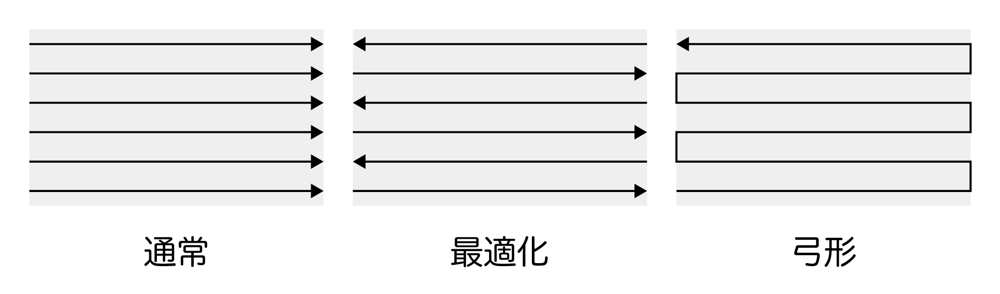
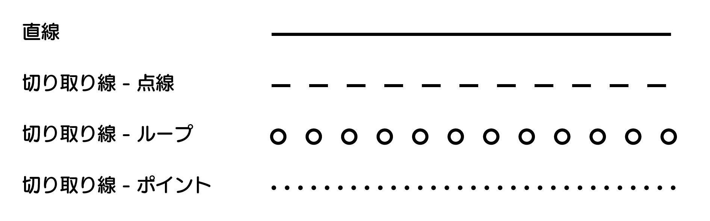
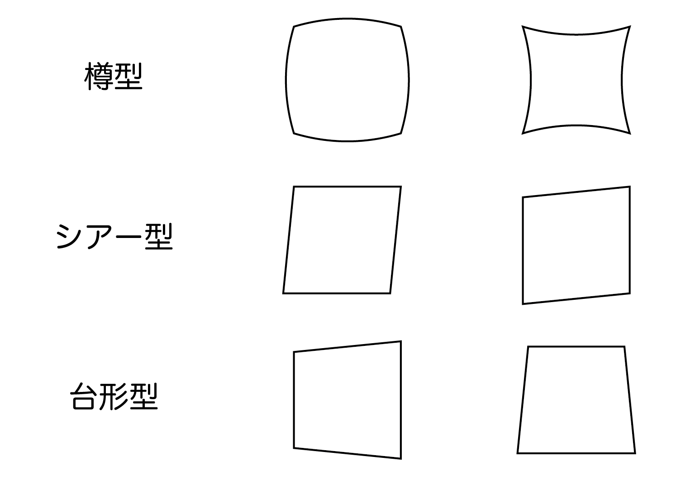

---
puppeteer:
    format: 'A4'
    headerTemplate: '

'
    footerTemplate: '
  
'
    displayHeaderFooter: true
---

LM100P 
操作マニュアル

第 0 版  
発行日 2026年00月00日 

目次

<a class="toc-item" href="#1-概要">
	1. 概要
	
	4
</a>
<a class="toc-item toc-section-item" href="#11-はじめに">
	1.1 はじめに
	
	4
</a>
<a class="toc-item toc-section-item" href="#12-製品安全使用ガイドライン">
	1.2 製品安全使用ガイドライン
	
	4
</a>
<a class="toc-item toc-section-item" href="#13-製品仕様">
	1.3 製品仕様
	
	6
</a>
<a class="toc-item" href="#2-画面構成">
	2. 画面構成
	
	7
</a>
<a class="toc-item toc-section-item" href="#21-サイドバー">
	2.1 サイドバー
	
	7
</a>
<a class="toc-item toc-section-item" href="#22-ステータスバー">
	2.2 ステータスバー
	
	7
</a>
<a class="toc-item toc-section-item" href="#23-メニューバー">
	2.3 メニューバー
	
	9
</a>
<a class="toc-item toc-section-item" href="#24-グラフィックビュー操作">
	2.4 グラフィックビュー操作
	
	11
</a>
<a class="toc-item toc-section-item" href="#25-コントロールパネル">
	2.5 コントロールパネル
	
	11
</a>
<a class="toc-item toc-section-subitem" href="#251-移動変形">
	2.5.1 移動・変形
	
	11
</a>
<a class="toc-item toc-section-subitem" href="#252-その他の操作">
	2.5.2 その他の操作
	
	12
</a>
<a class="toc-item toc-section-subitem" href="#253-リスト">
	2.5.3 リスト
	
	13
</a>
<a class="toc-item toc-section-subitem" href="#254-円弧文字">
	2.5.4 円弧文字
	
	13
</a>
<a class="toc-item toc-section-subitem" href="#255-塗りつぶし">
	2.5.5 塗りつぶし
	
	14
</a>
<a class="toc-item toc-section-subitem" href="#256-配列">
	2.5.6 配列
	
	15
</a>
<a class="toc-item toc-section-subitem" href="#257-プロパティ">
	2.5.7 プロパティ
	
	16
</a>
<a class="toc-item toc-section-item" href="#26-オブジェクトパネル">
	2.6 オブジェクトパネル
	
	17
</a>
<a class="toc-item toc-section-item" href="#27-文字入力">
	2.7 文字入力
	
	17
</a>
<a class="toc-item" href="#3-クイックスタート">
	3. クイックスタート
	
	18
</a>
<a class="toc-item toc-section-item" href="#31-ログイン">
	3.1 ログイン
	
	18
</a>
<a class="toc-item toc-section-item" href="#32-新規ファイルの作成">
	3.2 新規ファイルの作成
	
	18
</a>
<a class="toc-item toc-section-item" href="#33-データ作成">
	3.3 データ作成
	
	18
</a>
<a class="toc-item toc-section-item" href="#34-パラメータ設定">
	3.4 パラメータ設定
	
	19
</a>
<a class="toc-item toc-section-item" href="#35-加工操作">
	3.5 加工操作
	
	19
</a>
<a class="toc-item toc-section-item" href="#36-データ保存">
	3.6 データ保存
	
	19
</a>
<a class="toc-item" href="#4-編集">
	4. 編集
	
	20
</a>
<a class="toc-item toc-section-item" href="#41-図形">
	4.1 図形
	
	20
</a>
<a class="toc-item toc-section-subitem" href="#411-点">
	4.1.1 点
	
	20
</a>
<a class="toc-item toc-section-subitem" href="#412-直線">
	4.1.2 直線
	
	21
</a>
<a class="toc-item toc-section-subitem" href="#413-円形">
	4.1.3 円形
	
	21
</a>
<a class="toc-item toc-section-subitem" href="#414-矩形">
	4.1.4 矩形
	
	22
</a>
<a class="toc-item toc-section-item" href="#42-ファイル">
	4.2 ファイル
	
	22
</a>
<a class="toc-item toc-section-item" href="#43-テキスト">
	4.3 テキスト
	
	22
</a>
<a class="toc-item toc-section-subitem" href="#431-固定テキスト">
	4.3.1 固定テキスト
	
	24
</a>
<a class="toc-item toc-section-subitem" href="#432-シリアル番号">
	4.3.2 シリアル番号
	
	24
</a>
<a class="toc-item toc-section-subitem" href="#433-日付時刻">
	4.3.3 日付・時刻
	
	26
</a>
<a class="toc-item toc-section-subitem" href="#434-ファイル">
	4.3.4 ファイル
	
	27
</a>
<a class="toc-item toc-section-subitem" href="#435-プラン">
	4.3.5 プラン
	
	29
</a>
<a class="toc-item toc-section-subitem" href="#436-外部データ">
	4.3.6 外部データ
	
	30
</a>
<a class="toc-item toc-section-subitem" href="#437-ランダムコード">
	4.3.7 ランダムコード
	
	30
</a>
<a class="toc-item toc-section-subitem" href="#438-VINコード">
	4.3.8 VINコード
	
	30
</a>
<a class="toc-item toc-section-item" href="#44-バーコード">
	4.4 バーコード
	
	31
</a>
<a class="toc-item toc-section-item" href="#45-QRコード">
	4.5 QRコード
	
	32
</a>
<a class="toc-item toc-section-item" href="#46-待機時間">
	4.6 待機時間
	
	33
</a>
<a class="toc-item toc-section-item" href="#47-出力ポート">
	4.7 出力ポート
	
	33
</a>
<a class="toc-item" href="#5-設定">
	5. 設定
	
	34
</a>
<a class="toc-item toc-section-item" href="#51-加工パラメータ">
	5.1 加工パラメータ
	
	34
</a>
<a class="toc-item toc-section-item" href="#52-エリア">
	5.2 エリア
	
	36
</a>
<a class="toc-item toc-section-subitem" href="#521-ガルバノミラーのキャリブレーション">
	5.2.1 ガルバノミラーのキャリブレーション
	
	36
</a>
<a class="toc-item toc-section-item" href="#53-レーザー">
	5.3 レーザー
	
	37
</a>
<a class="toc-item toc-section-item" href="#54-ユーザー管理">
	5.4 ユーザー管理
	
	38
</a>
<a class="toc-item toc-section-item" href="#55-フォント管理">
	5.5 フォント管理
	
	38
</a>
<a class="toc-item toc-section-item" href="#56-システム設定">
	5.6 システム設定
	
	38
</a>
<a class="toc-item toc-section-item" href="#57-IO_設定">
	5.7 IO 設定
	
	40
</a>
<a class="toc-item toc-section-item" href="#58-通信設定">
	5.8 通信設定
	
	40
</a>
<a class="toc-item toc-section-item" href="#59-システム情報">
	5.9 システム情報
	
	40
</a>
<a class="toc-item" href="#6-オプション">
	6. オプション
	
	41
</a>
<a class="toc-item toc-section-item" href="#61-長文刻印カバー">
	6.1 長文刻印カバー
	
	41
</a>
<a class="toc-item" href="#7-付録">
	7. 付録
	
	43
</a>
<a class="toc-item toc-section-item" href="#71-バーコードスキャナの使い方">
	7.1 バーコードスキャナの使い方
	
	43
</a>
<a class="toc-item toc-section-subitem" href="#711-設定方法">
	7.1.1 設定方法
	
	43
</a>
<a class="toc-item toc-section-subitem" href="#712-使用方法">
	7.1.2 使用方法
	
	44
</a>
<a class="toc-item toc-section-item" href="#72-レンズの校正方法">
	7.2 レンズの校正方法
	
	44
</a>
<a class="toc-item toc-section-subitem" href="#721-事前設定">
	7.2.1 事前設定
	
	44
</a>
<a class="toc-item toc-section-subitem" href="#722-歪み補正">
	7.2.2 歪み補正
	
	45
</a>
<a class="toc-item toc-section-subitem" href="#723-大きさ補正">
	7.2.3 大きさ補正
	
	45
</a>

# 1. 概要

## 1.1 はじめに

本製品を使用する前に、必ずユーザーマニュアル全体を読み、本製品の各機能を十分に理解してから操作を行ってください。本製品の不適切な操作により、本人または第三者に危害が生じた場合、または製品の損傷や財産の損失が発生した場合であっても、当社は一切の法的責任を負いません。

当社が提供または推奨していない部品は使用しないでください。本製品の取り付けおよび使用にあたっては、必ず当社の指示に厳格に従ってください。そうしない場合、当社のアフターサービスを受けることができません。

本ガイド文書には、安全、操作、保守に関する説明が含まれています。組み立て、設定、使用を行う前に、必ずユーザーマニュアルをよくお読みください。

## 1.2 製品安全使用ガイドライン

本製品を不適切に使用すると、火災、物的損害、または人身傷害を引き起こすおそれがあります。ご使用の際は、必ず以下の安全ガイドラインに従ってください。

**製品免責事項**

すべての安全上の注意事項、警告メッセージ、利用規約、および免責事項をよくお読みください。使用前に、本製品の利用規約および免責事項、ならびに製品本体に貼付された黄色い警告ラベルを参照してください。ユーザーは、本製品のすべての使用および操作について、全責任を負うものとします。
ご利用の地域における関連法規を十分に理解してください。関連するすべての法令を理解し、それらを遵守した形で当社製品を使用することは、ユーザーの責任となります。

**製品の使用について**

1. 装置を使用する前に、以下のレーザーラベルの貼付位置に注意し、説明をよくお読みください。
   
2. 本製品の使用中は、レーザーを目や皮膚に直接照射しないでください。
   
3. 本製品の動作中に放射されるレーザーの性能パラメータは、以下のとおりです。

   <!-- |    | MFPN-20M-0.7 | MFPN-25M-0.6 | MFPN-30M-0.7 | MFPN-50M-1.1 |
   | --- | --- | --- | --- | --- |
   | パルス幅 | 90±10@27kHz | 100±20@40kHz | 100±20@40kHz | 100±10@45kHz |
   | 繰返し周波数 | 27～60 kHz | 40～60 kHz | 40～60 kHz | 45～170 kHz |
   | パルス幅 | モデル別によって異なる |||| -->

   <table>
   <tr><td>パルス幅</td><td>90±10@27kHz</td></tr>
   <tr><td>繰返し周波数</td><td>27～60 kHz</td></tr>
   <!-- <tr><td>最大出力</td><td>？？？？？</td></tr> -->
   </table>

4. 本仕様書の規定外の制御・調整・操作手順を用いると、危険なレーザー放射に曝露するおそれがあります。

5. 本製品に搭載されたレーザー開口部から放射されるレーザー放射レベルは、クラス1を超えています。

6. 光学濃度 OD3 の保護メガネの着用を推奨します。

7. 本製品をいかなる液体にも接触させないでください。水中に浸したり、濡らしたりしないでください。雨天時や長期間湿度の高い環境下で本機を使用しないでください。内部回路が短絡し、故障の原因となるおそれがあります。

8. 非公式部品や指定外の部品を使用することは固く禁止されています。部品の交換が必要な場合は、必ず当社公式ウェブサイトで関連する購入情報をご確認いただくか、アフターサービス窓口までお問い合わせください。当社が提供していない製品を使用したことに起因する製品事故や故障について、当社は一切の責任を負いません。

9.  本機の他のモジュールを取り付けたり取り外したりする前に、必ず本機の電源を切ってください。電源が入った状態でモジュールや各種部品を抜き差ししないでください。各種部品を損傷するおそれがあります。

10. 周囲温度が高すぎる場合（60℃を超える場合）、装置内部の電子部品が異常発熱・故障し、動作不良や破損を引き起こすおそれがあります。周囲温度が低すぎる場合には、LCDディスプレイが表示不良となったり、装置の動作が不安定となり、通常の使用要件を満たせなくなる場合があります。装置が通常の動作温度範囲に戻れば、表示および動作が回復する場合があります。

11. 強い静電気または強磁界環境下で本機を使用することは禁止されています。異常動作が発生するおそれがあります。その場合、本機の一部機能が誤動作し、重大な故障につながる可能性があります。

12. 本機を分解したり、鋭利な物で穴を開けたりすることは、いかなる方法であっても禁止されています。そうした行為により、本機の機能が誤動作し、重大な故障を引き起こすおそれがあります。

13. 本機が高所からの落下や外部からの強い衝撃を受けた場合、本機の機能に異常が生じ、故障の原因となることがあります。

14. 使用中に本製品が誤って水中に落下した場合は、安全で開けた場所に移動し、完全に乾燥するまで製品から離れてください。乾燥後であっても再使用せず、本書に記載された廃棄方法に従って適切に処分してください。製品が発火した場合は、消火手段として次の順序での使用を推奨します：水またはミスト、砂、防炎シート（防火毛布）、粉末消火器、二酸化炭素消火器。

15. 本製品を電子レンジや加圧容器の中に入れないでください。

16. 異常な状況下で、本製品の筐体にワイヤーやその他の金属物を差し込むことは禁止されています。短絡などにより、制御不能な危険を含む重大な結果を招くおそれがあります。

17. 本機を叩いたり衝撃を与えないでください。本機の上に重い物を載せないでください。

18. 本製品のタッチスクリーンに汚れが付着した場合は、専用の静電容量式スクリーン用クリーナーを使用して拭き取ってください。

19. 本製品の通気口にホコリがある場合は、ブラシを使用して清掃してください。（ひどく詰まっている場合は、アフターサービス担当者にご連絡ください）

20. 湿気の多い環境（海辺や水辺など）では、防湿袋を併用することを推奨します。水の侵入や浸水を防ぐためです。本製品内部に水が入っているのを確認した場合は、使用したり電源を入れたりしないでください。メンテナンスについては、アフターサービスにご連絡ください。

**製品の保管および輸送について**

1. 本機は子どもの手の届かない場所に保管してください。子どもが誤って触れたり電源を入れたりした場合、不適切な操作により重大な結果を招くおそれがあります。

1. 本機を熱源の近く（高温の車内、火気、暖房機器など）に近づけないでください。

1. 本機を保管する環境は乾燥した状態を保ってください。湿気の多い場所や、水漏れの可能性がある場所に長時間放置しないでください。

1. 本機を保管・輸送する際、ファイバケーブル（レーザー伝送ケーブル）には、強い引張り荷重をかけたり、無理に曲げたり、ねじったり、挟み込んだりしないでください。断線・出力低下・故障の原因となります。

**製品のメンテナンス**

1. 実際の使用状況に応じて、本機の放熱孔に付着したホコリを取り除くなど、必要な清掃を行ってください。これにより、本機の放熱効率を高い状態に保つことができます。

1. 保管環境温度は -20℃～45℃であり、最適な使用および保管環境温度は 20℃～25℃です。

<!-- **搭乗に関する注意事項** -->
<!-- 本機を航空機内に持ち込むことはできません。 -->

**本機の清掃方法**

本機を清掃する際は、乾いた柔らかい布などで拭き取ってください。より念入りな清掃を行う場合は、携帯電話やパソコン画面用の専用クリーナーの使用を推奨します。水などの導電性のある液体や腐食性の高い液体を、本製品に多量に付着させないでください。

## 1.3 製品仕様

<!--型番:MFPN-20M-0.7-->

| 項目 | 概要 |
|:--:|---|
| レーザー | ファイバーレーザー発振器 （Qスイッチ型） |
| 出力 | 20W |
| 波長 | 1064nm |
| 加工範囲 | 100×100mm |
| 走査方式 | 2軸ガルバノスキャナ |
| 焦点レンズ | 130mm |
| 最大加工速度 | 7000mm/s |
| マーキング方式 | ベクター／ラスタ（ビットマップ） |
| 最小線幅 | 0.03mm（条件により変動） |
| 繰り返し精度 | 0.01mm |
| 位置決め | 赤色ガイド光（可視光） |
| フォント | 簡体中国語・英語・数字・繁体字などの標準文字ライブラリ |
| 対応ファイル形式 | BMP / DXF / PNG / JPEG / PLT |
| バーコード | CODE 2-Of-5 Interleaved / CODE39 / CODE128 / QR / Codabar / CODE93 / UPC-A / UPC-E / EAN-14 / ITF-14 / EAN128 |
| 制御・操作 | 本体一体型（内蔵コントローラ / 8インチ静電容量式タッチスクリーン） |
| 電源 | AC100V 50/60Hz |
| 総消費電力 | 145〜250W |
| 保管環境 | -20 ～ 45℃ （推奨: 20 ～ 25℃）
| 動作環境 | 0 〜 40℃（推奨: 20 ～ 25℃）
| 本体質量 | 6〜6.8kg |

<!-- | 項目 | 概要 |
|:--:|---|
| レーザー | ファイバーレーザー発振器 （Qスイッチ型） |
| 出力 | 購入モデルに依存 |
| マーキング範囲 | 70×70mm、100×100mm（オプション） |
| 偏向ミラー | 高精度2次元スキャニングシステム |
| 波長 | 1064nm |
| 焦点レンズ | 130mm |
| マーキング速度 | ＜7000mm/s |
| マスターコントロール | 一体型マザーボード、8インチ静電容量式一体型スクリーン |
| オペレーティングシステム | Linuxシステム |
| マーキング/彫刻方式 | ドットマトリクスおよびベクター |
| タイプ | オールインワンマシン |
| 線幅 | 0.03mm |
| 繰り返し精度 | 0.01mm |
| 位置決め方式 | 赤色ガイド光による位置決め |
| フォント | 簡体中国語・英語・数字・繁体字などの標準文字ライブラリ |
| ファイル形式 | BMP / DXF / PNG / JPEG / PLT |
| バーコード | CODE 2-Of-5 Interleaved / CODE39 / CODE128 / CODE126 / QR / Codabar / CODE93 / UPC-A / UPC-E / EAN-14 / ITF-14 / EAN128 |
| 電源 | 110V / 220V AC、リチウムバッテリ（216Wh） |
| 総消費電力 | 145〜250W |
| 本体動作温度範囲 | 0〜40℃ |
| 本体質量 | 20W / 30Wモデル：6〜6.8kg、50Wモデル：8〜8.8kg |
| レーザー | ファイバーレーザー発振器（第2世代） |
| 位置決め方式 | 赤色ガイド光による位置決めおよびフォーカス |
| 刻印可能行数 | 有効マーキング範囲内で任意行 |
| 印字速度 | 800文字（材質および印字内容による） |
-->

# 2. 画面構成

ホーム画面は次の要素によって構成されています。

サイドバー
: HOMEボタンや設定ボタンなどが表示されています。

ステータスバー
: マーキングシステムの動作状態やエラー情報などを表示します。刻印操作もここから行います。

メニューバー
: ファイルの作成や保存、操作のやり直し等のツールが配置されています。

オブジェクトパネル
: 加工データの追加を行うことができます。

コントロールパネル
: 加工データの編集操作を行うことができます。

グラフィックビュー
: 加工データがプレビュー表示されています。

## 2.1 サイドバー

| 項目 | 説明 |
|:---:|-----|
| HOME | ホーム画面を表示します。 |
| 設定 | 設定画面を開きます。詳細は [5. 設定](#5-設定) の項目を参照してください。 |
| 再起動 | システムを再起動します。 |
| ログイン | 任意のユーザー権限でログインします。 |

## 2.2 ステータスバー

ここではステータスバーについて説明します。

| 項目 | 説明 |
|:---:|-----|
| ステータス表示 |  マーキングシステムの動作状態やエラー情報などを表示します。 |
| ガイド | 赤色ガイド光で、データのマーキングエリアをプレビューします。 |
| テスト加工 | マーキング状態の有無に関わらず、ボタンをタップした瞬間にレーザーが照射されます。 現在選択されているデータをマーキングします。マーキング後、ステータスバーでマーキング時間を確認できます。 |
| 加工情報 | ボタンをクリックすると、現在のファイルの印字情報を確認できます。 |
| START | マーキングモードの開始や停止を行います。 |

<!-- | 更新 |  飛行マーキング中に情報をオンライン更新することができます。オンライン更新には2つの方式があります。1つ目は「システムキャッシュを2回行った後にマーキング内容を更新する」方式です。オンライン更新をクリックすると、システムはもう一度マーキングを実行し、その内容を1回更新します。修正後の内容がマーキングされます。2つ目は「リアルタイム更新」です。オンライン更新をクリックすると、システムの次回マーキングが修正後の内容になります（高速生産ラインでは、リアルタイム更新により打刻抜けが発生するおそれがあります）。 |
| フォーカスライト | 赤色フォーカス用の赤色ライトチューブをシステムに接続している場合に使用します。つまり、2本の赤色ライトを接続します。 | -->

| 項目 | 説明 |
|:---:|-----|
| コンテンツを見る | ボタンをタップするとファイルのコンテンツリストを表示されます。 |
| <<拡張 | ボタンをタップするとこの画面を全体表示します。 |
| ファイル名 | 現在マーキング中のファイル名を表示します。 |
| 加工時間（ms） | 現在のファイルのマーキング時間。 |
| 累計加工回数 | 現在までのマーキング回数を総数を表示します。計数初期化でリセットできます。 |
| 加工回数 | 加工モード移行後のマーキング回数をカウントし、加工モードを解除するとリセットされます。加工モード中は「カウントクリア」からもリセットできます。 |
| ビューを更新 | この機能は使用しません。 |
| キャッシュの消去 | この機能は使用しません。 |

**その他の機能**

| 項目 | 説明 |
|:---:|-----|
| アラーム解除 | 発生しているアラームを解除します。 |
| シリアル番号編集 | シリアル番号のリセットや設定を行うことができます。 |
| 加工数到達アラート | 加工回数が上限カウントに達した時にアラートを表示します。 |

**シリアル番号リセット**

シリアル番号をリセットします。なお、シリアル番号の編集画面で「簡易リセット」が無効に設定されている要素はリセットされません。

**カウントクリア**

現在の 加工回数 または 累計加工回数 をクリアします。

**編集**

編集画面に戻ります。マーキング状態の場合は、状態を維持したまま編集を行うことができます。

マーキング状態でパラメータを変更しても、変更内容はすぐに反映されません。
予備加工を行うか、マーキング状態を解除してから再度マーキング状態に切り替えてください。

## 2.3 メニューバー

ここにはファイルの作成や保存、オブジェクトの複製やその他のツールが表示されています。

| 項目 | 説明 |
|:---:|-----|
| 新規 | 新規ファイルを作成します。 |
| 開く | システム内部または USB メモリ内に保存されているファイルを開きます。この画面の詳細については以降に記載します。 |
| 保存 | ファイルを上書き保存します。 |
| 別名保存 | ファイルに別名を付けて保存します。 |
| 取り消し | 直前の操作を取り消します。 |
| やり直し | 直前に取り消した操作を再実行します。 |
| コピー | 選択したデータをクリップボードへコピーします。その後、空白領域をタップするとペーストされます。 |
| 削除 | 現在選択しているオブジェクトを削除します。 |
| ツール | タップするとオブジェクトの整列や配置、グループ化などのツールパレットが開きます。 |

ファイル選択画面

| 項目 | 説明 |
|:---:|-----|
| 内部/USB | 表示するフォルダを システム内部 または USBメモリ に切り替えます。 |
| 戻る | 一つ前のディレクトリ階層に戻ります。 |
| フォルダを開く | 選択したフォルダを開きます。 |
| 新規フォルダ | 新規ファイルを作成します。 |
| 削除 | 選択したファイルを削除します。 |
| 名称変更 | 選択したファイルの名称を変更します。 |
| コピー | 選択したファイルをコピーします。 |
| 貼り付け | コピーしたファイルを貼り付けます。システム内部や USB メモリへの複製が可能です。 |

本体のファイルをUSBメモリにコピーする場合 
1.［内部］をタップしてファイルを選択し、［コピー］をタップします。 
2.［USB］をタップし、［貼り付け］をクリックすると、内部ファイルが USBメモリ にコピーされます。

ツールパレット

ここでは、ツールパレットの各機能について紹介します。
Tool機能には、整列、分布、グループ化、結合、カーブへの変換などが含まれます。

| 項目 | 説明 |
|:---:|-----|
| 左揃え | 選択したオブジェクトの左端を揃えます。 |
| 中央揃え | 選択したオブジェクトの垂直方向の中央を揃えます。 |
| 右揃え | 選択したオブジェクトの右端を揃えます。 |
| 上揃え | 選択したオブジェクトの上端を揃えます。 |
| 上中央揃え | 選択したオブジェクトの水平方向の中央を揃えます。 |
| 下揃え | 選択したオブジェクトの下端を揃えます。 |
| 垂直分布 | 選択したオブジェクトを垂直方向に等間隔で分布させます。3つ以上のオブジェクトを選択してください。 |
| 水平分布 | 選択したオブジェクトを水平方向に等間隔で分布させます。3つ以上のオブジェクトを選択してください。 |
| グループ化 | 選択した複数のベクター図形をグループ化します。 |
| グループ解除 | グループ化されたオブジェクトを解除します。 |
| 結合 | 選択したベクター図形を1つの新しいベクター図形として結合します。 |
| 結合解除 | ベクター図形やテキスト内容を、単一のベクター図形（パス）ごとに分解します。 |
| パス化 | テキストをベクターパスに変換します。 |
| その他設定 | オブジェクトの回転角度を設定したり、オブジェクト内の線の交差部分の重なりを削除できます。（テキストの場合は「N_YH1」フォントのみ交差削除に対応しています） |
| 配列 | 選択したオブジェクトを複数行・複数列にコピーして配置します。再編集が必要な場合は [2.5 コントロールパネル](#25-コントロールパネル) の「配列」機能を使用してください。 |

## 2.4 グラフィックビュー操作

| 項目 | 説明 |
|:---:|-----|
| 拡大 | 表示エリアを拡大します |
| 縮小 | 表示エリアを縮小します。 |
| 作業エリア | マーキングエリア全体を表示します。 |
| 選択中 | 選択中のオブジェクトを最大表示します。 |
| 全体 | すべてのオブジェクトを最大表示します。 |

## 2.5 コントロールパネル

<!--  -->

### 2.5.1 移動・変形

| 項目 | 説明 |
|:---:|-----|
| 移動量 | 回転や移動・シアー操作での移動量を設定します。（単位：mm または deg） |
| 回転 | 選択中のオブジェクトを「移動量」の設定値だけ回転させます。 |
| 移動 | 選択中のオブジェクトを「移動量」の設定値だけ移動させます。 |
| 自由移動 | 選択中のオブジェクトをタップした位置に移動させます。自由移動モードを解除する場合は再度このボタンをタップしてください。 |
| シアー | 選択中のオブジェクトに、「移動量」で指定した値のシアー（傾き）を適用します。 |
| 反転 | 選択中のオブジェクトを上下または左右に反転させます。 |
| 中央揃え | 選択中のオブジェクトの中心を加工エリアの中心座標に移動させます。 |

### 2.5.2 その他の操作

| 項目 | 説明 |
|:---:|-----|
| 編集 | 選択中のテキストやバーコードオブジェクトの編集画面を開きます。 |
| 複数選択 | 複数選択モードの切り替えを行います。 |
| 全選択 | 全てのオブジェクトを選択します。 |
| 評価 | 単位時間あたりの最大加工数の推定値を表示します。 |
| リスト | オブジェクトをリスト表示します。選択操作や並べ替え操作などを行うこともできます。 |
| 塗潰し | 図形の塗りつぶしを設定できます。 |
| 配列 | オブジェクトを指定間隔に並べて配置します。ここで設定した配列は再編集が可能です。 要素を複製したい場合は [2.3 メニューバー](#23-メニューバー) の「配列」機能を使用してください。 |
| 円弧文字 | 選択中のテキストオブジェクトを円弧テキストに変更できます。 |

### 2.5.3 リスト

現在のファイルに存在するオブジェクトの一覧を表示します。

| 項目 | 説明 |
|:---:|-----|
| 上移動 | 選択した項目を一つ上に移動することができます。この操作によりマーキング順序を設定できます。（マーキングはリストの上から下へ実行されます） |
| 下移動 | 選択した項目を一つ下に移動することができます。 |
| 最上位 | 選択した項目を先頭に移動します。 |
| 最下位 | 選択した項目を末尾に移動します。 |
| 加工可否 | 選択した項目の加工の有効・無効を切り替えます。 |
| 名称 | 選択した項目の名称を変更します。 |
| ロック切替 | 選択した項目のロック・ロック解除を行います。ロックするとタッチ操作での選択対象から除外されます。 |
| 削除 | 選択した項目を削除します。 |
| レイヤ | オブジェクトにレイヤを割り当てることができます。通常は使用しません。 |
| 編集 | 選択中のテキストやバーコードオブジェクトの編集画面を開きます。 |

<!-- | レイヤ | 3つのデータが同時に存在する場合、それぞれを前のデータのマーキング完了後に順次マーキングするよう順序を設定できます。レイヤーを追加し、各データを1つのレイヤーとして割り当てることで、マーキング順序を変更します。 「Layer management（レイヤー管理）」をクリックすると、図2-49の画面が表示されます。 例：現在の編集ボックスに3つのデータがあり、それらを1つずつ順番にマーキングしたい場合、3つのレイヤーを追加し、各レイヤーに1つずつシリアル番号を割り当てます。各レイヤーの「Start delay（スタートディレイ）」には値（例：1）を設定する必要があります。OKをクリックしてホーム画面に戻ると、図2-50のように、各データで異なるレイヤー番号を選択する必要があります。 <TODO:機能確認> |

左図は同一レイヤー内でのマーキング順序、右図は異なるレイヤー間でのマーキング順序を示しています。

 -->

### 2.5.4 円弧文字

円弧文字ボタンをタップすると、テキストを円弧テキストに変換できます。

| 項目 | 説明 |
|:---:|-----|
| 円弧文字 | 有効にすると円弧テキストに変換されます。この操作は取り消すことはできません。 |
| 文字順序反転 | テキストの並び方向（順方向／逆方向）を設定します。 |
| スタイル | テキストの配置位置を円の内側または外側へ設定します。 |
| 半径X(mm) | 基準円のX軸方向の半径を設定します。 |
| 半径Y(mm) | 基準円のY軸方向の半径を設定します。 |
| 開始角度 | 最初の文字の開始角度を設定します。 |
| 円弧角度 | 円弧の角度を設定します。 |

### 2.5.5 塗りつぶし

テキストオブジェクトやベクター図形に塗りつぶしをを設定できます。
単線フォントや開いたパス（始点と終点が繋がっていないパス）には設定できません。

| 項目 | 説明 |
|:---:|-----|
| 塗潰し有効 | 有効にすると図形またはテキストの塗りつぶし有効にします。 |
| 塗潰し角度 | X軸と走査線の角度を設定します。数値を入力するか、ボタンから選択します。 |
| 線間隔 | 塗りつぶし線同士の間隔（mm）を設定します。 |
| 輪郭 | 輪郭線の加工有無を設定します。 |
| 塗潰し種類 | 通常：一方向に直線を引き重ねて塗りつぶしを行います。輪郭が揃いやすくなります。 最適化：双方向に走査して塗つぶしを行います。マーキング時間を短縮できます。 弓形：双方向に走査して塗つぶしを行います。折り返し部分もレーサー照射が行われます。 |

詳細パラメータ

| 項目 | 説明 |
|:---:|-----|
| 均等分散 | 設定された線間隔を基準に、塗りつぶし範囲に対して線を均等に分配します。 |
| 余白 | 塗りつぶし線と輪郭線との距離を設定します。 |
| インデント | 通常使用しません。（「余白」と同じ効果です） |
| 輪郭線本数 | 追加の輪郭線の本数を設定します。設定する場合は「輪郭線間隔」を 0 より大きくしてください。 |
| 輪郭線間隔 | 輪郭線同士の間隔を設定します。 |
| 塗潰し回数 | 塗りつぶしを行う回数を設定します。 |
| 角度増分 | 塗潰しを複数回行う場合、加工毎に塗潰し角度を変化させることができます。ここではその変化量（回転角度）を設定できます。 |
| 分布値 | この項目は使用しません。 |

<!-- @バグあり・メーカー確認済み・修正予定なし@
ハッチング角度が0や90だとで余白を設定するとハッチングの結果がおかしくなる（余白が考慮されないところが出てくる）
30度に設定するとさらにおかしくなる。 -->

余白（インデント）が設定されている場合、ハッチングの角度によってはハッチングの計算結果に誤差が生じる場合があります。このような場合は角度を45°に設定するか、余白を小さくしてください。

### 2.5.6 配列

同一の要素を複数加工する場合に使用します。ここで設定した配列は再編集が可能です。

<table class="noframe">
<tr>
<td style="padding:20px"></td>
<td style="padding:20px"></td>
</tr>
</table>

**基本設定**
| 項目 | 説明 |
|:---:|-----|
| 列数 | 配列の列数を設定します。 |
| 行数 | 配列の行数を設定します。 |
| 列間隔 | 列の間隔を設定します。要素の中心間の距離を設定します。 |
| 行間隔 | 行の間隔を設定します。要素の中心間の距離を設定します。 |
| 方向 | 加工順序を設定します。「CCW/CW」で時計回り・反時計回りを切り替えることもできます。 |

**微調整**
| 項目 | 説明 |
|:---:|-----|
| 個別オフセット | 配列の個々の要素の位置を微調整できます。対象の要素を選択して数値を入力するか、矢印ボタンで移動させます。 |
| ガイド表示 | 選択中の要素をガイド光でプレビュー表示します。 |

### 2.5.7 プロパティ

ここには選択中のオブジェクトの座標や寸法情報などが表示されています。また、各項目を数値入力で設定することもできます。

| 項目 | 説明 |
|:---:|-----|
| 幅 / 高さ | 図形の寸法情報が表示されます。数値を入力して寸法を設定することも可能です。 |
| リンクボタン | 有効の場合は幅と高さの比率を固定します。 |
| X / Y | オブジェクトをリスト表示します。選択操作や並べ替え操作などを行うこともできます。 |
| パラメータ | 刻印パラメータを設定します。「変更」ボタンをタップするとパラメータを直接変更できます。また、設定メニューの「加工パラメータ」から変更することもできます。 オブジェクトごとにパラメータを変える場合は、対象のオブジェクトを選択した状態でカラーボタンをタップし、別のレイヤ（カラー）を選択してください。 |

設定した加工パラメータはファイルごとに保存されます。
新規ファイル作成時の初期パラメータを設定する場合は「デフォルト値」を変更します。

## 2.6 オブジェクトパネル

<!--  -->

ここには刻印オブジェクトの追加ツールが並んでいます。詳細は  [4. 編集](#4-編集) の項目をご確認ください。

| 項目 | 説明 |
|:---:|-----|
| 図形 | プリセット図形を配置します。 |
| ファイル | 画像ファイルを読み込んで配置します。 |
| テキスト | 文字列を配置します。 |
| バーコード | バーコードを配置します。 |
| QRコード | QRコードを配置します。 |
| 待機時間 | 待機時間を追加します。 |
| 出力ポート | この項目は使用しません。 |

## 2.7 文字入力

A：大文字／小文字切り替えキー 
B：スペースキー 
C：エンターキー 
D：カーソル移動キー 
E：削除、入力方式の切り替え

このシステムでは漢字変換は行えません。
漢字を含む文字列を刻印する場合は、予め文字列をテキストファイルへ保存し、テキスト要素の「ファイル」機能で文字列を読み込んでください。 
また、フォントによっては ひらがな や 漢字、一部の漢字 などに対応していない場合があります。

# 3. クイックスタート

## 3.1 ログイン

ログインボタンをクリックすると、パスワード入力画面がポップアップ表示されます。

ログインパスワード：123 
※管理者の初期パスワードです。異なる権限でシステムにログインすることもできます。

## 3.2 新規ファイルの作成

メニューバーの「新規」ボタンをタップして新規ファイルを開きます。

「編集中のファイルを保存しますか？」と表示された場合、「OK」をタップすると現在のファイルの変更内容が保存されます。「キャンセル」をタップすると変更内容が破棄されます。

## 3.3 データ作成

一例として、刻印ごとに「ABC0000」「ABC0001」「ABC0002」... とカウントアップしていく文字列を作成します。

**刻印文字列の作成** 

オブジェクトパネルから「テキスト」を選択します。

<画像>

文字列リストに追加されている「テキスト」要素を選択し、「編集」ボタンをタップします。

<画像>

「内容」の入力フォームをタップし、「ABC」と入力して「OK」ボタンをタップします。（大文字を入力する場合は`Caps`を有効にします）

<画像>

「シリアル番号」をタップしてシリアル番号要素を追加します。

フォントの「選択」ボタンをタップし、「輪郭線」フォントから「Arial Unicode MS」を選択します。

画面右上の「OK」ボタンをタップします。

**オブジェクトの選択** 
グラフィックビューに表示されているテキストオブジェクトをタップすると、オブジェクトが選択状態になります。
選択状態のオブジェクトは緑色の枠線が表示されます。（プリセットの「点」オブジェクトを除く）

**位置の調整** 
テキストオブジェクトが選択された状態で、位置を X:0 / Y:0 に設定します。 
※コントロールパネルの「中央揃え」をタップすることでも同等の操作が可能です。

**塗潰し設定** 
テキストオブジェクトが選択された状態で、コントロールパネルの「塗潰し」をタップします。
表示されたダイアログで下記の設定を行います。

| 項目 | 設定 |
|:---:|---|
| 塗潰し有効 | 有効 |
| 塗潰し角度 | 0.00|
| 線間隔 | 0.15 |
| 輪郭 | 有効 |
| 塗潰し種類 | 通常 |

この設定を行うと、グラフィックビューでも実際に塗りつぶされた状態で文字列が表示されます。

## 3.4 パラメータ設定

コントロールパネルの パラメータ「変更」ボタンをタップします。
表示されたパラメータ設定画面で下記の設定を行います。

| 項目 | ステンレス（参考） | MDF（参考） | ABS樹脂 |
|:---:|---|---|---|
| 加工速度 | 1000 | 100 | 2000 |
| パワー | 60 | 50 | 20 |
| 周波数 | 30 | 50 | 30 |

## 3.5 加工操作

安定した場所に素材を設置し、ハンドガンをしっかりと保持して素材に押し付けます。
ステータスバーの「START」ボタンをタップし、マーキングモードに切り替えます。 
マーキング状態では、ハンドガンのトリガー入力でレーザー照射されます。十分に注意してください。

刻印位置に赤色のガイド光が表示されるので、位置を確認しながら微調整を行います。

トリガーを入力すると加工が始まります。加工中はハンドガンをしっかり保持し、揺れないように注意してください。

加工が終わったら、ステータスバーの「STOP」ボタンをタップしてマーキング状態を解除します。

## 3.6 データ保存

作成したファイルを内部に保存します。
メニューバーの「保存」または「別名保存」をタップし、ファイル名を入力して「OK」をタップします。

# 4. 編集

ここでは、ファイルに追加できる刻印データの種類や設定方法を説明します。
追加できるものには、テキスト、図形（点・線・円・矩形）、バーコード、QRコードなどが含まれます。

## 4.1 図形

プリセット図形（直線、点線、点、円、矩形）を描画できます。

### 4.1.1 点
「点」を選択するとグラフィックエリアの座標（X:5, Y:5） に点が配置されます。コントロールパネル等で任意の位置に移動させてください。

また、下図に示すように、設定 → マーキングパラメータで「パルス照射」または「連続照射」を選択することもできます。
<TODO:@メーカー確認。挙動の違いについて>

「点」の加工パラメータは「単点照射時間」で設定で設定します。

### 4.1.2 直線
「直線」を選択すると下記のダイアログが表示されます。直線の長さやタイプなどを設定できます。

| 項目 | 説明 |
|:---:|-----|
| 線種 | 線のタイプを選択します。 |
| 長さ | 直線の長さ（mm）を設定します。 |
| 直径 | 点線とループのみ有効です。線分の長さまたは円の直径を設定します。 |
| 間隔 | 切り取り線タイプのみ有効です。要素同士の間隔を設定します。 |

**線種**

### 4.1.3 円形
「円形」を選択するとグラフィックエリアの中心に直径20mmの円が配置されます。コントロールパネル等で任意の位置や大きさに設定してください。

### 4.1.4 矩形
「矩形」を選択するとグラフィックエリアの中心に一辺20mmの矩形が配置されます。コントロールパネル等で任意の位置や大きさに設定してください。

## 4.2 ファイル
「ファイル」を選択すると下記のダイアログが表示されます。サポートされる形式は dxf, plt, jpg, png, bmp です。
ファイルが見つからない場合は、「種類」が適切に設定されているかご確認ください。

ラスタ画像は、インポート後にコントロールパネルの「編集」機能から 解像度や明るさ・コントラスト、色の反転などの設定を行うことができます。

## 4.3 テキスト
「テキスト」を選択すると、テキスト編集画面が表示されます。
新規作成時には空の固定テキストが自動的に追加されています。

| 項目 | 説明 |
|:---:|-----|
| 上移動 | データの順序を調整し、前方へ移動します。 |
| 下移動 | データの順序を調整し、後方へ移動します。 |
| 編集 | 固定テキスト、シリアル番号、日時、ファイル読み込み、シフトコード、外部データ、ランダムコードなどを編集します。 |
| 削除 | 追加した内容を削除します。 |
| 改行 | 枝分かれさせて情報を追加します。 |
| 管理 | この項目は使用しません |
| 文字モード | この項目は使用しません。 |
| 分割文字 | この項目は使用しません。 |
| 文字数制限 | この項目は使用しません。 |

フォントの設定

| 項目 | 説明 |
|:---:|-----|
| フォント | テキストフォントを選択します。ドットフォント、単線フォント、輪郭線フォントから選択できます。塗潰しを設定する場合は輪郭線フォントを使用します。 |
| 文字高さ | フォントの大きさ（mm）を指定します。実際に刻印される文字の高さを指定する場合は、オブジェクトの高さで調整してください。 |
| 文字幅 | デフォルト値は1で、値を変更することで文字を横方向に引き伸ばします。 |
| 文字間隔 | 文字同士の間隔（mm）を指定します。「字送り」を有効にすると文字の字送りを指定できます。 |
| 行間隔 | 複数行の場合、テキスト内の行間（mm）を設定できます。 |
| 文字揃え | 複数行の場合、行の整列方法を設定できます。 |

ログ機能

| 項目 | 説明 |
|:---:|-----|
| 保存 | ログ用の機能です。チェックを入れると加工時に加工内容をログファイルに記録します。 |
| 加工時刻 | ログ用の機能です。チェックを入れると加工時刻をログファイルに記録します。 |
| 保存ファイル | ログ用の機能です。加工内容を記録するログファイルの名称を入力します。ファイルは本体に保存されます。 |
| エクスポート | 保存したログファイルをUSBへ複製することができます。 |

<!-- | 保存/加工時刻/保存ファイル | この機能は使用しません。 | -->

**フォントの種類**

輪郭線フォントは「設定 > フォント管理」から追加することも可能です。TrueType（*.ttf）のみ対応しています。
<!--
ドットフォント *.bi
単線フォント *.nt
輪郭線フォント *.ttf
-->

### 4.3.1 固定テキスト
「テキスト」をタップするとテキスト要素が追加されます。「編集」をタップするとテキストボックスがポップアップし、任意の文字列を入力することができます。

### 4.3.2 シリアル番号
「シリアル番号」をタップするとテキスト要素が追加されます。「編集」をタップすると下記のポップアップが表示されます。

シリアル番号ボタンをクリックすると、デフォルト内容「0000」のシリアル番号が追加されます。

**シリアル番号の編集**

シリアル番号を選択し、編集ボタンをクリックすると、次に示すシリアル番号編集画面がポップアップ表示されます。

| 項目 | 説明 |
|:---:|---|
| 名称 |  シリアル番号の識別名称を入力します。空欄で問題ありません。加工情報の「その他の機能」「シリアル番号編集」に表示されます。 |
| 開始番号 | この値からカウントを始めます。 |
| 終了番号 | この値でカウントが終了します。 |
| 現在番号 | 現在のカウントです。 |
| 増分 | 加算値を設定します。 |
| 桁数 | 桁数を設定します。設定する場合は桁埋め文字も設定してください。 |
| 桁埋め文字 | パディング文字を指定します。 |
| カスタム進数 | デフォルトは10進数です。「設定」をタップするとダイアログが表示され、進数の変更や対応する文字の設定などを行うことができます。 |
| 変更方式 | 本製品では自動モードのみ有効です。 |
| 繰返し回数 | 各シリアル番号の繰り返し加工数を設定します。同一ワークの複数箇所に刻印を行う場合などに使用します。 |
| 現在の回数 | 現在のシリアル番号の刻印回数です。 |
| ループ | 有効の場合、加工中にシリアル番号が終了番号に達した時に自動的に開始番号にリセットされ、加工を継続します。 |
| Static | この機能は使用しません。 |
| 簡易リセット | チェックを入れると、加工情報の「シリアル番号をリセット」ボタンでシリアル番号を開始番号にリセットできます。 |
| Last length | この機能は使用しません |
| 時間リセット | この機能は使用しません。 |
| 制御信号出力 | この機能は使用しません。 |
| リセット対象 | シリアル番号のリセット時、シリアル番号を開始値にリセットするか、繰り返しの現在回数をリセットするか設定します。 |

<!-- **Change method**<変更方式説明>
| 項目 | 説明 |
|:---:|---|
| 自動モード |  シリアル番号が自動的に次の値へ進みます。 |
| 手動モード |  外部IO入力によって、次の値へ進めます。 | -->

<!--
時間リセット | シリアル番号をリセットする時刻を設定します。継続加工を行う中で、シリアル番号を毎日14:22:14に定期的にリセットするといった設定が可能です。
この機能は生産ラインモードでのみ有効 |
-->

### 4.3.3 日付・時刻
「日付」「時刻」ボタンをタップすると、次に示すように、システムの日付または時刻が追加されます。

<table class="noframe">
<tr>
<td style="padding:0 20px"></td>
<td style="padding:0 20px"></td>
</tr>
<tr style="text-align:center">
<td>日付</td><td>時刻</td>
</tr>
</table>

**日付・時刻の編集**

日付または時刻要素を選択して「編集」ボタンをタップすると、日付／時刻編集画面がポップアップ表示されます。

| 項目 | 説明 |
|:---:|---|
| 形式選択 | システム内蔵の日時フォーマットが用意されており、そのまま選択して使用できます。 |
| 形式の修正 | 日時フォーマットを編集します。区切り記号や、年月日の並び順などを変更できます。 |
| 時間オフセット | 年・月・日・時・分・秒を現在時刻を基準として増減させることができます。例えば、「日」の値に1を加えると翌日、「日」の値を -1 にすると前日となります。他の項目も同様です。 |
| カスタム形式（凡例型式） | カスタマイズした時間変数の表現を設定します。下図のように「カスタマイズを有効にする」にチェックを入れ、対象の項目を選択してフォーマットを編集します。 |
| 名称 | この項目は使用しません。 |
| 保証期間（日） | この項目は使用しません。 |

時間情報の更新のタイミングは「マーキングモードに移行した時刻」および「前の刻印が終了した時刻」です。（プレビューに表示されている日時・時刻文字列が刻印されます） 
加工開始時に時刻情報は更新されないため、マーキングモードで長時間アイドル状態が続いた場合は一度マーキングモードを停止し、再度マーキングモードに切り替えてください。

### 4.3.4 ファイル
ファイルボタンをクリックし、テキストファイルまたはExcelファイルを選択して項目を追加します。

行ごとに文字数が異なる場合、文字が加工エリアからはみ出した場合に加工不良が発生するリスクがあります。 
最大文字数の行でフォントや大きさの設定を行うか、文字数制限機能の使用をご検討ください。<TODO:長さ制限は有効か>

**テキストファイルの編集**

「テキスト読み込み」を選択し、Editボタンをクリックすると、ファイル読込の編集画面がポップアップ表示されます。

| 項目 | 説明 |
|:---:|---|
| ファイルパス | 対象のファイルを設定します。 |
| 行番号 | 現在参照しているテキストの行番号を表示しています。タップで設定することもできます。 |
| ループ | テキストファイルをループしてマーキングするかどうかを設定します。最後の行までマーキングした後、自動的に最初の行から再びマーキングを開始します。 |
| GS1リーディングの追加 | この機能は使用しません。 |
<!-- | Expr | この機能は使用しません。 | -->

**Excelファイルの編集**

「エクセル読み込み」を選択し、Editボタンをクリックすると、Excel読込の編集画面がポップアップ表示されます。

| 項目 | 説明 |
|:---:|---|
| ファイルパス | ファイルパスの後ろにある選択ボタンをクリックすると、（システム内またはUSB内の）ファイルパス画面がポップアップするので、読み込むファイルを選択します。 |
| 行番号（行） | 現在マーキングしている行番号。特定の行を指定して選択できます。 |
| 列名称（列） | テーブルに複数列がある場合、マーキングする列を選択できます。 |
| ループ | 循環マーキングを行うかどうかを設定します。ファイルの最後の行までマーキングした後、自動的に最初の行から再びマーキングを開始します。 |
| 指定行のみ | 指定された行のみ加工します。繰り返し回数の加工が終わると警告を表示します。 |
| 繰返し回数 | 単一行を何回繰り返しマーキングするかの回数。 |
| 現在の繰返し回数 | 単一行の繰り返しマーキングが、現在何回実行されたかを示します。 |
<!-- | Expr | この機能は使用しません。 | -->

### 4.3.5 プラン
現在時刻に応じて刻印する文字列を切り替える場合に使用します。
「プラン」ボタンをタップして作成し、「編集」ボタンをタップして具体的な設定を行います。

<!--  -->

<table class="noframe">
<tr>
<td style="padding:20px"></td>
<td style="padding:20px"></td>
</tr>
</table>

| 項目 | 説明 |
|:---:|---|
| 追加 | 新しい要素をリストを追加します。 |
| 削除 | 選択中の要素を削除します。 |
| 編集 | 選択中の要素を編集します。 |
| ファイルモード | 時間と文字列の対応を記載したCSVファイルを別途作成し、読み込むことができます。<TODO:動作確認> |

この例では、00:00:00～11:59:59 の間は「AAA」が刻印され、12:00:00～23:59:59 の間は「BBB」が刻印されます。

<table>
<tr><td>開始時間</td><td>印字要素</td></tr>
<tr><td>00:00:00</td><td>AAA</td></tr>
<tr><td>12:00:00</td><td>BBB</td></tr>
</table>

※データ更新のタイミングは前の刻印が終了した時、またはマーキングモードに移行した時です。（刻印開始時にデータは更新されません）

### 4.3.6 外部データ
この機能は使用しません。

### 4.3.7 ランダムコード
刻印文字列をランダムに生成します。
「ランダムコード」ボタンをタップして作成し、「編集」ボタンをタップして具体的な設定を行います。

| 項目 | 説明 |
|:---:|---|
| フォーマット | ランダムに生成する文字種類などを設定します。数字は「*」、小文字は「a」、大文字は「A」で表します。 |
| 按天变动 | 有効の場合、同日は同一のランダムコードを使用し、翌日になると新しいコードに更新されます。 |
| 重新获取 | ランダムコードを再生成します。 |

例：フォーマットを「***aaaAAA」に設定した場合、3桁の数字・3文字の小文字・3文字の大文字が混ざったランダムコード（4rj9EC5cS / W03M1pdKe など）が生成されます。 

### 4.3.8 VINコード
VINコード形式での文字列生成をサポートします。

## 4.4 バーコード
「バーコード」ボタンをタップと編集画面がポップアップします。
テキストボックスをタップするとテキスト編集画面が表示され、 [4.3 テキスト](#43-テキスト) 項目で紹介した文字列機能が利用できます。設定完了後にOK（確認画面）をタップするとバーコードが更新されます。

コード種類

| 項目 | 説明 |
|:---:|---|
| 反転 | チェックを入れるとバーコードが白黒反転します。このモードではバーコードの両端に枠線が自動的に追加されます。 |
| タイプ | バーコードの種類を設定します。Code 2of5 Interleaved、Codebar、Code 128、Code 39、Code 93、UPC-A、UPC-E、EAN-14、ITF-14、EAN128、EAN-13 などから選択できます。 |
| モード | バーコードのモデルの選択します。ノーマル（通常） と GS1（Code 128 と EAN128のみ対応）があります。 |
| 高さ | バーコードの高さ（mm）を設定します。 |
| 両端余白 | 左右の枠線がある場合に、バーコードと枠線との間の距離（mm）を設定します。 |
| 上下枠線（上下長さ） | バーコードの上下端に枠線を追加し、その線幅（mm）を設定します。 |
| 左右枠線（左右長さ） | バーコードの左右端に枠線を追加し、その線幅（mm）を設定します。上下枠線が0以外のとき枠線の線幅は統一されます。 |

<table class="noframe">
<tr>
<td></td>
<td></td>
</tr>
<tr style="text-align:center;">
<td>通常</td>
<td>反転 + 枠あり</td>
</tr>
</table>

テキスト

| 項目 | 説明 |
|:---:|---|
| 文字内容表示 | チェックを入れると、バーコード内容のテキストを刻印します。 |
| フォント | テキストのフォントを設定できます。 |
| 加工パラメータ | テキストのマーキングパラメータを個別に設定できます。 |
| 文字塗りつぶし | テキストの塗りつぶしを設定できます。詳細は [2.5.5 塗りつぶし](#255-塗りつぶし) の項目を参照してください。 |
| 文字高さ | フォントの大きさを設定します。 |
| 文字幅 | 文字の幅（横方向のスケール）を設定します。 |
| 間隔 | 文字同士の間隔を設定します。 |
| 行送り | この項目は使用しません。 |
| 水平位置 | テキストの水平方向のオフセットを設定します。 |
| 垂直位置 | テキストの垂直方向のオフセットを設定します。 |
| 配置位置 | この項目は使用しません。 |
| 文字揃え | この項目は使用しません。 |
<!-- | 保存/加工時刻/保存ファイル | この機能は使用しません。 | -->

## 4.5 QRコード
「QRコード」ボタンをタップと編集画面がポップアップします。
テキストボックスをタップするとテキスト編集画面が表示され、 [4.3 テキスト](#43-テキスト) 項目で紹介した文字列機能が利用できます。設定完了後にOK（確認画面）をタップするとQRコードが更新されます。

コード種類

| 項目 | 説明 |
|:---:|---|
| 反転 | チェックを入れるとQRコードが白黒反転します。反転させる場合は枠線を追加する必要があります。 |
| タイプ | QRコードの種類を設定します。QRCODE、PDF417、DATAMATRIX、Micro QR Code、Chinese-Sensible などから選択できます。対象のタイプによって以下の設定項目は適宜変更されます。 |
| バージョン | QRコードのバージョンを設定します。 |
| 誤り訂正レベル | QRコードの誤り訂正レベルを設定します。 |
| モード | QRコードでは使用しません。 |
| 上下枠線 | バーコードの上下端に枠線を追加し、その線幅（mm）を設定します。 |
| 左右枠線 | バーコードの左右端に枠線を追加し、その線幅（mm）を設定します。上下長さが0以外のとき枠線の線幅は統一されます。 |
| Clear Wrap | この機能は使用しません。 |

<table class="noframe">
<tr>
<td></td>
<td></td>
</tr>
<tr style="text-align:center;">
<td>通常</td>
<td>反転 + 枠あり</td>
</tr>
</table>

テキスト

| 項目 | 説明 |
|:---:|---|
| 文字内容表示 | チェックを入れると、バーコード内容のテキストを刻印します。 |
| フォント | テキストのフォントを設定できます。 |
| 加工パラメータ | テキストのマーキングパラメータを個別に設定できます。 |
| 文字塗潰し | テキストの塗りつぶしを設定できます。詳細は [2.5.5 塗りつぶし](#255-塗りつぶし) の項目を参照してください。 |
| 文字高さ | フォントの大きさを設定します。 |
| 文字幅 | 文字の幅（横方向のスケール）を設定します。 |
| 間隔 | 文字同士の間隔を設定します。 |
| 行送り | 行間を設定します。（改行を含む複数行のテキストの場合のみ） |
| 水平位置 | テキストの水平方向のオフセットを設定します。 |
| 垂直位置 | テキストの垂直方向のオフセットを設定します。 |
| 配置位置 | テキストの上下方向および左右方向の配置位置を設定します。 |
| 文字揃え | 配置位置が左右の場合、テキストの上下の配置位置を設定できます。 |
<!-- | 保存/加工時刻/保存ファイル | この機能は使用しません。 | -->

## 4.6 待機時間
複数のオブジェクトを加工する場合、各オブジェクトの加工完了から次のオブジェクトの加工開始までに待ち時間（待機時間）を挿入できます。

「待機時間」をタップすると編集画面が表示され、待機時間を設定できます。
必要に応じてオブジェクトリストなどで加工順序を変更し、遅延を入れたいオブジェクトの直前に「待機時間」を配置してください。

## 4.7 出力ポート
この機能は使用しません。

<!-- 出力時間と出力ポートを設定します。この機能はカスタマイズされた機種向けの機能です。 -->

# 5. 設定

## 5.1 加工パラメータ

マーキングファイルが読み込まれた状態で、画面左の「設定」→「加工パラメータ」 を選択すると、現在の加工ファイルのパラメータを変更できます。デフォルト値の変更も可能です。

| 項目 | 説明 |
|:---:|---|
| 加工速度 | 加工速度（mm/s）を設定します。レーザー光が加工対象物の表面を走査する速度を示します。 |
| ジャンプ速度 | レーザー光の出力を伴わない移動時の速度（mm/s）を設定します。一般的には印字速度の2倍程度に設定します。 |
| パワー | レーザーの出力（%）を設定します。値が大きいほど出力が大きくなります。発信機の保護のため、通常使用では **90％以内に設定することを推奨します。** |
| 周波数 | レーザーの周波数（単KHz）を設定します。 |
| ジャンプ遅延 | ジャンプ後に加工を開始するまでの遅延時間（μs）を設定します。 |
| マーク遅延 | この項目は通常は使用しません。0 に設定します |
| コーナー遅延 | 折り返し時の遅延時間（μs）を設定します。 |
| 出力オン遅延 | レーザー出力を開始するまでの遅延時間（μs）を設定します。 |
| 出力オフ遅延 | レーザー出力を停止するまでの遅延時間（μs）を設定します。 |
| 単点照射時間 | 単点の照射時間（μs）を設定します。フォントがドットフォントの場合や、「点」オブジェクトおよびドット配列QRコードを使用する場合などに使用されます。 |
| 照射モード | 単点の照射モードを選択します。 連続照射：設定した点照射時間の間、レーザーを連続照射します。 パルス照射：パルス単位で照射します。加工箇所への熱影響を抑えたい場合に使用します。 |

高度なパラメータ

この項目は使用しません。

**遅延設定について**

加工品質が満足いかない場合、遅延時間の設定を改善することで加工品質が改善される場合があります。
加工結果を観察し、下記に該当する場合は該当の遅延パラメータを調整してください。

<!-- 一般的に 出力オン遅延 と 出力オフ遅延 の長さは、加工時間には大きな影響を与えません。
まずはこの二つの項目を最適化し、その後に ジャンプ遅延、*終端遅延？*、コーナー遅延 などの遅延を調整することを推奨します。
特に ジャンプ遅延 および 終端遅延 を大きめに設定することで改善されるケースがあります。 -->

一般的に 出力オン遅延 と 出力オフ遅延 の長さは、加工時間には大きな影響を与えません。
まずはこの二つの項目を最適化し、その後に ジャンプ遅延、コーナー遅延 を調整することを推奨します。
特に ジャンプ遅延 を大きめに設定することで改善されるケースがあります。

**ジャンプ遅延 が短すぎる場合**
: ジャンプ遅延 が短すぎると、ジャンプ後にスキャンヘッドの位置が安定する前に最初のマーキングが開始され、このような振動（ぶれ）現象が発生します。

**ジャンプ遅延 が長すぎる場合**
: ジャンプ遅延 が長すぎると、マーキング品質に顕著な変化はありませんが、マーキング時間だけが長くなります。

**出力オン遅延 が短すぎる場合**
: 出力オン遅延 が短すぎると、パスの開始時点でスキャンヘッドが所定の速度に達していない状態でレーザーが照射されるため、加工ラインの始点が焦げたような状態になります。

**出力オン遅延 が長すぎる場合**
: 出力オン遅延 が長すぎると、パス始点でレーザー光が遅れて照射されるため、加工ラインの始点がマーキングされません。

**出力オフ遅延 が短すぎる場合**
: 出力オフ遅延 が短すぎると、スキャンヘッドがパス終端に達する前に、次の加工動作の制御によってレーザーが消灯してしまいます。その結果、各加工ラインが最後までマーキングされなくなります。

**出力オフ遅延 が長すぎる場合**
: Laser off delay が長すぎると、スキャンヘッドがパス終端に到達した後もレーザーが照射され続けます。その結果、加工ラインの終端部分が焦げたようになります。

<!-- **マーキング遅延 について**
値を大きくしても顕著な品質変化はありませんが、値が大きいほどマーキング時間は長くなります。 -->

**コーナー遅延 が短すぎる場合**
: コーナー遅延 が短すぎると、スキャンヘッドがパス終端に達していない状態で次の動作制御が開始され、折り返し部分に丸みが生じます。

**コーナー遅延 が長すぎる場合**
: コーナー遅延 が長すぎると、次の動作制御の開始時にスキャンヘッドの動作が非常に遅くなり、折り返し部分が焦げたようになります。

## 5.2 エリア

### 5.2.1 ガルバノミラーのキャリブレーション

表示領域

| 項目 | 説明 |
|:---:|---|
| 可動範囲 | 現在のレンズにおける最大可動範囲を設定します。 |
| 加工範囲設定 | 運用上の加工範囲を設定します。安全のため可動範囲より小さく設定されています。 |
| 軸設定 | X軸に対応する軸番号を設定します。 |

補正

ここではレンズの歪み補正の値を設定できます。

補正方法については[7.2 レンズの校正方法](#72-レンズの校正方法)をご参照ください。

| 項目 | 説明 |
|:---:|---|
| 反転 | 軸の向きを反転させます。 |
| 樽型 | 樽型・糸巻き型の歪みを補正する調整値です。 |
| シアー型 | シアー型の歪みを補正する調整値です。 |
| 台形型 | 台形の歪みを補正する調整値です。 |
| スケール | スケールを補正する調整値です。図形サイズと加工サイズから補正値を自動計算する機能が備わっています。 |

動作確認

レーザーが照射されます。この項目を操作する前に周囲の環境や加工素材の設置状況を十分に確認してください。

| 項目 | 説明 |
|:---:|---|
| テスト加工 | レーザー照射を行い、補正用のテストパターンを加工します。 |
| 連続トリガ | デバッグ用の機能です。使用しません。 |
| パラメータ | テストパターンの加工パラメータを設定します。 |

レーザーテスト

レーザーが照射されます。この項目を操作する前に周囲の環境や加工素材の設置状況を十分に確認してください。

強制発行機能ではレーザーが正常に発光しているかをテストできます。この機能は光路の調整やキャリブレーションにも使用できます。 **「強制照射」** をタップするとレーザーが出力され、レーザーを停止するには **「消灯」** ボタンをタップする必要があります。（自動停止しません） 
大変危険ですので、本体の非常停止ボタンの位置を確認した上で十分に注意して使用してください。

ガイド

ここでは位置確認で使用される赤色のガイド光のキャリブレーションを行うことができます。
なお、ここで設定した項目は「保存」ボタンをタップすると反映されます。

| 項目 | 説明 |
|:---:|---|
| フレーム表示 | 有効の場合、全ての加工オブジェクトを含むバウンディングボックス（矩形）を表示します。無効の場合は各オブジェクトのアウトラインを表示します。 |
| ガイド表示速度 | 赤色ガイド光の走査速度を設定します。 |
| フライモード | フライトマーキングの開始位置のみを表示します。長文刻印カバーを使用する場合に設定します。 |
| 赤色光パラメータ | 赤色ガイド光に関するパラメータを設定します。 |
| 位置 | ガイド光によるプレビュー表示の各軸オフセット値を設定します。 |
| 縮尺 | プレビュー表示の縮尺を設定します。 |
| 回転 | プレビュー表示の回転角を設定します。 |
| 焦点 | この項目は使用しません。 |

補正方法については〇〇をご参照ください。<TODO:トラブルシューティング等>

赤色ガイド光のキャリブレーション方法

赤色ガイド光のキャリブレーション方法は次のとおりです。

1. 新規プロジェクトに矩形を追加し、実際に加工を行います。
2. 赤色ガイド光をクリックし、オフセットやズームの設定値を調整して、赤色ガイド光の表示と実際にマーキングされた図形が完全に一致するように合わせます。

<!-- 赤色ガイド光のフォーカス調整方法は次のとおりです。

1. 赤色フォーカスには2つの赤色光源が必要です。1つは固定、もう1つは調整可能な赤色光とします。
2. 「Red light focus adjustment」にチェックを入れ、上下左右の4つのボタンを調整して、2つの赤色光が完全に重なるように合わせます。 -->

パラメータ管理

作成した補正パラメータは保存・読み込みが可能です。保存時はUSBメモリに保存されるため、あらかじめUSBメモリを本体に接続してください。

## 5.3 レーザー

**この項目は変更しないでください。**

## 5.4 ユーザー管理

この項目では、操作を行うユーザーごとに権限とパスワードを設定できます。この操作を行うには管理者ユーザーでログインしてください。

**設定例**

対象となるユーザーの権限から「オブジェクト追加」「オブジェクト編集」「ファイル操作」の3つの機能のチェックを外します。
その後、管理者ユーザーをログアウトし、対象ユーザーでログインすると制限された機能はグレー表示になり、使用できなくなります。

また、ユーザーは必要に応じて追加・削除・パスワード変更を行うことができます。

<table class="noframe">
<tr>
<td></td>
<td></td>
</tr>
</table>

## 5.5 フォント管理

システム内のフォントを管理します。フォントの追加、削除、エクスポートが可能です。

フォント追加後はシステムが自動的に再起動します。

## 5.6 システム設定

ここではシステム全般の設定を行うことができます。**設定の変更を行う場合は再起動が必要です。**

| 項目 | 説明 |
|:---:|---|
| 日付 | システムの日付を設定します。 |
| 時間 | システムの時刻を設定します。 |
| ネットワーク情報 | この項目は使用しません。 |
| 曲線解像度 | 輪郭線フォントに対して有効な設定です。解像度を高くするほどマーキング時間は長くなります。フォントの曲線が十分に滑らかでない場合は、解像度を少し上げることで改善できる場合があります。 |
| システムフォントサイズ | システムフォントのサイズを設定します。 |
| System unit | 長さの表示単位を mm/inch から選択できます。 |
| 言語 | システムの表示言語を選択できます。 |
| 自動ファイル読み込み | 起動時に前回使用したファイルを開くか尋ねます。 |
| 起動時加工モード | 起動後、自動的にマーキングモードに移行します。 |
| 生産ラインログ | この機能は使用しません。 |
| 自動保存しない | チェックを入れると、加工時にファイルが自動保存されなくなります。 |
| 起動時要ログイン | 起動時にログインを強制します。 |
| 起動後時刻表示 | 起動後にシステム時刻を表示します。 |

| 項目 | 説明 |
|:---:|---|
| バッテリー | 本製品ではこの設定は使用しません。 |
| ログを見る | ログファイルの内容を確認できます。 |
| スクリーンセーバー | スクリーンセーバーの設定を行うことができます。 |
| メニュー表示 | チェックを入れた機能をステータスバーまたはサイドバーに表示できます。詳細は下記を参照してください。 |
| キーボード文字 | 既存のキーボードにない記号を追加できます。「シンボル追加」をタップするとUnicodeコード入力画面に入ります。追加したい文字のUnicodeを入力してください。 追加した文字は、キーボード上の「more」ボタンをタップすると表示されます。 |
| 入力方法設定 | キーボードに表示する入力方式を設定します。キーボードには最大4種類の入力方式を同時に表示できます。 |
| バーコードスキャナ | バーコードスキャナやキーボード入力を有効にします。テキストの外部データ要素を使用する場合に設定します。 |
| プラグイン管理 | プラグインの削除・追加・有効化を行うことができます。通常使用しません。 |
| その他の設定 | この機能は使用しません。 |

メニュー表示

主な設定項目は下記の通りです。その他の設定項目は本製品では使用しません。

| 項目 | ボタン機能 |
|:---:|---|
| ガイドライト | 赤色ライトでガイド表示します。 |
| テスト加工 | マーキング状態の有無に関わらず、ボタンをタップした瞬間にレーザーが照射されます。 現在選択されているデータをマーキングします。マーキング後、ステータスバーでマーキング時間を確認できます。 |
| 生産ライン | オプションの長文刻印カバーを使用する場合に設定します。 |
| 中央座標 | 中央揃えを行った際の基準点（中央座標）を設定します。 |

## 5.7 IO 設定

この項目は使用しません。

## 5.8 通信設定

この項目は使用しません。

## 5.9 システム情報

システムの関連情報が表示されます。

<!--  -->

<!-- ### アップデート

アップデートでは、システムのアップグレード、起動画面（ブートインターフェース）の変更、および本体画面左上に表示される画像の変更を行うことができます。

システムアップグレードの手順は次のとおりです（最初に管理者としてログインしてください）。

1. アップデートファイルをUSBメモリに保存し、そのUSBメモリを本体に挿入します。
2. 「System update」をクリックすると、図4-33のようなポップアップ画面が表示されます。
3. 「Select」をクリックすると、図4-34のようなポップアップ画面が表示されます。
4. 「USB」をクリックしてアップデートファイルを選択し、［OK］をクリックしてから［Start Update］をクリックすると、アップデートが完了します。
-->

# 6. オプション

## 6.1 長文刻印カバー

長文刻印カバーを使用して加工範囲を超える長いテキスト刻印する場合は、システムの設定を変更する必要があります。

まず、「設定 > システム設定 > メニュー表示」で **生産ライン** を有効にします。有効にすると左メニューに「生産ライン」が追加されます。

生産ライン

| 項目 | 設定 |
|:---:|---|
| パイプラインの方向 | 右から左 |
| 印字順序最適化 | 有効 |
| エンコーダ有効 | 有効 |
| エンコーダモード | シングルパスモード |
| 測定長（mm） | 180.0 |
| ベアリングモード | 有効 |
| パルス数 | 8657 |
| 飛行係数 | 0.0190 |

**生産ライン - その他の設定**

| 項目 | 設定 |
|:---:|---|
| 加工の即時停止 | 有効 |

加工モード

| 項目 | 設定 |
|:---:|---|
| 検出機 | 有効 |
| 高出力・低出力 | 高出力 |
| ペダルモード | トリガー |
| 加工モード | 通常モード |

# 7. 付録

## 7.1 バーコードスキャナの使い方

バーコードスキャナを使用する場合は、システムの設定を変更する必要があります。

### 7.1.1 設定方法

通信設定

1. バーコードスキャナを加工機のUSBポートに接続します。
2. 設定 > 通信設定を開き、各項目を設定します。

 項目 | 設定 |
|:---:|---|
| 通信を有効化 | 通信1 |
| 重複を許可 | 有効 |
| 起動時にクリア | 有効 |
| デバッグモード | 有効 |

※設定を行ったら、「再起動」をタップしてデバイスを再起動してください。

システム設定 - バーコードスキャナ

 項目 | 設定 |
|:---:|---|
| 起動状態 | 起動 |
| システム起動後に自動開始 | 有効 |

### 7.1.2 使用方法

1. テキスト要素の「外部データ」を追加し、「編集」ボタンをタップします。
2. 変数名称（Variable name）を`sv1`に設定します。

この状態でバーコードリーダーでコードを読み取ると、上記のテキスト要素の文字列が読み取った文字列に変更されます。

## 7.2 レンズの校正方法

レンズの校正作業は設定画面の「エリア」ページで行います。

レーザーが照射されます。この項目を操作する前に周囲の環境や加工素材の設置状況を十分に確認してください。

### 7.2.1 事前設定

下記の各項目の値を設定します。

**エリア設定**

| 項目 | 設定 |
|:---:|---|
| 稼働範囲 | 110 |
| 軸設定 | 軸2=X |

**加工範囲設定**

| 項目 | 設定 |
|:---:|---|
| 加工範囲を制限 | 有効 |
| 幅 | 100 |
| 高さ | 100 |

**補正**

| 項目 | 設定 |
|:---:|---|
| 軸1 反転 | 有効 |
| 軸1 反転 | 無効 |

設定が完了したら、黒画用紙などの刻印素材を設置し、「テスト加工」をタップして校正用の図形を加工します。
ここで加工された「ABC」の文字の向きや「+Y」「+X」の方向を確認します。

### 7.2.2 歪み補正

テスト加工で加工された外側の四角形を確認し、歪み方に応じて「樽型」「シアー型」「台形型」の歪みを補正します。
各項目について、**X方向は軸2、Y方向は軸1** の項目へ補正値を入力します。

まずは補正する歪みのいずれかに着目して補正値を +0.01〜0.05 程度変化させ、結果を確認します。
- 着目している歪みが大きくなってしまった場合は元の値に戻し、補正値を -0.01〜0.05 程度変化させて再度確認します。
- 着目している歪みに全く変化がない場合は元の値に戻し、もう一方の軸の補正値を変化させます。

それぞれの歪みについて補正を行います。

### 7.2.3 大きさ補正

上記の歪みが改善されたあと、大きさ補正を行います。

1. テスト加工で加工された外側の四角形の`幅`および`高さ`を測定します。
2. 軸1の「計算」ボタンをタップし、「図形サイズ」に `100` を、「測定サイズ」に`測定した高さ`を入力します。
3. 軸2の「計算」ボタンをタップし、「図形サイズ」に `100` を、「測定サイズ」に`測定した幅`を入力します。

再度加工して長さの測定を行い、幅および高さが 100mm になっていることを確認します。
測定結果にズレがある場合は、上記の手順1〜3を再度行ってください。歪みが生じた場合は再度 歪み補正 を行ってください。

<h1>お問い合わせ</h1>

製品を使用する上で不明点や疑問点などありましたらお気軽にお問い合わせください。 

お問い合わせフォーム: <a href="https://www.smartdiys.com/contact/support/">https://www.smartdiys.com/contact/support/</a> 
電話：050-5527-0894（平日 10:00 〜 12:00 / 13:00 〜 17:00）

<!-- **本製品についてのサポート用動画などは下記ページに随時公開しています。参考にご覧ください。**
https://www.smartdiys.com/support/product/slw-robot/ -->
