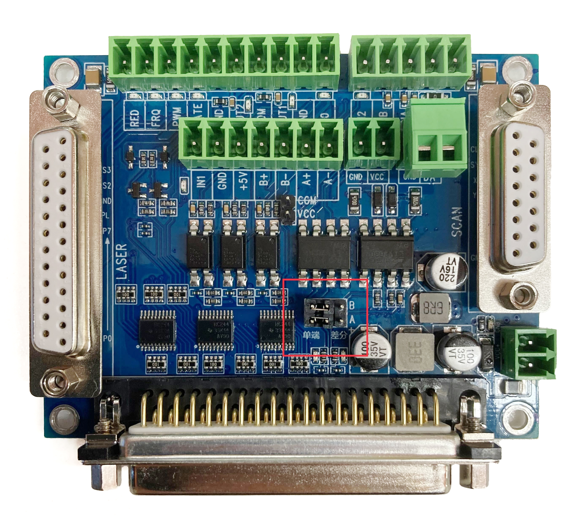
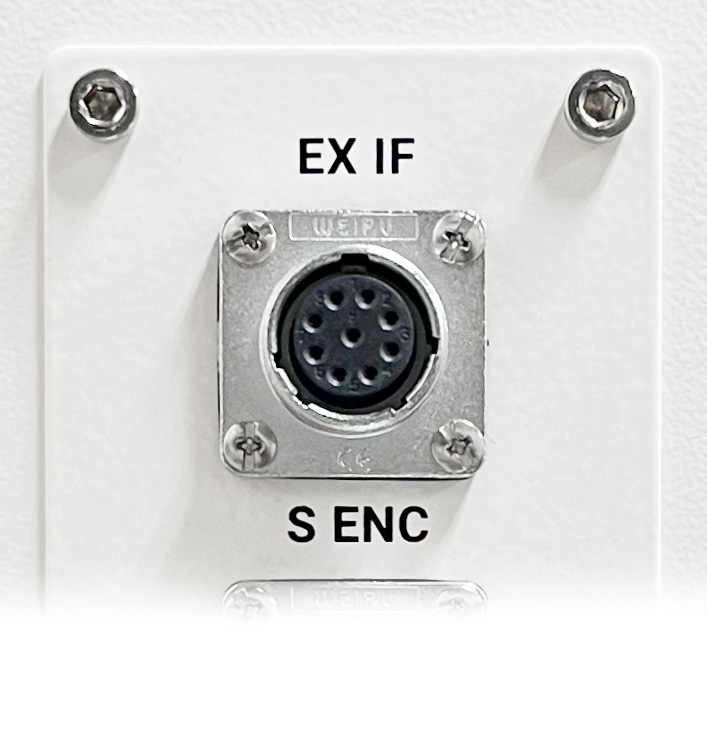
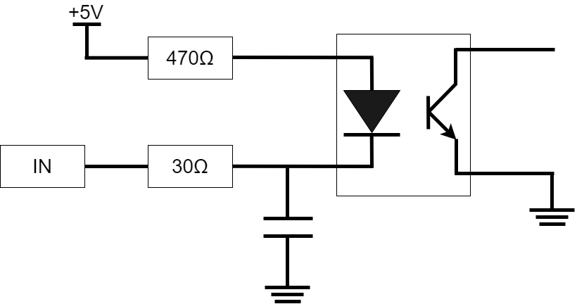
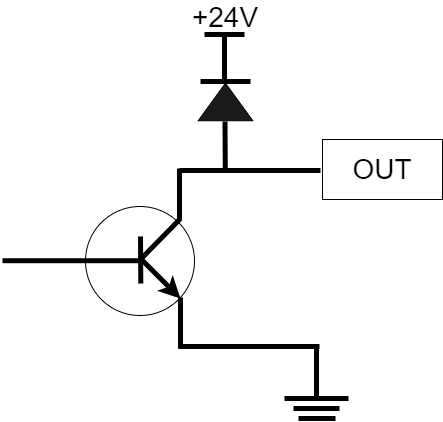

# ハードウェア仕様

<!--

## エンコーダ入力仕様

コネクタ① デュアルエンコーダ入力

| ピン番号 | 機能名 | 内容 |
|:--:| --- | --- |
| 1 | A+ | エンコーダのA+信号入力 |
| 2 | A- | エンコーダのA-信号入力 |
| 3 | B+ | エンコーダのB+信号入力 |
| 4 | B- | エンコーダのB-信号入力 |
| 5 | VCC | 5V外部電圧出力。最大出力電流値は200mAまでとなります。エンコーダへの電源供給用。 |
| 6 | GND | エンコーダ用GND |

コネクタ②　シングルエンドエンコーダ入力

| ピン番号 | 機能名 | 内容 |
|:--:| --- | --- |
| 1 | A | エンコーダのA信号入力 |
| 2 | B | エンコーダのB信号入力 |
| 3 | VCC | 5V外部電圧出力。最大出力電流値は200mAまでとなります。エンコーダへの電源供給用。 |
| 4 | GND | エンコーダ用GND |

接続するエンコーダに応じてコントローラのジャンパピン（画像赤枠部分）の設定を変更する必要があります。シングルエンコーダは左、デュアルエンコーダは右です。

-->

## 外部インターフェイス仕様

<!-- 
コネクタ③　外部インターフェイス ( センサー・PLC 接続 )
 -->

| ピン番号 | 機能名 | 内容 |
|:--:| --- | --- |
| 1 | 24V  | 24V 電源出力。最大出力電流値は 200mA までとなります。センサーへの電源供給用。 |
| 2 | IN0  | レーザー照射トリガー用入力。本信号は NPN タイプの光電センサ専用入力となります。 |
| 3 | GND  | GND（IN0 用） |
| 4 | IN1  | レーザー照射トリガー用入力。GND との短絡でトリガーを認識します。 |
| 5 | IN2  | 外部制御入力。ソフトウェアでの設定により、下記機能のいずれかへ割り当てが可能です。 ➀インターロック　➁レーザー照射 |
| 6 | GND  | GND（IN1, IN2 用） |
| 7 | NC   | 使用しません。何も接続しないでください。 |
| 8 | OUT1 | デフォルトではマーキング完了信号が割り当てられています。オープンコレクタ出力。 |
| 9 | OUT2 | デフォルトでは動作状態信号が割り当てられています。オープンコレクタ出力。 |

**等価回路図**

<table>
<tr>
<th>入力</th>
<th>出力</th>
</tr>
<tr>
<td style="padding:20px"></td>
<td style="padding:20px"></td>
</tr>
</table>