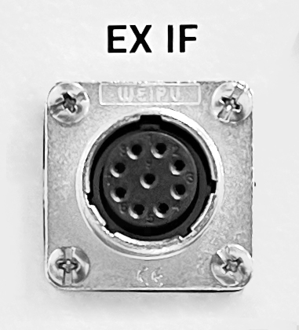
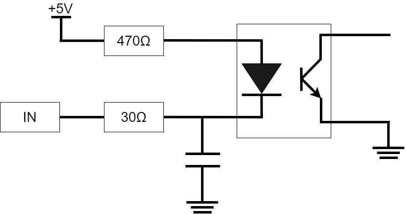
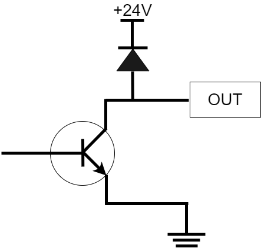
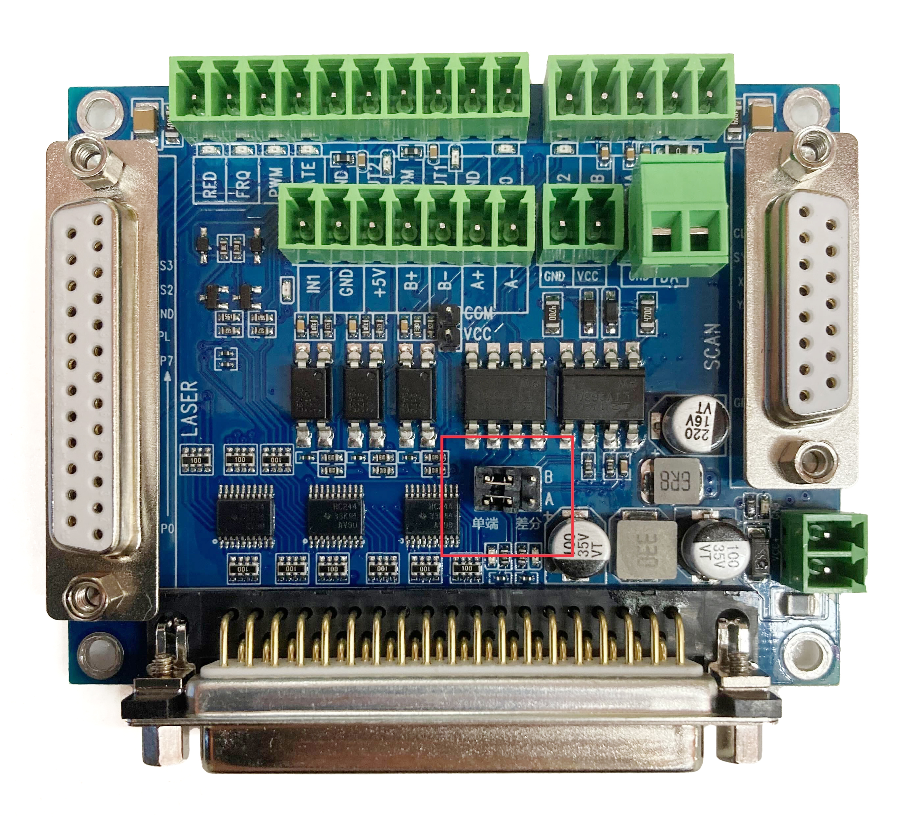
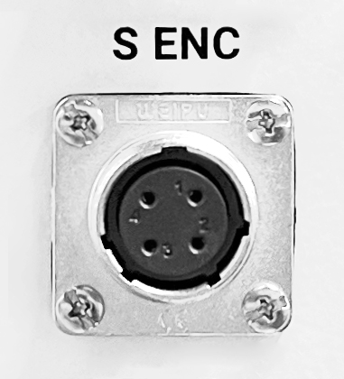
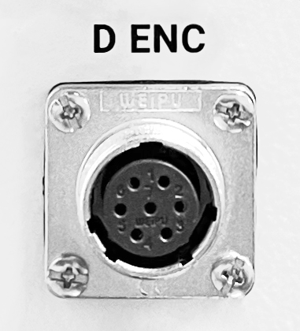
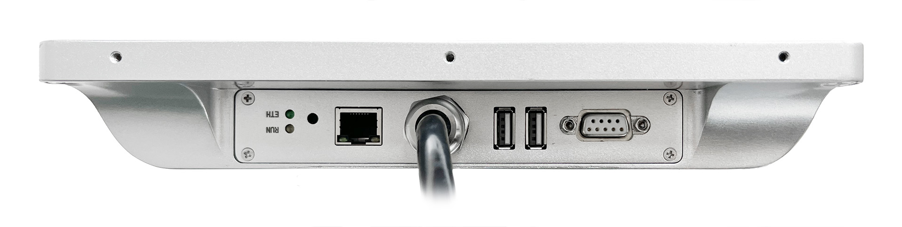
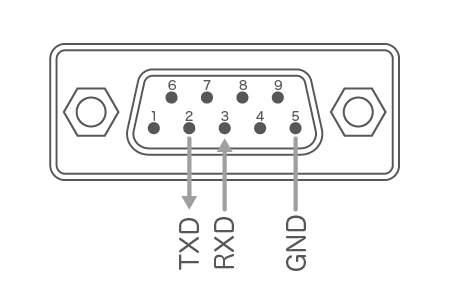

# ハードウェア仕様

## 制御入出力（I/O）仕様

<!-- 
コネクタ③　外部インターフェイス ( センサー・PLC 接続 )
 -->

| ピン番号 | 機能名 | 内容 |
|:--:| --- | --- |
| 1 | 24V  | センサ電源用の24V出力。最大出力電流は200mAです。 |
| 2 | IN0  | レーザー照射トリガー入力。NPN出力タイプの光電センサを接続します。 |
| 3 | GND  | GND |
| 4 | IN1  | レーザー照射トリガー入力。GNDとの短絡によりトリガーを認識します。 |
| 5 | IN2  | 外部制御入力。ソフトウェアの設定により、次のいずれかの機能を割り当てることができます。 ① インターロック　② レーザー照射 |
| 6 | GND  | GND |
| 7 | NC   | 使用しません。何も接続しないでください。 |
| 8 | OUT1 | デフォルトではマーキング完了信号が割り当てられています。オープンコレクタ出力です。 |
| 9 | OUT2 | デフォルトでは動作状態信号が割り当てられています。オープンコレクタ出力です。 |

※制御入出力に関する設定は[IO設定](#IO設定)をご参照ください。

 

**等価回路図**

<table>
<tr>
<th>入力</th>
<th>出力</th>
</tr>
<tr>
<td style="padding:20px"></td>
<td style="padding:20px"></td>
</tr>
</table>

## エンコーダ入力仕様

接続するエンコーダの出力方式に応じて、コントローラのジャンパピン（画像赤枠部分）の設定を変更する必要があります。
シングルエンド出力のエンコーダを接続する場合は左側、差動出力のエンコーダを接続する場合は右側に設定してください。

シングルエンド入力

| ピン番号 | 機能名 | 内容 |
|:--:| --- | --- |
| 1 | A | エンコーダのA信号入力 |
| 2 | B | エンコーダのB信号入力 |
| 3 | VCC | エンコーダ電源用の5V出力。最大出力電流は200mAです。 |
| 4 | GND | エンコーダ用GND |

差動入力

| ピン番号 | 機能名 | 内容 |
|:--:| --- | --- |
| 1 | A+ | エンコーダのA+信号入力 |
| 2 | A- | エンコーダのA-信号入力 |
| 3 | B+ | エンコーダのB+信号入力 |
| 4 | B- | エンコーダのB-信号入力 |
| 5 | VCC | エンコーダ電源用の5V出力。最大出力電流は200mAです。 |
| 6 | GND | エンコーダ用GND |

## 通信インターフェース仕様

| ポート | 機能名 |
|:--:| --- |
| LANポート | 外部機器とのTCP通信に使用します。 |
| シリアルポート | 外部機器とのシリアル通信（RS-232）に使用します。 |
| USBポート | USBメモリなどの外部記憶装置を接続し、ファイルの入出力に使用します。 |

※通信インターフェイスに関する設定は[外部通信](#外部通信)をご参照ください。

 

**シリアルポート RXD/TXD**
