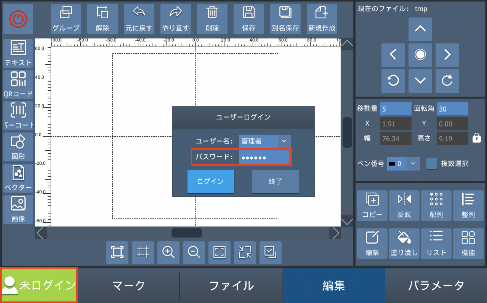
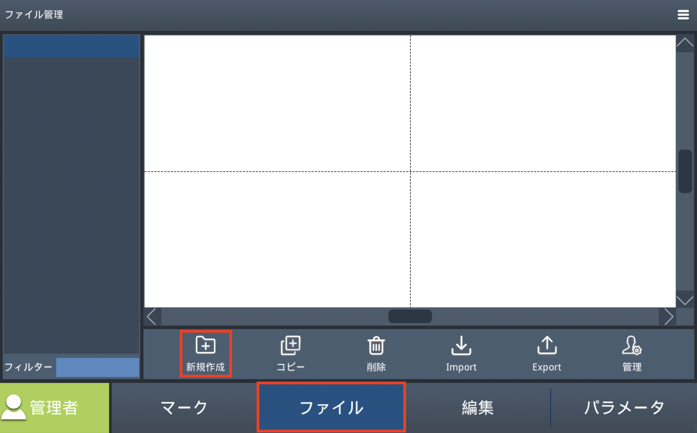
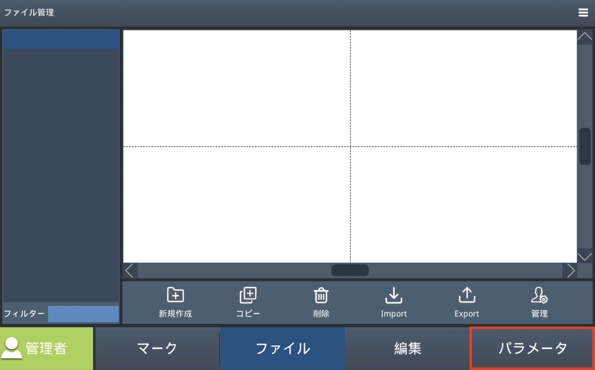
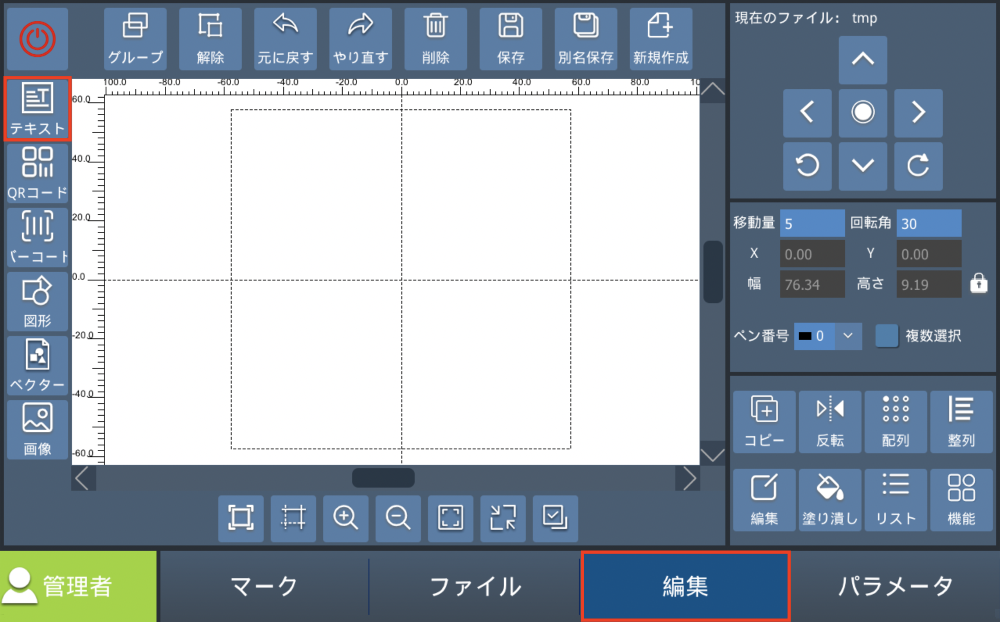
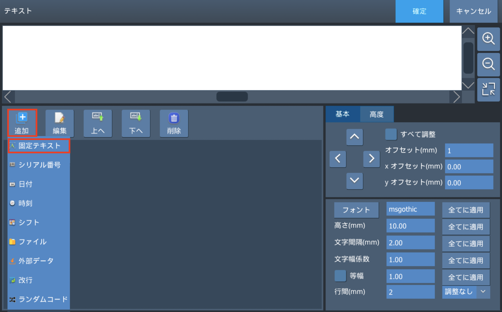
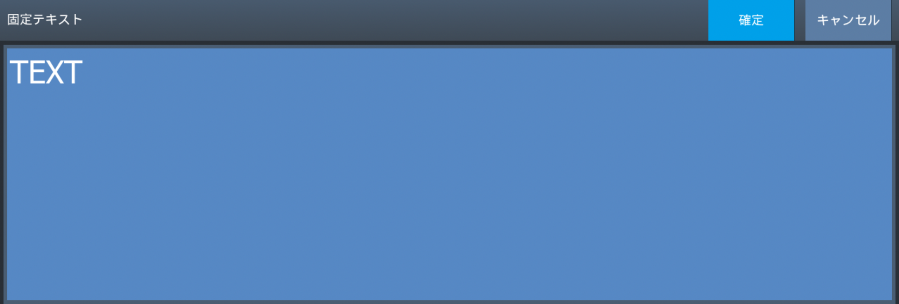

# クイックスタート

## ログイン

「未ログイン」ボタンをタップするとログインダイアログが表示されます。ユーザー名に「管理者」が選ばれていることを確認し、パスワード「111111」を入力してログインしてください。 

注意: 未ログインの状態では、各設定の変更ができません。

## 新規ドキュメントの作成

「ファイル」タブを開き、「新規」をタップします。ファイル名をタップしファイル名を入力します。「確定」をタップするとファイルが新規作成されます。

## 各種設定

「パラメータ」をタップし各種設定を行います。

<!-- #### ペンパラメータ -->

ペンパラメータ設定

加工時のパラメータを確認します。ここではデフォルトのまま使用します。

<!-- #### マーキング方法設定 -->

マーキング方法設定

トリガー方式を設定します。ここでは内部トリガーが選択されていることを確認します。

<!-- #### ライン設定 -->

ライン設定

生産ラインに組み込む場合に設定します。実際のラインの流れに応じてラインの方向を変更します。また、エンコーダを使用するか、固定のライン速度を指定するかを選択できます。素材を動かさずに固定したまま加工を行う場合は「静的マーク」を選択します。まずは静的マークをお試しください。

<!-- #### 加工エリア -->

加工エリア設定

加工エリアの確認を行います。加工エリアをタップし、ガルバノスキャナ設定の可動エリアと加工エリアを確認します。

<!-- #### レーザー設定 -->

レーザー設定

レーザーの種類を確認します。使用する機種に応じて、以下のタイプが選択されていることを確認してください。

- **LM110C 通常（Qスイッチ）**：ファイバー
- **LM110C MOPA型**：Mopa
- **LM140R**：CO2
- **LM110U**：UV

## データ作成

ここでは固定テキストデータを作成します。 
「編集」タブをタップし、「テキスト」ボタンをタップします。
テキスト作成ダイアログが表示されるので、「追加」ボタンをタップし、「固定テキスト」を選択します。

表示された入力フォームをタップし、任意の文字列を設定してください。

## マーキング

必ず保護メガネを着用して作業してください。 
加工中に危険を感じた場合は直ちに緊急停止ボタンを押し、再開時はボタンを右に回して解除してください。

<!-- ### 素材の設置・高さ調整 -->

素材の設置・高さ調整

加工に使用する素材を準備し、素材をレンズの下に配置します。 

次に **高さ調整（焦点合わせ）** を行います。本製品の場合、二つのレーザーポインターの光が重なり合う高さに調整します。
1. レーザーポインターのボタンを押し、ポインターをオンにします。ボタンはレンズの手前側、中央部分にあります。レンズを下から覗き込まないように注意してください。
1. レーザーポインターの光が2箇所から照射され、本体上部のハンドルを回すことで光が近づいたり離れたりします。2つの光が重なるように高さを調整します。
1. 高さ調整が完了したら、再度レーザーヘッドのボタンを押し、レーザーポインターをオフにしてください。

レーザー光はレンズによって集光され、素材に照射されます。適正な焦点位置から外れると、刻印が薄くなったり、線幅が広がったりする場合があります。レンズの焦点距離に合わせてレンズと素材の距離を適切に保ち、素材の高さが変わる場合は、その都度高さを調整してください。 
素材が平らでない場合は、加工箇所でレーザーポインターが重なるように高さを調整してください。

<!-- ### 位置合わせ・加工 -->

位置合わせ・加工

1. 高さ調整が完了していることを確認します。
1. 「マーク」タブを開きます。
1. プレビューボタンをタップします。レーザーが照射される位置がガイド光で表示されます。刻印したい位置とガイド光がずれている場合は、素材の設置位置または加工データの位置を調整してください。
1. 「マーキング」をタップします。トリガー設定に応じて加工が開始されます。「フットスイッチ」または「光電トリガー」の場合は、「手動トリガー」をタップすることで加工が開始されます。素材表面にレーザー光が照射されることを確認してください。

加工後、加工箇所を確認しても刻印が十分にできていない場合は、加工パラメータの調整が必要です。 
ペンパラメータ の項目で、加工速度を下げる・パワーを上げるなどの調整を行い、もう一度加工テストを行ってください。 

<!-- ## エンコーダとライン -->
<!--
ラインに組み込んで製品を使用する場合は、環境にあった設定を行う必要があります。
詳しくは[ライン設定](#ライン設定)の章をご確認ください。
-->
