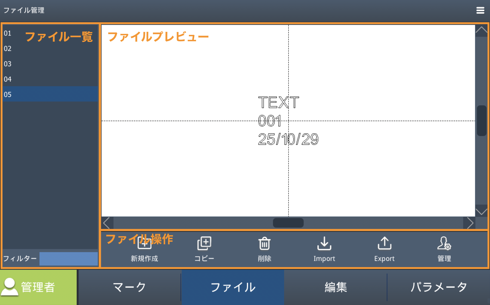

# ソフトウェア概要

## 画面構成

<!-- ### マーク -->

マーク

この画面は、設定・編集したデータを刻印するための画面です。
マーク画面は主にプレビューエリア、ステータスエリア、マーキングエリアに分かれています。
このタブについての説明は[加工操作](#加工操作)の章をご確認ください。

<!-- ### ファイル -->

ファイル

ファイル管理画面では、ユーザーのファイルを管理することができます。

| メニュー | 説明 |
|:---:|-----|
| 新規 | ファイルを新規作成します。「新規」ボタンをタップしてファァイルの保存先やファイル名を設定し、確定ボタンをタップするとファイルリストにファイルが追加されます。編集したいファイルを選択後に「編集」タブをタップすることで編集画面に切り替わります。 |
| コピー | 選択中のファイルを複製します。ファイル一覧からコピーしたいファイルを選択後、「複製」ボタンをタップします。 |
| 削除 | ファイルリストから削除したいファイルを選択後、「削除」ボタンをタップします。 |
| Import | 外部記憶装置などからファイルをインポートすることができます。 |
| Export | 作成したファイルを外部記憶装置などにエクスポートすることができます。 |
| 管理 | ファイルブラウザを表示します。フォルダの作成や名称変更、ファイル移動などの操作が行えます。 |

<!-- ### 編集 -->

編集

編集画面では、様々な図形要素やテキストを作成・編集することができます。
詳細は[編集](#編集)を参照してください。

<!-- ### パラメータ -->

パラメータ

この画面は、加工パラメータの他、IOや外部通信などの設定を行うことができます。
このタブについての説明は[パラメータ](#パラメータ)の章をご確認ください。

