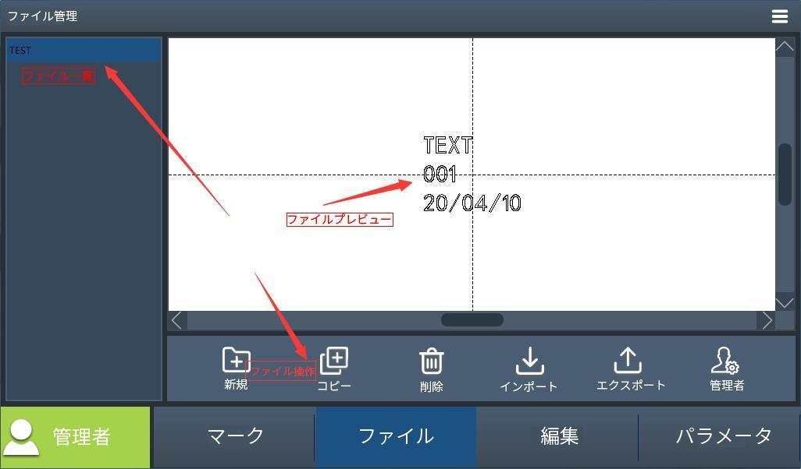

# ソフトウェア概要

## 画面構成

### マーク

この画面は、設定・編集したデータを刻印するための画面です。
マーク画面は主にプレビューエリア、ステータスエリア、マーキングエリアに分かれています。
注意: レーザー照射時は必ず保護メガネをかけて操作してください。
このタブについての説明は次章以降で詳しく解説します。

### ファイル

ファイル管理画面では、ユーザーのファイルを管理することができます。

### 編集

編集画面では、様々な図形要素やテキストを作成・編集することができます。
詳細は[編集](#編集)を参照してください。

### パラメータ

この画面は、加工パラメータの他、エンコーダや外部通信などの設定を行うことができます。
このタブについての説明は次章以降で詳しく解説します。

## ファイル管理画面

ファイル管理画面では、ユーザーのファイルを管理することができます。

### 機能説明

| メニュー | 説明 |
|:---:|-----|
| 新規 | ファイルを新規作成します。「新規」ボタンをタップしてファァイルの保存先やファイル名を設定し、確定ボタンをタップするとファイルリストにファイルが追加されます。編集したいファイルを選択後に「編集」タブをタップすることで編集画面に切り替わります。 |
| コピー | 選択中のファイルを複製します。ファイル一覧からコピーしたいファイルを選択後、「複製」ボタンをタップします。 |
| 削除 | ファイルリストから削除したいファイルを選択後、「削除」ボタンをタップします。 |
| Import | 外部記憶装置などからファイルをインポートすることができます。インポートしたいファイルを選択後、確定ボタンをタップします。 |
| Export | 作成したファイルを外部記憶装置などにエクスポートすることができます。ファイルリストからファイルを選択後、「Export」ボタンをタップします。 |
| 管理 | ファイルブラウザを表示します。フォルダの作成や名称変更、ファイル移動などの操作が行えます。 |

## パラメータ

この画面は、加工パラメータの他、エンコーダや外部通信などの設定を行うことができます。
このタブについての説明は次章で詳しく解説します。

