# 編集

「編集」タブでは、様々な図形要素やテキストを作成・編集することができます。

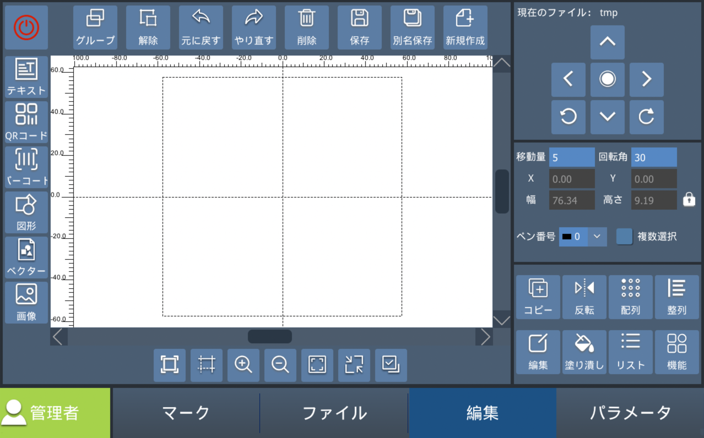

## 基本的な機能

| メニュー | 説明 |
|:---:|-----|
| グループ | 選択中の複数のセルをグループ化します。 |
| 解除    | 選択中の複数のセルのグループを解除します。 |
| 元に戻す | 編集状態を1つ前の状態に戻します。 |
| やり直す | 編集状態を1つ後の状態に進めます。 |
| 削除    | 選択しているアイテムを削除します。 |
| 保存    | 現在のファイルを保存します。 |
| 別名保存 | 現在のファイルを別の名称で保存します。 |
| 新規作成 | 新規ファイルを作成します。 |

ビュー操作

<table class="icontable">
<tr>
<td></td>
<td>プレビューエリアを最大化して表示します。</td>
</tr>
<tr>
<td></td>
<td>プレビューエリアの境界線と中心線、目盛りを表示を切り替えます。</td>
</tr>
<tr>
<td></td>
<td>プレビューエリアを拡大します。</td>
</tr>
<tr>
<td></td>
<td>プレビューエリアを縮小します。</td>
</tr>
<tr>
<td></td>
<td>プレビューエリアの表示サイズを標準サイズに戻します。</td>
</tr>
<tr>
<td></td>
<td>現在選択中の要素を最大化して表示します。</td>
</tr>
<tr>
<td></td>
<td>プレビューエリア内のすべての要素を選択します。</td>
</tr>
</table>

## オブジェクトの作成

加工オブジェクトは下記の種類があります。

| 種類 | 説明 |
|:---:|-----|
| テキスト | 文字列を刻印します。複数の文字列を組み合わせることも可能です（固定文字＋時刻など） |
| QRコード | 文字列データから二次元コードを作成します。複数の文字列を組み合わせることも可能です。 |
| バーコード | 文字列データからバーコードを作成します。複数の文字列を組み合わせることも可能です。 |
| 図形 | 直線や円などのプリセット図形を刻印します。 |
| ベクター | ベクタデータ（dxf, plt, ai）データを刻印します。USBメモリ等でインポートできます。 |
| 画像 | ビットマップデータ（bmp, jpg, png）を刻印します。USBメモリ等でインポートできます。 |

### テキスト

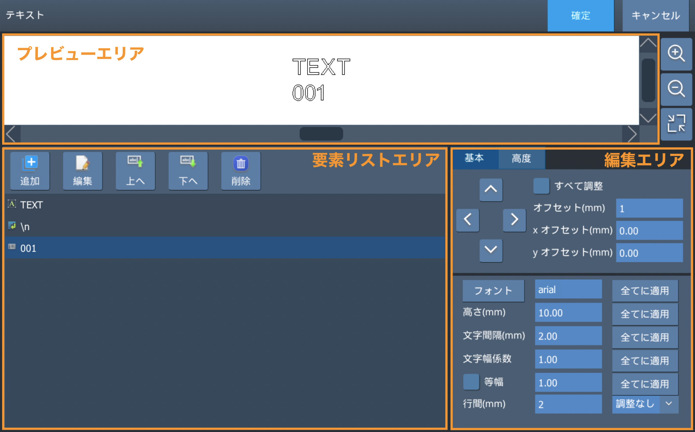

| パネル | 説明 |
|:---:|-----|
| プレビューエリア | 現在のテキストのすべての内容が表示されます。 |
| 要素リストエリア    | 作成しているテキスト要素の一覧が表示されます。 `追加`ボタン: テキストを追加します `編集`ボタン: 選択されているテキストを編集します。 `アップ/ダウン`ボタン: 選択されているテキストの順番を変更します。 `削除`ボタン: 選択されているテキストを削除します。 |
| 編集エリア | オフセットの設定、フォントなどの設定を行います。 |

#### テキストデータの種類

固定テキスト

加工時に変化させる必要のない固定文字列を作成します。

シリアル番号

加工を行う度に数値が増加するテキストを作成できます。

| 項目 | 説明 |
|:---:|-----|
| 開始番号 | シリアル番号の開始値を設定します。 |
| 現在の番号 | 現在のシリアル番号を表示します。 |
| 終了番号 | シリアル番号の終了値を設定します。終了番号に達するとマーキングを終了します。 |
| 増分 | マーキングごとにシリアル番号を増加させる値を設定します。 |
| 繰返し回数 | 同じシリアル番号をマーキングする回数を設定します。設定した回数に達すると、次の番号に進みます。 |
| 現在の回数 | 現在のシリアル番号をマーキングした回数を表示します。 |
| 進数 | シリアル番号の進数を選択します。 |
| シリアル番号の桁数 | シリアル番号の桁数を設定します。「先頭にゼロを表示」を有効にすると、設定した桁数に満たない場合に先頭へ0を追加します。例えば、桁数を2に設定すると、1は01と表示されます。 |

日付

日付情報を自動で取得します。また、日付の表示形式を編集することも可能です。
左のプリセットエリアから形式を選びます。選択後に日付の順序や区切り記号などを変更することができます。

| 項目 | 説明 |
|:---:|-----|
| プレビューエリア | 設定した日付の表示内容を確認できます。 |
| プリセットエリア | あらかじめ用意された日付形式から選択します。 |
| 編集エリア | 年・月・日の順序や区切り記号などを編集します。 |
| 先頭を0で埋める | 有効にすると、1桁の月や日の先頭に0を追加します。 |
| 日付オフセット | 現在の日付を基準に、設定した日数を加算または減算して表示します。 |
| フィールド設定 | 曜日や月名などの表示文字列を変更します。 |

時間

時間情報を自動で取得します。また、時間の表示形式を編集することも可能です。
時間の修正を行う場合は`パラメータ > システム > 高度な設定`で設定してください。

| 項目 | 説明 |
|:---:|-----|
| プレビューエリア | 設定した時刻の表示内容を確認できます。 |
| プリセットエリア | あらかじめ用意された時刻形式から選択します。 |
| 編集エリア | 時・分・秒の順序や区切り記号などを編集します。 |
| 午前 表示名・午後 表示名 | 午前・午後の表示文字列を設定します。 |
| 時間オフセット・分オフセット | 現在の時刻を基準に、設定した時間または分を加算・減算して表示します。 |
| 先頭にゼロを表示 | 有効にすると、1桁の時・分・秒の先頭に0を追加します。 |

シフト

マーキングを行う時間によってテキスト内容を変更する機能です。

| 項目 | 説明 |
|:---:|-----|
| 開始時間 | テキストを切り替える時刻を設定します。設定した時刻になると、対応するマーキング内容に切り替わります。 |
| マーキング内容 | 指定した開始時間から使用するテキストを設定します。開始時間とマーキング内容を入力して「追加」をタップすると、シフトプレビューに追加されます。 |
| シフトプレビュー | 設定した開始時間とマーキング内容を確認できます。 |

下記のように設定した場合、10:00～10:04は TEXT01、10:05～10:09は TEXT02、10:10～翌9:59は TEXT03 がマーキングされます。 
[ 10:00 ] - TEXT01 
[ 10:05 ] - TEXT02 
[ 10:10 ] - TEXT03 

ファイル

txt や csvファイルから一行ずつテキストを取得する機能です。

| 項目 | 説明 |
|:---:|-----|
| ファイルタイプ | 読み込むファイル形式を選択します。 |
| 現在の行番号 | 読み込みを開始する行番号を指定します。 |
| 現在の列番号 | 読み込みを開始する列番号を指定します。CSVファイルの場合のみ設定できます。 |
| 行の増加量 | マーキングごとに進める行数を設定します。例えば「2」に設定すると、1行おきにデータを読み込みます。 |
| 繰返し回数 | 同じ行のデータをマーキングする回数を設定します。設定した回数に達すると、次の対象行に進みます。 |
| 現在の回数 | 現在の行のデータをマーキングした回数を表示します。 |
| 自動ループ | 有効にすると、最終行に到達した後、先頭行に戻ってマーキングを継続します。 |
| ファイルパス | 読み込むファイルを選択します。 |
| DBクリア | ファイルの読み込み時に自動生成されるキャッシュファイルを削除します。 |
| 重複検出 | 同じ文字列の重複マーキングを防止します。キャッシュファイルと指定したファイルに同じ文字列がある場合、エラーを表示します。重複判定には改行コードも含まれます。 |
| 開始番号 | 読み込んだテキストからマーキングに使用する文字列の開始位置を指定します。0の場合は先頭から使用します。 |
| 文字数 | 「開始番号」で指定した位置から、マーキングに使用する文字数を指定します。0の場合は、残りの文字列をすべて使用します。 |

外部データ

マーキング時に、ネットワーク通信やシリアル通信を使用して外部機器から文字列を取得します。
詳細は[外部通信](#外部通信)の章をご確認ください。

改行

テキストを改行する場合は、改行要素を追加します。
要素リストに追加された改行要素を選択し、改行したい位置に移動します。
プレビューエリアで改行位置を確認してください。

ランダムコード

指定した規則に従って、ランダムな文字列を生成します。

| 記号 | 説明 |
|:---:|-----|
| % | 数字、大文字・小文字のアルファベットからランダムに1文字を生成します。 |
| # | 大文字のアルファベットからランダムに1文字を生成します。 |
| $ | 小文字のアルファベットからランダムに1文字を生成します。 |
| @ | 数字からランダムに1文字を生成します。 |

<b>設定例</b> 
設定文字列: text-%%%%-##$$@@ 
生成文字列: text-Hc7Z-BJia52

<!-- 
パラメータ
 -->

#### パラメータ

基本タブ

| 項目 | 説明 |
|:---:|-----|
| オフセット   | 選択したテキストの位置を調整します。 |
| フォント     | テキストに使用するフォントを選択します。シングルライン、標準フォント、ドットフォント、TTFから選択できます。 |
| 高さ（mm）   | 文字の高さを設定します。 |
| 文字間隔(mm) | 文字間の距離を設定します。 |
| 文字幅係数   | 文字の高さに対する幅の比率を設定します。 |
| 等幅        | 有効にすると、文字幅を一定にして配置します。 |
| 行間（mm）  | 行間の距離を設定します。 |
| 配置        | 複数行テキストの配置方法を設定します。調整なし / 左揃え / 右揃え / 中央揃え などがあります。 |
| 全てに適用   | 変更した設定をすべてのテキスト要素に適用します。 |

高度タブ

| 項目 | 説明 |
|:---:|-----|
| 適用 | 「高度な設定」の内容をプレビューに反映します。 |
| 円弧 | 有効にすると、テキストを円弧状に配置します。 |
| 高さ/幅 | 円弧の高さと幅を設定します。 |
| 開始角度 | 円弧上にテキストを配置する開始角度を設定します。角度の基準は以下の左図を参照してください。 |
| 固定角度 | 有効にすると、「固定角度範囲」で設定した角度内にテキストが収まるように配置します。 |
| 時計回り | 有効にすると、文字列を時計回りに配置します。 |
| 文字反転 | 有効にすると、テキストを水平方向に反転します。 |
| 交差点削除 | 文字の輪郭線が交差する部分を、設定した値に応じて削除します。 |

<table>
<tr>
<th>開始角度=0</th>
<th>開始角度=270</th>
</tr>
<tr>
<td style="padding:20px">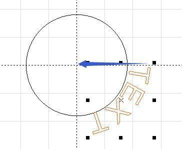</td>
<td style="padding:20px">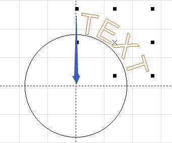</td>
</tr>
</table>

### QRコード

QRコードやデータマトリックスなどの2次元コードの作成が可能です。

<!-- | パネル | 説明 |
|:---:|-----|
| プレビューエリア | 現在のテキストのすべての内容が表示されます。 |
| 要素リストエリア    | 作成しているテキスト要素の一覧が表示されます。 `追加`ボタン: テキストを追加します（各項目は[テキストデータの種類](#テキストデータの種類)をご覧ください） `GS1`ボタン: GS1で標準化している形式を選択することができます。 `編集`ボタン: 選択されているテキストを編集します。 `アップ/ダウン`ボタン: 選択されているテキストの順番を変更します。 `削除`ボタン: 選択されているテキストを削除します。 |
| 編集エリア | オフセットの設定、フォントなどの設定を行います。 | -->

#### バーコード属性

| 項目 | 説明 |
|:---:|-----|
| タイプ | 二次元コードの種類を設定します。QRコード / DM（Data Matrix） / Aztec / Han Xin / DotCode / Micro QR Codeから選択できます。 |
| モード | 二次元コードを構成するセルの形状を設定します。 |
| 誤り訂正レベル | QRコードの誤り訂正レベルを設定します。L / M / Q / Hの4段階から選択できます。 |
| バージョン | 二次元コードのバージョンまたはシンボルサイズ（セル数）を設定します。「Default」に設定すると、データ量に応じて適切なサイズが自動的に選択されます。 |
| マスク | QRコードに適用するマスクパターンを設定します。0～7の8種類から選択できます。 |
| フォーマット | 二次元コードのフォーマットを設定します。「UCC/EAN/GS1」を選択した場合は、GS1形式に従ったデータを入力してください。 |
| 高さ | 二次元コードの高さをmm単位で設定します。 |
| 中央空白サイズ | 二次元コードの中央部分に設ける空白範囲のサイズを設定します。 |
| 加速距離 | マーキング開始部分のムラを軽減するための加速距離を設定します。 |
| 反転 | 二次元コードの白黒を反転してマーキングします。マーキング部分が素材より明るくなる場合などに使用します。 |
| X/Y 分割数 | 1つのセルを構成する形状（モード）のX方向・Y方向の分割数を設定します。 |
| 開始番号 | コードに使用する文字列の開始位置を指定します。0の場合は先頭から使用します。 |
| 文字数 | 位置からコードに使用する文字数を指定します。0の場合は、残りの文字列をすべて使用します。 |

#### テキスト属性

<!-- バーコードの内容をテキストで表示します。 -->

| 項目 | 説明 |
|:---:|-----|
| テキスト表示 | 有効にすると、テキストを表示します。 |
| フォント | テキストに使用するフォントを選択します。 |
| 高さ（mm） | 文字の高さを設定します。 |
| 文字間隔（mm） | 文字間の距離を設定します。 |
| 行間（mm） | 行間の距離を設定します。 |
| X/Y オフセット | テキストのX方向およびY方向の位置を調整します。 |
| 開始番号 | テキストを表示する開始位置を設定します。0の場合は、先頭から表示します。 |
| 文字数 | 表示する文字数を設定します。0の場合は、すべての文字を表示します。 |
| 行の文字数 | 1行あたりに表示する文字数を設定します。 |
| 文字幅係数 | 文字の高さに対する幅の比率を設定します。 |
| 空白挿入間隔 | スペースを挿入する文字間隔を設定します。 |
| スペース数 | 挿入するスペースの数を設定します。 |
| 等幅テキスト | 有効にすると、文字を設定した比率で等間隔に配置します。 |

### バーコード

#### バーコード属性

| 項目 | 説明 |
|:---:|-----|
| タイプ | バーコードの種類を設定します。 39 / EAN13 / 128 / 93 / 128A / 128B / 128C / GS1_128 / UPCA / PDF417 / ITF14 / CodaBar2から選択できます。 |
| 高さ（mm） | バーコードの高さを設定します。 |
| モジュール幅 | バーコードを構成する最小単位の幅を設定します。 |
| 上余白 | 反転時のバーコード上部の余白を設定します。 |
| 下余白 | 反転時のバーコード下部の余白を設定します。 |
| 右余白 | 反転時のバーコード右側の余白を設定します。 |
| 左余白 | 反転時のバーコード左側の余白を設定します。 |
| 反転 | バーコードの周囲に余白を設け、マーキングする部分としない部分を反転します。 |

#### テキスト属性

バーコードの内容をテキストで表示します。

| 項目 | 説明 |
|:---:|-----|
| 文字列表示 | 有効にすると、バーコードの内容をテキストで表示します。 |
| フォント | テキストに使用するフォントを選択します。 |
| 高さ（mm） | 文字の高さを設定します。 |
| 文字間隔（mm） | 文字間の距離を設定します。 |
| xオフセット | テキストのX方向の位置を調整します。 |
| yオフセット | テキストのy方向の位置を調整します。 |
| 文字幅係数 | 文字の高さに対する幅の比率を設定します。 |
| 空白挿入間隔 | スペースを挿入する文字間隔を設定します。 |
| スペース数 | 挿入するスペースの数を設定します。 |
| 等幅 | 有効にすると、文字を設定した比率で等間隔に配置します。 |

### 図形

直線、円形、楕円形、四角形、多角形、破線などの図形を作成します。

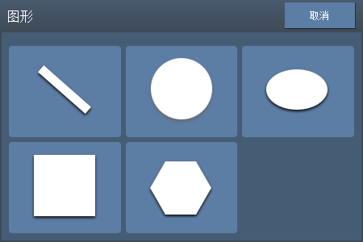

### ベクター

ベクターデータを読み込みます。DXF / PLT / AI（Ver.8）の3つのファイル形式に対応しています。 
DXFファイルを読み込む場合は、使用するフォントを選択してください。

### 画像

ビットマップ画像を読み込みます。BMP / JPG / PNGの3つのファイル形式に対応しています。 
画像を読み込むと、自動的に256階調のグレースケールに変換されます。

| 項目 | 説明 |
|:---:|-----|
| 反転 | 画像の濃淡を反転します。レーザー照射部分が白くなる素材（黒色の石材、透明アクリルなど）にマーキングする場合に使用します。 |
| コントラスト | 画像のコントラストを調整します。 |
| 輝度 | 画像の明るさを調整します。 |
| 固定DPI | 加工時のDPI（1インチあたりのドット数）を設定します。値を大きくするとドットの間隔が細かくなり、より精細な加工が可能になりますが、加工時間は長くなります。まずは600程度を目安に設定してください。 |

## オブジェクトの編集

<td>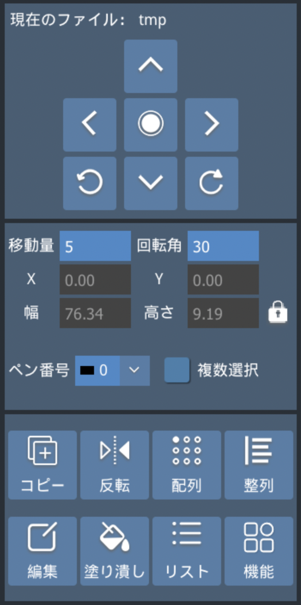</td>

このエリアでは図形の位置や大きさ、割り当てパラメータを編集できます。

| 項目 | 説明 |
|:---:|-----|
| コピー | 選択したオブジェクトをコピーします。配置したい位置をタップすると、その位置にオブジェクトが複製されます。 |
| 反転 | 選択したオブジェクトを水平方向または垂直方向に反転します。 |
| 配列 | 選択したオブジェクトを複製し、配列状に配置します。 |
| 整列 | 選択した複数のオブジェクトを指定した基準で整列します。 |
| 編集 | 選択したオブジェクトの内容を編集します。テキスト、一次元コード、二次元コードに対応しています。 |
| 塗り潰し | 選択したオブジェクトの塗りつぶしを設定します。 |
| リスト | ファイル内のオブジェクトを一覧表示し、並べ替え、選択、削除などの操作を行います。オブジェクトはリストの上から順にマーキングされます。 |
<!-- | 機能 | オブジェクトにシアーをかけることができます。  | -->

コマンド制御で使用する図形名（オブジェクト名）は、このリスト機能から確認できます。

配列設定

仮想配列: 配列を適用した後も、行数や列数、間隔などの配列設定を編集できます。
* 有効: 仮想配列を有効にします。
* 数量: 配列の行数と列数を設定します。
* 増分: 配列するオブジェクトの配置間隔を設定します。
* 方向: オブジェクトを配列する順序を設定します。
* 要素の非表示: 配列の基準となる元のオブジェクトを非表示にします。
* 行番号・列番号・Xオフセット・Yオフセット: 配列内の指定したオブジェクトの位置を個別に調整します。

実体配列: 配列を適用すると、配列された各オブジェクトが個別のオブジェクトとして作成されます。
* 数量: 配列の行数と列数を設定します。
* 増分: 配列するオブジェクトの配置間隔を設定します。
* 方向: オブジェクトを配列する順序を設定します。
* 適用: 設定した配列を確定し、オブジェクトを複製します。

塗りつぶし

オブジェクトの塗りつぶしを行うことが可能です。画像（ビットマップファイル）は設定することができません。また、閉じられていないパス要素の場合、塗りつぶすことができません。

| 項目 | 説明 |
|:---:|-----|
| 第1層・第2層・第3層 | 塗りつぶし設定を最大3層まで設定できます。 |
| フィル有効 | 選択している層の塗りつぶしを有効にします。 |
| フィルタイプ | 塗りつぶし方法を設定します。タップするたびに切り替わり、一方向、双方向、外側から内側などの方式を選択できます。 |
| 行間（mm） | 塗りつぶしに使用する線の間隔を設定します。まずは0.05 mmを目安に設定し、加工結果に応じて調整してください。値を小さくすると塗りつぶしが密になりますが、加工時間は長くなります。 |
| フィル角度 | 塗りつぶしに使用する線の角度を設定します。 |
| 全体の計算 | 有効にすると、複数のパスをまとめて塗りつぶし処理を行います。無効の場合は、パスごとに処理します。有効にすると加工時間が短くなる場合がありますが、ソフトウェアの処理に時間がかかる場合があります。 |
| 輪郭を有効にする | 有効にすると、図形の輪郭線もマーキングします。 |
| 輪郭を最初に刻印 | 有効にすると、最初に図形の輪郭線をマーキングします。 |

**フィルタイプ**

<table class="icontable">
<tr>
<td></td>
<td>両方向: 双方向に走査し、各走査線の端をつなげながら連続してマーキングします。</td>
</tr>
<tr>
<td>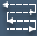</td>
<td>弓形: 双方向に走査し、オブジェクト内の塗りつぶさない部分をスキップしてマーキングします。</td>
</tr>
<tr>
<td></td>
<td>一方向: 各走査線を常に一方向にマーキングします。</td>
</tr>
<tr>
<td>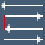</td>
<td>双方向: 走査方向を左から右、右から左と交互に切り替えてマーキングします。</td>
</tr>
</table>

<table>
<tr>
<th>両方向</th>
<th>弓形</th>
<th>一方向</th>
<th>双方向</th>
</tr>
<tr>
<td style="padding:20px">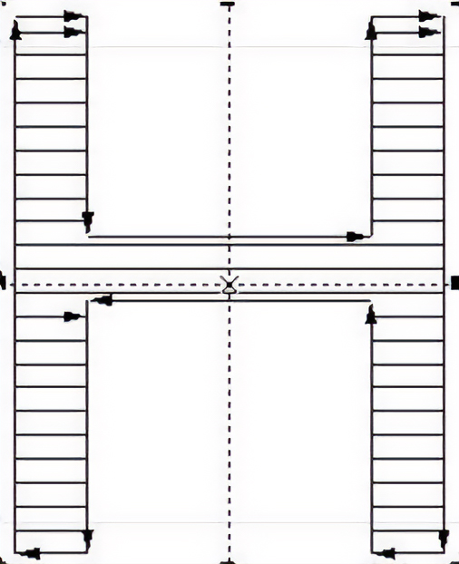</td>
<td style="padding:20px">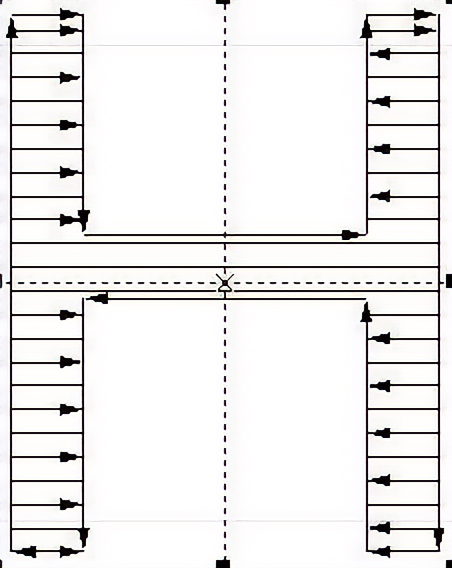</td>
<td style="padding:20px">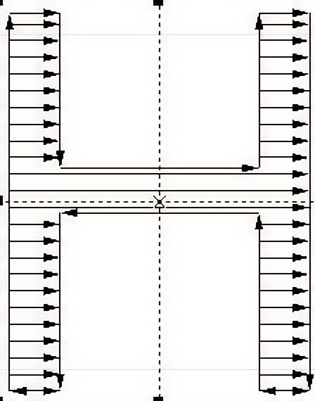</td>
<td style="padding:20px">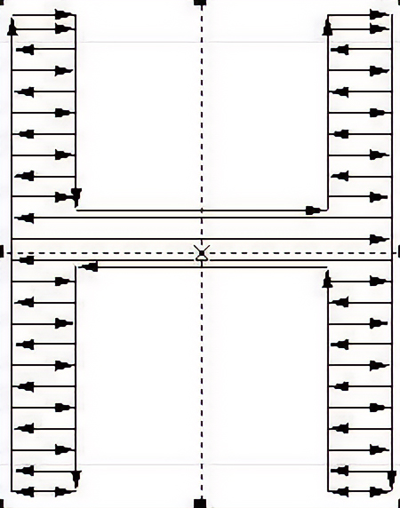</td>
</tr>
</table>

**高度な設定**

| 項目 | 説明 |
|:---:|-----|
| 開始オフセット（mm） | 最初の走査線と輪郭線の間隔を調整します。 |
| 終了オフセット（mm） | 最後の走査線と輪郭線の間隔を調整します。 |
| マージン | 塗りつぶし範囲と輪郭線の間に余白を設定します。 |
| 線間隔を均等化 | 有効にすると、オブジェクト内に走査線が均等に配置されるように行間を調整します。オブジェクトの大きさと設定した行間によって端部に偏りが生じる場合に、各走査線の間隔が設定値に近くなるように自動調整します。 |

<!-- **フィル角度の例（45°）**
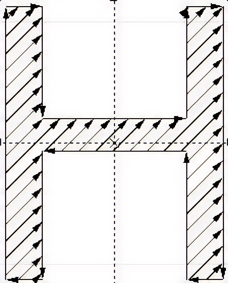

**マージンの例**
<table>
<tr>
<td style="padding:10px">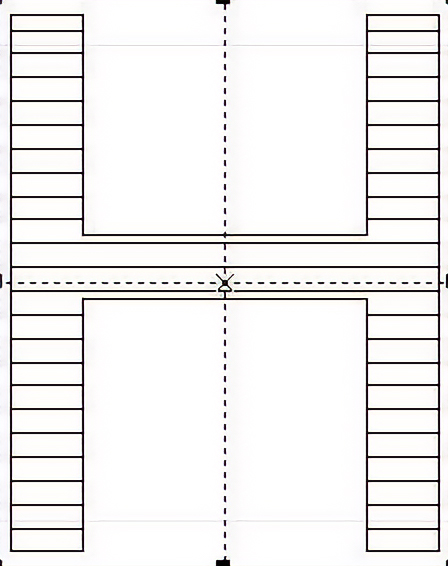</td>
<td style="padding:10px">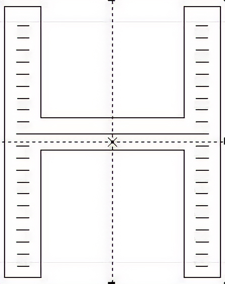</td>
</tr>
</table> -->

<table class="noframe">
<tr>
<td style="padding:10px; text-align:center">

</td>

<td style="width:40px"></td>

<td style="padding:10px; text-align:center">

</td>
<td style="padding:10px; text-align:center">

</td>
</tr>
<tr>
<td style="text-align:center"><b>フィル角度の例（45°）</b></td>
<td style="width:40px"></td>
<td colspan="2" style="text-align:center"><b>マージンの例</b></td>
</tr>
</table>