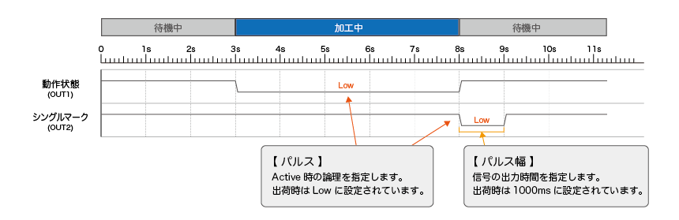

# パラメータ

## ペンパラメータ

### 基本パラメータ

| 項目 | 説明 |
|:---:|-----|
| ペン番号 | 0～15のペン番号を選択できます。それぞれのペン番号に異なる基本パラメータを設定できます。 |
| マーキング速度（mm/s） | 加工中のスピードです。スピードを遅くすると、素材に与えるレーザーのエネルギーが大きくなります（濃いマーキングになる）。単位は mm/sec、最高スピードは 4000mm/sec となります。 |
| ジャンプ速度（mm/s） | 照射終了後、次の照射の開始地点まで移動するスピードを設定できます。 |
| パワー（%） | レーザー照射の強度を設定します。パワーが大きいほど素材に与えるレーザーのエネルギーが大きくなります。単位は %、最高パワーは 100% となります。 |
| 周波数（kHz） | 1 秒間に繰り返す波の数を指します。単位は KHz、Q スイッチ（標準）は 30KHz ～ 60KHz、MOPA 型は 1KHz ～4000KHz の範囲内で設定できます。まず、Q スイッチ（標準）は 30KHz、MOPA 型は 25KHz で加工を試してください。周波数を上げると、Q スイッチ（標準）の場合は刻印が薄くなる傾向にあり、MOPA 型の場合は ( パルス幅との組み合わせにもよりますが ) 刻印が濃くなる傾向にあります。 |
| MOPAパルス値 | 周波数に対し、こちらは波の高さを指します。MOPA 型のみ設定可能です。単位は ns、2ns ～ 500ns の範囲内で設定できます。 最初は 250ns にしていただくことをお勧めします。加工が出来なかったら値をより上げていただいたり、スピー ドを遅くしたり、パワーを強めるなどの調整を行ってください。 パルス幅の値は小さい方が加工箇所周辺への熱の影響を防ぐことが出来るため、シャープな加工が可能です。少しずつ値を下げていただき、お好みの加工結果になるよう調整してください。 |
| ジャンプ遅延（us） | ジャンプスピードを高く設定すると、塗りつぶし線の最初に歪みが発生する可能性があるため、ジャンプ遅延を調整することにより歪みを軽減させます。 |
| ポイント時間（us） | ドットオブジェクトがある際のマーキング時間を設定します。 |
| 照射開始遅延 | 高スピードの値を設定した際、加工の開始部分が照射されない場合があります。その際はこちらの値を低く設定することにより、開始部分の刻印がきちんと行われるようになります。マイナスの値も設定できます。 |
| 照射終了遅延 | 高スピードの値を設定した際、加工の終了部分が照射されない場合があります。その際はこちら の値を高く設定することにより、終了部分の刻印がきちんと行われるようになります。 |
| 終了遅延（us） | 加工終了時、照射が終わる前にレーザーの移動が始まってしまい、塗りつぶし線の最後に歪みが発生する場合があります。その際はこちらの値を高く設定することにより、歪みが発生せずに加工することができます。 |
| コーナー遅延 | 図形の角部分の刻印スピードの調整を行います。図形の角が丸く加工されている場合は、こちら の値を高く設定してください。 |

### 高度なパラメータ

| 項目 | 説明 |
|:---:|-----|
| 有効遅延（us） | コマンドを実行するときにガルバノミラーとレーザーの間に時間差がある。通常、ガルバノミラーは約100usレーザーよりも遅いため、補正するためにこのパラメータを使用します。 |
| 初回ジャンプ遅延時間（us） | マーキング時の初回ジャンプで、元々のジャンプ遅延時間のベースに一定の時間が追加されます。 |

デバッグ説明: 最適な遅延時間を設定するための加工方法の説明を表示します。 
デフォルト値使用: すべてのパラメータにデフォルト値を割り当てます。 
デフォルト値管理: 各パラメータのデフォルト値を設定できます。 

**加工結果への影響**

| 項目 | 大きすぎる場合 | 小さすぎる場合 | 負の値にできるか |
| :---: | ----- | ----- | :---: |
| マーキング速度 | マーキングのストロークが荒く、加工が浅い。 | ストロークが密で、加工が深い。 | 不可 |
| 照射開始遅延 | 始点部の描画が不足する現象につながる。 | マーキングの始点部に太り・焼けが発生する。 | 可能（負の値の場合、レーザーが早く消える） |
| 照射終了遅延 | マーキングの終了点に太り・焼けが発生する。 | マーキング終了時に閉じない、塗りつぶしが足りない | 不可 |
| ジャンプ速度 | 空ストロークの処理時間が短く、総マーキング時間は短くなるが、ストロークがつながってしまい、ガルバノの動きが不安定になる。 | 空ストロークの処理時間が長く、総マーキング時間が長くなる。 | 不可 |
| ジャンプ遅延 | ガルバノが完全に回転し、次のストロークを処理する前に一定時間滞在し、マーキング時間が長くなる。 | ガルバノメーターが完全に回転する前にPCが次のストロークの処理を開始するため、ストロークの開始時に飛散が発生し、開始ストロークが不安定になる。 | 不可 |
| コーナー遅延 | マーキング時間が長くなり、コーナーでフォーカシング現象が発生する。 | 直角を刻印すると角が丸くなる現象が発生する。 | 不可 |

## マーキング方法

マーキングを行う際のトリガー設定を行います。
使用するトリガーに応じて、トリガータイプの選択などを設定します。
開始位置は、指定した位置または自動設定することができます。

### トリガーモード

トリガーモード

| 項目 | 説明 |
|:---:|-----|
| 光トリガー | マーク画面の手動トリガーとGDインターフェースへの信号でマーキングを開始します。 |
| ペダル式トリガー | マーク画面の手動トリガーとJTインターフェースへの信号でマーキングを開始します。 |
| 内部トリガー | マークを押した瞬間にマーキングを開始します。連続マークにチェックが入っているとマーキングし続けます。 |
| ライズエッジトリガー | 有効の場合センサーがオフになった瞬間にマーキングを開始し、無効の場合センサーがオンになった瞬間にマーキングを開始します。 |

### トリガー最適化

トリガー遅延

| 項目 | 説明 |
|:---:|-----|
| 距離（mm）| エンコーダ接続時に使用します。トリガー受付後、設定した距離を移動したらマーキングを開始します。 |
| 時間（ms）| トリガー受付後、設定した時間経過後にマーキングを開始します。 |

最小間隔

マーキング終了後、すぐにトリガーが発生した場合でも、設定した距離もしくは時間経過後にならないとマーキングされないようにします。一つの製品にセンサーに反応する箇所が複数ある場合などに使用します。

### ラインモード

素材を移動させながらマーキングを行うモードです。

| 項目 | 説明 |
|:---:|-----|
| ライン有効 | ラインモードを有効にします。 |
| トリガー間隔（mm） | マーキングの開始位置から次のマーキングの開始位置までの距離。 |
| マーキング回数 | 有効の場合、トリガー1回につき、指定された回数をマーキングする。チェックが無効の場合、マーキングが自動で継続されます。 |

マーキング開始後、一定の距離で印字を続ける場合の設定例 
<b>トリガー方式: 内部トリガー / トリガー間隔: 固定距離 / マークの数: チェックなし</b>

1回トリガーしてN回マークする場合の設定例 
<b>トリガー方式: 光電トリガー / トリガー間隔: 固定距離 / マークの数: N回</b>

### パスの最適化

| 項目 | 説明 |
|:---:|-----|
| オートソート | 有効の場合、ベルトの流れに沿った加工順序になります。チェック無効でデータの作成順序と同じ順序で加工します。 |
| ベルトの流れに沿ってマーク | 有効の場合、データに関係なくベルトの流れに沿って加工されます。データが2つ並んでいた場合、2つのデータを同時に加工します。 |
| スタート位置 | `指定`: マーキングの位置を指定します（座標を入力してください）。 `自動`: 材料が移動する方向によって自動で設定します。 `元`: データの配置位置（編集で設定した位置）。|

### その他

| 項目 | 説明 |
|:---:|-----|
| キャッシュ | データの一時保存機能です。この値を10に設定すると、ホストから送信されたデータが10件保存され、ホストから送信されたデータの順序に従って順番に加工します。 |

## ライン設定

ラインに組み込んで使用する場合は、使用する環境に応じてエンコーダーか固定ライン速度にチェックを入れます。
固定ライン速度には使用環境にあったライン速度を入力してください。
エンコーダーを使用する場合は、エンコーダーの直径とパルスを入力することでパルス間距離が自動計算されます。

### ライン方向

ラインが流れる方向を設定します。

### エンコーダ

エンコーダーを使用する場合はチェックを入れてください。

* パルス間距離: エンコーダーのパルスの移動距離。エンコーダーパラメータを入力すると自動計算されます。
* エンコーダー反転: エンコーダーABの両相の入力信号を交換します。

エンコーダパラメータ

* 直径（mm）: エンコーダーの直径を入力します。
* パルス: エンコーダの1回転あたりのパルス数を入力します。
* 計算: 直径と1回転あたりのパルス数に基づいて、ラインのパルス間距離を計算します。
* スピードテスト: 現在のライン速度を表示します。

### 固定ライン速度

ラインが流れる速度（m/min）を設定します。

### 静的マーク

ラインを使用せず、素材を固定して加工する場合に選択します。

## IO設定

### 共通出力

<!-- | 項目 | 説明 |
|:---:|-----|
| 動作状態 | 対応する出力ポートがマーキング時にハイレベルを出力するか、ローレベルを出力するかを設定します。 |
| シングルマーク | シングルマーキングが完了するたびに、対応する出力ポートから出力される電圧の種類と時間を設定します。 | -->

| 項目 | 説明 |
|:---:|-----|
| 動作状態 | マーキング動作時の信号出力の論理レベル（High/Low）を指定します。 |
| シングルマーク | 単加工完了時の信号出力について、ポートの 論理レベル（High/Low）と出力時間（パルス幅） を設定します。 |

### セーフティゲート
インターロック機能を使用する場合はここに入力ポートを割り当ててください。

### 強力な光出力
レーザー照射機能を使用する場合はここに入力ポートを割り当ててください。

## 加工エリア

### ガルバノスキャナ設定

| 項目 | 説明 |
|:---:|-----|
| 駆動エリア（mm） | ガルバノスキャナの駆動範囲を設定します。下記の表の値を設定します。 |
| 加工エリア（mm） | 加工範囲を設定します。下記の表の値を設定します。 |
| XY交換 | 有効の場合、X/Y方向を反転します。 |
| X反転 / Y反転 | それぞれの方向を反転します。 |

| レンズ種別 | 駆動エリア | 加工エリア |
|:-----:|:-----:|:-----:|
| 110mm レンズ | 120 | 115 |
| 200mm レンズ | 210 | 205 |
| 300mm レンズ | 310 | 305 |

### ガルバノスキャナ補正

| 項目 | 説明 |
|:---:|-----|
| 樽型 | 湾曲を補正します。既定値は 1.0（パラメータ範囲0.5～1.5）です。 |
| 傾斜 | 平行四辺形のような傾斜を補正します。定数は1.0（パラメータ範囲0.5〜1.5）です。 |
| 台形 | 垂直方向の遠近を補正します。既定値は 1.0（パラメータ範囲0.5～1.5）です。 |
| オフセット（mm） | 加工位置のズレを補正します。 |
| 比率補正（%） | データと加工結果のサイズのズレを補正します。`>>`ボタンをタップし、データサイズと加工サイズを入力することで比率補正の自動入力ができます。 |

### ポインタ補正

| 項目 | 説明 |
|:---:|-----|
| アウトライン表示 | 有効にすると要素の輪郭を、レーザーポインターで表示することができます。 |
| ポインタ速度 | レーザーポインターの移動速度。速度が遅いほど、レーザーポインターの経路がより明確になり、速度が速いほど、要素の輪郭が明確になります。 |
| 照射遅延（us） | レーザーポインターが照射されるまでの遅延時間 |
| オフセット | レーザーポインターの照射位置が、設定した距離分移動します。レーザーポインターと実際の加工結果に差異がある場合に補正する機能です。 |
| 比率補正 | レーザーポインターのフレームの比率を補正します。レーザーポインターと実際の加工結果に差異がある場合に補正する機能です。 |
| パイプライン矢印 | プレビュー表示時に設定されているライン方向を、レーザーポインターが表示します。 |

### デバッグ

| 項目 | 説明 |
|:---:|-----|
| 補正テスト | 設定されたパラメータに従って矩形を描画し、補正効果が要求を満たしているかどうかをテストします。 |
| ポインタテスト | 赤色補正パラメータに従って、ガイド光が正しく変化するかどうかをテストします。 |
| レーザーテスト | レーザーが正常に照射されるかどうかを確認します。 レーザーが照射されるため、必ず安全メガネを着用して操作してください。 |
| インポート・エクスポート | ガルバノスキャナ補正で設定した値を保存できます。また、保存されたデータを読み込むことも可能です。 |

## レーザー設定

レーザーの種類を選択します。LM110Cはファイバー、LM140RはCO2、LM110UはUVが選択されているか確認してください。

## ユーザー権限

### ユーザー設定

ユーザは、追加、削除、変更、制限などの管理を行うことができます。

### 権限設定

ユーザーごとに権限レベルを設定することができます。

## 言語とフォント

| 項目 | 説明 |
|:---:|-----|
| 言語 | ソフトウェアの言語を設定します。 |
| フォントサイズ | フォントサイズを変更することが可能です。 |
| フォント | ソフトウェア内のフォントを管理します。フォントの追加や削除を行うことが可能です。 |

## システム

### バージョン情報
ソフトウェア、ハードウェアのバージョン番号を表示します。

### 外部通信

外部から刻印データを読み込んだり、コマンドを使用して操作を行う場合に設定します。通信方法を設定後、「起動」ボタンを押すと外部との通信が可能になります。
詳細については[外部通信](#外部通信)の章をご確認ください。

#### 通信プラグイン - 設定

この設定を行うには、通信プロセスを停止する必要があります。「停止」ボタンをタップしてください。

「通信プラグイン」プルダウンから使用する通信方法を選択します。
- シリアル通信: plugin_com 0.0*
- TCP通信: plugin_tcp 0.0*

※プラグインの数字はバージョンによって異なります

使用するプラグインを選択した状態で「設定」ボタンをタップすると通信設定を編集することができます。

plugin_com

ここではシリアルポートの通信設定を変更することができます。

| 項目 | 説明 |
|:---:|-----|
| シリアルポートを選択 | 使用するシリアルポートを選択します。tty2を使用してください。 |
| ボーレート | ボーレートを設定します。 |
| データビット | データビットを設定します。 |
| 検証 | パリティビットを設定します。 |
| ストップビット | ストップビットを設定します。 |
| フロー制御 | フロー制御の種類を設定します。 |
| エンコーディング選択 | エンコーディングを設定します。 |

plugin_tcp

ここではTCPポートの通信設定を変更することができます。

| 項目 | 説明 |
|:---:|-----|
| ネイティブサーバ | 有効の場合は加工機がサーバーになり、クライアントの接続を待ちます。無効の場合はクライアントとして外部サーバーに接続します。 |
| ネイティブサーバーポート | 内部サーバーのTCP通信用のポート番号を設定します。 |
| ネイティブサーバーIPアドレス | 設定されているIPアドレスが表示されます。 |
| ターゲットサーバーポート | 外部サーバーを使用する場合は、サーバーのポート番号を設定します。 |
| ターゲットサーバーIPアドレス | 外部サーバーを使用する場合は、サーバーのIPアドレスを設定します。 |

#### 解析プラグイン - 設定

構成

| 項目 | 説明 |
|:---:|-----|
| 開始記号 | データの開始を示す内容を設定します。デフォルトは空白です。 |
| エンドキャラクタ | データの終了を示す内容を設定します。デフォルトは英文セミコロン2つです。 |
| リターンキャラクタ | データを受信した後に返す内容を設定します。 |
| データ区切り文字 | コマンドと対応するパラメータを区切る記号です。 |
| ブロック区切り記号 | 複数のデータ同士を区切る記号です。 |
| デバイスキャラクタ | 異なるデバイスを区別するために使用します。 |

コマンド制御

チェックするとコマンドモードが有効になり、図形の位置や加工パラメータの変更、状態の取得などを行うことができます。具体的なコマンドについては[コマンド制御](#コマンド制御)を参照してください。

<!--
| 項目 | 説明 |
|:---:|-----|
| スケール完了1回の戻り値 | マーキング1回ごとに、完了した数量を送ります。 |
| コールアウトが完了したらコンテンツに戻ります | マーキング1回ごとに、完了した内容を送ります。 |
| ドロップ変更によるドロップ回数の戻し | 未マーキング（漏れ）の発生時に、その回数を返送ります。 |
| マーキング状態変更時に状態復帰 | タッチパネルの作業状態が変化した際に、対応する状態値を送ります。 |
| インデックス完了戻り文字 | マーキング完了後、指定された内容を送ります。 |
 -->

**スケール完了1回の戻り値**

マーキング1回ごとに総マーキング数を送ります。

送信例: MarkStatus:2;; 

**コールアウトが完了したらコンテンツに戻ります**

マーキング1回ごとに刻印した文字列情報を送ります。

送信例: MarkData:text1text2;; 
※text1text2 はテキストオブジェクト1、テキストオブジェクト2のテキスト内容を意味します。

**ドロップ変更によるドロップ回数の戻し**

マーキング漏れの発生時に、その回数を送ります。

MissCount:1;; 

**マーキング状態変更時に状態復帰**

システム状態が変化した際に、対応する状態値を送ります。ステータス番号は[コマンド一覧](コマンド一覧)の GetMarkStatus コマンドの説明を参照してください。

MarkStatus:2;; 
※2 はマーキング状態を意味します。

チャネル構成

* チャンネル構成方式1: 一度に複数のチャンネルデータを送信できます。デフォルトではチャンネル間のデータは英文セミコロンで区切ります。
* チャンネル設定方式2: 各チャンネルごとに、1つのデータのどの部分を取得するかを設定できます。開始位置と文字数を指定するだけです。 例: データ「123456789」がある場合、チャンネル1の開始位置を0、文字数を3に設定すると、チャンネル1が取得するデータは「123」となります。チャンネル2を開始位置3、文字数5に設定すると、チャンネル2が取得するデータは「45678」となります。

### 高度な設定

#### 高度な設定

| 項目 | 説明 |
|:---:|-----|
| ウォッチドッグ有効（ms） | 設定時間内にホスト・コンピュータから信号が受信されない場合、リセットされます。 そして対応する出力ポートに信号を出力させます。 |
| タイマー更新（s） | トリガーされなくても、設定時間に従ってマーキングオブジェクトの時間要素を自動的に更新します。 |
| 最小マーク間隔（mm） | ソフトウェアによる適切なライン速度の計算に影響するだけで、実際のマーキングには影響しません。 設定なしでも可能です。 |

#### 機能設定

| 項目 | 説明 |
|:---:|-----|
| 手動トリガー有効| マーク画面に「手動トリガー」ボタンを表示します。 |
| シリアル番号のリセット| マーク画面に「シリアル番号リセット」ボタンを表示します。 |
| 可変テキストのリアルタイム保存| 可変テキスト要素が刻印された場合、更新した文字列がすぐに保存されます。 |
| リアルタイム更新 | 連続マーキング時、時刻テキストなどの刻印内容をプレビュー画面にすぐに反映します。 |

#### デバッグ

テンプレートの全プロパティを開く: 有効の場合、すべてのパラメータがテンプレートに保存されます。

#### その他

* 工場出荷時に戻す: すべての設定を工場出荷状態に戻すことができます。
* システム時刻: ソフトウェアの時間設定が可能です。
* ネットワーク設定: IPアドレス、サブネットマスク等を指定することが可能です。
* 画面設定: スクリーンセーバーの有効化と輝度の調整ができます。
