# パラメータ

「パラメータ」タブでは、加工パラメータをはじめ、IOポートやユーザ権限などシステムの様々な設定を行うことができます。

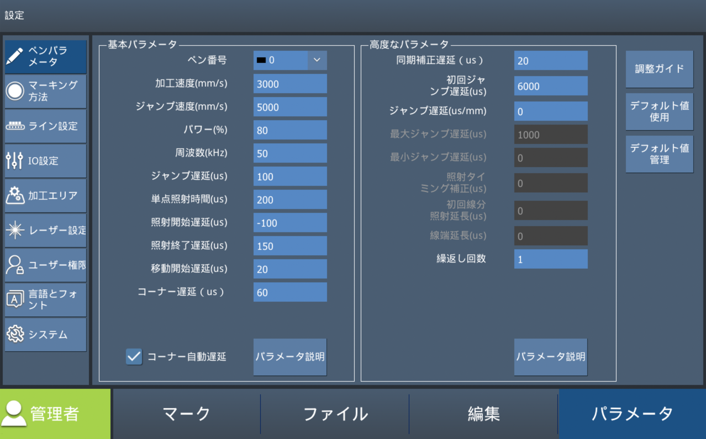

 

| 設定ページ | 概要 |
| :---: | ---- |
|  **ペンパラメータ** | 加工パラメータを設定します。 |
|  **マーキング方法** | 加工開始トリガー等の設定を行います。 |
|  **ライン設定** | 使用しません。 |
|  **IO設定** | IOポートの割り当てや設定を行います。 |
|  **加工エリア** | 加工エリアのサイズや補正を行います。 |
|  **レーザー設定** | レーザー発信機の種別を設定します。 |
|  **ユーザー権限** | ユーザーの追加や権限設定を行います。 |
|  **言語とフォント** | 言語設定やフォントの管理を行います。 |
|  **システム** | 外部通信の設定やIPアドレスの設定を行います。 |

## ペンパラメータ

### 基本パラメータ

| 項目 | 説明 |
|:---:|-----|
| ペン番号 | 0～15のペン番号を選択できます。それぞれのペン番号に異なる基本パラメータを設定できます。 |
| 加工速度（mm/s） | 加工中のスピードです。スピードを遅くすると、素材に与えるレーザーのエネルギーが大きくなります（濃いマーキングになる）。単位は mm/sec、最高スピードは 4000mm/sec となります。 |
| ジャンプ速度（mm/s） | 照射終了後、次の照射の開始地点まで移動するスピードを設定できます。 |
| パワー（%） | レーザー照射の強度を設定します。パワーが大きいほど素材に与えるレーザーのエネルギーが大きくなります。単位は %、最高パワーは 100% となります。 |
| 周波数（kHz） | 1 秒間に繰り返す波の数を指します。単位は KHz、Q スイッチ（標準）は 30KHz ～ 60KHz、MOPA 型は 1KHz ～4000KHz の範囲内で設定できます。まず、Q スイッチ（標準）は 30KHz、MOPA 型は 25KHz で加工を試してください。周波数を上げると、Q スイッチ（標準）の場合は刻印が薄くなる傾向にあり、MOPA 型の場合は ( パルス幅との組み合わせにもよりますが ) 刻印が濃くなる傾向にあります。 |
| MOPAパルス値（ns） | 周波数に対し、こちらは波の高さを指します。MOPA 型のみ設定可能です。単位は ns、2ns ～ 500ns の範囲内で設定できます。 最初は 250ns にしていただくことをお勧めします。加工が出来なかったら値をより上げていただいたり、スピー ドを遅くしたり、パワーを強めるなどの調整を行ってください。 パルス幅の値は小さい方が加工箇所周辺への熱の影響を防ぐことが出来るため、シャープな加工が可能です。少しずつ値を下げていただき、お好みの加工結果になるよう調整してください。 |
| ジャンプ遅延（us） | ジャンプスピードを高く設定すると、塗りつぶし線の最初に歪みが発生する可能性があるため、ジャンプ遅延を調整することにより歪みを軽減させます。 |
| 単点照射時間（us） | ドットオブジェクトがある際のマーキング時間を設定します。 |
| 照射開始遅延（us） | 高スピードの値を設定した際、加工の開始部分が照射されない場合があります。その際はこちらの値を低く設定することにより、開始部分の刻印がきちんと行われるようになります。マイナスの値も設定できます。 |
| 照射終了遅延（us） | 高スピードの値を設定した際、加工の終了部分が照射されない場合があります。その際はこちら の値を高く設定することにより、終了部分の刻印がきちんと行われるようになります。 |
| 移動開始遅延（us） | 加工終了時、照射が終わる前にレーザーの移動が始まってしまい、塗りつぶし線の最後に歪みが発生する場合があります。その際はこちらの値を高く設定することにより、歪みが発生せずに加工することができます。 |
| コーナー遅延（us） | 図形の角部分の刻印スピードの調整を行います。図形の角が丸く加工されている場合は、こちら の値を高く設定してください。 |

### 高度なパラメータ

| 項目 | 説明 |
|:---:|-----|
| 同期補正遅延（us） | ガルバノミラーとレーザーの動作タイミングのずれを補正します。通常、ガルバノミラーの動作はレーザーより約100us遅れるため、この値を設定してタイミングを調整します。 |
| 初回ジャンプ遅延（us） | マーキング開始時の最初のジャンプ動作に対して、通常のジャンプ遅延時間に追加する遅延時間を設定します。 |

調整ガイド: 最適な遅延時間を設定するための調整方法を表示します。 
デフォルト値使用: すべてのペン番号の各パラメータにデフォルト値を適用します。 
デフォルト値管理: 各パラメータのデフォルト値を設定します。 

**加工結果への影響**

| 項目 | 大きすぎる場合 | 小さすぎる場合 | 負値設定 |
| :---: | ----- | ----- | :---: |
|  加工速度  | 単位距離あたりのレーザー照射時間が短くなり、加工が浅くなります。 | 単位距離あたりのレーザー照射時間が長くなり、加工が深くなります。 | 不可 |
| 照射開始遅延 | 始点部分のマーキングが不足する場合があります。 | 始点部分に太りや焼けが発生する場合があります。 | 可 |
| 照射終了遅延 | 終点部分に太りや焼けが発生する場合があります。 | 終点部分が閉じなかったり、塗りつぶしが不足したりする場合があります。 | 不可 |
| ジャンプ速度 | 非照射移動の時間が短くなり、全体のマーキング時間を短縮できますが、速度が速すぎるとガルバノミラーの動作が不安定になり、不要な線が発生する場合があります。 | 非照射移動の時間が長くなり、全体のマーキング時間が長くなります。 | 不可 |
| ジャンプ遅延 | ガルバノミラーが移動を完了してからマーキングを開始するまでの待機時間が長くなり、全体のマーキング時間が長くなります。 | ガルバノミラーが移動を完了する前にマーキングが開始され、線の始点がずれたり、形状が乱れたりする場合があります。 | 不可 |
| コーナー遅延 | コーナー部分でのレーザー照射時間が長くなり、太りや焼けが発生する場合があります。また、全体のマーキング時間が長くなります。 | ガルバノミラーが十分に減速できず、直角などのコーナーが丸くなる場合があります。 | 不可 |

## マーキング方法

マーキングを開始するためのトリガー方式や動作を設定します。
使用するトリガーのほか、トリガー入力からマーキング開始までの遅延、連続したトリガー入力の制限、マーキング順序などを設定できます。

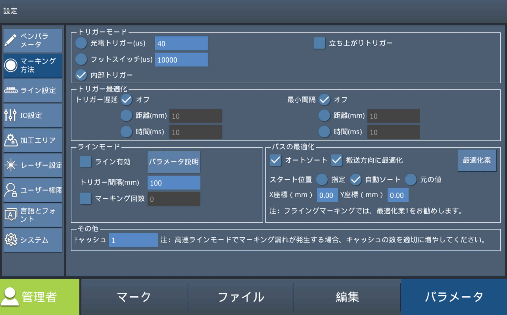

### トリガーモード

トリガーモード

| 項目 | 説明 |
|:---:|-----|
| 光電トリガー | 制御入出力の IN0 への信号入力でマーキングを開始します。マーク画面の「手動トリガー」での代用も可能です。 |
| フットスイッチ | 制御入出力の IN1 への信号入力でマーキングを開始します。マーク画面の「手動トリガー」での代用も可能です。 |
| 内部トリガー | 「マーキング」ボタンをタップしてマーキングモードへ移行すると、直ちにマーキングを開始します。「連続マーク」が有効の場合は、マーキングを繰り返します。 |
| 立ち上がりトリガー | 有効の場合はセンサ信号がONになったとき、無効の場合はOFFになったときにマーキングを開始します。 |

### トリガー最適化

トリガー遅延

| 項目 | 説明 |
|:---:|-----|
| 距離（mm）| エンコーダ接続時に使用します。トリガー受付後、ラインが設定した距離だけ移動するとマーキングを開始します。 |
| 時間（ms）| トリガー受付後、設定した時間が経過するとマーキングを開始します。 |

最小間隔

| 項目 | 説明 |
|:---:|-----|
| 距離（mm）| エンコーダ接続時に使用します。マーキング終了後、ラインが設定した距離だけ移動するまで、次のトリガーを受け付けません。 |
| 時間（ms）| マーキング終了後、設定した時間が経過するまで、次のトリガーを受け付けません。 |

### ラインモード

搬送ラインの動きに合わせて、一定の間隔で連続してマーキングを行うモードです。

| 項目 | 説明 |
|:---:|-----|
| ライン有効 | ラインモードを有効にします。 |
| トリガー間隔（mm） | 連続マーキング時の間隔を設定します。マーキングの開始位置から、次のマーキングの開始位置までの距離を指定します。 |
| マーキング回数 | 有効にすると、1回のトリガーで指定した回数のマーキングを行います。無効の場合は、マーキングを自動で継続します。 |

一定の間隔でマーキングを継続する場合の設定例 
<b>トリガー方式：内部トリガー / トリガー間隔：固定距離 / マーキング回数：無効</b>

1回のトリガーで指定した回数（N回）マーキングする場合の設定例 
<b>トリガー方式：光電トリガー / トリガー間隔：固定距離 / マーキング回数：N回</b>

### パスの最適化

| 項目 | 説明 |
|:---:|-----|
| オートソート | 有効にすると、マーキング順序を自動で並べ替えます。無効の場合は、データの作成順にマーキングします。 |
| 搬送方向に最適化 | 有効にすると、データの作成順に関係なく、搬送方向に沿ってマーキングします。複数のデータが並んでいる場合は、それらをまとめてマーキングします。 |
| スタート位置 | `指定`：マーキングの開始位置を座標で指定します。 `自動`：ワークの搬送方向に応じて、開始位置を自動で設定します。 `元`：編集時に設定したデータの配置位置を使用します。 |

### その他

| 項目 | 説明 |
|:---:|-----|
| キャッシュ | ホストから受信したデータを一時的に保存する件数を設定します。例えば10に設定すると、最大10件のデータを保存し、受信した順にマーキングします。 |

<!-- 

 -->

## ライン設定

搬送ラインに組み込んで使用する場合は、使用環境に応じて「エンコーダ」または「固定ライン速度」を選択します。
「固定ライン速度」を使用する場合は、実際の搬送速度を設定してください。
「エンコーダ」を使用する場合は、エンコーダの直径と1回転あたりのパルス数を入力すると、パルス間距離が自動で計算されます。

### ライン方向

ラインが流れる方向を設定します。

### エンコーダ

エンコーダを使用して搬送ラインの移動量を検出する場合に有効にします。

| 項目 | 説明 |
|:---:|-----|
| パルス間距離 | エンコーダの1パルスあたりの搬送距離を設定します。エンコーダパラメータから自動で計算できます。 |
| エンコーダ反転 | エンコーダのA相とB相の入力信号を入れ替え、検出する搬送方向を反転します。 |

エンコーダパラメータ

| 項目 | 説明 |
|:---:|-----|
| 直径（mm） | エンコーダに接続されたローラーの直径を入力します。 |
| パルス | エンコーダの1回転あたりのパルス数を入力します。 |
| 計算 | 入力した直径とパルス数から、パルス間距離を計算します。 |
| スピードテスト | エンコーダから検出した現在のライン速度を表示します。 |

パルス間距離の設定値と実際の移動距離に誤差があると、マーキング結果に歪みが生じる場合があります。
その場合は、加工結果を確認しながらパルス間距離を微調整してください。

### 固定ライン速度

エンコーダを使用せず、一定のライン速度で動作させる場合に選択します。ラインが流れる速度（m/min）を設定してください。

### 静的マーク

ラインを使用せず、ワークを静止させた状態でマーキングする場合に選択します。

## IO設定

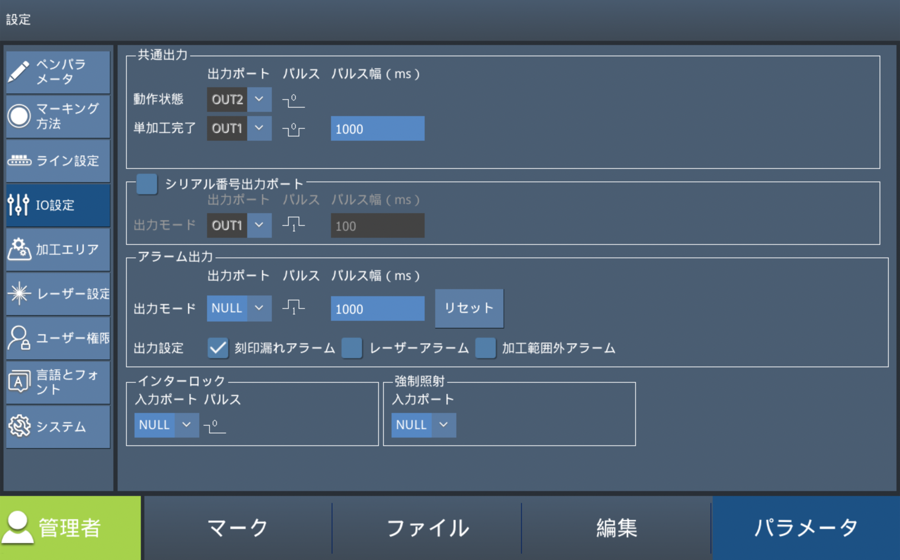

### 共通出力

| 項目 | 説明 |
|:---:|-----|
| 動作状態 | マーキング動作時の信号出力の論理レベル（High/Low）を指定します。 |
| 単加工完了 | 1回のマーキング完了時に出力する信号の論理レベル（High / Low）と出力時間（パルス幅）を設定します。 |

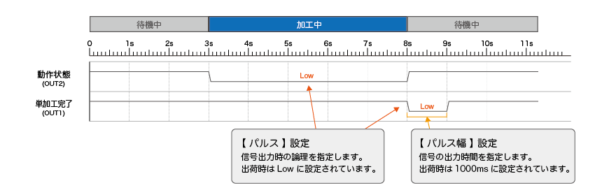

### アラーム出力

| 項目 | 説明 |
|:---:|-----|
| 出力モード | アラーム発生時に信号を出力するポート、信号の論理レベル（High / Low）、出力時間（パルス幅）を設定します。 |
| 出力設定 | 信号出力の対象とするアラームを選択します。 ・刻印漏れアラーム: マーキングに失敗した場合に通知します。 ・レーザーアラーム: レーザー発振器でエラーが発生した場合に通知します。 ・加工範囲外アラーム: マーキングデータが加工エリアを超えている場合に通知します。  |

### インターロック

インターロック機能を使用する場合は「インターロック」に入力ポートを割り当ててください。

### テスト照射

レーザーのテスト照射機能を使用する場合は「強制照射」に入力ポートを割り当ててください。 
信号が入力されるとレーザーが強制的に照射されるので十分に注意してください。

## 加工エリア

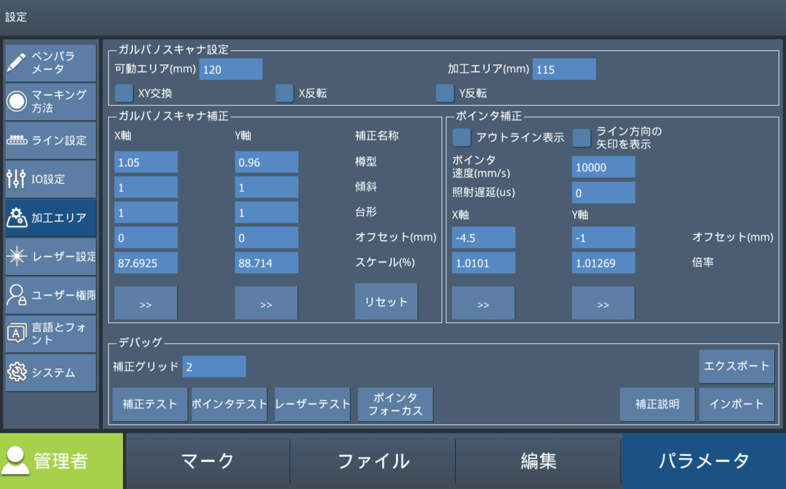

### ガルバノスキャナ設定

| 項目 | 説明 |
|:---:|-----|
| 可動エリア（mm） | ガルバノスキャナの可動範囲を設定します。下記の表の値を設定します。 |
| 加工エリア（mm） | 加工範囲を設定します。下記の表の値を設定します。 |
| XY交換 | 有効の場合、X/Y方向を反転します。 |
| X反転 / Y反転 | それぞれの方向を反転します。 |

| レンズ種別 | 可動エリア | 加工エリア |
|:-----:|:-----:|:-----:|
| 110mm レンズ | 120 | 115 |
| 200mm レンズ | 210 | 205 |
| 300mm レンズ | 310 | 305 |

### ガルバノスキャナ補正

| 項目 | 説明 |
|:---:|-----|
| 樽型 | 湾曲を補正します。既定値は 1.0（パラメータ範囲0.5～1.5）です。 |
| 傾斜 | 平行四辺形のような傾斜を補正します。既定値は1.0（パラメータ範囲0.5〜1.5）です。 |
| 台形 | 台形状の歪みを補正します。既定値は1.0（設定範囲：0.5～1.5）です。 |
| オフセット（mm） | 加工位置のズレを補正します。 |
| スケール（%） | データと加工結果のサイズのズレを補正します。`>>`ボタンをタップし、データサイズと加工サイズを入力すると、補正値が自動で計算されます。 |

### ポインタ補正

| 項目 | 説明 |
|:---:|-----|
| アウトライン表示 | 有効にすると、要素の輪郭をレーザーポインターで表示します。 |
| ライン方向の矢印を表示 | プレビュー時に、設定されているライン方向をレーザーポインターで表示します。 |
| ポインタ速度 | レーザーポインターの移動速度を設定します。速度が遅いほど移動経路を確認しやすく、速度が速いほど要素の輪郭を確認しやすくなります。 |
| 照射遅延（us） | レーザーポインターが照射されるまでの遅延時間を設定します。 |
| オフセット | レーザーポインターと実際の加工位置にズレがある場合に、ポインターの照射位置を補正します。 |
| 倍率 | レーザーポインターと実際の加工サイズにズレがある場合に、ポインターの表示サイズを補正します。 |

### デバッグ

| 項目 | 説明 |
|:---:|-----|
| 補正テスト | 設定した補正パラメータに従って矩形をマーキングし、補正結果を確認します。 |
| ポインタテスト | 設定したポインタ補正パラメータに従ってガイド光を照射し、補正結果を確認します。 |
| レーザーテスト | レーザーが正常に照射されることを確認します。 レーザーが強制照射されるため、ワークの設置状態および周囲の安全を確認したうえで、必ず安全メガネを着用して操作してください。 |
| インポート・エクスポート | ガルバノスキャナ補正の設定値をファイルに保存したり、保存した設定値を読み込んだりできます。 |

## レーザー設定

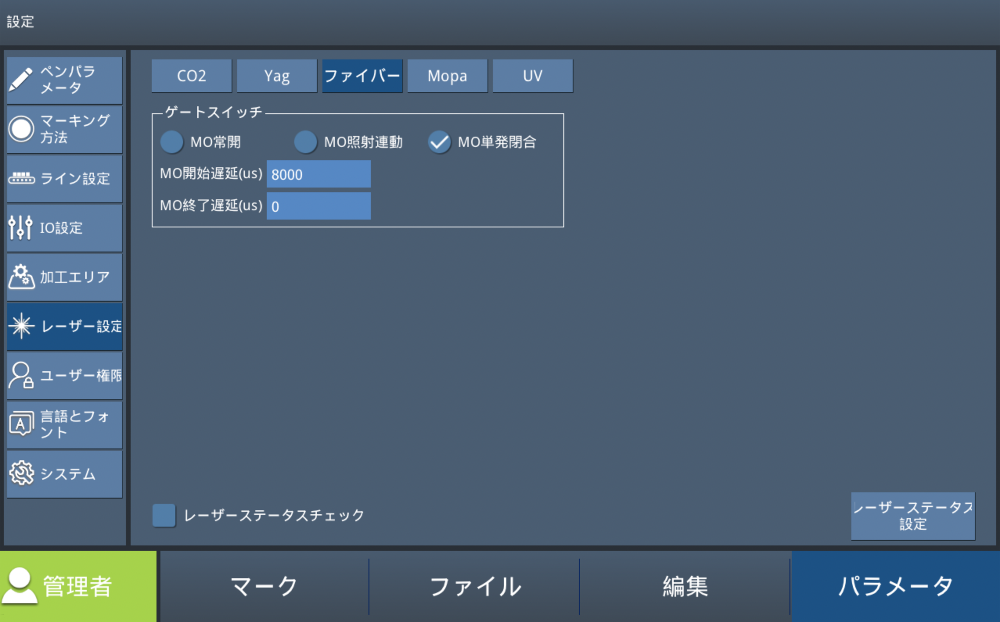

レーザーの種類を選択します。使用する機種に応じて、以下のタイプが選択されていることを確認してください。

LM110C 通常（Qスイッチ）：**ファイバー** ／ LM110C MOPA型：**Mopa** ／ LM140R：**CO2** ／ LM110U：**UV**

## ユーザー権限

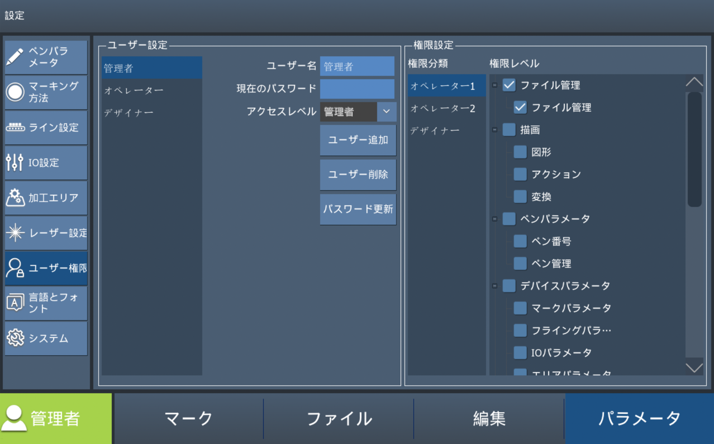

### ユーザー設定

ユーザの追加、削除、変更などの管理を行います。

### 権限設定

ユーザーごとの権限レベルを設定します。

## 言語とフォント

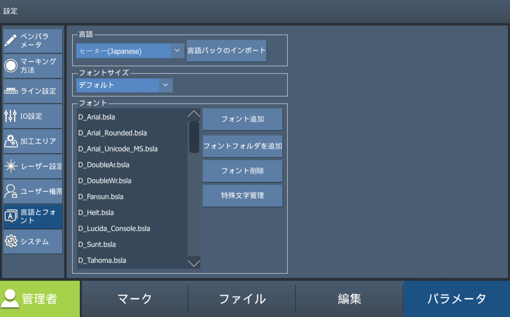

| 項目 | 説明 |
|:---:|-----|
| 言語 | ソフトウェアの表示言語を設定します。 |
| フォントサイズ | ソフトウェアの表示文字サイズを設定します。 |
| フォント | ソフトウェアで使用するフォントを管理します。フォントの追加や削除ができます。 |

## システム

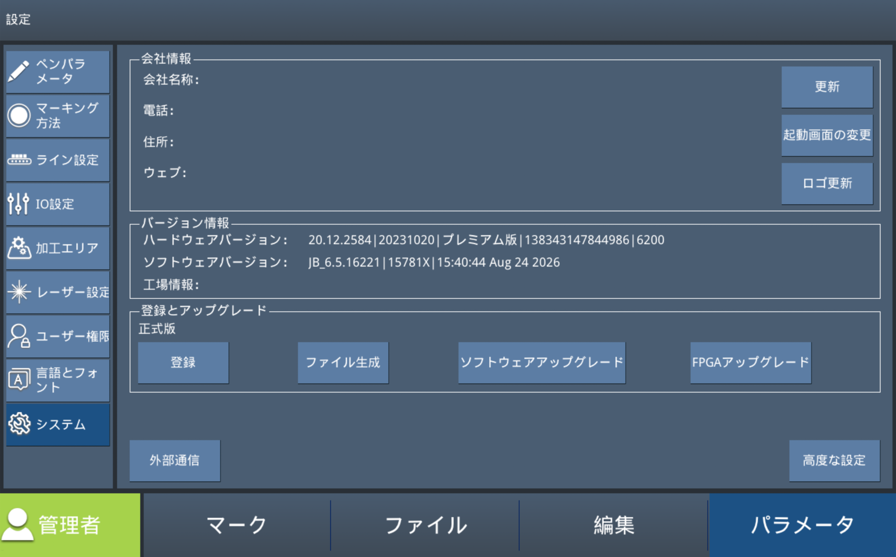

### バージョン情報
ソフトウェア、ハードウェアのバージョン番号を表示します。

### 外部通信

外部から刻印データを読み込んだり、コマンドを使用して操作を行う場合に設定します。通信方法を設定後、「起動」ボタンを押すと外部との通信が可能になります。
詳細については[外部機器との通信](#外部機器との通信)の章をご確認ください。

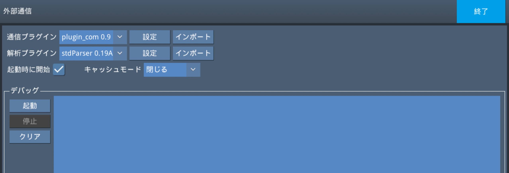

#### 通信プラグイン - 設定

この設定を行うには、通信プロセスを停止する必要があります。「停止」ボタンをタップしてください。

「通信プラグイン」プルダウンから使用する通信方法を選択します。
- シリアル通信: plugin_com 0.0*
- TCP通信: plugin_tcp 0.0*

※プラグインの数字はバージョンによって異なります

使用するプラグインを選択した状態で「設定」ボタンをタップすると通信設定を編集することができます。

plugin_com

ここでは、シリアル通信の設定を変更できます。

| 項目 | 説明 |
|:---:|-----|
| シリアルポートを選択 | 使用するシリアルポートを選択します。tty2を使用してください。 |
| ボーレート | ボーレートを設定します。 |
| データビット | データビットを設定します。 |
| パリティ | パリティを設定します。 |
| ストップビット | ストップビットを設定します。 |
| フロー制御 | フロー制御の種類を設定します。RTS/CTSは使用できません。 |
| 文字コード | 通信に使用する文字コードを設定します。 |

plugin_tcp

ここでは、TCP通信の設定を変更できます。

| 項目 | 説明 |
|:---:|-----|
| 本機をサーバーとして動作 | 有効の場合は本機がサーバーとして動作し、クライアントからの接続を待ちます。無効の場合はクライアントとして動作し、外部サーバーに接続します。 |
| 本機サーバーポート | 本機をサーバーとして使用する場合のポート番号を設定します。 |
| 本機IPアドレス | 本機に設定されているIPアドレスを表示します。 |
| 接続先ポート | 本機をクライアントとして使用する場合の接続先サーバーのポート番号を設定します。 |
| 接続先IPアドレス | 本機をクライアントとして使用する場合の接続先サーバーのIPアドレスを設定します。 |

#### 解析プラグイン - 設定

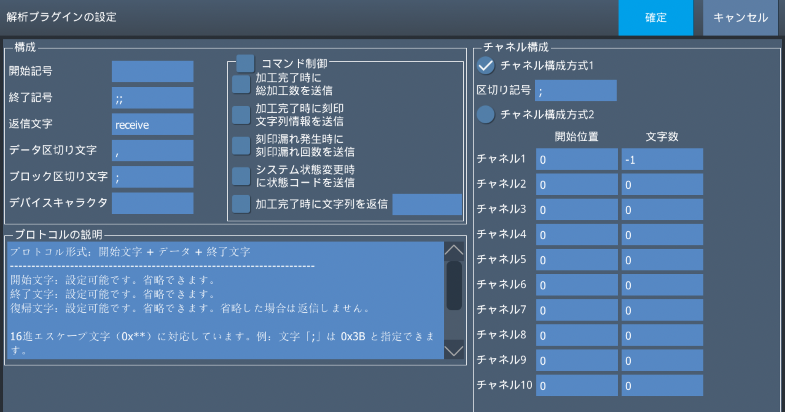

構成

| 項目 | 説明 |
|:---:|-----|
| 開始記号 | データの開始を示す文字列を設定します。デフォルトは空です。 |
| 終了記号 | データの終了を示す文字列を設定します。デフォルトは半角セミコロン2つ（;;）です。 |
| 返信文字 | データを受信したときに返信する文字列を設定します。 |
| データ区切り文字 | コマンドとパラメータを区切る文字を設定します。 |
| ブロック区切り記号 | 複数のデータを区切る文字を設定します。 |
| デバイスキャラクタ | 複数のデバイスを識別するための文字を設定します。 |

コマンド制御

チェックするとコマンドモードが有効になり、図形の位置や加工パラメータの変更、状態の取得などを行うことができます。具体的なコマンドについては[コマンド制御](#コマンド制御)を参照してください。

<!--
| 項目 | 説明 |
|:---:|-----|
| スケール完了1回の戻り値 | マーキング1回ごとに、完了した数量を送ります。 |
| コールアウトが完了したらコンテンツに戻ります | マーキング1回ごとに、完了した内容を送ります。 |
| ドロップ変更によるドロップ回数の戻し | 未マーキング（漏れ）の発生時に、その回数を返送ります。 |
| マーキング状態変更時に状態復帰 | タッチパネルの作業状態が変化した際に、対応する状態値を送ります。 |
| インデックス完了戻り文字 | マーキング完了後、指定された内容を送ります。 |
 -->

**加工完了時に総加工数を送信**

マーキング1回ごとに総マーキング数を送ります。

送信例: MarkStatus:2;; 

**加工完了時に刻印文字列情報を送信**

マーキング1回ごとに刻印した文字列情報を送ります。

送信例: MarkData:text1text2;; 
※text1text2 はテキストオブジェクト1、テキストオブジェクト2のテキスト内容を意味します。

**刻印漏れ発生時に刻印漏れ回数を送信**

マーキング漏れの発生時に、その回数を送ります。

MissCount:1;; 

**システム状態変更時に状態コードを送信**

システム状態が変化した際に、対応する状態値を送ります。ステータス番号は[コマンド一覧](コマンド一覧)の GetMarkStatus コマンドの説明を参照してください。

MarkStatus:2;; 
※2 はマーキング状態を意味します。

チャネル構成

* チャンネル構成方式1: 一度に複数のチャンネルデータを送信できます。デフォルトではチャンネル間のデータは英文セミコロンで区切ります。
* チャンネル設定方式2: 各チャンネルごとに、1つのデータのどの部分を取得するかを設定できます。開始位置と文字数を指定するだけです。 例: データ「123456789」がある場合、チャンネル1の開始位置を0、文字数を3に設定すると、チャンネル1が取得するデータは「123」となります。チャンネル2を開始位置3、文字数5に設定すると、チャンネル2が取得するデータは「45678」となります。

### 高度な設定

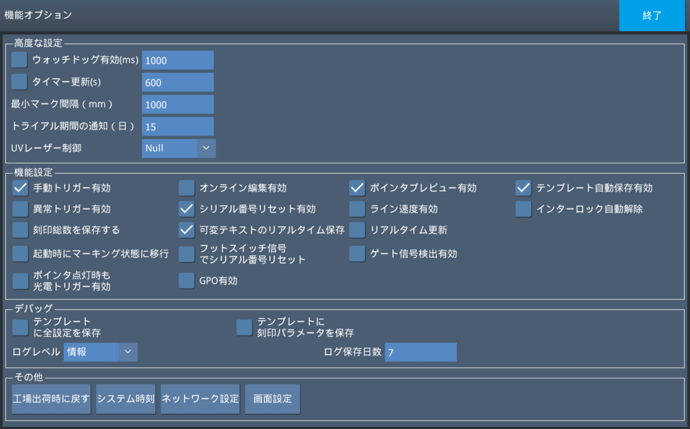

高度な設定

| 項目 | 説明 |
|:---:|-----|
| ウォッチドッグ有効（ms） | この項目は使用しません。 |
| タイマー更新（s） | トリガー入力がない場合でも、設定した間隔でマーキングデータ内の時間要素を自動的に更新します。 |
| 最小マーク間隔（mm） | 適切なライン速度を算出するために使用します。実際のマーキング動作には影響しません。必要に応じて設定します。 |

機能設定

| 項目 | 説明 |
|:---:|-----|
| 手動トリガー有効 | マーク画面の「手動トリガー」ボタンを有効にします。 |
| シリアル番号リセット有効 | マーク画面の「シリアル番号リセット」ボタンを有効にします。 |
| 可変テキストのリアルタイム保存 | 可変テキストをマーキングした場合、更新された文字列をすぐに保存します。 |
| リアルタイム更新 | 連続マーキング時に、時刻テキストなどのマーキング内容をプレビュー画面へすぐに反映します。 |

#### デバッグ

テンプレートに全設定を保存: 有効の場合、すべてのパラメータがテンプレートに保存されます。

#### その他

* 工場出荷時に戻す: すべての設定を工場出荷状態に戻すことができます。
* システム時刻: ソフトウェアの時間設定が可能です。
* ネットワーク設定: IPアドレス、サブネットマスク等を指定することが可能です。
* 画面設定: スクリーンセーバーの有効化と輝度の調整ができます。
