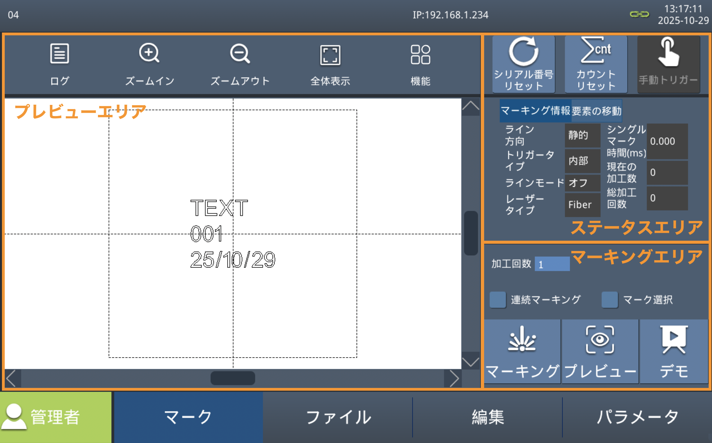

# 加工操作

「マーク」タブは、現在のファイルの加工操作を行うためのインターフェイスです。
正式なマーキングを行う前に予備マーキングを行い、焦点距離や加工範囲、加工パラメータの確認を行なってください。

注意: レーザー照射時は必ず保護メガネをかけて操作してください。

この画面は主にプレビューエリア、ステータスエリア、マーキングエリアに分かれています。

## プレビューエリア

* ログ: ソフトウェアの動作ログが取得できます。 不具合が発生した際に確認する場合があります。
* ズームイン: プレビューエリアのズームインを行います。
* ズームアウト: プレビューエリアのズームアウトを行います。
* 全体表示: プレビューエリア全体を表示します。

## ステータスエリア

| 項目 | 説明 |
|:---:|-----|
| シリアル番号リセット | シリアル番号機能を使用している場合、データの開始番号などのリセットや指定を行えます。 |
| カウントリセット | 現在の加工回数や総加工回数などをリセットします。 |
| 手動トリガー | トリガーモードに「内部トリガー」以外が設定されている場合に使用できます。「マークキング」状態にしてこのボタンをタップすると手動でマーキングを開始します。モードの設定は[トリガーモード](#トリガーモード)を参照してください。 |
| マーキング情報 | 各種設定や現在の加工数などが表示されます。 |
| 要素の移動 | オブジェクトの位置や角度を変更することができます。 |

## マーキングエリア

| 項目 | 説明 |
|:---:|-----|
| マーキング | タップすることでマーキング状態になり、ボタンが「停止」に切り替わります。 内部トリガーを設定している場合、すぐにレーザー照射が始まる場合があります。 加工が終了する場合は「停止」を押して解除してください。 |
| プレビュー | レーザーポインターで加工範囲を表示します。 |
| デモ | どのような順序で加工が行われるか確認することができます。最大ライン速度を参考に、ライン速度やマーキング速度の調整を行ってください。 |
| 連続マーキング | 有効の場合、加工を連続で行うことができます。無効の場合、加工終了後にマーキング状態が自動で解除されます。 |