---
puppeteer:
    format: 'A4'
    headerTemplate: '

'
    footerTemplate: '
  
'
    displayHeaderFooter: true
---

インラインレーザーマーカーシステム 
操作マニュアル

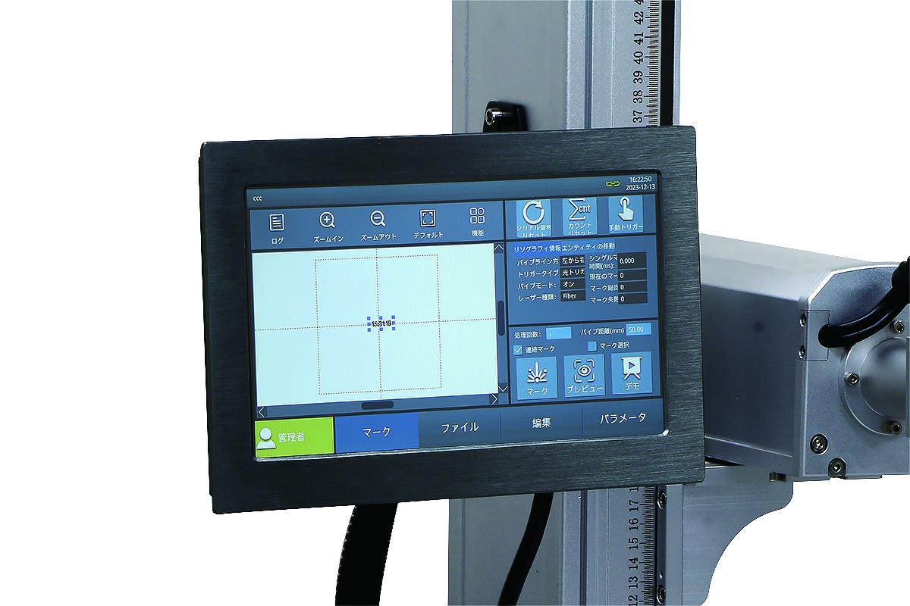

第 2 版  
発行日 2025年10月⚪︎⚪︎日 

目次

<a class="toc-item" href="#1-概要">
	1. 概要
	
	4
</a>
<a class="toc-item toc-section-item" href="#11-はじめに">
	1.1 はじめに
	
	4
</a>
<a class="toc-item toc-section-item" href="#12-インラインレーザーマーカーシステムの特徴">
	1.2 インラインレーザーマーカーシステムの特徴
	
	4
</a>
<a class="toc-item toc-section-item" href="#13-標準システムとの比較">
	1.3 標準システムとの比較
	
	5
</a>
<a class="toc-item" href="#2-ハードウェア仕様">
	2. ハードウェア仕様
	
	6
</a>
<a class="toc-item toc-section-item" href="#21-IOポート仕様">
	2.1 I/Oポート仕様
	
	6
</a>
<a class="toc-item toc-section-item" href="#22-通信インターフェース仕様">
	2.2 通信インターフェース仕様
	
	7
</a>
<a class="toc-item" href="#3-クイックスタート">
	3. クイックスタート
	
	8
</a>
<a class="toc-item toc-section-item" href="#31-ログイン">
	3.1 ログイン
	
	8
</a>
<a class="toc-item toc-section-item" href="#32-新規ドキュメントの作成">
	3.2 新規ドキュメントの作成
	
	8
</a>
<a class="toc-item toc-section-item" href="#33-各種設定">
	3.3 各種設定
	
	9
</a>
<a class="toc-item toc-section-item" href="#34-データ作成">
	3.4 データ作成
	
	9
</a>
<a class="toc-item toc-section-item" href="#35-マーキング">
	3.5 マーキング
	
	10
</a>
<a class="toc-item" href="#4-ソフトウェア概要">
	4. ソフトウェア概要
	
	11
</a>
<a class="toc-item toc-section-item" href="#41-画面構成">
	4.1 画面構成
	
	11
</a>
<a class="toc-item" href="#5-編集">
	5. 編集
	
	12
</a>
<a class="toc-item toc-section-item" href="#51-基本的な機能">
	5.1 基本的な機能
	
	12
</a>
<a class="toc-item toc-section-item" href="#52-オブジェクトの作成">
	5.2 オブジェクトの作成
	
	13
</a>
<a class="toc-item toc-section-subitem" href="#521-テキスト">
	5.2.1 テキスト
	
	13
</a>
<a class="toc-item toc-section-subitem" href="#522-QRコード">
	5.2.2 QRコード
	
	18
</a>
<a class="toc-item toc-section-subitem" href="#523-バーコード">
	5.2.3 バーコード
	
	19
</a>
<a class="toc-item toc-section-subitem" href="#524-図形">
	5.2.4 図形
	
	20
</a>
<a class="toc-item toc-section-subitem" href="#525-ベクター">
	5.2.5 ベクター
	
	20
</a>
<a class="toc-item toc-section-subitem" href="#526-画像">
	5.2.6 画像
	
	20
</a>
<a class="toc-item toc-section-item" href="#53-オブジェクトの編集">
	5.3 オブジェクトの編集
	
	21
</a>
<a class="toc-item" href="#6-パラメータ">
	6. パラメータ
	
	24
</a>
<a class="toc-item toc-section-item" href="#61-ペンパラメータ">
	6.1 ペンパラメータ
	
	24
</a>
<a class="toc-item toc-section-subitem" href="#611-基本パラメータ">
	6.1.1 基本パラメータ
	
	24
</a>
<a class="toc-item toc-section-subitem" href="#612-高度なパラメータ">
	6.1.2 高度なパラメータ
	
	25
</a>
<a class="toc-item toc-section-item" href="#62-マーキング方法">
	6.2 マーキング方法
	
	26
</a>
<a class="toc-item toc-section-subitem" href="#621-トリガーモード">
	6.2.1 トリガーモード
	
	26
</a>
<a class="toc-item toc-section-subitem" href="#622-トリガー最適化">
	6.2.2 トリガー最適化
	
	26
</a>
<a class="toc-item toc-section-subitem" href="#623-ラインモード">
	6.2.3 ラインモード
	
	26
</a>
<a class="toc-item toc-section-subitem" href="#624-パスの最適化">
	6.2.4 パスの最適化
	
	26
</a>
<a class="toc-item toc-section-subitem" href="#625-その他">
	6.2.5 その他
	
	26
</a>
<a class="toc-item toc-section-item" href="#63-ライン設定">
	6.3 ライン設定
	
	27
</a>
<a class="toc-item toc-section-item" href="#64-IO設定">
	6.4 IO設定
	
	27
</a>
<a class="toc-item toc-section-subitem" href="#641-共通出力">
	6.4.1 共通出力
	
	27
</a>
<a class="toc-item toc-section-subitem" href="#642-アラーム出力">
	6.4.2 アラーム出力
	
	27
</a>
<a class="toc-item toc-section-subitem" href="#643-インターロック">
	6.4.3 インターロック
	
	27
</a>
<a class="toc-item toc-section-subitem" href="#644-テスト照射">
	6.4.4 テスト照射
	
	27
</a>
<a class="toc-item toc-section-item" href="#65-加工エリア">
	6.5 加工エリア
	
	28
</a>
<a class="toc-item toc-section-subitem" href="#651-ガルバノスキャナ設定">
	6.5.1 ガルバノスキャナ設定
	
	28
</a>
<a class="toc-item toc-section-subitem" href="#652-ガルバノスキャナ補正">
	6.5.2 ガルバノスキャナ補正
	
	28
</a>
<a class="toc-item toc-section-subitem" href="#653-ポインタ補正">
	6.5.3 ポインタ補正
	
	28
</a>
<a class="toc-item toc-section-subitem" href="#654-デバッグ">
	6.5.4 デバッグ
	
	29
</a>
<a class="toc-item toc-section-item" href="#66-レーザー設定">
	6.6 レーザー設定
	
	29
</a>
<a class="toc-item toc-section-item" href="#67-ユーザー権限">
	6.7 ユーザー権限
	
	29
</a>
<a class="toc-item toc-section-subitem" href="#671-ユーザー設定">
	6.7.1 ユーザー設定
	
	29
</a>
<a class="toc-item toc-section-subitem" href="#672-権限設定">
	6.7.2 権限設定
	
	29
</a>
<a class="toc-item toc-section-item" href="#68-言語とフォント">
	6.8 言語とフォント
	
	29
</a>
<a class="toc-item toc-section-item" href="#69-システム">
	6.9 システム
	
	30
</a>
<a class="toc-item toc-section-subitem" href="#691-バージョン情報">
	6.9.1 バージョン情報
	
	30
</a>
<a class="toc-item toc-section-subitem" href="#692-外部通信">
	6.9.2 外部通信
	
	30
</a>
<a class="toc-item toc-section-subitem" href="#693-高度な設定">
	6.9.3 高度な設定
	
	32
</a>
<a class="toc-item" href="#7-加工操作">
	7. 加工操作
	
	33
</a>
<a class="toc-item toc-section-item" href="#71-プレビューエリア">
	7.1 プレビューエリア
	
	33
</a>
<a class="toc-item toc-section-item" href="#72-ステータスエリア">
	7.2 ステータスエリア
	
	33
</a>
<a class="toc-item toc-section-item" href="#73-マーキングエリア">
	7.3 マーキングエリア
	
	33
</a>
<a class="toc-item" href="#8-外部機器との通信">
	8. 外部機器との通信
	
	34
</a>
<a class="toc-item toc-section-item" href="#81-外部からの文字列指定">
	8.1 外部からの文字列指定
	
	34
</a>
<a class="toc-item toc-section-subitem" href="#811-TCP通信の例">
	8.1.1 TCP通信の例
	
	34
</a>
<a class="toc-item toc-section-subitem" href="#812-シリアル通信の例">
	8.1.2 シリアル通信の例
	
	35
</a>
<a class="toc-item toc-section-item" href="#82-コマンド制御">
	8.2 コマンド制御
	
	36
</a>
<a class="toc-item toc-section-subitem" href="#821-プロトコル形式">
	8.2.1 プロトコル形式
	
	36
</a>
<a class="toc-item toc-section-subitem" href="#822-コマンド一覧">
	8.2.2 コマンド一覧
	
	36
</a>
<a class="toc-item" href="#9-付録">
	9. 付録
	
	45
</a>
<a class="toc-item toc-section-item" href="#91-レンズの交換方法">
	9.1 レンズの交換方法
	
	45
</a>
<a class="toc-item toc-section-item" href="#92-補正ファイルの作成">
	9.2 補正ファイルの作成
	
	45
</a>
<a class="toc-item toc-section-item" href="#93-フォントの追加">
	9.3 フォントの追加
	
	48
</a>

# 1. 概要

## 1.1 はじめに

本書は、加工機を制御する専用コントローラおよびソフトウェアのマニュアルです。 
ご利用前に、加工機本体の製品マニュアルも必ずご確認ください。

- [LM110C 製品マニュアル - https://www.smartdiys.com/assets/pdf/LM110C_Manual.pdf](https://www.smartdiys.com/assets/pdf/LM110C_Manual.pdf)
- [LM140R 製品マニュアル - https://www.smartdiys.com/assets/pdf/LM140R_Manual.pdf](https://www.smartdiys.com/assets/pdf/LM140R_Manual.pdf)
- [LM110U 製品マニュアル - https://www.smartdiys.com/assets/pdf/LM110U_Manual.pdf](https://www.smartdiys.com/assets/pdf/LM110U_Manual.pdf)

## 1.2 インラインレーザーマーカーシステムの特徴

本製品は、スタンドアロンでの運用に必要な基本機能を備えたレーザーマーキングシステムです。 
 

**多様な加工開始トリガ** 
フットスイッチ、NPN入力、内部トリガから選択可能。設備仕様や運用フローに応じて柔軟に切り替えられます。また、コマンド制御モードではシリアル通信やTCP通信から加工開始トリガーを送ることもできます。

**加工状態取得** 
「加工中／非加工中」の状態を外部へ出力できるため、PLCや周辺装置とのインターロックに利用できます。

**ユーザー権限管理** 
不正操作等を防止するためのユーザー権限設定機能が搭載されています。

**マーキングカウント** 
刻印回数やエラー回数、加工時間などを取得でき、生産管理に活用できます。

**加工データの作成・編集** 
図形やテキスト（QR / バーコード）の配置・調整、パラメータ設定、ファイル管理まで一貫して行えます。

**多彩なデータ作成機能**
シリアル番号の自動カウントアップ、加工時の日時情報やランダム文字列などを自動で生成して加工データに適用します。

**外部通信による可変印字** 
複雑な事前処理が必要なテキスト情報（テキスト／QRコード／バーコード）の場合は、TCPまたはシリアル通信を通じて外部システムで生成した文字列を指定することができます。

**コマンド制御** 
コマンド制御モードを有効化すると、外部通信を通じて刻印位置・パラメータ設定、状態取得などが可能になります。

## 1.3 標準システムとの比較

本システムは、外部機器との連携に特化した各種機能を備えています。 
下記に 標準システム  と インラインレーザーマーカーシステム の主な違いをご紹介します。

| 項目 | 標準システム | インラインレーザーマーカー システム |
|---|:-----:|:-----:|
| ソフトウェア     | SmartDIYs CAD | 内蔵ソフトウェア <small>※SmartDIYs CAD非対応</small> |
| 加工開始トリガー | ソフトウェア IOポート | ソフトウェア IOポート 外部通信 |
| インターロック | 有り（一部機種） | 有り |
| 加工中状態取得 | IOポート | IOポート 外部通信 |
| 外部通信による刻印文字の指定 | ◎ | ◎ |
| 外部通信によるプロジェクト切り替え | △ <small>※ミドルウェアの開発が必要</small> | ◎ |
| 外部通信による図形位置調整 | × | ◎ |
| 外部通信による加工パラメータ設定 | × | ◎ |
| 加工数カウント機能 | ⚪︎ | ◎ <small>※エラーカウントも取得可能</small> |
| ユーザー権限の管理 | ◎ | ◎ |
| 回転軸加工 | ◎ | × |
| 対応画像形式 | ◎ <small>bmp / jpg / gif / tga / png / tif  ai (ver.8) / plt / dxf / jpc / svg / nc 等</small> | ⚪︎ <small>bmp / jpg / png  ai (ver.8) / dxf / plt</small>|

※外部通信はいずれもシリアル通信/TCP通信に対応しています。 

 

<!--

本製品は、スタンドアロンでの運用に必要な基本機能を備えたレーザーマーキングシステムです。 
また、光電センサやエンコーダと連携することで、搬送ライン上を移動するワークにも刻印を行うことができます。

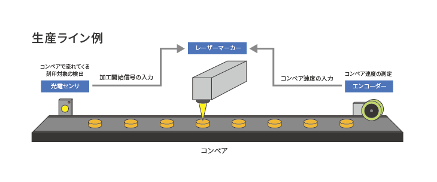

ハードウェア

**加工状態出力** 
コントローラから「加工中／非加工中」を外部へ出力でき、PLCや周辺装置とのインターロックに利用できます。

**エンコーダ対応** 
シングル出力／デュアル出力の両方式をサポート。出力形式は NPN とラインドライバに対応し、既設ラインに合わせた取り回しが可能です。

**多様なスタートトリガ** 
フットスイッチ、NPN入力、内部トリガから選択可能。設備仕様や運用フローに応じて柔軟に切り替えられます。また、コマンド制御モードではシリアル通信やTCP通信から加工開始トリガーを送ることもできます。

※ 光電センサ・エンコーダとレーザーマーカー間のケーブルは、最大およそ 20 m 程度まで延長可能です。 
※ 搬送ラインの上限速度は刻印内容に依存します。刻印時間が増えるほど許容速度は低下します。 

ソフトウェア

**ユーザー権限（ロール）管理** 
不正操作等を防止するためのユーザー権限設定機能が搭載されています。

**加工データの作成・編集** 
図形やテキスト（QR / バーコード）の配置・調整、パラメータ設定、ファイル管理まで一貫して行えます。

**マーキングカウント** 
刻印回数やエラー回数、加工時間などを取得でき、生産管理に活用できます。

**外部通信による可変印字** 
テキスト／QRコード／バーコードの内容を外部から指定できます。

**コマンド制御** 
コマンド制御モードを有効化すると、外部通信を通じて刻印位置・パラメータ設定、状態取得などが可能になります。

-->

# 2. ハードウェア仕様

<!-- ## エンコーダ入力仕様

コネクタ① デュアルエンコーダ入力

| ピン番号 | 機能名 | 内容 |
|:--:| --- | --- |
| 1 | A+ | エンコーダのA+信号入力 |
| 2 | A- | エンコーダのA-信号入力 |
| 3 | B+ | エンコーダのB+信号入力 |
| 4 | B- | エンコーダのB-信号入力 |
| 5 | VCC | 5V外部電圧出力。最大出力電流値は200mAまでとなります。エンコーダへの電源供給用。 |
| 6 | GND | エンコーダ用GND |

コネクタ②　シングルエンドエンコーダ入力

| ピン番号 | 機能名 | 内容 |
|:--:| --- | --- |
| 1 | A | エンコーダのA信号入力 |
| 2 | B | エンコーダのB信号入力 |
| 3 | VCC | 5V外部電圧出力。最大出力電流値は200mAまでとなります。エンコーダへの電源供給用。 |
| 4 | GND | エンコーダ用GND |

接続するエンコーダに応じてコントローラのジャンパピン（画像赤枠部分）の設定を変更する必要があります。シングルエンコーダは左、デュアルエンコーダは右です。

-->

## 2.1 I/Oポート仕様

<!-- 
コネクタ③　外部インターフェイス ( センサー・PLC 接続 )
 -->

| ピン番号 | 機能名 | 内容 |
|:--:| --- | --- |
| 1 | 24V  | 24V 電源出力。最大出力電流値は 200mA までとなります。センサーへの電源供給用。 |
| 2 | IN0  | レーザー照射トリガー用入力。本信号は NPN タイプの光電センサ専用入力となります。 |
| 3 | GND  | GND（IN0 用） |
| 4 | IN1  | レーザー照射トリガー用入力。GND との短絡でトリガーを認識します。 |
| 5 | IN2  | 外部制御入力。ソフトウェアでの設定により、下記機能のいずれかへ割り当てが可能です。 ➀インターロック　➁レーザー照射 |
| 6 | GND  | GND（IN1, IN2 用） |
| 7 | NC   | 使用しません。何も接続しないでください。 |
| 8 | OUT1 | デフォルトではマーキング完了信号が割り当てられています。オープンコレクタ出力。 |
| 9 | OUT2 | デフォルトでは動作状態信号が割り当てられています。オープンコレクタ出力。 |

※I/Oポートに関する設定は[6.4 IO設定](#64-IO設定)をご参照ください。

 

**等価回路図**

<table>
<tr>
<th>入力</th>
<th>出力</th>
</tr>
<tr>
<td style="padding:20px"></td>
<td style="padding:20px"></td>
</tr>
</table>

## 2.2 通信インターフェース仕様

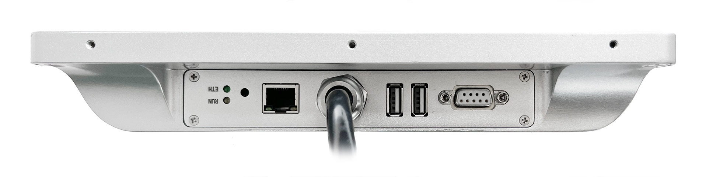

| ポート | 機能名 |
|:--:| --- |
| LANポート | 外部機器とTCP通信を行うことができます。 |
| シリアルポート | 外部機器とシリアル通信（RS232）を行うことができます。 |
| USBポート | 外部記憶装置（USBメモリ等）を接続し、ファイルの入出力を行うことができます。 |

※通信インターフェイスに関する設定は[6.9.2 外部通信](#692-外部通信)をご参照ください。

**シリアルポート RXD/TXD**
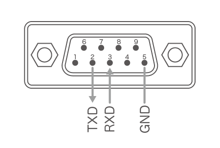

# 3. クイックスタート

## 3.1 ログイン

「未ログイン」ボタンをタップするとログインダイアログが表示されます。ユーザー名に管理者が選ばれていることを確認し、パスワード「111111」を入力してログインしてください。 

注意: 未ログインの状態では、各設定の変更ができません。

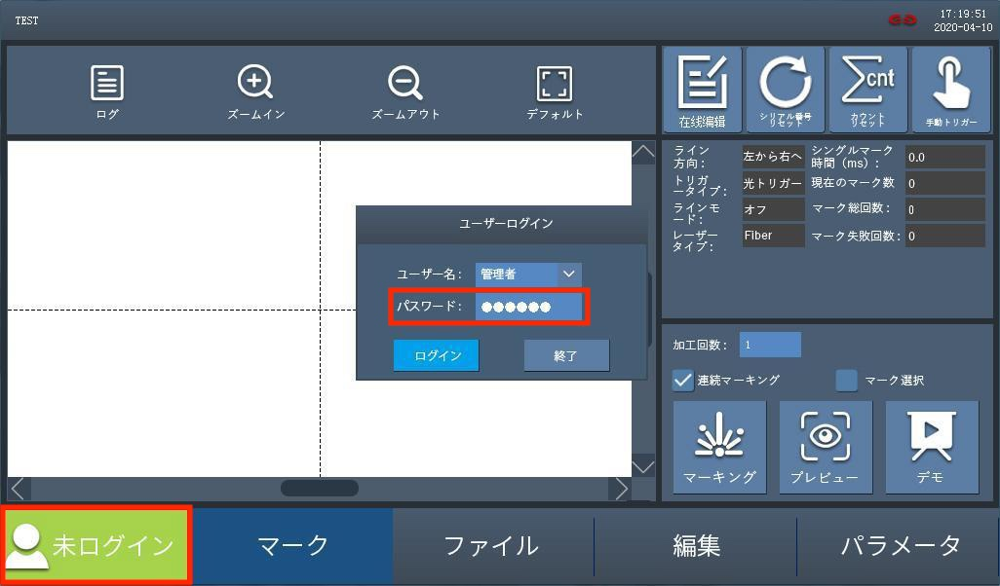

## 3.2 新規ドキュメントの作成

「ファイル」タブを開き、「新規」をタップします。ファイル名をタップしファイル名を入力します。「確定」をタップするとファイルが新規作成されます。

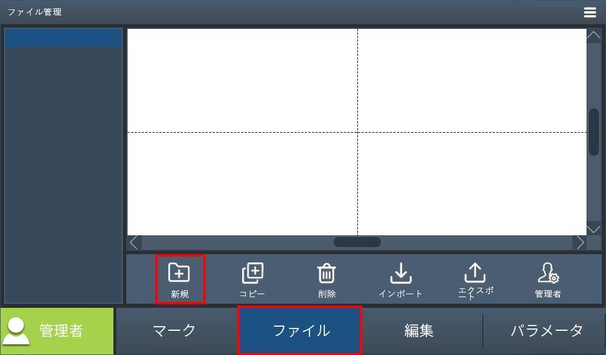

## 3.3 各種設定

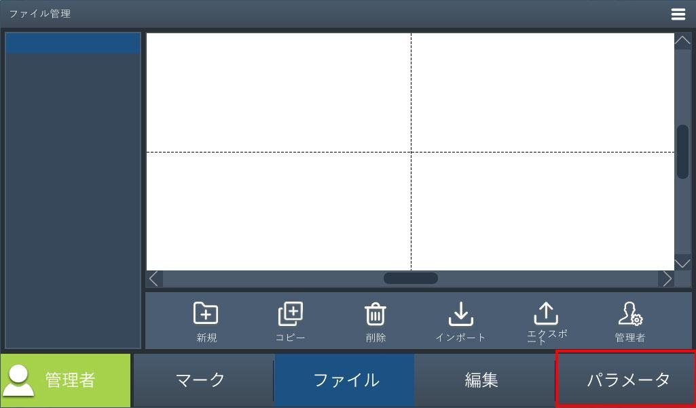

「パラメータ」をタップし各種設定を行います。

<!-- #### ペンパラメータ -->

ペンパラメータ

加工時のパラメータを確認します。ここではデフォルトのまま使用します。

<!-- #### マーキング方法設定 -->

マーキング方法設定

トリガー方式を設定します。ここでは内部トリガーが選択されていることを確認します。

<!-- #### ライン設定 -->
<!--

ライン設定

実際の状況に応じてラインの方向を変更します。また、ラインに組み込む場合、エンコーダを使用するか、ライン速度を指定するかを選択できます。素材を動かさずに固定したまま加工を行う場合は、静的マークを選択します。ここでは静的マークを選択してください。
-->

<!-- #### 加工エリア -->

加工エリア

加工エリアの確認を行います。加工エリアをタップし、ガルバノスキャナ設定の駆動エリアと加工エリアを確認します（駆動エリアは加工エリアに20mmプラスした値に設定してください）。

<!-- #### レーザー設定 -->

レーザー設定

レーザーの種類を確認します。LM110Cはファイバー、LM140RはCO2、LM110UはUVが選択されているか確認してください。

## 3.4 データ作成

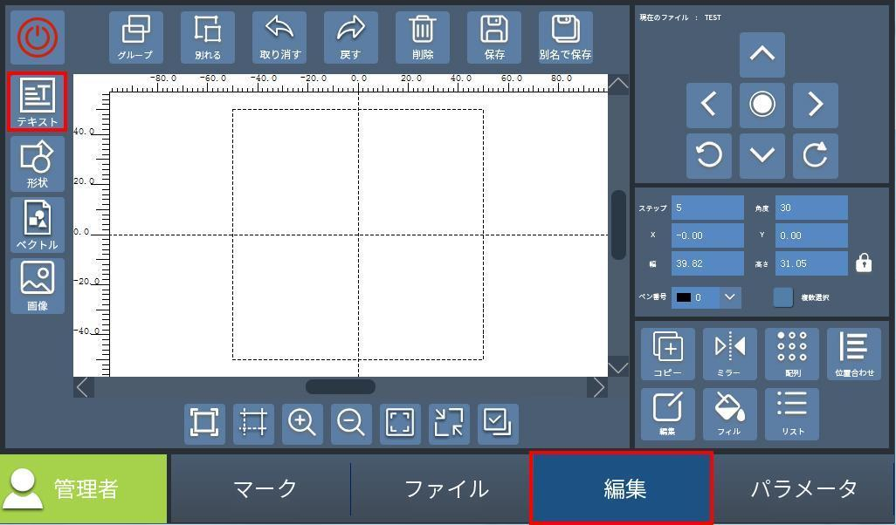

ここでは固定テキストデータを作成します。「編集」タブをタップし、「テキスト」ボタンをタップします。
テキスト作成ダイアログが表示されるので、「追加」ボタンをタップし「テキスト」を選択します。
テキスト内容を入力し、確定ボタンを押します。

## 3.5 マーキング

必ず保護メガネを着用して作業してください。 
加工中に危険を感じた場合は直ちに緊急停止ボタンを押し、再開時はボタンを右に回して解除してください。

<!-- ### 素材の設置・高さ調整 -->

素材の設置・高さ調整

加工に使用する素材を準備し、素材をレンズの下に配置します。 

次に **高さ調整（焦点合わせ）** を行います。本製品の場合、二つのレーザーポインターの光が重なり合う高さに調整します。
1. レーザーポインターのボタンを押し、ポインターをオンにします。ボタンはレンズの手前側、中央部分にあります。※レンズを下から覗き込まないように注意してください。
1. レーザーポインターの光が2箇所から照射され、本体上部のハンドルを回すことで光が近づいたり離れたりします。2つの光が重なるように高さを調整します。
1. 高さ調整が完了したら、再度レーザーヘッドのボタンを押し、レーザーポインターをオフにしてください。

レーザー光はレンズで集光して素材に照射されます。適正な焦点位置から外れると、刻印が薄い・幅が広いなどの不具合が生じます。レンズの焦点距離に合わせてレンズと素材の距離を一定に保ち、素材の高さが変わるごとに高さ調整を行ってください。 
素材の表面が平らでない場合は、加工箇所でレーザーポインターが重なり合うように調整してください。

<!-- ### 位置合わせ・加工 -->

位置合わせ・加工

1. 高さ調整が完了していることを確認します。
1. タッチパネルをマーク画面に切り替え、マーキング後の刻印結果を確認します。
1. プレビューボタンをタップすると、レーザーが照射される部分をガイド光が示します。刻印したい位置とガイド光がずれている場合は、素材の設置位置や加工データの位置を調整してください。
1. 「マーキング」「手動トリガー」の順にタップすると加工が開始されます。素材表面にレーザー光が照射されることを確認してください。

加工後、加工箇所を確認しても刻印が十分にできていない場合は、加工パラメータの調整が必要です。 
ペンパラメータ の項目で、マーキング速度を下げる・パワーを上げるなどの調整を行い、もう一度加工テストを行ってください。 

<!-- ## エンコーダとライン

ラインに組み込んで製品を使用する場合は、環境にあった設定を行う必要があります。
詳しくは[6.3 ライン設定](#63-ライン設定)の章をご確認ください。
-->

# 4. ソフトウェア概要

## 4.1 画面構成

<!-- ### マーク -->

マーク

この画面は、設定・編集したデータを刻印するための画面です。
マーク画面は主にプレビューエリア、ステータスエリア、マーキングエリアに分かれています。
このタブについての説明は[7. 加工操作](#7-加工操作)の章をご確認ください。

<!-- ### ファイル -->

ファイル

ファイル管理画面では、ユーザーのファイルを管理することができます。

| メニュー | 説明 |
|:---:|-----|
| 新規 | ファイルを新規作成します。「新規」ボタンをタップしてファァイルの保存先やファイル名を設定し、確定ボタンをタップするとファイルリストにファイルが追加されます。編集したいファイルを選択後に「編集」タブをタップすることで編集画面に切り替わります。 |
| コピー | 選択中のファイルを複製します。ファイル一覧からコピーしたいファイルを選択後、「複製」ボタンをタップします。 |
| 削除 | ファイルリストから削除したいファイルを選択後、「削除」ボタンをタップします。 |
| Import | 外部記憶装置などからファイルをインポートすることができます。インポートしたいファイルを選択後、確定ボタンをタップします。 |
| Export | 作成したファイルを外部記憶装置などにエクスポートすることができます。ファイルリストからファイルを選択後、「Export」ボタンをタップします。 |
| 管理 | ファイルブラウザを表示します。フォルダの作成や名称変更、ファイル移動などの操作が行えます。 |

<!-- ### 編集 -->

編集

編集画面では、様々な図形要素やテキストを作成・編集することができます。
詳細は[5. 編集](#5-編集)を参照してください。

<!-- ### パラメータ -->

パラメータ

この画面は、加工パラメータの他、IOや外部通信などの設定を行うことができます。
このタブについての説明は[6. パラメータ](#6-パラメータ)の章をご確認ください。

# 5. 編集

編集画面では、様々な図形要素やテキストを作成・編集することができます。

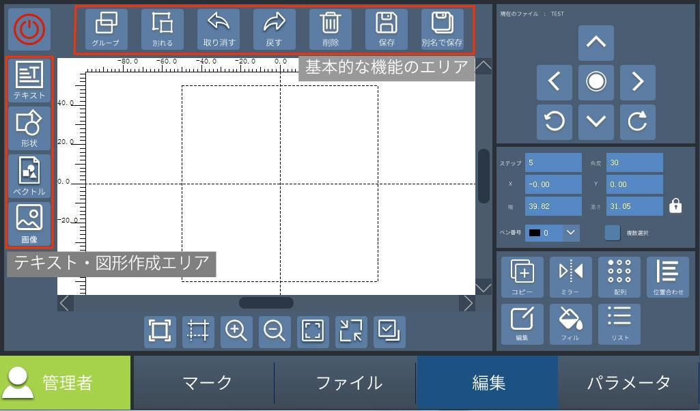

## 5.1 基本的な機能

| メニュー | 説明 |
|:---:|-----|
| グループ | 選択中の複数のセルをグループ化します。 |
| 解除    | 選択中の複数のセルのグループを解除します。 |
| 元に戻す | 編集状態を1つ前の状態に戻します。 |
| やり直す | 編集状態を1つ後の状態に進めます。 |
| 削除    | 選択しているアイテムを削除します。 |
| 保存    | ファイルメニューからファイルを作成していない場合、このボタンから保存が可能です。 |
| 別名保存 | 現在開いているファイルを別名で保存します。 |
| 新規作成 | 新規ファイルを作成します。 |

ビュー操作

<table class="icontable">
<tr>
<td></td>
<td>プレビューエリアを最大化して表示します。</td>
</tr>
<tr>
<td></td>
<td>プレビューエリアの境界線と中心線、目盛りを表示を切り替えます。</td>
</tr>
<tr>
<td></td>
<td>プレビューエリアを拡大します。</td>
</tr>
<tr>
<td></td>
<td>プレビューエリアを縮小します。</td>
</tr>
<tr>
<td></td>
<td>プレビューエリアの表示サイズを標準サイズに戻します。</td>
</tr>
<tr>
<td></td>
<td>現在選択中の要素を最大化して表示します。</td>
</tr>
<tr>
<td></td>
<td>プレビューエリア内のすべての要素を選択します。</td>
</tr>
</table>

## 5.2 オブジェクトの作成

加工オブジェクトは下記の種類があります。

| 種類 | 説明 |
|:---:|-----|
| テキスト | 文字列を刻印します。複数の文字列を組み合わせることも可能です（固定文字＋時刻など） |
| QRコード | 文字列データから二次元コードを作成します。複数の文字列を組み合わせることも可能です。 |
| バーコード | 文字列データからバーコードを作成します。複数の文字列を組み合わせることも可能です。 |
| 図形 | 直線や円などのプリセット図形を刻印します。 |
| ベクター | ベクタデータ（dxf, plt, ai）データを刻印します。USBメモリ等でインポートできます。 |
| 画像 | ビットマップデータ（bmp, jpg, png）を刻印します。USBメモリ等でインポートできます。 |

### 5.2.1 テキスト

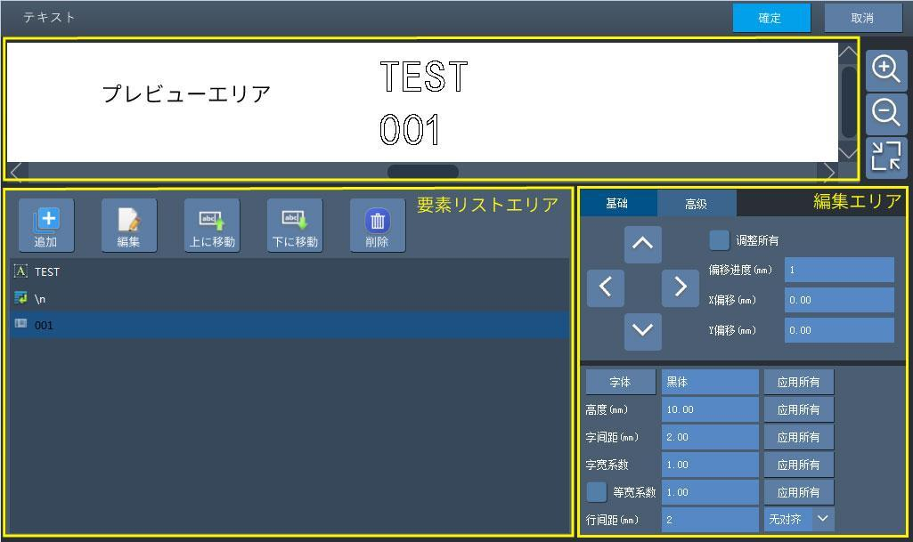

| パネル | 説明 |
|:---:|-----|
| プレビューエリア | 現在のテキストのすべての内容が表示されます。 |
| 要素リストエリア    | 作成しているテキスト要素の一覧が表示されます。 `追加`ボタン: テキストを追加します `編集`ボタン: 選択されているテキストを編集します。 `アップ/ダウン`ボタン: 選択されているテキストの順番を変更します。 `削除`ボタン: 選択されているテキストを削除します。 |
| 編集エリア | オフセットの設定、フォントなどの設定を行います。 |

#### テキストデータの種類

固定テキスト

加工時に変化させる必要のない固定文字列を作成します。

シリアル番号

加工を行う度に数値が増加するテキストを作成できます。

| 項目 | 説明 |
|:---:|-----|
| 開始番号 | マーキングを行うシリアル番号の最初の番号を入力します。 |
| 現在の番号 | 現在、マーキングが行われている番号です。 |
| 終了番号 | シリアル番号の最後の番号を入力します。終了番号に達した場合は加工を終了します。 |
| 増分 | シリアル番号の増加量。入力した数値分をカウントアップしていきます。 |
| 繰り返し回数 | 繰り返し回数に入力した数値回数に達するまで、同じ番号を繰り返しマーキングします。 |
| 刻印回数 | 繰り返し回数のうち、現在の刻印回数が表示されます。 |
| 進数 | シリアル番号の進数を選択します。 |
| シリアル番号の桁数 | シリアル番号の桁数を設定します。「先頭にゼロを表示」を有効にしシリアル番号の桁数を2と入力すると、一桁の番号でも先頭に0が表示されます。 |

日付

日付情報を自動で取得します。また、日付の表示形式を編集することも可能です。
左のプリセットエリアから形式を選びます。選択後に日付の順序や区切り記号などを変更することができます。

| 項目 | 説明 |
|:---:|-----|
| プレビューエリア | 日付の表示を確認できます。 |
| プリセットエリア | 複数の日付形式を用意しています。選択後、独自の形式に変更もできます。 |
| 編集エリア | 日付の順序や記号の追加などを編集することが可能です。 |
| 先頭を0で埋める | 有効の場合、一桁の月・日の先頭にゼロを表示します。 |
| 日付オフセット | 入力した数値分、日付を加算もしくは減算して表示します。 |
| フィールド設定 | 曜日や月名の変更を独自に行うことができます。 |

時間

時間情報を自動で取得します。また、時間の表示形式を編集することも可能です。
時間の修正を行う場合は`パラメータ > システム > 高度な設定`で設定してください。

| 項目 | 説明 |
|:---:|-----|
| プレビューエリア | 時間の表示を確認できます。 |
| プリセットエリア | 複数の時間形式を用意しています。選択後、独自の形式に変更もできます。 |
| 編集エリア | 時間の表示順序や記号の追加などを編集することが可能です。 |
| 午前 表示名・午後 表示名 | 午前・午後の表示名を設定できます。 |
| 時間オフセット・分オフセット | 入力した数値分、時間や分を加算もしくは減算して表示します。 |
| 先頭にゼロを表示 | 有効の場合、一桁の数字の先頭にゼロを表示します。 |

シフト

マーキングを行う時間によってテキスト内容を変更する機能です。

| 項目 | 説明 |
|:---:|-----|
| 開始時間 | 各マーキング内容の開始時間を設定できます。設定された時間になると、その時間に対応したマーキング内容に加工データが切り替わります。 |
| マーキング内容 | マーキング内容をタップするとテキストを入力することができます。開始時間とマーキング内容を入力した状態で追加をタップすると、シフトプレビューに表示されます。 |
| シフトプレビュー | 設定した開始時間とマーキング内容を確認できます。 |

下記のように設定した場合、10:00～10:04の間は TEXT01、10:05～10:09の間は TEXT02、10:10～翌09:59の間は TEXT03 に加工データが変更されます。 
[ 10:10 ] - TEXT01 
[ 10:05 ] - TEXT02 
[ 10:00 ] - TEXT03 

ファイル

txt や csvファイルから一行ずつテキストを取得する機能です。

| 項目 | 説明 |
|:---:|-----|
| ファイルタイプ | 読み込むファイル形式を選択します。 |
| 現在の行番号 | 加工を開始する行番号を指定します。 |
| 現在の列番号 | 加工を開始する列番号を指定します（csvのみ指定可）。 |
| 行の増加量 | 加工後に移動する行の増加量を指定します。「2」を入力すると1行飛ばしで加工データを読み込みます。 |
| 繰り返し回数 | 繰り返し回数に入力した数値回数に達するまで、同じ行番号を繰り返しマーキングします。 |
| 刻印回数 | 繰り返し回数のうち、現在の刻印回数が表示されます。 |
| データループ | 有効の場合、最終行に到達後、最初の行に戻ってマーキングを行います。 |
| ファイルパス | ファイルを選択します。 |
| データベースクリーン | ファイル読み込み時に自動生成されるキャッシュファイルを削除します。 |
| 重複コード検出 | 刻印文字列の重複を避けるため、キャッシュファイルと指定ファイルに同じ文字列がある場合にエラーを表示します。重複の判定は改行コードも含まれます。 |
| 開始番号 | テキストの左から何番目の文字を加工するか指定することができます。0の場合はすべての文字を加工します。 |
| 文字数 | テキストの左から何番目の文字までを加工するか指定することができます。0の場合はすべての文字を加工します。開始番号が0以外の場合、開始番号で指定された番号分の文字から数えます。 |

外部データ

刻印処理中にネットワーク通信やシリアル通信を用いて自動的に文字列を取得します。
詳細については[6.9.2 外部通信](#692-外部通信)の章をご確認ください。

改行

テキストを改行する際は改行要素を追加します。
要素リストに改行要素が追加されます。改行要素を選択後、改行したい位置に移動させます。
プレビューエリアで改行されていることを確認してください。

ランダムコード

規則に従ってアルファベットや数字をランダムに入力します。

| 記号 | 説明 |
|:---:|-----|
| % | 完全なランダムを表し、数字とアルファベットの大文字と小文字を含みます。 |
| # | ランダムな大文字アルファベットを表します。 |
| $ | ランダムな小文字アルファベットを表します。 |
| @ | ランダムな数字を表します。 |

<b>設定例</b> 
設定文字列: text-%%%%-##$$@@ 
生成文字列: text-Hc7Z-BJia52

<!-- 
パラメータ
 -->

#### パラメータ

基本タブ

| 項目 | 説明 |
|:---:|-----|
| オフセット   | 選択したテキストの位置を調整します。 |
| フォント     | テキストのフォントを選択します。シングルライン、標準フォント、ドットフォント、TTF |
| 高さ（mm）   | 文字本体の高さを指定します。 |
| 文字間隔(mm) | 文字と文字の間隔の距離を指定します。 |
| 文字幅比率   | 文字の幅と高さの比率を指定します。 |
| 等幅        | 有効にすると、入力した数値の比率で等間隔に文字が並びます。 |
| 行間（mm）  | 行間の距離を指定します。 |
| 配置        | 文字の配置を変更します（デフォルトは調整なし）。複数行のテキストに適用されます。 |
| すべて適用   | すべてのテキストに変更を適用します。 |

高度タブ

| 項目 | 説明 |
|:---:|-----|
| 適用 | 「高度な設定」の設定項目を適用します。 |
| 円弧 | 円弧機能の有効無効を設定します。 |
| 高さ/幅 | 円弧の高さと幅を設定します。 |
| 開始角度 | 円弧に対する文字の配置開始角度です。以下の左図が開始角度の基準です。 |
| 固定角度 | 固定角度を有効にすると、固定角度範囲に入力した角度内にテキストを収めます。 |
| 時計回り | 有効にすると文字列を時計回りに配置します。 |
| 文字反転 | 有効にするとテキストを水平方向に反転します。 |
| 交差点削除 | 入力した数値分、テキストの輪郭がクロスしている箇所が削除されます。 |

<table>
<tr>
<th>開始角度=0</th>
<th>開始角度=270</th>
</tr>
<tr>
<td style="padding:20px">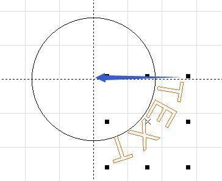</td>
<td style="padding:20px">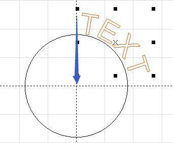</td>
</tr>
</table>

### 5.2.2 QRコード

QRコードやデータマトリックスなどの2次元コードの作成が可能です。

<!-- | パネル | 説明 |
|:---:|-----|
| プレビューエリア | 現在のテキストのすべての内容が表示されます。 |
| 要素リストエリア    | 作成しているテキスト要素の一覧が表示されます。 `追加`ボタン: テキストを追加します（各項目は[テキストデータの種類](#テキストデータの種類)をご覧ください） `GS1`ボタン: GS1で標準化している形式を選択することができます。 `編集`ボタン: 選択されているテキストを編集します。 `アップ/ダウン`ボタン: 選択されているテキストの順番を変更します。 `削除`ボタン: 選択されているテキストを削除します。 |
| 編集エリア | オフセットの設定、フォントなどの設定を行います。 | -->

#### バーコード属性

| 項目 | 説明 |
|:---:|-----|
| タイプ | 二次元コードのタイプを設定します。QRコード/DM（データマトリックス）/Aztec/Hanxin/DotCode/MicroQRcodeを選択できます。 |
| モード | 二次元コードのドットの形を設定します。通常は「標準」を選択してください。 |
| 誤り訂正レベル | QRコードの誤り訂正レベルを設定します。「L、M、Q、H」の4つの中から選択できます。 |
| バージョン | QRコードのバージョン（セル数）を設定します。QRコードの内容に応じて自動的にバージョンが選択されます。 |
| マスク | QRコードパターンの黒ブロックと白ブロックの比率を均等にします。「0-7」の8種類のマスクパターンがあります。 |
| フォーマット | DataMatrixのフォーマットを設定します。 |
| 高さ | QRコードの高さをmm単位で設定します。 |
| 中央ブロック削除 | 削除するQRコードの中間部分のサイズを設定します。 |
| 加速距離 | マーキング開始部分の刻印ムラをなくすために設定します。 |
| 反転 | 加工を反転させるかどうかを設定します。素材によってはレーザーマーキング後に薄い色になる場合があり、その際に選択します。 |
| X/Y 倍率 | 二次元コードのドットマトリックスの倍率を設定します。 |

#### テキスト属性

<!-- バーコードの内容をテキストで表示します。 -->

| 項目 | 説明 |
|:---:|-----|
| テキスト表示 | 有効の場合、テキストを表示します。 |
| フォント | フォントを選択できます。 |
| 高さ（mm） | 文字本体の高さ。 |
| 文字間隔（mm） | 文字と文字の間隔の距離。 |
| 行間（mm） | 行間の距離。 |
| xオフセット | テキストのx方向の位置を調整します。 |
| yオフセット | テキストのy方向の位置を調整します。 |
| 開始番号 | 最初の桁から表示を開始するかどうかを設定します。0の場合、すべて表示されます。 |
| 文字数 | テキストを表示する文字数。0はすべて表示します。 |
| 行の文字数 | 1行あたりに表示する文字数。 |
| 文字幅係数 | 文字の幅と高さの比率。 |
| 空白の挿入間隔 | スペースを挿入する箇所を設定します。 |
| 空間数 | 挿入するスペースの数を設定します。 |
| 等幅 | 有効にすると、入力した数値の比率で等間隔に文字が並びます。 |

### 5.2.3 バーコード

#### バーコード属性

| 項目 | 説明 |
|:---:|-----|
| タイプ | バーコードのタイプを設定します。 39/EAN13/128/93/128A/128B/128C/GS1\_128/UPCA/PDF417/ITF14/CodaBar2 を選択できます。 |
| 高さ（mm） | バーコードの高さを設定します。 |
| モジュール幅 | バーコードのモジュール幅を設定します。 |
| トップスペース | 反転が有効の場合におけるバーコード上部の距離を設定します。 |
| ボトムスペース | 反転が有効の場合におけるバーコード下部の距離を設定します。 |
| 右スペース | 反転が有効の場合におけるバーコード右の距離を設定します。 |
| 左スペース | 反転が有効の場合におけるバーコード左の距離を設定します。 |
| 反転 | バーコードの周囲に枠を設け、マーキング箇所を反転します。 |

#### テキスト属性

バーコードの内容をテキストで表示します。

| 項目 | 説明 |
|:---:|-----|
| テキスト表示 | 有効の場合、テキストを表示します。 |
| フォント | フォントを選択できます。 |
| 高さ（mm） | 文字本体の高さ。 |
| 文字間隔（mm） | 文字と文字の間隔の距離。 |
| xオフセット | テキストのx方向の位置を調整します。 |
| yオフセット | テキストのy方向の位置を調整します。 |
| 文字幅比率 | 文字の幅と高さの比率。 |
| 挿入空間間隔 | スペースを挿入する箇所を設定します。 |
| 空間数 | 挿入するスペースの数を設定します。 |
| 等幅 | 有効にすると、入力した数値の比率で等間隔に文字が並びます。 |

### 5.2.4 図形

直線、円形、円形、点、多角形、三角形、破線などを作成するために使用します。

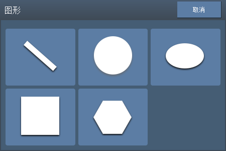

### 5.2.5 ベクター

ベクターデータの読み込みをします。DXF / PLT / AI（ver.8） の 3 つの形式をサポートしています。 
DXFファイルを読み込む場合は、フォントの種類を選択する必要があります。

### 5.2.6 画像

ビットマップファイルを読み込みます。BMP / JPG / PNG の 3 つの形式をサポートしています。 
ビットマップファイルをインポートすると、ソフトウェアが自動的にファイルを256レベルのグレースケールに修正します。

| 項目 | 説明 |
|:---:|-----|
| 反転 |  画像の濃い箇所と薄い箇所を反転します。レーザーを照射したときに白くなる素材（黒石/透明アクリルなど）を加工する場合に使用します。 |
| コントラスト |  画像のコントラストを調整できます。 |
| 輝度 |  画像の輝度を調整できます。 |
| 固定DPI |  DPI（1インチあたりの点の密度）を設定できます。数値が高い程画像の濃淡を表現するための点が密集し、加工結果も精細になりますが、その分加工時間が長くなります。まずは600程度での加工を推奨します。 |

## 5.3 オブジェクトの編集

<td>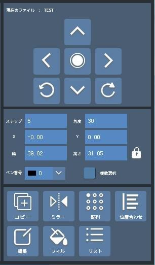</td>

このエリアでは図形の位置や大きさ、割り当てパラメータを編集できます。

| 項目 | 説明 |
|:---:|-----|
| コピー | 選択中のオブジェクトをコピーします。配置したい位置をタップすることで、タップした場所にオブジェクトが複製されます。 |
| 反転 | 選択中のオブジェクトを水平反転・垂直反転することができます。 |
| 配列 | 選択している要素を複製し配列にすることができます。 |
| 整列 | 複数のオブジェクトを整列することができます。 |
| 編集 | 選択しているオブジェクトの編集を行うことができます（テキスト・1次元・2次元）。 |
| 塗りつぶし | オブジェクトの塗りつぶし設定を行うことができです。 |
| リスト | ファイル内のオブジェクトをリストで表示し、並べ替えや選択・削除操作を行うことができます。リストの上から順番にマーキングされます。 |
<!-- | 機能 | オブジェクトにシアーをかけることができます。  | -->

配列設定

内部配列: 配列後、元の要素を変更するとすべての要素が変更されます。

* 有効: 内部配列を有効にします。
* 数量: 配列の行数と列数をを設定します。
* 増分: 複製する要素と要素のオフセットを設定します。
* 方向: 配列する方向（順番）を設定します。
* 要素の非表示: 元の要素を非表示にします。
* 行番号・列番号・Xオフセット・Yオフセット: 選択した特定の配列要素の位置を移動させることができます。

外部配列: 配列を設定して適用するとオブジェクトがコピーされます。
* 数量: 配列の行数と列数をを設定します。
* 増分: 複製する要素と要素の距離。
* 方向: 配列する方向（順番）を設定します。
* 適用: 配列を確定し、オブジェクトを複製します。

塗りつぶし

オブジェクトの塗りつぶしを行うことが可能です。画像（ビットマップファイル）は設定することができません。また、閉じられていないパス要素の場合、塗りつぶすことができません。

| 項目 | 説明 |
|:---:|-----|
| 第1層・第2層・第3層 | フィルの設定を3層に分けて設定できます。 |
| フィル有効 | 選択している層のフィルを有効にします。 |
| フィルタイプ | タップするたびに塗りつぶしの方法を変更できます。一方向や双方向、外側から内側への塗りつぶしが選択できます。 |
| 行間（mm） | 線を引き重ねてマーキングすることで塗りつぶしを表現します。この線の間隔を設定します。まず0.05mmを設定し、加工結果に応じて調整してください。間隔が小さいと高密度で塗りつぶされますが、加工時間が長くなります。 |
| フィル角度 | フィルの角度（塗りつぶしの線の角度）を設定します。 |
| 全体の計算 | パスごとにハッチング処理を行うか、すべてのパスをまとめてハッチング処理を行うかを選択します。有効の場合は、すべてのパスをまとめて一度に加工します。加工時間が短くなる場合がありますが、ソフトウェアの処理速度が低下する可能性があります。 |
| 輪郭を有効にする | 有効の場合、要素のアウトライン（輪郭線）をマーキングします。 |
| 輪郭を最初に刻印 | 有効の場合、要素のアウトライン（輪郭線）を最初にマーキングします。 |

**フィルタイプ**

<table class="icontable">
<tr>
<td></td>
<td>両方向: 双方向塗りつぶしに似ていますが、走査線の左右の端が途切れずそのまま加工を行います。</td>
</tr>
<tr>
<td>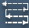</td>
<td>弓形: 走査線が要素の空白部分をスキップして移動します。</td>
</tr>
<tr>
<td></td>
<td>一方向: 走査線は常に左から右に移動します。</td>
</tr>
<tr>
<td></td>
<td>双方向: 走査線は左から右、右から左に移動します。</td>
</tr>
</table>

<table>
<tr>
<th>両方向</th>
<th>弓形</th>
<th>一方向</th>
<th>双方向</th>
</tr>
<tr>
<td style="padding:20px">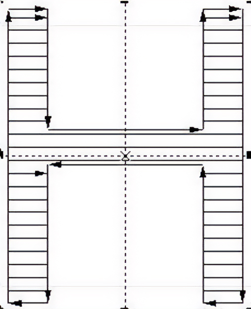</td>
<td style="padding:20px">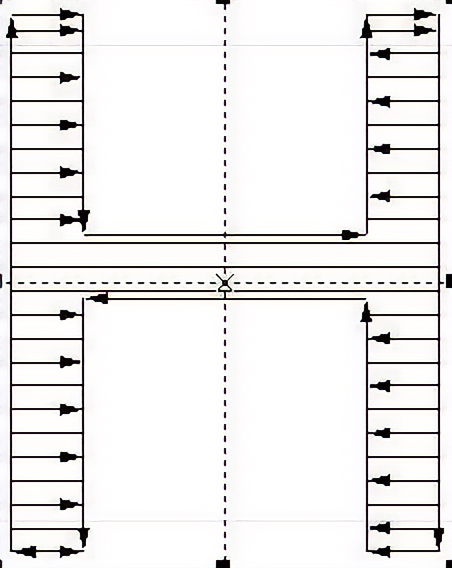</td>
<td style="padding:20px">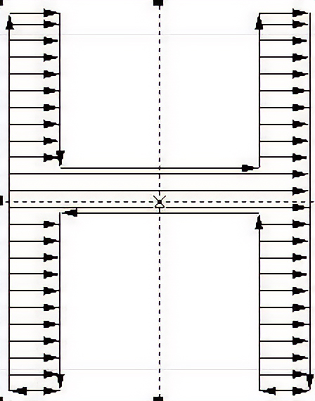</td>
<td style="padding:20px">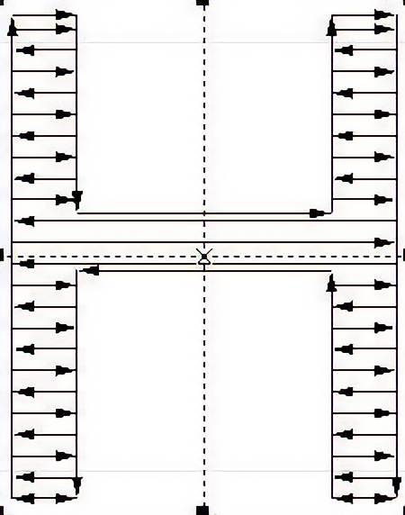</td>
</tr>
</table>

**高度な設定**

| 項目 | 説明 |
|:---:|-----|
| 開始オフセット（mm） | ハッチングの一行目と輪郭線の間隔を調整します。 |
| 終了オフセット（mm） | ハッチングの最終行と輪郭線の間隔を調整します。 |
| マージン | ハッチングと輪郭線との間隔を設けることができます。 |
| 平均フィル線 | 行間で設定した間隔で走査線が設定されますが、オブジェクトの高さと行間の数値によっては偏りが生じる場合があり、ハッチングの一行目と輪郭線の間隔が設定した行間よりも短くなる場合があります。平均フィル線を有効にした場合、すべての走査線が設定したフィル間隔に限りなく近くなるように走査線を均等に配置します。 |

**フィル角度の例（45°）**
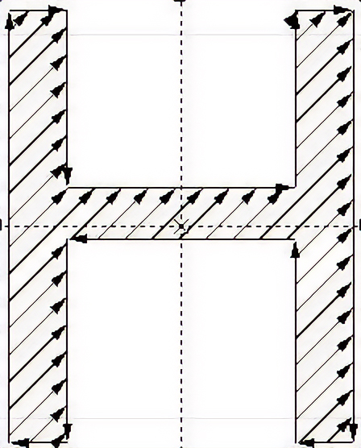

**マージンの例**
<table>
<tr>
<td style="padding:10px">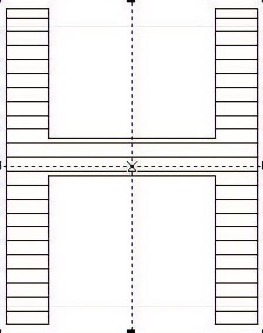</td>
<td style="padding:10px">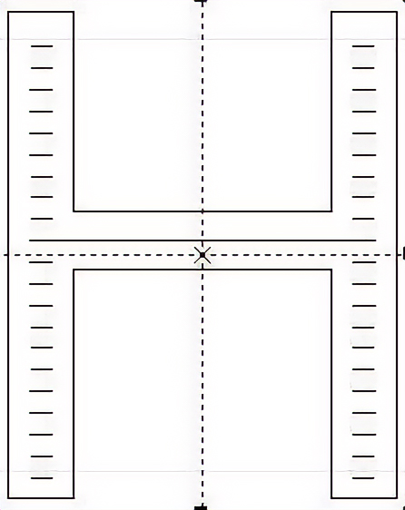</td>
</tr>
</table>

# 6. パラメータ

## 6.1 ペンパラメータ

### 6.1.1 基本パラメータ

| 項目 | 説明 |
|:---:|-----|
| ペン番号 | 0～15のペン番号を選択できます。それぞれのペン番号に異なる基本パラメータを設定できます。 |
| マーキング速度（mm/s） | 加工中のスピードです。スピードを遅くすると、素材に与えるレーザーのエネルギーが大きくなります（濃いマーキングになる）。単位は mm/sec、最高スピードは 4000mm/sec となります。 |
| ジャンプ速度（mm/s） | 照射終了後、次の照射の開始地点まで移動するスピードを設定できます。 |
| パワー（%） | レーザー照射の強度を設定します。パワーが大きいほど素材に与えるレーザーのエネルギーが大きくなります。単位は %、最高パワーは 100% となります。 |
| 周波数（kHz） | 1 秒間に繰り返す波の数を指します。単位は KHz、Q スイッチ（標準）は 30KHz ～ 60KHz、MOPA 型は 1KHz ～4000KHz の範囲内で設定できます。まず、Q スイッチ（標準）は 30KHz、MOPA 型は 25KHz で加工を試してください。周波数を上げると、Q スイッチ（標準）の場合は刻印が薄くなる傾向にあり、MOPA 型の場合は ( パルス幅との組み合わせにもよりますが ) 刻印が濃くなる傾向にあります。 |
| MOPAパルス値 | 周波数に対し、こちらは波の高さを指します。MOPA 型のみ設定可能です。単位は ns、2ns ～ 500ns の範囲内で設定できます。 最初は 250ns にしていただくことをお勧めします。加工が出来なかったら値をより上げていただいたり、スピー ドを遅くしたり、パワーを強めるなどの調整を行ってください。 パルス幅の値は小さい方が加工箇所周辺への熱の影響を防ぐことが出来るため、シャープな加工が可能です。少しずつ値を下げていただき、お好みの加工結果になるよう調整してください。 |
| ジャンプ遅延（us） | ジャンプスピードを高く設定すると、塗りつぶし線の最初に歪みが発生する可能性があるため、ジャンプ遅延を調整することにより歪みを軽減させます。 |
| ポイント時間（us） | ドットオブジェクトがある際のマーキング時間を設定します。 |
| 照射開始遅延 | 高スピードの値を設定した際、加工の開始部分が照射されない場合があります。その際はこちらの値を低く設定することにより、開始部分の刻印がきちんと行われるようになります。マイナスの値も設定できます。 |
| 照射終了遅延 | 高スピードの値を設定した際、加工の終了部分が照射されない場合があります。その際はこちら の値を高く設定することにより、終了部分の刻印がきちんと行われるようになります。 |
| 終了遅延（us） | 加工終了時、照射が終わる前にレーザーの移動が始まってしまい、塗りつぶし線の最後に歪みが発生する場合があります。その際はこちらの値を高く設定することにより、歪みが発生せずに加工することができます。 |
| コーナー遅延 | 図形の角部分の刻印スピードの調整を行います。図形の角が丸く加工されている場合は、こちら の値を高く設定してください。 |

### 6.1.2 高度なパラメータ

| 項目 | 説明 |
|:---:|-----|
| 有効遅延（us） | コマンドを実行するときにガルバノミラーとレーザーの間に時間差がある。通常、ガルバノミラーは約100usレーザーよりも遅いため、補正するためにこのパラメータを使用します。 |
| 初回ジャンプ遅延時間（us） | マーキング時の初回ジャンプで、元々のジャンプ遅延時間のベースに一定の時間が追加されます。 |

デバッグ説明: 最適な遅延時間を設定するための加工方法の説明を表示します。 
デフォルト値使用: すべてのパラメータにデフォルト値を割り当てます。 
デフォルト値管理: 各パラメータのデフォルト値を設定できます。 

**加工結果への影響**

| 項目 | 大きすぎる場合 | 小さすぎる場合 | 負の値にできるか |
| :---: | ----- | ----- | :---: |
| マーキング速度 | マーキングのストロークが荒く、加工が浅い。 | ストロークが密で、加工が深い。 | 不可 |
| 照射開始遅延 | 始点部の描画が不足する現象につながる。 | マーキングの始点部に太り・焼けが発生する。 | 可能（負の値の場合、レーザーが早く消える） |
| 照射終了遅延 | マーキングの終了点に太り・焼けが発生する。 | マーキング終了時に閉じない、塗りつぶしが足りない | 不可 |
| ジャンプ速度 | 空ストロークの処理時間が短く、総マーキング時間は短くなるが、ストロークがつながってしまい、ガルバノの動きが不安定になる。 | 空ストロークの処理時間が長く、総マーキング時間が長くなる。 | 不可 |
| ジャンプ遅延 | ガルバノが完全に回転し、次のストロークを処理する前に一定時間滞在し、マーキング時間が長くなる。 | ガルバノメーターが完全に回転する前にPCが次のストロークの処理を開始するため、ストロークの開始時に飛散が発生し、開始ストロークが不安定になる。 | 不可 |
| コーナー遅延 | マーキング時間が長くなり、コーナーでフォーカシング現象が発生する。 | 直角を刻印すると角が丸くなる現象が発生する。 | 不可 |

## 6.2 マーキング方法

マーキングを行う際のトリガー設定を行います。
使用するトリガーに応じて、トリガータイプの選択などを設定します。
開始位置は、指定した位置または自動設定することができます。

### 6.2.1 トリガーモード

トリガーモード

| 項目 | 説明 |
|:---:|-----|
| 光トリガー | GDインターフェースへの信号（またはマーク画面の手動トリガー）でマーキングを開始します。 |
| ペダル式トリガー | JTインターフェースへの信号（またはマーク画面の手動トリガー）でマーキングを開始します。 |
| 内部トリガー | マーキングボタンをタップした瞬間にマーキングを開始します。連続マークにチェックが入っているとマーキングし続けます。 |
| ライズエッジトリガー | 有効の場合センサーがオフになった瞬間にマーキングを開始し、無効の場合センサーがオンになった瞬間にマーキングを開始します。 |

### 6.2.2 トリガー最適化

トリガー遅延

<!--
| 項目 | 説明 |
|:---:|-----|
| 距離（mm）| エンコーダ接続時に使用します。トリガー受付後、設定した距離を移動したらマーキングを開始します。 |
| 時間（ms）| トリガー受付後、設定した時間経過後にマーキングを開始します。 |
-->

| 項目 | 説明 |
|:---:|-----|
| 距離（mm）| この項目は使用しません。 |
| 時間（ms）| トリガー受付後、設定した時間経過後にマーキングを開始します。 |

<!--

最小間隔

マーキング終了後、すぐにトリガーが発生した場合でも、設定した距離もしくは時間経過後にならないとマーキングされないようにします。一つの製品にセンサーに反応する箇所が複数ある場合などに使用します。
-->

最小間隔

| 項目 | 説明 |
|:---:|-----|
| 距離（mm）| この項目は使用しません。 |
| 時間（ms）| マーキング終了後、すぐにトリガーが入力された場合でも、設定した時間経過後にならないとマーキングされないようにします。 |

### 6.2.3 ラインモード

この項目は使用しません。

<!--
素材を移動させながらマーキングを行うモードです。

| 項目 | 説明 |
|:---:|-----|
| ライン有効 | ラインモードを有効にします。 |
| トリガー間隔（mm） | マーキングの開始位置から次のマーキングの開始位置までの距離。 |
| マーキング回数 | 有効の場合、トリガー1回につき、指定された回数をマーキングする。チェックが無効の場合、マーキングが自動で継続されます。 |

マーキング開始後、一定の距離で印字を続ける場合の設定例 
<b>トリガー方式: 内部トリガー / トリガー間隔: 固定距離 / マークの数: チェックなし</b>

1回トリガーしてN回マークする場合の設定例 
<b>トリガー方式: 光電トリガー / トリガー間隔: 固定距離 / マークの数: N回</b>

-->

### 6.2.4 パスの最適化

この項目は使用しません。

<!--
| 項目 | 説明 |
|:---:|-----|
| オートソート | 有効の場合、ベルトの流れに沿った加工順序になります。チェック無効でデータの作成順序と同じ順序で加工します。 |
| ベルトの流れに沿ってマーク | 有効の場合、データに関係なくベルトの流れに沿って加工されます。データが2つ並んでいた場合、2つのデータを同時に加工します。 |
| スタート位置 | `指定`: マーキングの位置を指定します（座標を入力してください）。 `自動`: 材料が移動する方向によって自動で設定します。 `元`: データの配置位置（編集で設定した位置）。|
-->

### 6.2.5 その他

| 項目 | 説明 |
|:---:|-----|
| キャッシュ | データの一時保存機能です。この値を10に設定すると、ホストから送信されたデータが10件保存され、ホストから送信されたデータの順序に従って順番に加工します。 |

## 6.3 ライン設定

この項目は使用しません。

<!-- ラインに組み込んで使用する場合は、使用する環境に応じてエンコーダーか固定ライン速度にチェックを入れます。
固定ライン速度には使用環境にあったライン速度を入力してください。
エンコーダーを使用する場合は、エンコーダーの直径とパルスを入力することでパルス間距離が自動計算されます。 -->

<!-- ### ライン方向

ラインが流れる方向を設定します。 -->

<!-- ### エンコーダ

エンコーダーを使用する場合はチェックを入れてください。

* パルス間距離: エンコーダーのパルスの移動距離。エンコーダーパラメータを入力すると自動計算されます。
* エンコーダー反転: エンコーダーABの両相の入力信号を交換します。

エンコーダパラメータ

* 直径（mm）: エンコーダーの直径を入力します。
* パルス: エンコーダの1回転あたりのパルス数を入力します。
* 計算: 直径と1回転あたりのパルス数に基づいて、ラインのパルス間距離を計算します。
* スピードテスト: 現在のライン速度を表示します。 -->

<!-- ### 固定ライン速度

ラインが流れる速度（m/min）を設定します。 -->

<!-- ### 静的マーク

ラインを使用せず、素材を固定して加工する場合に選択します。 -->

## 6.4 IO設定

### 6.4.1 共通出力

<!--
| 項目 | 説明 |
|:---:|-----|
| 動作状態 | 対応する出力ポートがマーキング時にハイレベルを出力するか、ローレベルを出力するかを設定します。 |
| シングルマーク | シングルマーキングが完了するたびに、対応する出力ポートから出力される電圧の種類と時間を設定します。 |
-->

| 項目 | 説明 |
|:---:|-----|
| 動作状態 | マーキング動作時の信号出力の論理レベル（High/Low）を指定します。 |
| シングルマーク | 単加工完了時の信号出力について、ポートの 論理レベル（High/Low）と出力時間（パルス幅） を設定します。 |

### 6.4.2 アラーム出力

| 項目 | 説明 |
|:---:|-----|
| 出力モード | アラーム発生時の信号出力の割り当てポートや信号出力の論理レベル（High/Low）、出力時間（パルス幅） を設定します。 |
| 出力設定 | 信号出力対象のアラームを選択します。 ・刻印漏れアラーム: 刻印失敗時に通知します。 ・レーザーアラーム: レーザー発信機のエラーを通知します。 ・範囲外のマーキング: 刻印データの範囲が加工エリアよりも大きい場合に通知します。  |

### 6.4.3 インターロック

インターロック機能を使用する場合は「セーフティゲート」に入力ポートを割り当ててください。

### 6.4.4 テスト照射

レーザーのテスト照射機能を使用する場合は「強力な光出力」に入力ポートを割り当ててください。 
信号が入力されるとレーザーが強制的に照射されるので十分に注意してください。

## 6.5 加工エリア

### 6.5.1 ガルバノスキャナ設定

| 項目 | 説明 |
|:---:|-----|
| 駆動エリア（mm） | ガルバノスキャナの駆動範囲を設定します。下記の表の値を設定します。 |
| 加工エリア（mm） | 加工範囲を設定します。下記の表の値を設定します。 |
| XY交換 | 有効の場合、X/Y方向を反転します。 |
| X反転 / Y反転 | それぞれの方向を反転します。 |

| レンズ種別 | 駆動エリア | 加工エリア |
|:-----:|:-----:|:-----:|
| 110mm レンズ | 120 | 115 |
| 200mm レンズ | 210 | 205 |
| 300mm レンズ | 310 | 305 |

### 6.5.2 ガルバノスキャナ補正

| 項目 | 説明 |
|:---:|-----|
| 樽型 | 湾曲を補正します。既定値は 1.0（パラメータ範囲0.5～1.5）です。 |
| 傾斜 | 平行四辺形のような傾斜を補正します。定数は1.0（パラメータ範囲0.5〜1.5）です。 |
| 台形 | 垂直方向の遠近を補正します。既定値は 1.0（パラメータ範囲0.5～1.5）です。 |
| オフセット（mm） | 加工位置のズレを補正します。 |
| 比率補正（%） | データと加工結果のサイズのズレを補正します。`>>`ボタンをタップし、データサイズと加工サイズを入力することで比率補正の自動入力ができます。 |

### 6.5.3 ポインタ補正

| 項目 | 説明 |
|:---:|-----|
| アウトライン表示 | 有効にすると要素の輪郭を、レーザーポインターで表示することができます。 |
| ポインタ速度 | レーザーポインターの移動速度。速度が遅いほど、レーザーポインターの経路がより明確になり、速度が速いほど、要素の輪郭が明確になります。 |
| 照射遅延（us） | レーザーポインターが照射されるまでの遅延時間 |
| オフセット | レーザーポインターの照射位置が、設定した距離分移動します。レーザーポインターと実際の加工結果に差異がある場合に補正する機能です。 |
| 比率補正 | レーザーポインターのフレームの比率を補正します。レーザーポインターと実際の加工結果に差異がある場合に補正する機能です。 |
| パイプライン矢印 | プレビュー表示時に設定されているライン方向を、レーザーポインターが表示します。 |

### 6.5.4 デバッグ

| 項目 | 説明 |
|:---:|-----|
| 補正テスト | 設定されたパラメータに従って矩形を描画し、補正効果が要求を満たしているかどうかをテストします。 |
| ポインタテスト | 赤色補正パラメータに従って、ガイド光が正しく変化するかどうかをテストします。 |
| レーザーテスト | レーザーが正常に照射されるかどうかを確認します。 レーザーが照射されるため、必ず安全メガネを着用して操作してください。 |
| インポート・エクスポート | ガルバノスキャナ補正で設定した値を保存できます。また、保存されたデータを読み込むことも可能です。 |

## 6.6 レーザー設定

レーザーの種類を選択します。LM110Cはファイバー、LM140RはCO2、LM110UはUVが選択されているか確認してください。

## 6.7 ユーザー権限

### 6.7.1 ユーザー設定

ユーザの追加、削除、変更などの管理を行うことができます。

### 6.7.2 権限設定

ユーザーごとに権限レベルを設定することができます。

## 6.8 言語とフォント

| 項目 | 説明 |
|:---:|-----|
| 言語 | ソフトウェアの言語を設定します。 |
| フォントサイズ | フォントサイズを変更することが可能です。 |
| フォント | ソフトウェア内のフォントを管理します。フォントの追加や削除を行うことが可能です。 |

## 6.9 システム

### 6.9.1 バージョン情報
ソフトウェア、ハードウェアのバージョン番号を表示します。

### 6.9.2 外部通信

外部から刻印データを読み込んだり、コマンドを使用して操作を行う場合に設定します。通信方法を設定後、「起動」ボタンを押すと外部との通信が可能になります。
詳細については[8. 外部機器との通信](#8-外部機器との通信)の章をご確認ください。

#### 通信プラグイン - 設定

この設定を行うには、通信プロセスを停止する必要があります。「停止」ボタンをタップしてください。

「通信プラグイン」プルダウンから使用する通信方法を選択します。
- シリアル通信: plugin_com 0.0*
- TCP通信: plugin_tcp 0.0*

※プラグインの数字はバージョンによって異なります

使用するプラグインを選択した状態で「設定」ボタンをタップすると通信設定を編集することができます。

plugin_com

ここではシリアルポートの通信設定を変更することができます。

| 項目 | 説明 |
|:---:|-----|
| シリアルポートを選択 | 使用するシリアルポートを選択します。tty2を使用してください。 |
| ボーレート | ボーレートを設定します。 |
| データビット | データビットを設定します。 |
| 検証 | パリティビットを設定します。 |
| ストップビット | ストップビットを設定します。 |
| フロー制御 | フロー制御の種類を設定します。 |
| エンコーディング選択 | エンコーディングを設定します。 |

plugin_tcp

ここではTCPポートの通信設定を変更することができます。

| 項目 | 説明 |
|:---:|-----|
| ネイティブサーバ | 有効の場合は加工機がサーバーになり、クライアントの接続を待ちます。無効の場合はクライアントとして外部サーバーに接続します。 |
| ネイティブサーバーポート | 内部サーバーのTCP通信用のポート番号を設定します。 |
| ネイティブサーバーIPアドレス | 設定されているIPアドレスが表示されます。 |
| ターゲットサーバーポート | 外部サーバーを使用する場合は、サーバーのポート番号を設定します。 |
| ターゲットサーバーIPアドレス | 外部サーバーを使用する場合は、サーバーのIPアドレスを設定します。 |

#### 解析プラグイン - 設定

構成

| 項目 | 説明 |
|:---:|-----|
| 開始記号 | データの開始を示す内容を設定します。デフォルトは空白です。 |
| エンドキャラクタ | データの終了を示す内容を設定します。デフォルトは英文セミコロン2つです。 |
| リターンキャラクタ | データを受信した後に返す内容を設定します。 |
| データ区切り文字 | コマンドと対応するパラメータを区切る記号です。 |
| ブロック区切り記号 | 複数のデータ同士を区切る記号です。 |
| デバイスキャラクタ | 異なるデバイスを区別するために使用します。 |

コマンド制御

チェックするとコマンドモードが有効になり、図形の位置や加工パラメータの変更、状態の取得などを行うことができます。具体的なコマンドについては[8.2 コマンド制御](#82-コマンド制御)を参照してください。

<!--
| 項目 | 説明 |
|:---:|-----|
| スケール完了1回の戻り値 | マーキング1回ごとに、完了した数量を送ります。 |
| コールアウトが完了したらコンテンツに戻ります | マーキング1回ごとに、完了した内容を送ります。 |
| ドロップ変更によるドロップ回数の戻し | 未マーキング（漏れ）の発生時に、その回数を返送ります。 |
| マーキング状態変更時に状態復帰 | タッチパネルの作業状態が変化した際に、対応する状態値を送ります。 |
| インデックス完了戻り文字 | マーキング完了後、指定された内容を送ります。 |
 -->

**スケール完了1回の戻り値**

マーキング1回ごとに総マーキング数を送ります。

送信例: MarkStatus:2;; 

**コールアウトが完了したらコンテンツに戻ります**

マーキング1回ごとに刻印した文字列情報を送ります。

送信例: MarkData:text1text2;; 
※text1text2 はテキストオブジェクト1、テキストオブジェクト2のテキスト内容を意味します。

**ドロップ変更によるドロップ回数の戻し**

マーキング漏れの発生時に、その回数を送ります。

MissCount:1;; 

**マーキング状態変更時に状態復帰**

システム状態が変化した際に、対応する状態値を送ります。ステータス番号は[コマンド一覧](コマンド一覧)の GetMarkStatus コマンドの説明を参照してください。

MarkStatus:2;; 
※2 はマーキング状態を意味します。

チャネル構成

* チャンネル構成方式1: 一度に複数のチャンネルデータを送信できます。デフォルトではチャンネル間のデータは英文セミコロンで区切ります。
* チャンネル設定方式2: 各チャンネルごとに、1つのデータのどの部分を取得するかを設定できます。開始位置と文字数を指定するだけです。 例: データ「123456789」がある場合、チャンネル1の開始位置を0、文字数を3に設定すると、チャンネル1が取得するデータは「123」となります。チャンネル2を開始位置3、文字数5に設定すると、チャンネル2が取得するデータは「45678」となります。

### 6.9.3 高度な設定

#### 高度な設定

| 項目 | 説明 |
|:---:|-----|
| ウォッチドッグ有効（ms） | 設定時間内にホスト・コンピュータから信号が受信されない場合、リセットされます。 そして対応する出力ポートに信号を出力させます。 |
| タイマー更新（s） | トリガーされなくても、設定時間に従ってマーキングオブジェクトの時間要素を自動的に更新します。 |
| 最小マーク間隔（mm） | ソフトウェアによる適切なライン速度の計算に影響するだけで、実際のマーキングには影響しません。 設定なしでも可能です。 |

#### 機能設定

| 項目 | 説明 |
|:---:|-----|
| 手動トリガー有効| マーク画面に「手動トリガー」ボタンを表示します。 |
| シリアル番号のリセット| マーク画面に「シリアル番号リセット」ボタンを表示します。 |
| 可変テキストのリアルタイム保存| 可変テキスト要素が刻印された場合、更新した文字列がすぐに保存されます。 |
| リアルタイム更新 | 連続マーキング時、時刻テキストなどの刻印内容をプレビュー画面にすぐに反映します。 |

#### デバッグ

テンプレートの全プロパティを開く: 有効の場合、すべてのパラメータがテンプレートに保存されます。

#### その他

* 工場出荷時に戻す: すべての設定を工場出荷状態に戻すことができます。
* システム時刻: ソフトウェアの時間設定が可能です。
* ネットワーク設定: IPアドレス、サブネットマスク等を指定することが可能です。
* 画面設定: スクリーンセーバーの有効化と輝度の調整ができます。

# 7. 加工操作

「マーク」画面は、現在のファイルの加工操作を行うためのインターフェイスです。
正式なマーキングを行う前に予備マーキングを行い、焦点距離や加工範囲、加工パラメータの確認を行なってください。

注意: レーザー照射時は必ず保護メガネをかけて操作してください。

この画面は主にプレビューエリア、ステータスエリア、マーキングエリアに分かれています。

## 7.1 プレビューエリア

* ログ: クリックすると、ソフトウェアの動作中の情報が表示されます。 不具合が発生した際に確認する場合があります。
* ズームイン・ズームアウト: プレビューエリアのズームイン・ズームアウトを行います。
* 全体表示: プレビューエリア全体を表示します。

## 7.2 ステータスエリア

| 項目 | 説明 |
|:---:|-----|
| シリアル番号リセット | シリアル番号機能を使用している場合、データの開始番号などのリセットや指定を行えます。 |
| カウントリセット | 現在の加工回数や総加工回数などをリセットします。 |
| 手動トリガー | タップすると手動でマーキングを開始します。「マークキング」状態でないとマーキングは開始されません。 |
| マーキング情報 | 各種設定や加工数などを表示します。 |
| 要素の移動 | オブジェクトの位置や角度を変更することができます。 |

## 7.3 マーキングエリア

| 項目 | 説明 |
|:---:|-----|
| マーキング | タップすることでマーキング状態になり、ボタンが「停止」に切り替わります。 内部トリガーを設定している場合、すぐにレーザー照射が始まる場合があります。 加工が終了する場合は「停止」を押して解除してください。 |
| プレビュー | レーザーポインターで加工範囲を表示します。 |
| デモ | どのような順序で加工が行われるか確認することができます。最大ライン速度を参考に、ライン速度やマーキング速度の調整を行ってください。 |
| 連続マーキング | 有効の場合、加工を連続で行うことができます。無効の場合、加工終了後にマーキング状態が自動で解除されます。 |

# 8. 外部機器との通信

## 8.1 外部からの文字列指定

インラインレーザーマーカーのテキスト機能は外部デバイスからのデータ入力に対応しています。
あらかじめ文字列（QRコードやデータマトリクス等も含む）の位置や大きさを設定したテキストオブジェクトをファイル上に作成しておくことで、加工文字列を外部デバイスから受信して刻印を行うことが可能です。

外部通信は下記の方法に対応しています。
- TCP通信
- シリアル通信（RS232）

### 8.1.1 TCP通信の例

下記の例はコントローラとデバイス（PC）を LAN ケーブルで一対一で接続した場合の設定例です。

事前準備

**[1] LAN ケーブル接続**
1. PCとコントローラをLANケーブルで接続します。コントローラ側のLANコネクタは画面裏にあります。

**[2] コントローラの IP アドレス設定**
1. 「パラメータ」タブ > システム設定 > 高度な設定 > ネットワーク設定 を開きます。
1. IPアドレスやサブネットマスクを設定します。 
例）IPアドレス: 192.168.1.10 / サブネットマスク: 255.255.255.0 / デフォルトゲートウェイ: 192.168.1.1

**[3] 外部通信の設定**
1. 「パラメータ」タブ > システム設定 > 外部通信 を開きます。
1. 「通信プラグイン」に「plugin_tcp 0.0※」を設定します。
1. 「通信プラグイン」の設定を開き、ポート番号を適宜設定します。（例: 45678）
1. 「解析プラグイン」に「stdParser 0.0※」を設定します。 
※プラグインの数字はバージョンによって異なります

**[4] PC のネットワーク設定**
1. PC側のLAN接続のネットワーク設定を適宜設定します。 
例）IP アドレス: 192.168.1.5 / サブネットマスク: 255.255.255.0 / デフォルトゲートウェイ: 192.168.1.1

**[5] テスト**
1. 「パラメータ」タブ > システム設定 > 外部通信を開きます。
1. 「起動」ボタンをタップします。
1. PCデバイスのターミナルで上記に接続します。 
例）$ telnet 192.168.1.10 45678
1. ターミナル上で「ABC;;」と入力し、エンターキーを押します。
1. コントローラ画面上に「ABC;;」と表示されたら正常に通信ができています。 
※「;;」はデフォルトのデータの区切り文字です。この文字列で入力完了と判断されます。

データ作成と加工

**プロジェクトの作成**
1. 「ファイル」タブ→「新規」をタップし、新しいプロジェクトを作成します。
1. 「編集」タブを開き、「テキスト」「追加」「外部データ」「OK」の順にタップします。
1. フォントや大きさなどの設定を適宜行い、右上の「確定」をタップします。

**プロジェクトの加工**
1. 上記のプロジェクトファイルを開きます。
1. 「マーク」タブを開き、「マーキング」ボタンを有効にします。
1. PC デバイスのターミナルで上記に接続します。 
例）$ telnet 192.168.1.10 45678
1. ターミナル上で文字列（例 :「TEST;;」）を入力し、エンターキーを押します。
1. 「手動トリガー」または IO などから刻印開始指示を行います。
1. 文字列が「TEST」に置き換わり、刻印されます。

### 8.1.2 シリアル通信の例

下記の例はコントローラとデバイス（PC）をシリアル通信ケーブルで接続した場合の設定例です

事前準備

**[1] シリアル通信ケーブル接続**
1. PCとコントローラをシリアル通信ケーブルで接続します。コントローラ側のシリアルコネクタは画面裏にあります。

**[2] 外部通信の設定**
1. 「パラメータ」タブ→システム設定→外部通信を開きます。
1. 「通信プラグイン」に「plugin_com 0.0※」を設定します。
1. 「通信プラグイン」の設定を開き、シリアルポートを「ttyS2」に設定します。必要に応じてビットレート等を適宜設定します。
1. 「解析プラグイン」に「stdParser 0.0※」を設定します。 
※プラグインの数字はバージョンによって異なります

**[2] テスト**
1. 「パラメータ」タブ→システム設定→外部通信を開きます。
2. 「起動」ボタンをタップします。
3. PC デバイスのターミナルで上記に接続します。 
例）$ screen /dev/ttyUSB0 9600　（デバイス名は環境によって異なります）
4. ターミナル上で「ABC;;」と入力し、エンターキーを押します。
5. コントローラ画面上に「ABC;;」と表示されたら正常に通信ができています。 
※「;;」はデフォルトのデータの区切り文字です。この文字列で入力完了と判断されます。

データ作成と加工

**プロジェクトの作成**
1. 「ファイル」タブ→「新規」をタップし、新しいプロジェクトを作成します。
1. 「編集」タブを開き、「テキスト」「追加」「外部データ」「OK」の順にタップします。
1. フォントや大きさなどの設定を適宜行い、右上の「確定」をタップします。

**プロジェクトの加工**
1. 上記のプロジェクトファイルを開きます。
1. 「マーク」タブを開き、「マーキング」ボタンを有効にします。
1. PC デバイスのターミナルで上記に接続します。 
例）$ screen /dev/ttyUSB0 9600
1. ターミナル上で文字列（例 :「TEST;;」）を入力し、エンターキーを押します。
1. 「手動トリガー」または IO などから刻印開始指示を行います。
1. 文字列が「TEST」に置き換わり、刻印されます。

## 8.2 コマンド制御

コマンド制御機能を有効にすることで、外部通信によるコマンド制御（加工操作やデータの編集）が可能になります。

コマンド制御は下記の通信方法に対応しています。
- TCP通信
- シリアル通信（RS232）

コマンド制御機能を有効にした場合でも、外部からの文字列指定機能は利用できます。

### 8.2.1 プロトコル形式

- 送信内容: `開始記号` `内容` `終了記号`
- 受信内容: `開始記号` `内容` `終了記号`

開始記号と終了記号はインターフェース上で設定可能で、デフォルトでは開始記号は空で、終了記号は「;;」です。
以下のプロトコル説明は、すべてこのデフォルトの開始記号と終了記号を例としています。 
また、設定は16進数表示をサポートします。例えば、開始記号がASCIIの02である場合、0x02と設定できます。
<!-- プロトコルの内容は、コマンド制御タイプとデータタイプの2種類に分かれます。 -->

送信されたコマンド形式が正しくない場合、外部データ用の文字列として解釈され「 receive;; 」を返します。

### 8.2.2 コマンド一覧

以下の送信例は、開始記号を「」（空文字）、終了記号を「;;」に設定している場合の例です。

<!-- Original ID: 1 -->

1. ボードカード接続状態の取得 - GetLinkStatus

コントロールボードの現在の接続状態を取得します。

<table>
<tr><td>コマンド</td><td>GetLinkStatus</td></tr>
<tr><td>送信例</td><td>GetLinkStatus;;</td></tr>
<tr><td>返信例</td><td>1;;</td></tr>
</table>

返信1は接続済み、0は未接続を意味します。

<!-- Original ID: 2 -->

2. システム動作状態の取得 - GetMarkStatus

現在のシステムの動作状態を取得します。

<table>
<tr><td>コマンド</td><td>GetMarkStatus</td></tr>
<tr><td>送信例</td><td>GetMarkStatus;;</td></tr>
<tr><td>返信例</td><td>0;;</td></tr>
</table>

0: アイドル（待機） / 1: シミュレーション中 / 2: マーキング中 / 3: プレビュー中 / 4: レーザー校正テスト中 / 5: 赤色ガイド光校正テスト中 / 6: レーザー強制出力中 / 7: 回転マーキング中 / 8: 赤色ガイド光フォーカス中

<!-- Original ID: 3 -->

3. マーキングカウントの取得 - GetCount

現在のシステムのマーキングカウントを取得します。総マーキング数、連続マーキング数、マーキング漏れ回数、単回所要時間(ms)などが含まれます。

<table>
<tr><td>コマンド</td><td>GetCount</td></tr>
<tr><td>送信例</td><td>GetCount;;</td></tr>
<tr><td>返信例</td><td>2,1,0,100;;</td></tr>
</table>

返信例の 2 は総マーキング数、1 は連続マーキング数、0 はマーキング漏れ回数、100 は今回の単回所要時間100msを意味します。 
なお、取得前にレーザーテストまたはプレビューを実行している場合は、そのテスト/プレビューの所要時間などのパラメータが返されます。

<!-- Original ID: 4 -->

4. 総マーキング数の取得 - GetMarkedCount

現在の総マーキング数を取得します。

<table>
<tr><td>コマンド</td><td>GetMarkedCount</td></tr>
<tr><td>送信例</td><td>GetMarkedCount;;</td></tr>
<tr><td>返信例</td><td>2;;</td></tr>
</table>

返信例の 2 は総マーキング数を意味します。

<!-- Original ID: 5 -->

5. マーキング漏れ回数の取得 - GetMissedCount

現在のマーキング漏れ回数を取得します。

<table>
<tr><td>コマンド</td><td>GetMissedCount</td></tr>
<tr><td>送信例</td><td>GetMissedCount;;</td></tr>
<tr><td>返信例</td><td>0;;</td></tr>
</table>

返信例の 0 はマーキング漏れ回数を意味します。

<!-- Original ID: 6 -->

6. カウントのクリア - ClearCount

現在の各マーキング数をクリアします。

<table>
<tr><td>コマンド</td><td>ClearCount</td></tr>
<tr><td>送信例</td><td>ClearCount;;</td></tr>
<tr><td>返信例</td><td>Ok;;</td></tr>
</table>

クリアに失敗した場合は Failed,ErrorInfo が表示されます。ErrorInfo は具体的な失敗ログで、例えば「 is marking; 」はマーキング中であり、カウントのクリアが禁止されていることを示します。

<!-- Original ID: 7 -->

7. 現在ドキュメント内容の取得 - GetMarkData

現在のドキュメント内のすべてのテキスト、QRコード、バーコードの文字列内容を取得します。

<table>
<tr><td>コマンド</td><td>GetMarkData</td></tr>
<tr><td>送信例</td><td>GetMarkData;;</td></tr>
<tr><td>返信例</td><td>DATA1DATA2;;</td></tr>
</table>

DATA1 は最初の図形の内容、DATA2 は2番目の図形の内容、と続きます。該当するタイプの図形がない場合は空になります。 
 DATA は、その図形が前回マーキングされた内容を示します。

<!-- Original ID: 8 -->

8. 生産ライン方向の取得 - GetAssemblyLineDir

現在のシステムパラメータにおける生産ライン方向の設定を取得します。

<table>
<tr><td>コマンド</td><td>GetAssemblyLineDir</td></tr>
<tr><td>送信例</td><td>GetAssemblyLineDir;;</td></tr>
<tr><td>返信例</td><td>0;;</td></tr>
</table>

0 は右から左、1 は左から右を意味します。

<!-- Original ID: 9 -->

9. 生産ライン方向の設定 - SetAssemblyLineDir

現在のシステムパラメータにおける生産ライン方向を設定します。

<table>
<tr><td>コマンド</td><td>SetAssemblyLineDir</td></tr>
<tr><td>送信例</td><td>SetAssemblyLineDir,1;;</td></tr>
<tr><td>返信例</td><td>Ok;;</td></tr>
</table>

0 は右から左、1 は左から右を意味します。 設定は次回のマーキングから有効になります。

<!-- Original ID: 10 -->

10. 運動補償方式の取得 - GetAssemblyLineType

現在の運動補償方式（静止、エンコーダ、アナログ速度）を取得します。

<table>
<tr><td>コマンド</td><td>GetAssemblyLineType</td></tr>
<tr><td>送信例</td><td>GetAssemblyLineType;;</td></tr>
<tr><td>返信例</td><td>0;;</td></tr>
</table>

0 はエンコーダ、1 はアナログ速度、2は静止を意味します。

<!-- Original ID: 11 -->

11. 運動補償方式の設定 - SetAssemblyLineType

現在の運動補償方式（静止、エンコーダ、アナログ速度）を設定します。

<table>
<tr><td>コマンド</td><td>SetAssemblyLineType</td></tr>
<tr><td>送信例</td><td>SetAssemblyLineType,0;;</td></tr>
<tr><td>返信例</td><td>Ok;;</td></tr>
</table>

0 はエンコーダ、1 はアナログ速度、2は静止を意味します。 設定は次回のマーキングから有効になります。

<!-- Original ID: 12 -->

12. エンコーダパルス距離パラメータの取得 - GetEncodeParam

現在のエンコーダパルス距離パラメータ値を取得します。この値は運動補償方式がエンコーダの場合のみ有効です。

<table>
<tr><td>コマンド</td><td>GetEncodeParam</td></tr>
<tr><td>送信例</td><td>GetEncodeParam;;</td></tr>
<tr><td>返信例</td><td>21.0;;</td></tr>
</table>

返信例の 21.0 はパルス距離値を意味し、単位はum/pです。

<!-- Original ID: 13 -->

13. エンコーダパルス距離パラメータの設定 - SetEncodeParam

現在のエンコーダパルス距離パラメータ値を設定します。この値は運動補償方式がエンコーダの場合のみ有効です。

<table>
<tr><td>コマンド</td><td>SetEncodeParam</td></tr>
<tr><td>送信例</td><td>SetEncodeParam,21.0;;</td></tr>
<tr><td>返信例</td><td>Ok;;</td></tr>
</table>

設定は次回のマーキングから有効になります。

<!-- Original ID: 14 -->

14. アナログ速度の取得 - GetFixSpeed

現在のアナログ速度を取得します。この値は運動補償方式がアナログ速度の場合のみ有効です。

<table>
<tr><td>コマンド</td><td>GetFixSpeed</td></tr>
<tr><td>送信例</td><td>GetFixSpeed;;</td></tr>
<tr><td>返信例</td><td>21.0;;</td></tr>
</table>

返信例の 21.0 はアナログ速度値を意味し、単位はm/minです。

<!-- Original ID: 15 -->

15. アナログ速度の設定 - SetFixSpeed

現在のアナログ速度を設定します。この値は運動補償方式がアナログ速度の場合のみ有効です。

<table>
<tr><td>コマンド</td><td>SetFixSpeed</td></tr>
<tr><td>送信例</td><td>SetFixSpeed,21.0;;</td></tr>
<tr><td>返信例</td><td>Ok;;</td></tr>
</table>

設定は次回のマーキングから有効になります。

<!-- Original ID: 16 -->

16. トリガー遅延パラメータの取得 - GetTriggerDelay

現在のトリガー遅延パラメータ（遅延方式と遅延パラメータ）を取得します。

<table>
<tr><td>コマンド</td><td>GetTriggerDelay</td></tr>
<tr><td>送信例</td><td>GetTriggerDelay;;</td></tr>
<tr><td>返信例</td><td>1,100;;</td></tr>
</table>

返信例の1番め値は遅延方式です（0:オフ / 1:距離 / 2:時間）。 
2番目の値は対応する遅延パラメータです。方式が1の場合は遅延距離（単位:mm）、方式が2の場合は遅延時間（単位:ms）を意味します。

<!-- Original ID: 17 -->

17. トリガー遅延パラメータの設定 - SetTriggerDelay

現在のトリガー遅延パラメータ（遅延方式と遅延パラメータ）を設定します。

<table>
<tr><td>コマンド</td><td>SetTriggerDelay</td></tr>
<tr><td>送信例</td><td>SetTriggerDelay,1,100;;</td></tr>
<tr><td>返信例</td><td>Ok;;</td></tr>
</table>

送信例の1番目の値は遅延方式です（0:オフ、1:距離、2:時間）。2番目の値は遅延パラメータです。 
方式が1の場合は遅延距離（単位:mm）、方式が2の場合は遅延時間（単位:ms）です。 
設定は次回のマーキングから有効になります。

<!-- Original ID: 18 -->

18. ラインパイプトリガー間隔パラメータの取得 - GetPipIntveralDistance

現在のラインパイプトリガー間隔距離を取得します。

<table>
<tr><td>コマンド</td><td>GetPipIntveralDistance</td></tr>
<tr><td>送信例</td><td>GetPipIntveralDistance;;</td></tr>
<tr><td>返信例</td><td>100;;</td></tr>
</table>

返信例の 100 は間隔距離を意味し、単位はmmです。

<!-- Original ID: 19 -->

19. ラインパイプトリガー間隔パラメータの設定 - SetPipIntveralDistance

現在のラインパイプトリガー間隔距離を設定します。

<table>
<tr><td>コマンド</td><td>SetPipIntveralDistance</td></tr>
<tr><td>送信例</td><td>SetPipIntveralDistance,100;;</td></tr>
<tr><td>返信例</td><td>Ok;;</td></tr>
</table>

マーキングプロセス中に設定した場合、即時に有効になります。

<!-- Original ID: 20 -->

20. テンプレートリストの取得 - GetDocList

システム内のドキュメントフォルダに保存されているテンプレートリストを取得します。

<table>
<tr><td>コマンド</td><td>GetDocList</td></tr>
<tr><td>送信例</td><td>GetDocList;;</td></tr>
<tr><td>返信例</td><td>1.bpd;2.bpd;;</td></tr>
</table>

1.bpd、2.bpd はテンプレート名を意味します。サブフォルダ内のファイルは取得されません。

<!-- Original ID: 21 -->

21. 編集状態で指定テンプレートを開く - OpenDoc

指定されたテンプレートを開きます。このコマンドは編集状態でのみ有効です。

<table>
<tr><td>コマンド</td><td>OpenDoc</td></tr>
<tr><td>送信例</td><td>OpenDoc,sample.bpd;;</td></tr>
<tr><td>返信例</td><td>Ok;;</td></tr>
</table>

拡張子（.bpd）も入力します（例: 01.bpd）。サブフォルダ内のテンプレートを指定する場合は、フォルダ名/ファイル名.bpd と指定します。（例: OpenDoc,mydir/03.bpd）

<!-- Original ID: 22 -->

22. マーキング状態で指定テンプレートを切り替え - SwitchDoc

指定されたテンプレートに切り替えます。このコマンドはマーキング状態でのみ有効です。実行後、現在加工中の場合は加工完了後に次のマーキングから有効になり、待機中の場合は次のマーキングから有効になります。

<table>
<tr><td>コマンド</td><td>SwitchDoc</td></tr>
<tr><td>送信例</td><td>SwitchDoc,sample.bpd;;</td></tr>
<tr><td>返信例</td><td>Ok;;</td></tr>
</table>

拡張子（.bpd）も入力します（例: 01.bpd）。サブフォルダ内のテンプレートを指定する場合は、フォルダ名/ファイル名.bpd と指定します。（例: SwitchDoc,mydir/03.bpd）

<!-- Original ID: 23 -->

23. テンプレートの保存 - SaveCurrentDoc

現在のテンプレートを保存します。このコマンドは非マーキング状態でのみ有効です。

<table>
<tr><td>コマンド</td><td>SaveCurrentDoc</td></tr>
<tr><td>送信例</td><td>SaveCurrentDoc;;</td></tr>
<tr><td>返信例</td><td>Ok;;</td></tr>
</table>

<!-- Original ID: 24 -->

24. テンプレートを名前を付けて保存 - SaveDocAs

現在のテンプレートを指定したファイル名でローカルディレクトリに保存します。

<table>
<tr><td>コマンド</td><td>SaveDocAs</td></tr>
<tr><td>送信例</td><td>SaveDocAs,sample2.bpd;;</td></tr>
<tr><td>返信例</td><td>Ok;;</td></tr>
</table>

拡張子（.bpd）も入力します。

<!-- Original ID: 25 -->

25. テンプレートの図形リストの取得 - GetShapeList

現在のテンプレートの図形オブジェクトリストを取得します。テンプレート内の図形の並び順で図形名が返されます。

<table>
<tr><td>コマンド</td><td>GetShapeList</td></tr>
<tr><td>送信例</td><td>GetShapeList;;</td></tr>
<tr><td>返信例</td><td>Shape1;Shape2;;</td></tr>
</table>

Shape1 は最初の図形名、Shape2 は2番目の図形名を意味します。

<!-- Original ID: 26 -->

26. 指定図形のテキスト内容の取得 - GetShapeData

指定した図形のテキスト内容を取得します（複数可）。この命令はテキスト、QRコード、バーコードにのみ有効です。編集状態では現在の内容、マーキング状態では前回マーキングされた内容が取得されます。

<table>
<tr><td>コマンド</td><td>GetShapeData</td></tr>
<tr><td>送信例</td><td>GetShapeData,Shape1,Shape2;;</td></tr>
<tr><td>返信例</td><td>text1;text2;;</td></tr>
</table>

text1 は1番目の図形のテキスト内容、text2 は2番目の図形のテキスト内容を意味します。

<!-- Original ID: 27 -->

27. 指定図形の位置の取得 - GetShapePos

指定した図形の位置を取得します（複数可）。図形のRect(x, y, w, h)、つまり左下座標と幅、高さを返します。

<table>
<tr><td>コマンド</td><td>GetShapePos</td></tr>
<tr><td>送信例</td><td>GetShapePos,Shape1,Shape2;;</td></tr>
<tr><td>返信例</td><td>Shape1,x1,y1,w1,h1;Shape2,x2,y2,w2,h2;;</td></tr>
</table>

Shape1 は最初の図形名、Shape2 は2番目の図形名を表しています。 
x1,y1,w1,h1 は最初の図形の位置、x2,y2,w2,h2 は2番目のテキストオブジェクトの位置を表しています。 
テキスト、QRコード、バーコード、図形のみをサポートしています。

<!-- Original ID: 28 -->

28. 指定図形の位置の設定 - SetShapePos

指定した図形の位置を設定します（複数可）。Rect(x,y,w,h) は図元の左下座標 x,y と幅 w、高さ h を指します。

<table>
<tr><td>コマンド</td><td>SetShapePos</td></tr>
<tr><td>送信例</td><td>SetShapePos,Shape1,x1,y1,w1,h1;Shape2,x2,y2,w2,h2;;</td></tr>
<tr><td>返信例</td><td>ok;;</td></tr>
</table>

Shape1 は最初の図形名、Shape2 は2番目の図形名を表しています。 
x1,y1,w1,h1 は最初の図形の位置、x2,y2,w2,h2 は2番目のテキストオブジェクトの位置を表しています。 
Failed,ErrorInfo は設定失敗を表し、ErrorInfo は具体的な失敗ログを表します。 
テキスト、QRコード、バーコード、図形のみをサポートしています。

<!-- Original ID: 29 -->

29. 指定図形のテキスト内容、位置、角度の設定 - SetShapeData

図形のテキスト内容、位置、角度を設定します。位置設定の処理順序は「移動→回転」です。
テキスト設定は「文字・QRコード・バーコード」にのみ有効で、該当オブジェクトに固定テキストが1つある場合に限られます。

<table>
<tr><td>コマンド</td><td>SetShapeData</td></tr>
<tr><td>送信例</td><td>SetShapeData,Shape1,text1,posx1,posy1,postype1,angle1,cx1,cy1,0;Shape2,text2,posx2,posy2,postype2,angle2,cx2,cy2,0;;</td></tr>
<tr><td>返信例</td><td>ok;;</td></tr>
</table>

Shape1: 対象の図形名。空の場合はすべての図形が対象となります（その場合、図形のテキスト内容は設定不可） 
text1: 図形のテキスト内容を指定します。 
posx1: 相対移動時のX方向のオフセット値、絶対移動時の図形中心点のX座標を指定します。 
posy1: は相対移動時のY方向のオフセット値、絶対移動時の図形中心点のY座標を指定します。 
postype1: 0 が相対移動、1 が絶対移動を指定します。 
angle1: 相対回転角度を指定します。 
cx1: 回転中心点のX座標を表し、空の場合は図形自体を中心に回転します。 
cy1: 回転中心点のY座標を表し、空の場合は図形自体を中心に回転します。 
0: 相対回転を表す固定値であり、省略可能です。 
 
パラメータは省略可能です。例えば、テキスト内容のみを変更したい場合、text1以降のデータはすべて送信しなくても構いません。 
例1: Shape1 の内容を text1 に、Shape2 の内容を text2 に変更するには、以下のコマンドを使用します。 
SetShapeData,Shape1,text1;Shape2,text2;; 
例2: すべての図形を全体として中心点に移動するには、以下のコマンドを使用します。 
SetShapeData,,,0,0,1;;

<!-- Original ID: 30 -->

30. キャッシュデータを送信して指定図形のテキスト、位置、角度を変更 - PushShapeData

カメラを使用した位置補正システムとの連携に有効です。
このコマンドは、システムがマーキング状態に入り、かつ外部通信の「キャッシュモード」が有効な場合のみ使用できます。
基本的に元ファイルには変更を加えず、キャッシュデータを使用して指定図形の位置、角度を変更します。
テキスト設定は「文字・QRコード・バーコード」にのみ有効で、該当オブジェクトに固定テキストが1つある場合に限られます。
なお、テキスト内容を変更した場合は文字列のみ元データへ反映されます。

<table>
<tr><td>コマンド</td><td>PushShapeData</td></tr>
<tr><td>送信例</td><td>PushShapeData,Shape1,text1,posx1,posy1,postype1,angle1,cx1,cy1,0;Shape2,text2,posx2,posy2,postype2,angle2,cx2,cy2,0;;</td></tr>
</table>

各パラメータの概要は上記を参照してください。 
刻印文字列がプレビュー画面に反映されるタイミングが遅い場合は、「パラメータ > 高度な設定 > リアルタイム更新」を有効にしてください。なお、位置や回転の変更はプレビュー画面へ反映されません。 
キャッシュサイズは「パラメータ > マーキング方法 > その他」にて設定します。 
例: 全図形を相対移動(10,20)し、その後全図形の中心を基準に90°回転させる場合 
PushShapeData,,,10,20,0,,,90;;

<!-- Original ID: 31 -->

31. キャッシュデータのクリア - ClearCache

PushShapeDataで送信されたすべてのデータをクリアします。

<table>
<tr><td>コマンド</td><td>ClearCache</td></tr>
<tr><td>送信例</td><td>ClearCache;;</td></tr>
<tr><td>返信例</td><td>Ok;;</td></tr>
</table>

<!-- Original ID: 32 -->

32. 指定ベクターグラフィックファイルの変更 - SetVectorgraphData

指定したベクターオブジェクトの内容を変更します。このコマンドは編集状態でのみ有効です。

<table>
<tr><td>コマンド</td><td>SetVectorgraphData</td></tr>
<tr><td>送信例</td><td>SetVectorgraphData,Shape1,plt,data;;</td></tr>
</table>

Shape1: 変更対象のベクター図形名 
plt: ベクターファイル形式（plt, dxf, aiをサポート） 
data: ベクターファイルのデータストリーム 
通信速度が遅いとデータ送信中にタイムアウトになる可能があります。

<!-- Original ID: 33 -->

33. 指定ペン番号のペンパラメータ内容の取得 - GetPen

指定したペン番号のパラメータ内容を取得します。

<table>
<tr><td>コマンド</td><td>GetPen</td></tr>
<tr><td>送信例</td><td>GetPen,0,MarkSpeed,Power;;</td></tr>
<tr><td>返信例</td><td>4000,80;;</td></tr>
</table>

送信例の 0 はペン番号 0（0～15まで対応）を表します。 
MarkSpeed(マーキング速度)、JumpSpeed(ジャンプ速度)、Power(パワー)、PW(パルス幅)、Freq(周波数)、PointTime(ドット時間)などのパラメータを取得できます。 
返信例の 4000 はマーキング速度、80 はパワーを意味します。

<!-- Original ID: 34 -->

34. 指定ペン番号のペンパラメータ内容の設定 - SetPen

指定したペン番号のパラメータ内容を設定します。設定は次にマーキング状態に入る時に有効になります。

<table>
<tr><td>コマンド</td><td>SetPen</td></tr>
<tr><td>送信例</td><td>SetPen,ID,0;MarkSpeed,4000;Power,80;;</td></tr>
</table>

ID,0: ペン番号 0 を指定 
MarkSpeed,4000: マーキング速度を 4000 に設定 
Power,80: パワーを 80 に設定

<!-- Original ID: 35 -->

35. マーキングする図形オブジェクトの指定 - MarkShape

マーキングプロセス中に、マーキング対象のテキストオブジェクトを指定します。（指定対象はテキスト・QRコード・バーコードに限ります）
このコマンドはマーキング状態でのみ有効で、次のマーキングから即時有効になります。

<table>
<tr><td>コマンド</td><td>MarkShape</td></tr>
<tr><td>送信例</td><td>MarkShape,Shape1,Shape2;;</td></tr>
</table>

Shape1、Shape2 はマーキングしたい図形名を指定します。 
テンプレート内の全図形をマーキングする場合は、MarkShape;; と送信します。

<!-- Original ID: 36 -->

36. マーキング状態の開始 - StartMark

システムをマーキング状態モードに移行させます。

<table>
<tr><td>コマンド</td><td>StartMark</td></tr>
<tr><td>送信例</td><td>StartMark;;</td></tr>
<tr><td>返信例</td><td>Ok;;</td></tr>
</table>

<!-- Original ID: 37 -->

37. マーキング状態の終了 - StopMark

システムをアイドル状態モードに移行させます。

<table>
<tr><td>コマンド</td><td>StopMark</td></tr>
<tr><td>送信例</td><td>StopMark;;</td></tr>
<tr><td>返信例</td><td>Ok;;</td></tr>
</table>

<!-- Original ID: 38 -->

38. 赤色光プレビュー状態の開始 - StartRedMark

システムを赤色光プレビュー状態モードに移行させます。

<table>
<tr><td>コマンド</td><td>StartRedMark</td></tr>
<tr><td>送信例</td><td>StartRedMark;;</td></tr>
<tr><td>返信例</td><td>Ok;;</td></tr>
</table>

<!-- Original ID: 39 -->

39. 手動トリガー（光電トリガーシミュレーション） - ManualTrgger

システムがトリガー待ち状態の時に、このコマンドでマーキングをトリガーできます。マーキング状態でのみ有効です。

<table>
<tr><td>コマンド</td><td>ManualTrgger</td></tr>
<tr><td>送信例</td><td>ManualTrgger;;</td></tr>
<tr><td>返信例</td><td>Ok;;</td></tr>
</table>

<!-- Original ID: 40 -->

40. シリアル番号のリセット - ClearSN

テンプレート内のすべてのシリアル番号を初期値にリセットします。マーキング中にリセットした場合、次のマーキングから有効になります。

<table>
<tr><td>コマンド</td><td>ClearSN</td></tr>
<tr><td>送信例</td><td>ClearSN;;</td></tr>
<tr><td>返信例</td><td>Ok;;</td></tr>
</table>

<!-- Original ID: 45 -->

41. システム現在テンプレート名の取得 - GetCurDoc

システムの現在のテンプレート名を取得します。

<table>
<tr><td>コマンド</td><td>GetCurDoc</td></tr>
<tr><td>送信例</td><td>GetCurDoc;;</td></tr>
<tr><td>返信例</td><td>1.bpd;;</td></tr>
</table>

# 9. 付録

## 9.1 レンズの交換方法

レンズ交換・焦点の調整方法は、各製品の製品マニュアル「レンズ」に記載されている「レンズ交換」「高さ調整用レーザーポインター調整」の項目をご覧ください。

- [LM110C 製品マニュアル - https://www.smartdiys.com/assets/pdf/LM110C_Manual.pdf](https://www.smartdiys.com/assets/pdf/LM110C_Manual.pdf)
- [LM140R 製品マニュアル - https://www.smartdiys.com/assets/pdf/LM140R_Manual.pdf](https://www.smartdiys.com/assets/pdf/LM140R_Manual.pdf)
- [LM110U 製品マニュアル - https://www.smartdiys.com/assets/pdf/LM110U_Manual.pdf](https://www.smartdiys.com/assets/pdf/LM110U_Manual.pdf)

 

レンズを交換した場合は補正ファイルも変更する必要があります。
補正ファイルが存在しない場合は、[9.2 補正ファイルの作成](#92-補正ファイルの作成)を行なってください。

※ レンズを頻繁に取り替える場合などは、ポインター以外の高さ調整方法（実測での運用やZ軸のメモリの活用等）もご検討ください。

## 9.2 補正ファイルの作成

※以下の作業は、工程を飛ばしたり、途中で作業を中断したりせず、すべての作業を最後まで行うようにしてください。

まず、パラメータタブの「加工エリア」画面を表示してください。

<!-- 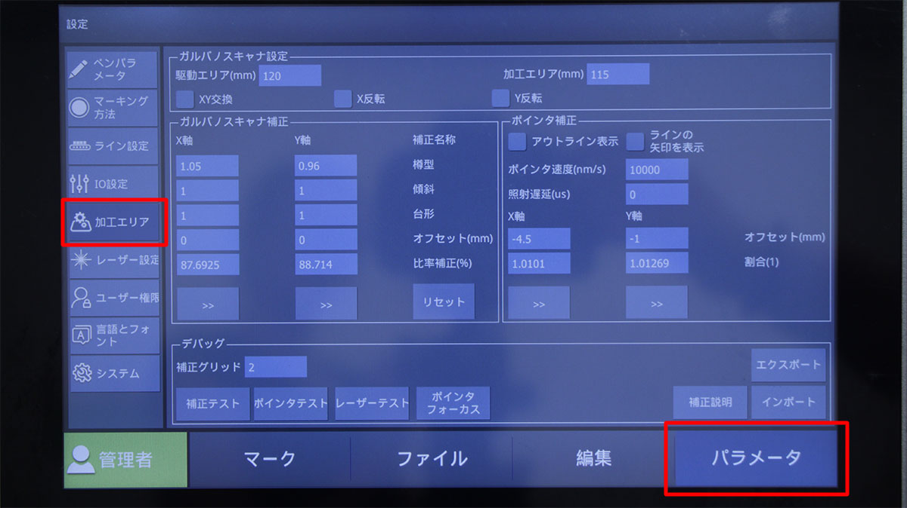 -->

1. 初期設定

**比率補正** の項目をX軸・Y軸ともに **100%** に設定します。

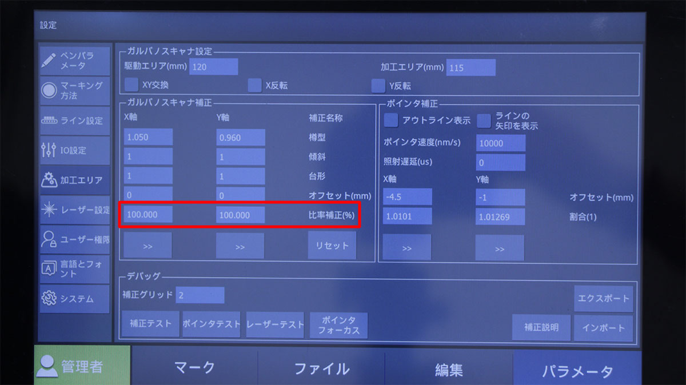

**駆動エリア・加工エリア** の設定値を確認します。
レンズごとに適切な設定値が異なりますので、[6.5.1 ガルバノスキャナ設定](#651-ガルバノスキャナ設定)を参照して値を入力してください。

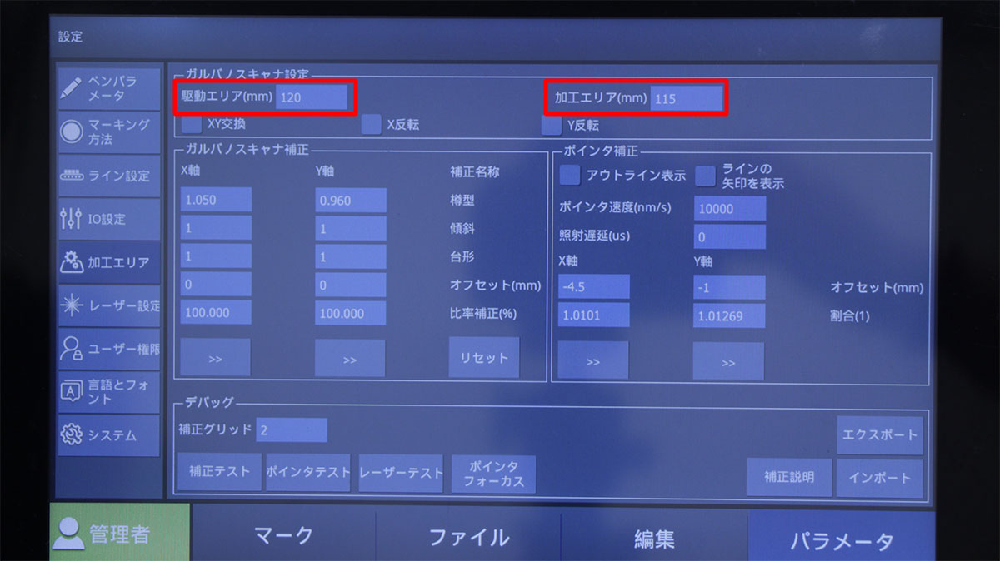

ガルバノスキャナ補正パネルの **樽型** の補正値に **X軸: 1.05** / **Y軸: 0.96** を入力してください。

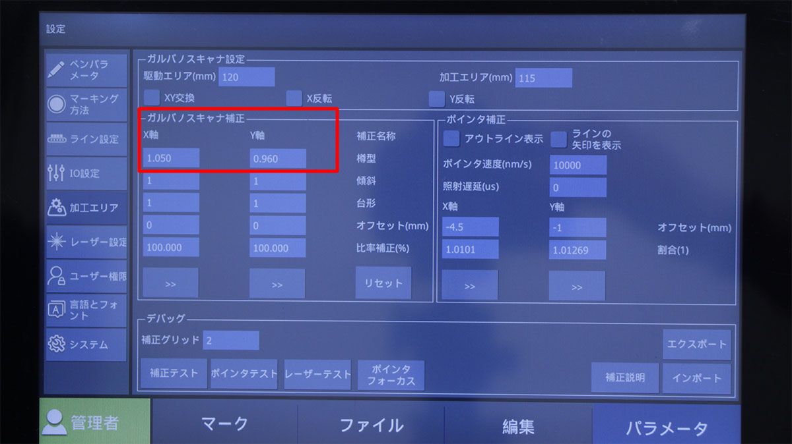

2. 補正値の調整と加工確認

歪み補正

まず **補正テスト** をタップして加工を行い、現在の歪みを確認します。 
※タップと同時に加工が始まります。必ず保護メガネを着用して操作してください。

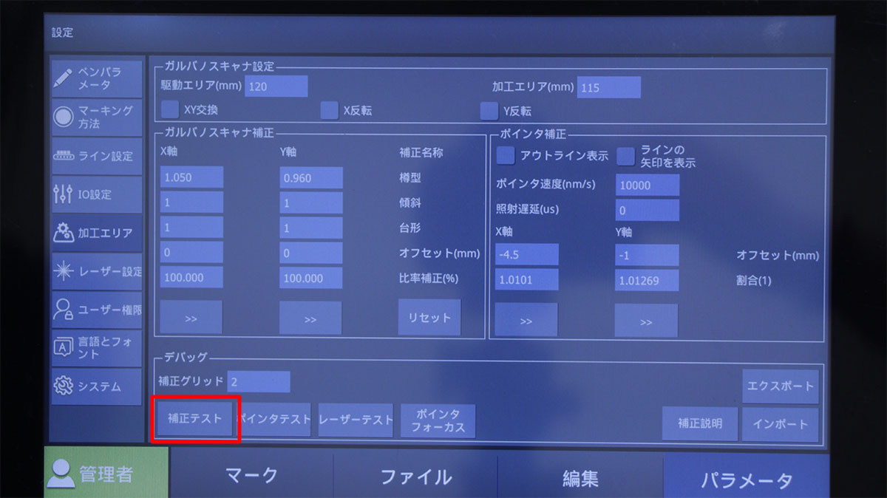

以下の写真のような四角が加工されます。四角に歪みが発生している場合は上記の **樽型** の補正値を **±0.01** ずつ変更して補正テストを行なってください。この操作を繰り返し、許容できる範囲まで歪みを低減してください。

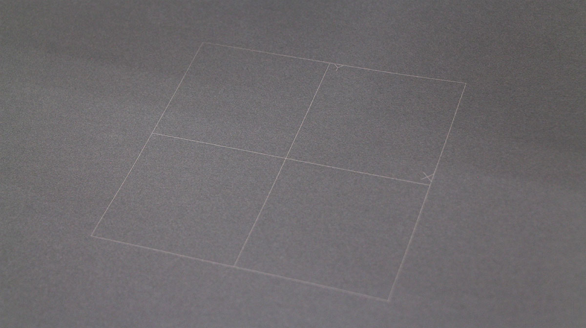

樽型の補正を行うことで基本的な歪みは補正できます。さらに精度を上げたい場合は[6.5.2 ガルバノスキャナ補正](#652-ガルバノスキャナ補正)を参考に、傾斜・台形の補正値の調整もお試しください。

大きさ補正

歪みがなくなったら、図形の縦幅と横幅を測定します。

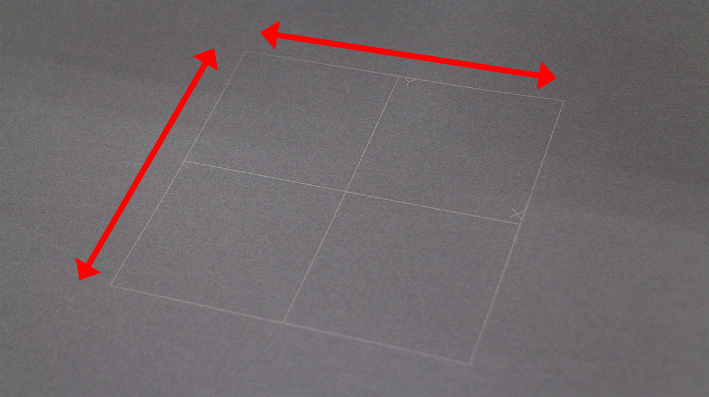

各軸の「>>」ボタンをそれぞれタップし、測定した数値を **「実サイズ」** に入力します。

<table class="noframe">
<tr>
<td>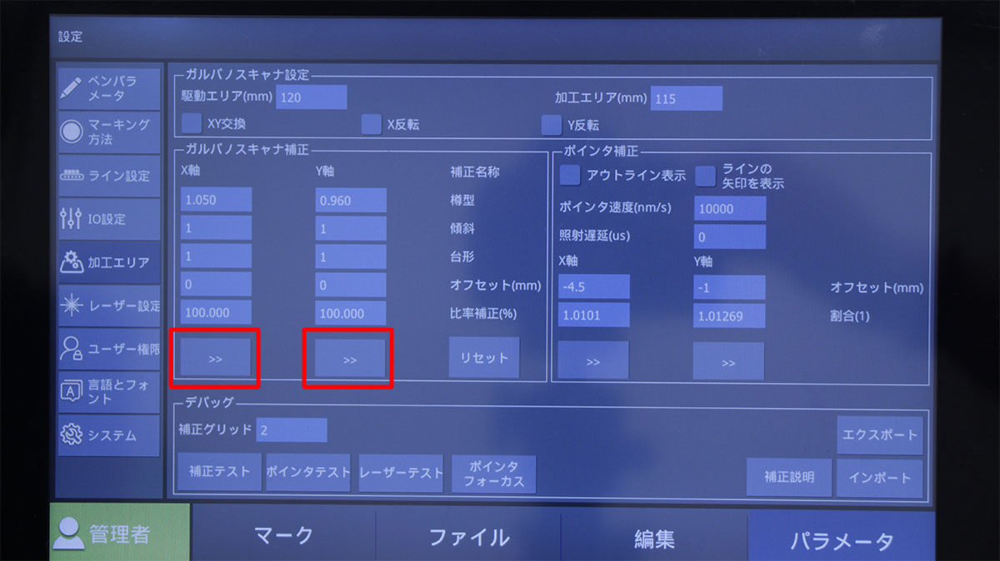</td>
<td>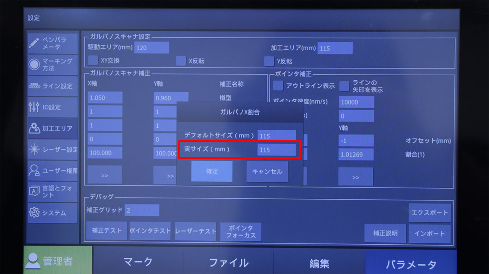</td>
</tr>
</table>

これにより **比率補正** の値が自動で修正されます。

再度「補正テスト」を行い、加工された四角のサイズが設定した加工エリアの値（115mm/205mm/305mm）と同じかどうかを確認します。

※レンズとのズレがある場合は比率補正を100に設定して補正テストを行い、計測および実サイズの入力を再度行ってください。

3. 補正ファイルの保存

補正が完了したら補正ファイルを保存します。
「エクスポート」をタップし、ファイル名を入力し（ここでは「110」としています）、「確定」をタップしてください。

<table class="noframe">
<tr>
<td>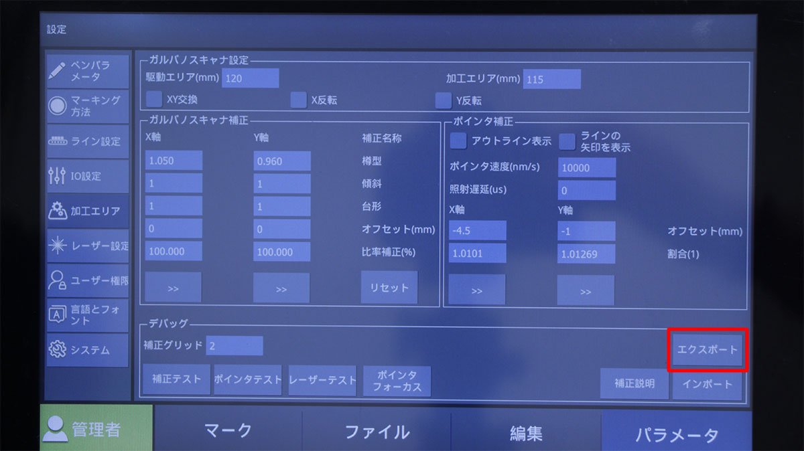</td>
<td>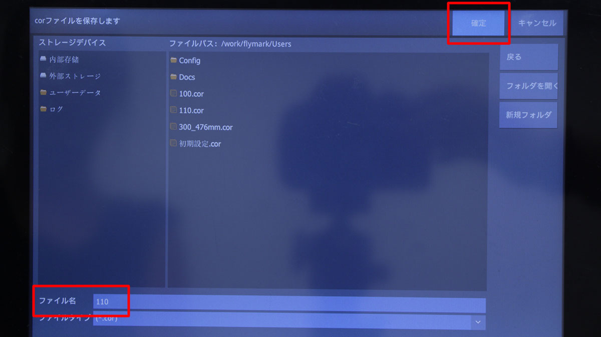</td>
</tr>
</table>

調整ファイルの切り替えを行う場合、「インポート」を選択し、変更したいファイルを選択してください。
<td>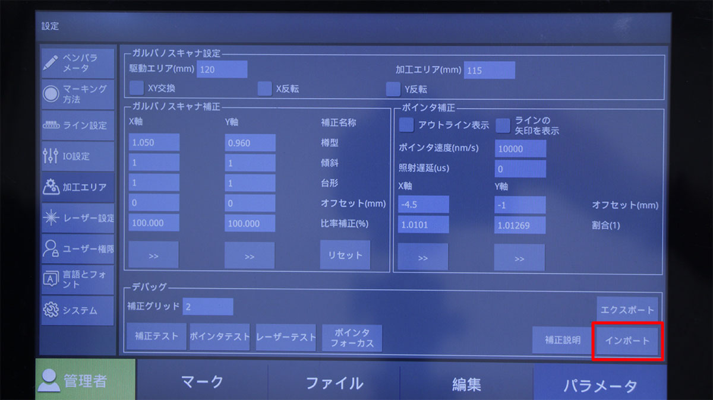</td>

## 9.3 フォントの追加

パラメータタブの「言語とフォント」画面を表示し、画面中央右側の「フォント追加」ボタンから追加してください。
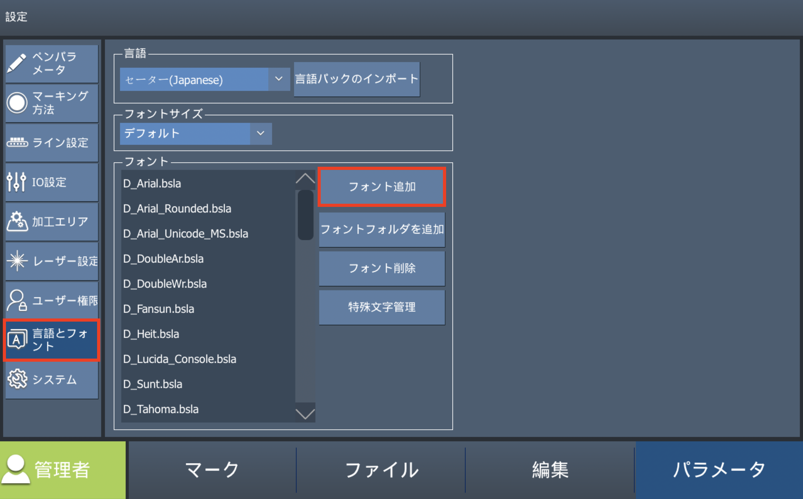

<h1>お問い合わせ</h1>

製品を使用する上で不明点や疑問点などありましたらお気軽にお問い合わせください。 

お問い合わせフォーム: <a href="https://www.smartdiys.com/contact/support/">https://www.smartdiys.com/contact/support/</a> 
電話：050-5527-0894（平日 10:00 〜 12:00 / 13:00 〜 17:00）

<!-- **本製品についてのサポート用動画などは下記ページに随時公開しています。参考にご覧ください。**
https://www.smartdiys.com/support/product/slw-robot/ -->
