---
puppeteer:
    format: 'A4'
    headerTemplate: '

'
    footerTemplate: '
  
'
    displayHeaderFooter: true
---

インラインレーザーマーカーシステム 
操作マニュアル

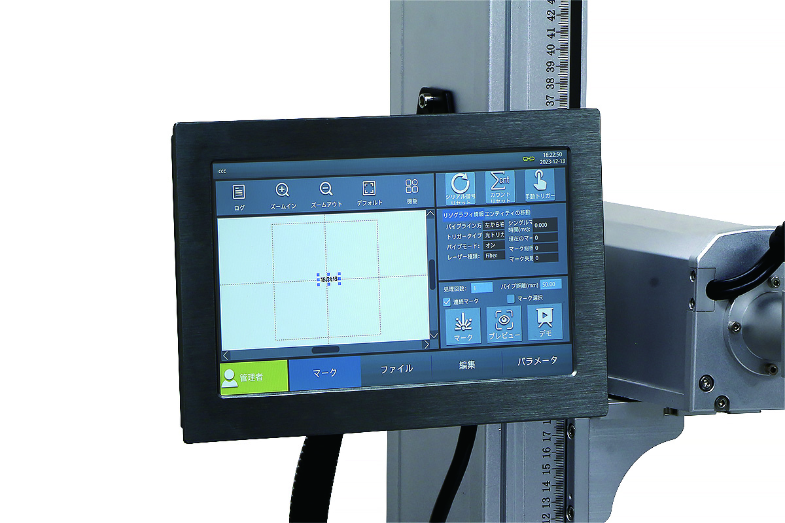

第 5 版  
発行日 2026年-月-日 

目次

<a class="toc-item" href="#1-概要">
	1. 概要
	
	4
</a>
<a class="toc-item toc-section-item" href="#11-はじめに">
	1.1 はじめに
	
	4
</a>
<a class="toc-item toc-section-item" href="#12-インラインレーザーマーカーシステムの特徴">
	1.2 インラインレーザーマーカーシステムの特徴
	
	4
</a>
<a class="toc-item toc-section-item" href="#13-標準システムとの比較">
	1.3 標準システムとの比較
	
	5
</a>
<a class="toc-item" href="#2-ハードウェア仕様">
	2. ハードウェア仕様
	
	6
</a>
<a class="toc-item toc-section-item" href="#21-制御入出力IO仕様">
	2.1 制御入出力（I/O）仕様
	
	6
</a>
<a class="toc-item toc-section-item" href="#22-エンコーダ入力仕様">
	2.2 エンコーダ入力仕様
	
	7
</a>
<a class="toc-item toc-section-item" href="#23-通信インターフェース仕様">
	2.3 通信インターフェース仕様
	
	8
</a>
<a class="toc-item" href="#3-クイックスタート">
	3. クイックスタート
	
	9
</a>
<a class="toc-item toc-section-item" href="#31-ログイン">
	3.1 ログイン
	
	9
</a>
<a class="toc-item toc-section-item" href="#32-新規ドキュメントの作成">
	3.2 新規ドキュメントの作成
	
	9
</a>
<a class="toc-item toc-section-item" href="#33-各種設定">
	3.3 各種設定
	
	10
</a>
<a class="toc-item toc-section-item" href="#34-データ作成">
	3.4 データ作成
	
	11
</a>
<a class="toc-item toc-section-item" href="#35-マーキング">
	3.5 マーキング
	
	12
</a>
<a class="toc-item" href="#4-ソフトウェア概要">
	4. ソフトウェア概要
	
	13
</a>
<a class="toc-item toc-section-item" href="#41-画面構成">
	4.1 画面構成
	
	13
</a>
<a class="toc-item" href="#5-編集">
	5. 編集
	
	14
</a>
<a class="toc-item toc-section-item" href="#51-基本的な機能">
	5.1 基本的な機能
	
	14
</a>
<a class="toc-item toc-section-item" href="#52-オブジェクトの作成">
	5.2 オブジェクトの作成
	
	15
</a>
<a class="toc-item toc-section-subitem" href="#521-テキスト">
	5.2.1 テキスト
	
	15
</a>
<a class="toc-item toc-section-subitem" href="#522-QRコード">
	5.2.2 QRコード
	
	20
</a>
<a class="toc-item toc-section-subitem" href="#523-バーコード">
	5.2.3 バーコード
	
	21
</a>
<a class="toc-item toc-section-subitem" href="#524-図形">
	5.2.4 図形
	
	22
</a>
<a class="toc-item toc-section-subitem" href="#525-ベクター">
	5.2.5 ベクター
	
	22
</a>
<a class="toc-item toc-section-subitem" href="#526-画像">
	5.2.6 画像
	
	22
</a>
<a class="toc-item toc-section-item" href="#53-オブジェクトの編集">
	5.3 オブジェクトの編集
	
	23
</a>
<a class="toc-item" href="#6-パラメータ">
	6. パラメータ
	
	26
</a>
<a class="toc-item toc-section-item" href="#61-ペンパラメータ">
	6.1 ペンパラメータ
	
	27
</a>
<a class="toc-item toc-section-subitem" href="#611-基本パラメータ">
	6.1.1 基本パラメータ
	
	27
</a>
<a class="toc-item toc-section-subitem" href="#612-高度なパラメータ">
	6.1.2 高度なパラメータ
	
	28
</a>
<a class="toc-item toc-section-item" href="#62-マーキング方法">
	6.2 マーキング方法
	
	29
</a>
<a class="toc-item toc-section-subitem" href="#621-トリガーモード">
	6.2.1 トリガーモード
	
	29
</a>
<a class="toc-item toc-section-subitem" href="#622-トリガー最適化">
	6.2.2 トリガー最適化
	
	30
</a>
<a class="toc-item toc-section-subitem" href="#623-ラインモード">
	6.2.3 ラインモード
	
	30
</a>
<a class="toc-item toc-section-subitem" href="#624-パスの最適化">
	6.2.4 パスの最適化
	
	30
</a>
<a class="toc-item toc-section-subitem" href="#625-その他">
	6.2.5 その他
	
	30
</a>
<a class="toc-item toc-section-item" href="#63-ライン設定">
	6.3 ライン設定
	
	31
</a>
<a class="toc-item toc-section-subitem" href="#631-ライン方向">
	6.3.1 ライン方向
	
	31
</a>
<a class="toc-item toc-section-subitem" href="#632-エンコーダ">
	6.3.2 エンコーダ
	
	31
</a>
<a class="toc-item toc-section-subitem" href="#633-固定ライン速度">
	6.3.3 固定ライン速度
	
	31
</a>
<a class="toc-item toc-section-subitem" href="#634-静的マーク">
	6.3.4 静的マーク
	
	31
</a>
<a class="toc-item toc-section-item" href="#64-IO設定">
	6.4 IO設定
	
	32
</a>
<a class="toc-item toc-section-subitem" href="#641-共通出力">
	6.4.1 共通出力
	
	32
</a>
<a class="toc-item toc-section-subitem" href="#642-アラーム出力">
	6.4.2 アラーム出力
	
	32
</a>
<a class="toc-item toc-section-subitem" href="#643-インターロック">
	6.4.3 インターロック
	
	33
</a>
<a class="toc-item toc-section-subitem" href="#644-テスト照射">
	6.4.4 テスト照射
	
	33
</a>
<a class="toc-item toc-section-item" href="#65-加工エリア">
	6.5 加工エリア
	
	34
</a>
<a class="toc-item toc-section-subitem" href="#651-ガルバノスキャナ設定">
	6.5.1 ガルバノスキャナ設定
	
	34
</a>
<a class="toc-item toc-section-subitem" href="#652-ガルバノスキャナ補正">
	6.5.2 ガルバノスキャナ補正
	
	34
</a>
<a class="toc-item toc-section-subitem" href="#653-ポインタ補正">
	6.5.3 ポインタ補正
	
	35
</a>
<a class="toc-item toc-section-subitem" href="#654-デバッグ">
	6.5.4 デバッグ
	
	35
</a>
<a class="toc-item toc-section-item" href="#66-レーザー設定">
	6.6 レーザー設定
	
	36
</a>
<a class="toc-item toc-section-item" href="#67-ユーザー権限">
	6.7 ユーザー権限
	
	36
</a>
<a class="toc-item toc-section-subitem" href="#671-ユーザー設定">
	6.7.1 ユーザー設定
	
	36
</a>
<a class="toc-item toc-section-subitem" href="#672-権限設定">
	6.7.2 権限設定
	
	36
</a>
<a class="toc-item toc-section-item" href="#68-言語とフォント">
	6.8 言語とフォント
	
	37
</a>
<a class="toc-item toc-section-item" href="#69-システム">
	6.9 システム
	
	38
</a>
<a class="toc-item toc-section-subitem" href="#691-バージョン情報">
	6.9.1 バージョン情報
	
	38
</a>
<a class="toc-item toc-section-subitem" href="#692-外部通信">
	6.9.2 外部通信
	
	38
</a>
<a class="toc-item toc-section-subitem" href="#693-高度な設定">
	6.9.3 高度な設定
	
	42
</a>
<a class="toc-item" href="#7-加工操作">
	7. 加工操作
	
	43
</a>
<a class="toc-item toc-section-item" href="#71-プレビューエリア">
	7.1 プレビューエリア
	
	43
</a>
<a class="toc-item toc-section-item" href="#72-ステータスエリア">
	7.2 ステータスエリア
	
	43
</a>
<a class="toc-item toc-section-item" href="#73-マーキングエリア">
	7.3 マーキングエリア
	
	44
</a>
<a class="toc-item" href="#8-外部機器との通信">
	8. 外部機器との通信
	
	45
</a>
<a class="toc-item toc-section-item" href="#81-外部からの文字列指定">
	8.1 外部からの文字列指定
	
	45
</a>
<a class="toc-item toc-section-subitem" href="#811-TCP通信の例">
	8.1.1 TCP通信の例
	
	45
</a>
<a class="toc-item toc-section-subitem" href="#812-シリアル通信の例">
	8.1.2 シリアル通信の例
	
	46
</a>
<a class="toc-item toc-section-item" href="#82-コマンド制御">
	8.2 コマンド制御
	
	47
</a>
<a class="toc-item toc-section-subitem" href="#821-プロトコル形式">
	8.2.1 プロトコル形式
	
	47
</a>
<a class="toc-item toc-section-subitem" href="#822-コマンド一覧">
	8.2.2 コマンド一覧
	
	47
</a>
<a class="toc-item" href="#9-付録">
	9. 付録
	
	56
</a>
<a class="toc-item toc-section-item" href="#91-レンズの交換方法">
	9.1 レンズの交換方法
	
	56
</a>
<a class="toc-item toc-section-item" href="#92-補正ファイルの作成">
	9.2 補正ファイルの作成
	
	57
</a>
<a class="toc-item toc-section-item" href="#93-ログの操作">
	9.3 ログの操作
	
	60
</a>
<a class="toc-item toc-section-subitem" href="#931-ログレベルの変更">
	9.3.1 ログレベルの変更
	
	60
</a>
<a class="toc-item toc-section-subitem" href="#932-ログファイルのエクスポート">
	9.3.2 ログファイルのエクスポート
	
	60
</a>
<a class="toc-item toc-section-item" href="#94-フォントの追加">
	9.4 フォントの追加
	
	61
</a>
<a class="toc-item toc-section-item" href="#95-ユーザーデータのバックアップ">
	9.5 ユーザーデータのバックアップ
	
	61
</a>
<a class="toc-item toc-section-item" href="#96-ソフトウェアアップデート">
	9.6 ソフトウェアアップデート
	
	62
</a>

# 1. 概要

## 1.1 はじめに

本書は、加工機を制御する専用コントローラおよびソフトウェアのマニュアルです。 
ご利用前に、加工機本体の製品マニュアルも必ずご確認ください。

**製品マニュアル**

LM110C ｜ https://www.smartdiys.com/assets/pdf/fiber-laser-marking-machine-lm110c-manual.pdf
 
LM140R ｜ https://www.smartdiys.com/assets/pdf/co2-laser-marking-machine-lm140r-manual.pdf
 
LM110U ｜ https://www.smartdiys.com/assets/pdf/uv-laser-marking-machine-lm110u-jpt-manual.pdf

## 1.2 インラインレーザーマーカーシステムの特徴

本製品は、スタンドアロンでの運用に必要な基本機能を備えたレーザーマーキングシステムです。 
また、光電センサやエンコーダと連携することで、搬送ライン上を移動するワークへのマーキングにも対応します。

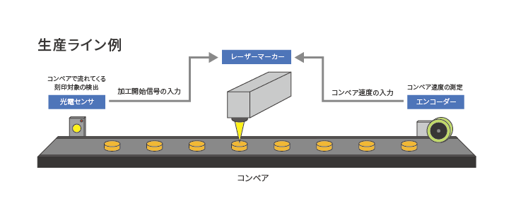

**多様な加工開始トリガー** 
光電トリガー、フットスイッチ、内部トリガーから選択可能。設備仕様や運用フローに応じて柔軟に切り替えられます。また、コマンド制御モードではシリアル通信やTCP通信から加工開始トリガーを送ることもできます。

**エンコーダ対応** 
シングルエンド出力／差動出力の両方式に対応しています。

**加工状態取得** 
「加工中／非加工中」の状態を外部へ出力できます。PLCや周辺装置とのインターロックに利用できます。

**ユーザー権限管理** 
不正操作等を防止するためのユーザー権限設定機能が搭載されています。

**マーキングカウント** 
刻印回数や刻印漏れ回数、加工時間などを取得できます。生産管理に活用いただけます。

**加工データの作成・編集** 
図形やテキスト（QR / バーコード）の配置調整、パラメータ設定、ファイル管理まで一貫して行えます。

**多彩なデータ作成機能** 
シリアル番号の自動カウントアップや、加工時の日時情報やランダム文字列などを自動生成できます。

**外部通信による可変印字** 
複雑な事前処理が必要なテキスト情報（テキスト／QRコード／バーコード）の場合は、TCPまたはシリアル通信を通じて外部システムで生成した文字列を指定することができます。

**コマンド制御** 
コマンド制御モードを有効化すると、外部通信を通じて刻印位置調整・パラメータ設定、状態取得などができます。

※ 光電センサ・エンコーダとレーザーマーカー間のケーブルは、最大約20mまで延長できます。 
※ 搬送ライン上では、静止時よりマーキング精度が低下する場合があります。 
※ 搬送ラインの上限速度は、マーキング内容（加工時間）や使用するレンズによって異なります。 

<!-- 

 -->

## 1.3 標準システムとの比較

本システムは、外部機器との連携に特化した各種機能を備えています。 
下記に 標準システム  と インラインレーザーマーカーシステム の主な違いをご紹介します。

| 項目 | 標準システム | インラインレーザーマーカー システム |
|---|:-----:|:-----:|
| ソフトウェア     | SmartDIYs CAD | 内蔵ソフトウェア <small>※SmartDIYs CAD非対応</small> |
| 加工開始トリガー | ソフトウェア IOポート | ソフトウェア IOポート 外部通信 |
| インターロック | 有り | 有り |
| 加工中状態取得 | IOポート | IOポート 外部通信 |
| 外部通信による刻印文字の指定 | ◎ | ◎ |
| 外部通信によるプロジェクト切り替え | △ <small>※ミドルウェアの開発が必要</small> | ◎ |
| 外部通信による図形位置調整 | × | ◎ |
| 外部通信による加工パラメータ設定 | × | ◎ |
| 加工数カウント機能 | ⚪︎ | ◎ <small>※エラーカウントも取得可能</small> |
| ユーザー権限の管理 | ◎ | ◎ |
| 搬送マーキング | × | ◎ |
| 回転軸加工 | ◎ | × |
| 対応画像形式 | ◎ <small>bmp / jpg / gif / tga / png / tif  ai (ver.8) / plt / dxf / jpc / svg / nc 等</small> | ⚪︎ <small>bmp / jpg / png  ai (ver.8) / dxf / plt</small>|

※外部通信はいずれもシリアル通信/TCP通信に対応しています。 

 

<!--

本製品は、スタンドアロンでの運用に必要な基本機能を備えたレーザーマーキングシステムです。 
また、光電センサやエンコーダと連携することで、搬送ライン上を移動するワークにも刻印を行うことができます。

ハードウェア

**加工状態出力** 
コントローラから「加工中／非加工中」を外部へ出力でき、PLCや周辺装置とのインターロックに利用できます。

**エンコーダ対応** 
シングルエンド出力／差動出力の両方式をサポート。出力形式は NPN とラインドライバに対応し、既設ラインに合わせた取り回しが可能です。

**多様なスタートトリガ** 
フットスイッチ、NPN入力、内部トリガから選択可能。設備仕様や運用フローに応じて柔軟に切り替えられます。また、コマンド制御モードではシリアル通信やTCP通信から加工開始トリガーを送ることもできます。

※ 光電センサ・エンコーダとレーザーマーカー間のケーブルは、最大およそ 20 m 程度まで延長可能です。 
※ 搬送ラインの上限速度は刻印内容に依存します。刻印時間が増えるほど許容速度は低下します。 

ソフトウェア

**ユーザー権限（ロール）管理** 
不正操作等を防止するためのユーザー権限設定機能が搭載されています。

**加工データの作成・編集** 
図形やテキスト（QR / バーコード）の配置・調整、パラメータ設定、ファイル管理まで一貫して行えます。

**マーキングカウント** 
刻印回数やエラー回数、加工時間などを取得でき、生産管理に活用できます。

**外部通信による可変印字** 
テキスト／QRコード／バーコードの内容を外部から指定できます。

**コマンド制御** 
コマンド制御モードを有効化すると、外部通信を通じて刻印位置・パラメータ設定、状態取得などが可能になります。

-->

# 2. ハードウェア仕様

## 2.1 制御入出力（I/O）仕様

<!-- 
コネクタ③　外部インターフェイス ( センサー・PLC 接続 )
 -->

| ピン番号 | 機能名 | 内容 |
|:--:| --- | --- |
| 1 | 24V  | センサ電源用の24V出力。最大出力電流は200mAです。 |
| 2 | IN0  | レーザー照射トリガー入力。NPN出力タイプの光電センサを接続します。 |
| 3 | GND  | GND |
| 4 | IN1  | レーザー照射トリガー入力。GNDとの短絡によりトリガーを認識します。 |
| 5 | IN2  | 外部制御入力。ソフトウェアの設定により、次のいずれかの機能を割り当てることができます。 ① インターロック　② レーザー照射 |
| 6 | GND  | GND |
| 7 | NC   | 使用しません。何も接続しないでください。 |
| 8 | OUT1 | デフォルトではマーキング完了信号が割り当てられています。オープンコレクタ出力です。 |
| 9 | OUT2 | デフォルトでは動作状態信号が割り当てられています。オープンコレクタ出力です。 |

※制御入出力に関する設定は[6.4 IO設定](#64-IO設定)をご参照ください。

 

**等価回路図**

<table>
<tr>
<th>入力</th>
<th>出力</th>
</tr>
<tr>
<td style="padding:20px"></td>
<td style="padding:20px"></td>
</tr>
</table>

## 2.2 エンコーダ入力仕様

接続するエンコーダの出力方式に応じて、コントローラのジャンパピン（画像赤枠部分）の設定を変更する必要があります。
シングルエンド出力のエンコーダを接続する場合は左側、差動出力のエンコーダを接続する場合は右側に設定してください。

シングルエンド入力

| ピン番号 | 機能名 | 内容 |
|:--:| --- | --- |
| 1 | A | エンコーダのA信号入力 |
| 2 | B | エンコーダのB信号入力 |
| 3 | VCC | エンコーダ電源用の5V出力。最大出力電流は200mAです。 |
| 4 | GND | エンコーダ用GND |

差動入力

| ピン番号 | 機能名 | 内容 |
|:--:| --- | --- |
| 1 | A+ | エンコーダのA+信号入力 |
| 2 | A- | エンコーダのA-信号入力 |
| 3 | B+ | エンコーダのB+信号入力 |
| 4 | B- | エンコーダのB-信号入力 |
| 5 | VCC | エンコーダ電源用の5V出力。最大出力電流は200mAです。 |
| 6 | GND | エンコーダ用GND |

## 2.3 通信インターフェース仕様

| ポート | 機能名 |
|:--:| --- |
| LANポート | 外部機器とのTCP通信に使用します。 |
| シリアルポート | 外部機器とのシリアル通信（RS-232）に使用します。 |
| USBポート | USBメモリなどの外部記憶装置を接続し、ファイルの入出力に使用します。 |

※通信インターフェイスに関する設定は[6.9.2 外部通信](#692-外部通信)をご参照ください。

 

**シリアルポート RXD/TXD**

# 3. クイックスタート

## 3.1 ログイン

「未ログイン」ボタンをタップするとログインダイアログが表示されます。ユーザー名に「管理者」が選ばれていることを確認し、パスワード「111111」を入力してログインしてください。 

注意: 未ログインの状態では、各設定の変更ができません。

## 3.2 新規ドキュメントの作成

「ファイル」タブを開き、「新規」をタップします。ファイル名をタップしファイル名を入力します。「確定」をタップするとファイルが新規作成されます。

## 3.3 各種設定

「パラメータ」をタップし各種設定を行います。

<!-- #### ペンパラメータ -->

ペンパラメータ設定

加工時のパラメータを確認します。ここではデフォルトのまま使用します。

<!-- #### マーキング方法設定 -->

マーキング方法設定

トリガー方式を設定します。ここでは内部トリガーが選択されていることを確認します。

<!-- #### ライン設定 -->

ライン設定

生産ラインに組み込む場合に設定します。実際のラインの流れに応じてラインの方向を変更します。また、エンコーダを使用するか、固定のライン速度を指定するかを選択できます。素材を動かさずに固定したまま加工を行う場合は「静的マーク」を選択します。まずは静的マークをお試しください。

<!-- #### 加工エリア -->

加工エリア設定

加工エリアの確認を行います。加工エリアをタップし、ガルバノスキャナ設定の可動エリアと加工エリアを確認します。

<!-- #### レーザー設定 -->

レーザー設定

レーザーの種類を確認します。使用する機種に応じて、以下のタイプが選択されていることを確認してください。

- **LM110C 通常（Qスイッチ）**：ファイバー
- **LM110C MOPA型**：Mopa
- **LM140R**：CO2
- **LM110U**：UV

## 3.4 データ作成

ここでは固定テキストデータを作成します。 
「編集」タブをタップし、「テキスト」ボタンをタップします。
テキスト作成ダイアログが表示されるので、「追加」ボタンをタップし、「固定テキスト」を選択します。

表示された入力フォームをタップし、任意の文字列を設定してください。

## 3.5 マーキング

必ず保護メガネを着用して作業してください。 
加工中に危険を感じた場合は直ちに緊急停止ボタンを押し、再開時はボタンを右に回して解除してください。

<!-- ### 素材の設置・高さ調整 -->

素材の設置・高さ調整

加工に使用する素材を準備し、素材をレンズの下に配置します。 

次に **高さ調整（焦点合わせ）** を行います。本製品の場合、二つのレーザーポインターの光が重なり合う高さに調整します。
1. レーザーポインターのボタンを押し、ポインターをオンにします。ボタンはレンズの手前側、中央部分にあります。レンズを下から覗き込まないように注意してください。
1. レーザーポインターの光が2箇所から照射され、本体上部のハンドルを回すことで光が近づいたり離れたりします。2つの光が重なるように高さを調整します。
1. 高さ調整が完了したら、再度レーザーヘッドのボタンを押し、レーザーポインターをオフにしてください。

レーザー光はレンズによって集光され、素材に照射されます。適正な焦点位置から外れると、刻印が薄くなったり、線幅が広がったりする場合があります。レンズの焦点距離に合わせてレンズと素材の距離を適切に保ち、素材の高さが変わる場合は、その都度高さを調整してください。 
素材が平らでない場合は、加工箇所でレーザーポインターが重なるように高さを調整してください。

<!-- ### 位置合わせ・加工 -->

位置合わせ・加工

1. 高さ調整が完了していることを確認します。
1. 「マーク」タブを開きます。
1. プレビューボタンをタップします。レーザーが照射される位置がガイド光で表示されます。刻印したい位置とガイド光がずれている場合は、素材の設置位置または加工データの位置を調整してください。
1. 「マーキング」をタップします。トリガー設定に応じて加工が開始されます。「フットスイッチ」または「光電トリガー」の場合は、「手動トリガー」をタップすることで加工が開始されます。素材表面にレーザー光が照射されることを確認してください。

加工後、加工箇所を確認しても刻印が十分にできていない場合は、加工パラメータの調整が必要です。 
ペンパラメータ の項目で、加工速度を下げる・パワーを上げるなどの調整を行い、もう一度加工テストを行ってください。 

<!-- ## エンコーダとライン -->
<!--
ラインに組み込んで製品を使用する場合は、環境にあった設定を行う必要があります。
詳しくは[6.3 ライン設定](#63-ライン設定)の章をご確認ください。
-->

# 4. ソフトウェア概要

## 4.1 画面構成

<!-- ### マーク -->

マーク

マーク画面では、設定・編集したデータを使用してマーキングを行います。
この画面は主に、プレビューエリア、ステータスエリア、マーキングエリアに分かれています。
詳細は[7. 加工操作](#7-加工操作)の章をご確認ください。

<!-- ### ファイル -->

ファイル

ファイル管理画面では、ユーザーのファイルを管理することができます。

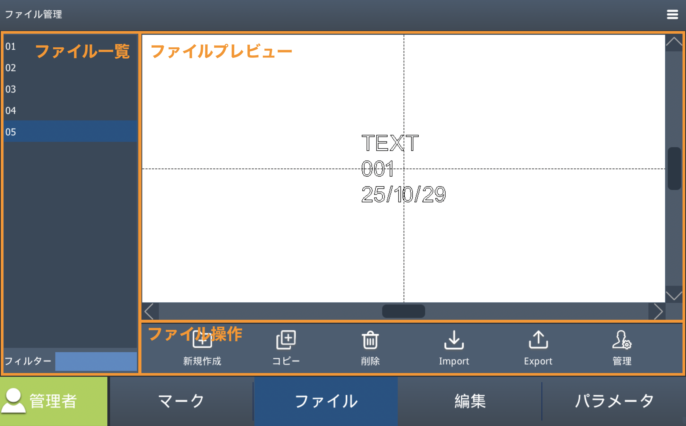

| メニュー | 説明 |
|:---:|-----|
| 新規 | ファイルを新規作成します。「新規」ボタンをタップしてファァイルの保存先やファイル名を設定し、確定ボタンをタップするとファイルリストにファイルが追加されます。編集したいファイルを選択後に「編集」タブをタップすることで編集画面に切り替わります。 |
| コピー | 選択中のファイルを複製します。ファイル一覧からコピーしたいファイルを選択後、「複製」ボタンをタップします。 |
| 削除 | ファイルリストから削除したいファイルを選択後、「削除」ボタンをタップします。 |
| Import | 外部記憶装置などからファイルをインポートすることができます。 |
| Export | 作成したファイルを外部記憶装置などにエクスポートすることができます。 |
| 管理 | ファイルブラウザを表示します。フォルダの作成や名称変更、ファイル移動などの操作が行えます。 |

<!-- ### 編集 -->

編集

編集画面では、各種図形やテキストの作成・編集を行います。
詳細は[5. 編集](#5-編集)を参照してください。

<!-- ### パラメータ -->

パラメータ

パラメータ画面では、加工パラメータのほか、IOや外部通信などの設定を行います。
このタブについての説明は[6. パラメータ](#6-パラメータ)の章をご確認ください。

# 5. 編集

「編集」タブでは、様々な図形要素やテキストを作成・編集することができます。

## 5.1 基本的な機能

| メニュー | 説明 |
|:---:|-----|
| グループ | 選択中の複数のセルをグループ化します。 |
| 解除    | 選択中の複数のセルのグループを解除します。 |
| 元に戻す | 編集状態を1つ前の状態に戻します。 |
| やり直す | 編集状態を1つ後の状態に進めます。 |
| 削除    | 選択しているアイテムを削除します。 |
| 保存    | 現在のファイルを保存します。 |
| 別名保存 | 現在のファイルを別の名称で保存します。 |
| 新規作成 | 新規ファイルを作成します。 |

ビュー操作

<table class="icontable">
<tr>
<td></td>
<td>プレビューエリアを最大化して表示します。</td>
</tr>
<tr>
<td></td>
<td>プレビューエリアの境界線と中心線、目盛りを表示を切り替えます。</td>
</tr>
<tr>
<td></td>
<td>プレビューエリアを拡大します。</td>
</tr>
<tr>
<td></td>
<td>プレビューエリアを縮小します。</td>
</tr>
<tr>
<td></td>
<td>プレビューエリアの表示サイズを標準サイズに戻します。</td>
</tr>
<tr>
<td></td>
<td>現在選択中の要素を最大化して表示します。</td>
</tr>
<tr>
<td></td>
<td>プレビューエリア内のすべての要素を選択します。</td>
</tr>
</table>

## 5.2 オブジェクトの作成

加工オブジェクトは下記の種類があります。

| 種類 | 説明 |
|:---:|-----|
| テキスト | 文字列を刻印します。複数の文字列を組み合わせることも可能です（固定文字＋時刻など） |
| QRコード | 文字列データから二次元コードを作成します。複数の文字列を組み合わせることも可能です。 |
| バーコード | 文字列データからバーコードを作成します。複数の文字列を組み合わせることも可能です。 |
| 図形 | 直線や円などのプリセット図形を刻印します。 |
| ベクター | ベクタデータ（dxf, plt, ai）データを刻印します。USBメモリ等でインポートできます。 |
| 画像 | ビットマップデータ（bmp, jpg, png）を刻印します。USBメモリ等でインポートできます。 |

### 5.2.1 テキスト

| パネル | 説明 |
|:---:|-----|
| プレビューエリア | 現在のテキストのすべての内容が表示されます。 |
| 要素リストエリア    | 作成しているテキスト要素の一覧が表示されます。 `追加`ボタン: テキストを追加します `編集`ボタン: 選択されているテキストを編集します。 `アップ/ダウン`ボタン: 選択されているテキストの順番を変更します。 `削除`ボタン: 選択されているテキストを削除します。 |
| 編集エリア | オフセットの設定、フォントなどの設定を行います。 |

#### テキストデータの種類

固定テキスト

加工時に変化させる必要のない固定文字列を作成します。

シリアル番号

加工を行う度に数値が増加するテキストを作成できます。

| 項目 | 説明 |
|:---:|-----|
| 開始番号 | シリアル番号の開始値を設定します。 |
| 現在の番号 | 現在のシリアル番号を表示します。 |
| 終了番号 | シリアル番号の終了値を設定します。終了番号に達するとマーキングを終了します。 |
| 増分 | マーキングごとにシリアル番号を増加させる値を設定します。 |
| 繰返し回数 | 同じシリアル番号をマーキングする回数を設定します。設定した回数に達すると、次の番号に進みます。 |
| 現在の回数 | 現在のシリアル番号をマーキングした回数を表示します。 |
| 進数 | シリアル番号の進数を選択します。 |
| シリアル番号の桁数 | シリアル番号の桁数を設定します。「先頭にゼロを表示」を有効にすると、設定した桁数に満たない場合に先頭へ0を追加します。例えば、桁数を2に設定すると、1は01と表示されます。 |

日付

日付情報を自動で取得します。また、日付の表示形式を編集することも可能です。
左のプリセットエリアから形式を選びます。選択後に日付の順序や区切り記号などを変更することができます。

| 項目 | 説明 |
|:---:|-----|
| プレビューエリア | 設定した日付の表示内容を確認できます。 |
| プリセットエリア | あらかじめ用意された日付形式から選択します。 |
| 編集エリア | 年・月・日の順序や区切り記号などを編集します。 |
| 先頭を0で埋める | 有効にすると、1桁の月や日の先頭に0を追加します。 |
| 日付オフセット | 現在の日付を基準に、設定した日数を加算または減算して表示します。 |
| フィールド設定 | 曜日や月名などの表示文字列を変更します。 |

時間

時間情報を自動で取得します。また、時間の表示形式を編集することも可能です。
時間の修正を行う場合は`パラメータ > システム > 高度な設定`で設定してください。

| 項目 | 説明 |
|:---:|-----|
| プレビューエリア | 設定した時刻の表示内容を確認できます。 |
| プリセットエリア | あらかじめ用意された時刻形式から選択します。 |
| 編集エリア | 時・分・秒の順序や区切り記号などを編集します。 |
| 午前 表示名・午後 表示名 | 午前・午後の表示文字列を設定します。 |
| 時間オフセット・分オフセット | 現在の時刻を基準に、設定した時間または分を加算・減算して表示します。 |
| 先頭にゼロを表示 | 有効にすると、1桁の時・分・秒の先頭に0を追加します。 |

シフト

マーキングを行う時間によってテキスト内容を変更する機能です。

| 項目 | 説明 |
|:---:|-----|
| 開始時間 | テキストを切り替える時刻を設定します。設定した時刻になると、対応するマーキング内容に切り替わります。 |
| マーキング内容 | 指定した開始時間から使用するテキストを設定します。開始時間とマーキング内容を入力して「追加」をタップすると、シフトプレビューに追加されます。 |
| シフトプレビュー | 設定した開始時間とマーキング内容を確認できます。 |

下記のように設定した場合、10:00～10:04は TEXT01、10:05～10:09は TEXT02、10:10～翌9:59は TEXT03 がマーキングされます。 
[ 10:00 ] - TEXT01 
[ 10:05 ] - TEXT02 
[ 10:10 ] - TEXT03 

ファイル

txt や csvファイルから一行ずつテキストを取得する機能です。

| 項目 | 説明 |
|:---:|-----|
| ファイルタイプ | 読み込むファイル形式を選択します。 |
| 現在の行番号 | 読み込みを開始する行番号を指定します。 |
| 現在の列番号 | 読み込みを開始する列番号を指定します。CSVファイルの場合のみ設定できます。 |
| 行の増加量 | マーキングごとに進める行数を設定します。例えば「2」に設定すると、1行おきにデータを読み込みます。 |
| 繰返し回数 | 同じ行のデータをマーキングする回数を設定します。設定した回数に達すると、次の対象行に進みます。 |
| 現在の回数 | 現在の行のデータをマーキングした回数を表示します。 |
| 自動ループ | 有効にすると、最終行に到達した後、先頭行に戻ってマーキングを継続します。 |
| ファイルパス | 読み込むファイルを選択します。 |
| DBクリア | ファイルの読み込み時に自動生成されるキャッシュファイルを削除します。 |
| 重複検出 | 同じ文字列の重複マーキングを防止します。キャッシュファイルと指定したファイルに同じ文字列がある場合、エラーを表示します。重複判定には改行コードも含まれます。 |
| 開始番号 | 読み込んだテキストからマーキングに使用する文字列の開始位置を指定します。0の場合は先頭から使用します。 |
| 文字数 | 「開始番号」で指定した位置から、マーキングに使用する文字数を指定します。0の場合は、残りの文字列をすべて使用します。 |

外部データ

マーキング時に、ネットワーク通信やシリアル通信を使用して外部機器から文字列を取得します。
詳細は[6.9.2 外部通信](#692-外部通信)の章をご確認ください。

改行

テキストを改行する場合は、改行要素を追加します。
要素リストに追加された改行要素を選択し、改行したい位置に移動します。
プレビューエリアで改行位置を確認してください。

ランダムコード

指定した規則に従って、ランダムな文字列を生成します。

| 記号 | 説明 |
|:---:|-----|
| % | 数字、大文字・小文字のアルファベットからランダムに1文字を生成します。 |
| # | 大文字のアルファベットからランダムに1文字を生成します。 |
| $ | 小文字のアルファベットからランダムに1文字を生成します。 |
| @ | 数字からランダムに1文字を生成します。 |

<b>設定例</b> 
設定文字列: text-%%%%-##$$@@ 
生成文字列: text-Hc7Z-BJia52

<!-- 
パラメータ
 -->

#### パラメータ

基本タブ

| 項目 | 説明 |
|:---:|-----|
| オフセット   | 選択したテキストの位置を調整します。 |
| フォント     | テキストに使用するフォントを選択します。シングルライン、標準フォント、ドットフォント、TTFから選択できます。 |
| 高さ（mm）   | 文字の高さを設定します。 |
| 文字間隔(mm) | 文字間の距離を設定します。 |
| 文字幅係数   | 文字の高さに対する幅の比率を設定します。 |
| 等幅        | 有効にすると、文字幅を一定にして配置します。 |
| 行間（mm）  | 行間の距離を設定します。 |
| 配置        | 複数行テキストの配置方法を設定します。調整なし / 左揃え / 右揃え / 中央揃え などがあります。 |
| 全てに適用   | 変更した設定をすべてのテキスト要素に適用します。 |

高度タブ

| 項目 | 説明 |
|:---:|-----|
| 適用 | 「高度な設定」の内容をプレビューに反映します。 |
| 円弧 | 有効にすると、テキストを円弧状に配置します。 |
| 高さ/幅 | 円弧の高さと幅を設定します。 |
| 開始角度 | 円弧上にテキストを配置する開始角度を設定します。角度の基準は以下の左図を参照してください。 |
| 固定角度 | 有効にすると、「固定角度範囲」で設定した角度内にテキストが収まるように配置します。 |
| 時計回り | 有効にすると、文字列を時計回りに配置します。 |
| 文字反転 | 有効にすると、テキストを水平方向に反転します。 |
| 交差点削除 | 文字の輪郭線が交差する部分を、設定した値に応じて削除します。 |

<table>
<tr>
<th>開始角度=0</th>
<th>開始角度=270</th>
</tr>
<tr>
<td style="padding:20px"></td>
<td style="padding:20px"></td>
</tr>
</table>

### 5.2.2 QRコード

QRコードやデータマトリックスなどの2次元コードの作成が可能です。

<!-- | パネル | 説明 |
|:---:|-----|
| プレビューエリア | 現在のテキストのすべての内容が表示されます。 |
| 要素リストエリア    | 作成しているテキスト要素の一覧が表示されます。 `追加`ボタン: テキストを追加します（各項目は[テキストデータの種類](#テキストデータの種類)をご覧ください） `GS1`ボタン: GS1で標準化している形式を選択することができます。 `編集`ボタン: 選択されているテキストを編集します。 `アップ/ダウン`ボタン: 選択されているテキストの順番を変更します。 `削除`ボタン: 選択されているテキストを削除します。 |
| 編集エリア | オフセットの設定、フォントなどの設定を行います。 | -->

#### バーコード属性

| 項目 | 説明 |
|:---:|-----|
| タイプ | 二次元コードの種類を設定します。QRコード / DM（Data Matrix） / Aztec / Han Xin / DotCode / Micro QR Codeから選択できます。 |
| モード | 二次元コードを構成するセルの形状を設定します。 |
| 誤り訂正レベル | QRコードの誤り訂正レベルを設定します。L / M / Q / Hの4段階から選択できます。 |
| バージョン | 二次元コードのバージョンまたはシンボルサイズ（セル数）を設定します。「Default」に設定すると、データ量に応じて適切なサイズが自動的に選択されます。 |
| マスク | QRコードに適用するマスクパターンを設定します。0～7の8種類から選択できます。 |
| フォーマット | 二次元コードのフォーマットを設定します。「UCC/EAN/GS1」を選択した場合は、GS1形式に従ったデータを入力してください。 |
| 高さ | 二次元コードの高さをmm単位で設定します。 |
| 中央空白サイズ | 二次元コードの中央部分に設ける空白範囲のサイズを設定します。 |
| 加速距離 | マーキング開始部分のムラを軽減するための加速距離を設定します。 |
| 反転 | 二次元コードの白黒を反転してマーキングします。マーキング部分が素材より明るくなる場合などに使用します。 |
| X/Y 分割数 | 1つのセルを構成する形状（モード）のX方向・Y方向の分割数を設定します。 |
| 開始番号 | コードに使用する文字列の開始位置を指定します。0の場合は先頭から使用します。 |
| 文字数 | 位置からコードに使用する文字数を指定します。0の場合は、残りの文字列をすべて使用します。 |

#### テキスト属性

<!-- バーコードの内容をテキストで表示します。 -->

| 項目 | 説明 |
|:---:|-----|
| テキスト表示 | 有効にすると、テキストを表示します。 |
| フォント | テキストに使用するフォントを選択します。 |
| 高さ（mm） | 文字の高さを設定します。 |
| 文字間隔（mm） | 文字間の距離を設定します。 |
| 行間（mm） | 行間の距離を設定します。 |
| X/Y オフセット | テキストのX方向およびY方向の位置を調整します。 |
| 開始番号 | テキストを表示する開始位置を設定します。0の場合は、先頭から表示します。 |
| 文字数 | 表示する文字数を設定します。0の場合は、すべての文字を表示します。 |
| 行の文字数 | 1行あたりに表示する文字数を設定します。 |
| 文字幅係数 | 文字の高さに対する幅の比率を設定します。 |
| 空白挿入間隔 | スペースを挿入する文字間隔を設定します。 |
| スペース数 | 挿入するスペースの数を設定します。 |
| 等幅テキスト | 有効にすると、文字を設定した比率で等間隔に配置します。 |

### 5.2.3 バーコード

#### バーコード属性

| 項目 | 説明 |
|:---:|-----|
| タイプ | バーコードの種類を設定します。 39 / EAN13 / 128 / 93 / 128A / 128B / 128C / GS1_128 / UPCA / PDF417 / ITF14 / CodaBar2から選択できます。 |
| 高さ（mm） | バーコードの高さを設定します。 |
| モジュール幅 | バーコードを構成する最小単位の幅を設定します。 |
| 上余白 | 反転時のバーコード上部の余白を設定します。 |
| 下余白 | 反転時のバーコード下部の余白を設定します。 |
| 右余白 | 反転時のバーコード右側の余白を設定します。 |
| 左余白 | 反転時のバーコード左側の余白を設定します。 |
| 反転 | バーコードの周囲に余白を設け、マーキングする部分としない部分を反転します。 |

#### テキスト属性

バーコードの内容をテキストで表示します。

| 項目 | 説明 |
|:---:|-----|
| 文字列表示 | 有効にすると、バーコードの内容をテキストで表示します。 |
| フォント | テキストに使用するフォントを選択します。 |
| 高さ（mm） | 文字の高さを設定します。 |
| 文字間隔（mm） | 文字間の距離を設定します。 |
| xオフセット | テキストのX方向の位置を調整します。 |
| yオフセット | テキストのy方向の位置を調整します。 |
| 文字幅係数 | 文字の高さに対する幅の比率を設定します。 |
| 空白挿入間隔 | スペースを挿入する文字間隔を設定します。 |
| スペース数 | 挿入するスペースの数を設定します。 |
| 等幅 | 有効にすると、文字を設定した比率で等間隔に配置します。 |

### 5.2.4 図形

直線、円形、楕円形、四角形、多角形、破線などの図形を作成します。

### 5.2.5 ベクター

ベクターデータを読み込みます。DXF / PLT / AI（Ver.8）の3つのファイル形式に対応しています。 
DXFファイルを読み込む場合は、使用するフォントを選択してください。

### 5.2.6 画像

ビットマップ画像を読み込みます。BMP / JPG / PNGの3つのファイル形式に対応しています。 
画像を読み込むと、自動的に256階調のグレースケールに変換されます。

| 項目 | 説明 |
|:---:|-----|
| 反転 | 画像の濃淡を反転します。レーザー照射部分が白くなる素材（黒色の石材、透明アクリルなど）にマーキングする場合に使用します。 |
| コントラスト | 画像のコントラストを調整します。 |
| 輝度 | 画像の明るさを調整します。 |
| 固定DPI | 加工時のDPI（1インチあたりのドット数）を設定します。値を大きくするとドットの間隔が細かくなり、より精細な加工が可能になりますが、加工時間は長くなります。まずは600程度を目安に設定してください。 |

## 5.3 オブジェクトの編集

<td></td>

このエリアでは図形の位置や大きさ、割り当てパラメータを編集できます。

| 項目 | 説明 |
|:---:|-----|
| コピー | 選択したオブジェクトをコピーします。配置したい位置をタップすると、その位置にオブジェクトが複製されます。 |
| 反転 | 選択したオブジェクトを水平方向または垂直方向に反転します。 |
| 配列 | 選択したオブジェクトを複製し、配列状に配置します。 |
| 整列 | 選択した複数のオブジェクトを指定した基準で整列します。 |
| 編集 | 選択したオブジェクトの内容を編集します。テキスト、一次元コード、二次元コードに対応しています。 |
| 塗り潰し | 選択したオブジェクトの塗りつぶしを設定します。 |
| リスト | ファイル内のオブジェクトを一覧表示し、並べ替え、選択、削除などの操作を行います。オブジェクトはリストの上から順にマーキングされます。 |
<!-- | 機能 | オブジェクトにシアーをかけることができます。  | -->

コマンド制御で使用する図形名（オブジェクト名）は、このリスト機能から確認できます。

配列設定

仮想配列: 配列を適用した後も、行数や列数、間隔などの配列設定を編集できます。
* 有効: 仮想配列を有効にします。
* 数量: 配列の行数と列数を設定します。
* 増分: 配列するオブジェクトの配置間隔を設定します。
* 方向: オブジェクトを配列する順序を設定します。
* 要素の非表示: 配列の基準となる元のオブジェクトを非表示にします。
* 行番号・列番号・Xオフセット・Yオフセット: 配列内の指定したオブジェクトの位置を個別に調整します。

実体配列: 配列を適用すると、配列された各オブジェクトが個別のオブジェクトとして作成されます。
* 数量: 配列の行数と列数を設定します。
* 増分: 配列するオブジェクトの配置間隔を設定します。
* 方向: オブジェクトを配列する順序を設定します。
* 適用: 設定した配列を確定し、オブジェクトを複製します。

塗りつぶし

オブジェクトの塗りつぶしを行うことが可能です。画像（ビットマップファイル）は設定することができません。また、閉じられていないパス要素の場合、塗りつぶすことができません。

| 項目 | 説明 |
|:---:|-----|
| 第1層・第2層・第3層 | 塗りつぶし設定を最大3層まで設定できます。 |
| フィル有効 | 選択している層の塗りつぶしを有効にします。 |
| フィルタイプ | 塗りつぶし方法を設定します。タップするたびに切り替わり、一方向、双方向、外側から内側などの方式を選択できます。 |
| 行間（mm） | 塗りつぶしに使用する線の間隔を設定します。まずは0.05 mmを目安に設定し、加工結果に応じて調整してください。値を小さくすると塗りつぶしが密になりますが、加工時間は長くなります。 |
| フィル角度 | 塗りつぶしに使用する線の角度を設定します。 |
| 全体の計算 | 有効にすると、複数のパスをまとめて塗りつぶし処理を行います。無効の場合は、パスごとに処理します。有効にすると加工時間が短くなる場合がありますが、ソフトウェアの処理に時間がかかる場合があります。 |
| 輪郭を有効にする | 有効にすると、図形の輪郭線もマーキングします。 |
| 輪郭を最初に刻印 | 有効にすると、最初に図形の輪郭線をマーキングします。 |

**フィルタイプ**

<table class="icontable">
<tr>
<td></td>
<td>両方向: 双方向に走査し、各走査線の端をつなげながら連続してマーキングします。</td>
</tr>
<tr>
<td></td>
<td>弓形: 双方向に走査し、オブジェクト内の塗りつぶさない部分をスキップしてマーキングします。</td>
</tr>
<tr>
<td></td>
<td>一方向: 各走査線を常に一方向にマーキングします。</td>
</tr>
<tr>
<td></td>
<td>双方向: 走査方向を左から右、右から左と交互に切り替えてマーキングします。</td>
</tr>
</table>

<table>
<tr>
<th>両方向</th>
<th>弓形</th>
<th>一方向</th>
<th>双方向</th>
</tr>
<tr>
<td style="padding:20px"></td>
<td style="padding:20px"></td>
<td style="padding:20px"></td>
<td style="padding:20px"></td>
</tr>
</table>

**高度な設定**

| 項目 | 説明 |
|:---:|-----|
| 開始オフセット（mm） | 最初の走査線と輪郭線の間隔を調整します。 |
| 終了オフセット（mm） | 最後の走査線と輪郭線の間隔を調整します。 |
| マージン | 塗りつぶし範囲と輪郭線の間に余白を設定します。 |
| 線間隔を均等化 | 有効にすると、オブジェクト内に走査線が均等に配置されるように行間を調整します。オブジェクトの大きさと設定した行間によって端部に偏りが生じる場合に、各走査線の間隔が設定値に近くなるように自動調整します。 |

<!-- **フィル角度の例（45°）**

**マージンの例**
<table>
<tr>
<td style="padding:10px"></td>
<td style="padding:10px"></td>
</tr>
</table> -->

<table class="noframe">
<tr>
<td style="padding:10px; text-align:center">

</td>

<td style="width:40px"></td>

<td style="padding:10px; text-align:center">

</td>
<td style="padding:10px; text-align:center">

</td>
</tr>
<tr>
<td style="text-align:center"><b>フィル角度の例（45°）</b></td>
<td style="width:40px"></td>
<td colspan="2" style="text-align:center"><b>マージンの例</b></td>
</tr>
</table>

# 6. パラメータ

「パラメータ」タブでは、加工パラメータをはじめ、IOポートやユーザ権限などシステムの様々な設定を行うことができます。

 

| 設定ページ | 概要 |
| :---: | ---- |
|  **ペンパラメータ** | 加工パラメータを設定します。 |
|  **マーキング方法** | 加工開始トリガー等の設定を行います。 |
|  **ライン設定** | 使用しません。 |
|  **IO設定** | IOポートの割り当てや設定を行います。 |
|  **加工エリア** | 加工エリアのサイズや補正を行います。 |
|  **レーザー設定** | レーザー発信機の種別を設定します。 |
|  **ユーザー権限** | ユーザーの追加や権限設定を行います。 |
|  **言語とフォント** | 言語設定やフォントの管理を行います。 |
|  **システム** | 外部通信の設定やIPアドレスの設定を行います。 |

## 6.1 ペンパラメータ

### 6.1.1 基本パラメータ

| 項目 | 説明 |
|:---:|-----|
| ペン番号 | 0～15のペン番号を選択できます。それぞれのペン番号に異なる基本パラメータを設定できます。 |
| 加工速度（mm/s） | 加工中のスピードです。スピードを遅くすると、素材に与えるレーザーのエネルギーが大きくなります（濃いマーキングになる）。単位は mm/sec、最高スピードは 4000mm/sec となります。 |
| ジャンプ速度（mm/s） | 照射終了後、次の照射の開始地点まで移動するスピードを設定できます。 |
| パワー（%） | レーザー照射の強度を設定します。パワーが大きいほど素材に与えるレーザーのエネルギーが大きくなります。単位は %、最高パワーは 100% となります。 |
| 周波数（kHz） | 1 秒間に繰り返す波の数を指します。単位は KHz、Q スイッチ（標準）は 30KHz ～ 60KHz、MOPA 型は 1KHz ～4000KHz の範囲内で設定できます。まず、Q スイッチ（標準）は 30KHz、MOPA 型は 25KHz で加工を試してください。周波数を上げると、Q スイッチ（標準）の場合は刻印が薄くなる傾向にあり、MOPA 型の場合は ( パルス幅との組み合わせにもよりますが ) 刻印が濃くなる傾向にあります。 |
| MOPAパルス値（ns） | 周波数に対し、こちらは波の高さを指します。MOPA 型のみ設定可能です。単位は ns、2ns ～ 500ns の範囲内で設定できます。 最初は 250ns にしていただくことをお勧めします。加工が出来なかったら値をより上げていただいたり、スピー ドを遅くしたり、パワーを強めるなどの調整を行ってください。 パルス幅の値は小さい方が加工箇所周辺への熱の影響を防ぐことが出来るため、シャープな加工が可能です。少しずつ値を下げていただき、お好みの加工結果になるよう調整してください。 |
| ジャンプ遅延（us） | ジャンプスピードを高く設定すると、塗りつぶし線の最初に歪みが発生する可能性があるため、ジャンプ遅延を調整することにより歪みを軽減させます。 |
| 単点照射時間（us） | ドットオブジェクトがある際のマーキング時間を設定します。 |
| 照射開始遅延（us） | 高スピードの値を設定した際、加工の開始部分が照射されない場合があります。その際はこちらの値を低く設定することにより、開始部分の刻印がきちんと行われるようになります。マイナスの値も設定できます。 |
| 照射終了遅延（us） | 高スピードの値を設定した際、加工の終了部分が照射されない場合があります。その際はこちら の値を高く設定することにより、終了部分の刻印がきちんと行われるようになります。 |
| 移動開始遅延（us） | 加工終了時、照射が終わる前にレーザーの移動が始まってしまい、塗りつぶし線の最後に歪みが発生する場合があります。その際はこちらの値を高く設定することにより、歪みが発生せずに加工することができます。 |
| コーナー遅延（us） | 図形の角部分の刻印スピードの調整を行います。図形の角が丸く加工されている場合は、こちら の値を高く設定してください。 |

### 6.1.2 高度なパラメータ

| 項目 | 説明 |
|:---:|-----|
| 同期補正遅延（us） | ガルバノミラーとレーザーの動作タイミングのずれを補正します。通常、ガルバノミラーの動作はレーザーより約100us遅れるため、この値を設定してタイミングを調整します。 |
| 初回ジャンプ遅延（us） | マーキング開始時の最初のジャンプ動作に対して、通常のジャンプ遅延時間に追加する遅延時間を設定します。 |

調整ガイド: 最適な遅延時間を設定するための調整方法を表示します。 
デフォルト値使用: すべてのペン番号の各パラメータにデフォルト値を適用します。 
デフォルト値管理: 各パラメータのデフォルト値を設定します。 

**加工結果への影響**

| 項目 | 大きすぎる場合 | 小さすぎる場合 | 負値設定 |
| :---: | ----- | ----- | :---: |
|  加工速度  | 単位距離あたりのレーザー照射時間が短くなり、加工が浅くなります。 | 単位距離あたりのレーザー照射時間が長くなり、加工が深くなります。 | 不可 |
| 照射開始遅延 | 始点部分のマーキングが不足する場合があります。 | 始点部分に太りや焼けが発生する場合があります。 | 可 |
| 照射終了遅延 | 終点部分に太りや焼けが発生する場合があります。 | 終点部分が閉じなかったり、塗りつぶしが不足したりする場合があります。 | 不可 |
| ジャンプ速度 | 非照射移動の時間が短くなり、全体のマーキング時間を短縮できますが、速度が速すぎるとガルバノミラーの動作が不安定になり、不要な線が発生する場合があります。 | 非照射移動の時間が長くなり、全体のマーキング時間が長くなります。 | 不可 |
| ジャンプ遅延 | ガルバノミラーが移動を完了してからマーキングを開始するまでの待機時間が長くなり、全体のマーキング時間が長くなります。 | ガルバノミラーが移動を完了する前にマーキングが開始され、線の始点がずれたり、形状が乱れたりする場合があります。 | 不可 |
| コーナー遅延 | コーナー部分でのレーザー照射時間が長くなり、太りや焼けが発生する場合があります。また、全体のマーキング時間が長くなります。 | ガルバノミラーが十分に減速できず、直角などのコーナーが丸くなる場合があります。 | 不可 |

## 6.2 マーキング方法

マーキングを開始するためのトリガー方式や動作を設定します。
使用するトリガーのほか、トリガー入力からマーキング開始までの遅延、連続したトリガー入力の制限、マーキング順序などを設定できます。

### 6.2.1 トリガーモード

トリガーモード

使用するマーキング開始トリガーを設定します。 
マーク画面の「マーキング」ボタンをタップしてマーキング状態に移行した後、選択したトリガーモードに応じてマーキングを開始します。

| 項目 | 説明 |
|:---:|-----|
| 光電トリガー | 制御入出力の IN0 への信号入力でマーキングを開始します。マーク画面の「手動トリガー」での代用も可能です。 |
| フットスイッチ | 制御入出力の IN1 への信号入力でマーキングを開始します。マーク画面の「手動トリガー」での代用も可能です。 |
| 内部トリガー | マーキングモードへ移行すると、直ちにマーキングを開始します。「連続マーク」が有効の場合は、マーキングを繰り返します。 |
| 立ち上がりトリガー | 有効の場合はセンサ信号がONになったとき、無効の場合はOFFになったときにマーキングを開始します。 |

### 6.2.2 トリガー最適化

トリガー遅延

| 項目 | 説明 |
|:---:|-----|
| 距離（mm）| エンコーダ接続時に使用します。トリガー受付後、ラインが設定した距離だけ移動するとマーキングを開始します。 |
| 時間（ms）| トリガー受付後、設定した時間が経過するとマーキングを開始します。 |

最小間隔

| 項目 | 説明 |
|:---:|-----|
| 距離（mm）| エンコーダ接続時に使用します。マーキング終了後、ラインが設定した距離だけ移動するまで、次のトリガーを受け付けません。 |
| 時間（ms）| マーキング終了後、設定した時間が経過するまで、次のトリガーを受け付けません。 |

### 6.2.3 ラインモード

搬送ラインの動きに合わせて、一定の間隔で連続してマーキングを行うモードです。

| 項目 | 説明 |
|:---:|-----|
| ライン有効 | ラインモードを有効にします。 |
| トリガー間隔（mm） | 連続マーキング時の間隔を設定します。マーキングの開始位置から、次のマーキングの開始位置までの距離を指定します。 |
| マーキング回数 | 有効にすると、1回のトリガーで指定した回数のマーキングを行います。無効の場合は、マーキングを自動で継続します。 |

一定の間隔でマーキングを継続する場合の設定例 
<b>トリガー方式：内部トリガー / トリガー間隔：固定距離 / マーキング回数：無効</b>

1回のトリガーで指定した回数（N回）マーキングする場合の設定例 
<b>トリガー方式：光電トリガー / トリガー間隔：固定距離 / マーキング回数：N回</b>

### 6.2.4 パスの最適化

| 項目 | 説明 |
|:---:|-----|
| オートソート | 有効にすると、マーキング順序を自動で並べ替えます。無効の場合は、データの作成順にマーキングします。 |
| 搬送方向に最適化 | 有効にすると、データの作成順に関係なく、搬送方向に沿ってマーキングします。複数のデータが並んでいる場合は、それらをまとめてマーキングします。 |
| スタート位置 | `指定`：マーキングの開始位置を座標で指定します。 `自動`：ワークの搬送方向に応じて、開始位置を自動で設定します。 `元`：編集時に設定したデータの配置位置を使用します。 |

### 6.2.5 その他

| 項目 | 説明 |
|:---:|-----|
| キャッシュ | ホストから受信したデータを一時的に保存する件数を設定します。例えば10に設定すると、最大10件のデータを保存し、受信した順にマーキングします。 |

<!-- 

 -->

## 6.3 ライン設定

搬送ラインに組み込んで使用する場合は、使用環境に応じて「エンコーダ」または「固定ライン速度」を選択します。
「固定ライン速度」を使用する場合は、実際の搬送速度を設定してください。
「エンコーダ」を使用する場合は、エンコーダの直径と1回転あたりのパルス数を入力すると、パルス間距離が自動で計算されます。

### 6.3.1 ライン方向

ラインが流れる方向を設定します。

### 6.3.2 エンコーダ

エンコーダを使用して搬送ラインの移動量を検出する場合に有効にします。

| 項目 | 説明 |
|:---:|-----|
| パルス間距離 | エンコーダの1パルスあたりの搬送距離を設定します。エンコーダパラメータから自動で計算できます。 |
| エンコーダ反転 | エンコーダのA相とB相の入力信号を入れ替え、検出する搬送方向を反転します。 |

エンコーダパラメータ

| 項目 | 説明 |
|:---:|-----|
| 直径（mm） | エンコーダに接続されたローラーの直径を入力します。 |
| パルス | エンコーダの1回転あたりのパルス数を入力します。 |
| 計算 | 入力した直径とパルス数から、パルス間距離を計算します。 |
| スピードテスト | エンコーダから検出した現在のライン速度を表示します。 |

パルス間距離の設定値と実際の移動距離に誤差があると、マーキング結果に歪みが生じる場合があります。
その場合は、加工結果を確認しながらパルス間距離を微調整してください。

### 6.3.3 固定ライン速度

エンコーダを使用せず、一定のライン速度で動作させる場合に選択します。ラインが流れる速度（m/min）を設定してください。

### 6.3.4 静的マーク

ラインを使用せず、ワークを静止させた状態でマーキングする場合に選択します。

## 6.4 IO設定

### 6.4.1 共通出力

| 項目 | 説明 |
|:---:|-----|
| 動作状態 | マーキング動作時の信号出力の論理レベル（High/Low）を指定します。 |
| 単加工完了 | 1回のマーキング完了時に出力する信号の論理レベル（High / Low）と出力時間（パルス幅）を設定します。 |

### 6.4.2 アラーム出力

| 項目 | 説明 |
|:---:|-----|
| 出力モード | アラーム発生時に信号を出力するポート、信号の論理レベル（High / Low）、出力時間（パルス幅）を設定します。 |
| 出力設定 | 信号出力の対象とするアラームを選択します。 ・刻印漏れアラーム: マーキングに失敗した場合に通知します。 ・レーザーアラーム: レーザー発振器でエラーが発生した場合に通知します。 ・加工範囲外アラーム: マーキングデータが加工エリアを超えている場合に通知します。  |

### 6.4.3 インターロック

インターロック機能を使用する場合は「インターロック」に入力ポートを割り当ててください。

### 6.4.4 テスト照射

レーザーのテスト照射機能を使用する場合は「強制照射」に入力ポートを割り当ててください。 
信号が入力されるとレーザーが強制的に照射されるので十分に注意してください。

## 6.5 加工エリア

### 6.5.1 ガルバノスキャナ設定

| 項目 | 説明 |
|:---:|-----|
| 可動エリア（mm） | ガルバノスキャナの可動範囲を設定します。下記の表の値を設定します。 |
| 加工エリア（mm） | 加工範囲を設定します。下記の表の値を設定します。 |
| XY交換 | 有効の場合、X/Y方向を反転します。 |
| X反転 / Y反転 | それぞれの方向を反転します。 |

| レンズ種別 | 可動エリア | 加工エリア |
|:-----:|:-----:|:-----:|
| 110mm レンズ | 120 | 115 |
| 200mm レンズ | 210 | 205 |
| 300mm レンズ | 310 | 305 |

### 6.5.2 ガルバノスキャナ補正

| 項目 | 説明 |
|:---:|-----|
| 樽型 | 湾曲を補正します。既定値は 1.0（パラメータ範囲0.5～1.5）です。 |
| 傾斜 | 平行四辺形のような傾斜を補正します。既定値は1.0（パラメータ範囲0.5〜1.5）です。 |
| 台形 | 台形状の歪みを補正します。既定値は1.0（設定範囲：0.5～1.5）です。 |
| オフセット（mm） | 加工位置のズレを補正します。 |
| スケール（%） | データと加工結果のサイズのズレを補正します。`>>`ボタンをタップし、データサイズと加工サイズを入力すると、補正値が自動で計算されます。 |

### 6.5.3 ポインタ補正

| 項目 | 説明 |
|:---:|-----|
| アウトライン表示 | 有効にすると、要素の輪郭をレーザーポインターで表示します。 |
| ライン方向の矢印を表示 | プレビュー時に、設定されているライン方向をレーザーポインターで表示します。 |
| ポインタ速度 | レーザーポインターの移動速度を設定します。速度が遅いほど移動経路を確認しやすく、速度が速いほど要素の輪郭を確認しやすくなります。 |
| 照射遅延（us） | レーザーポインターが照射されるまでの遅延時間を設定します。 |
| オフセット | レーザーポインターと実際の加工位置にズレがある場合に、ポインターの照射位置を補正します。 |
| 倍率 | レーザーポインターと実際の加工サイズにズレがある場合に、ポインターの表示サイズを補正します。 |

### 6.5.4 デバッグ

| 項目 | 説明 |
|:---:|-----|
| 補正テスト | 設定した補正パラメータに従って矩形をマーキングし、補正結果を確認します。 |
| ポインタテスト | 設定したポインタ補正パラメータに従ってガイド光を照射し、補正結果を確認します。 |
| レーザーテスト | レーザーが正常に照射されることを確認します。 レーザーが強制照射されるため、ワークの設置状態および周囲の安全を確認したうえで、必ず安全メガネを着用して操作してください。 |
| インポート・エクスポート | ガルバノスキャナ補正の設定値をファイルに保存したり、保存した設定値を読み込んだりできます。 |

## 6.6 レーザー設定

レーザーの種類を選択します。使用する機種に応じて、以下のタイプが選択されていることを確認してください。

LM110C 通常（Qスイッチ）：**ファイバー** ／ LM110C MOPA型：**Mopa** ／ LM140R：**CO2** ／ LM110U：**UV**

## 6.7 ユーザー権限

### 6.7.1 ユーザー設定

ユーザの追加、削除、変更などの管理を行います。

### 6.7.2 権限設定

ユーザーごとの権限レベルを設定します。

## 6.8 言語とフォント

| 項目 | 説明 |
|:---:|-----|
| 言語 | ソフトウェアの表示言語を設定します。 |
| フォントサイズ | ソフトウェアの表示文字サイズを設定します。 |
| フォント | ソフトウェアで使用するフォントを管理します。フォントの追加や削除ができます。 |

## 6.9 システム

### 6.9.1 バージョン情報
ソフトウェア、ハードウェアのバージョン番号を表示します。

### 6.9.2 外部通信

外部から刻印データを読み込んだり、コマンドを使用して操作を行う場合に設定します。通信方法を設定後、「起動」ボタンを押すと外部との通信が可能になります。
詳細については[8. 外部機器との通信](#8-外部機器との通信)の章をご確認ください。

#### 通信プラグイン - 設定

この設定を行うには、通信プロセスを停止する必要があります。「停止」ボタンをタップしてください。

「通信プラグイン」プルダウンから使用する通信方法を選択します。
- シリアル通信: plugin_com 0.0*
- TCP通信: plugin_tcp 0.0*

※プラグインの数字はバージョンによって異なります

使用するプラグインを選択した状態で「設定」ボタンをタップすると通信設定を編集することができます。

plugin_com

ここでは、シリアル通信の設定を変更できます。

| 項目 | 説明 |
|:---:|-----|
| シリアルポートを選択 | 使用するシリアルポートを選択します。ttyS2を使用してください。 |
| ボーレート | ボーレートを設定します。 |
| データビット | データビットを設定します。 |
| パリティ | パリティを設定します。 |
| ストップビット | ストップビットを設定します。 |
| フロー制御 | フロー制御の種類を設定します。RTS/CTSは使用できません。 |
| 文字コード | 通信に使用する文字コードを設定します。 |

plugin_tcp

ここでは、TCP通信の設定を変更できます。

| 項目 | 説明 |
|:---:|-----|
| 本機をサーバーとして動作 | 有効の場合は本機がサーバーとして動作し、クライアントからの接続を待ちます。無効の場合はクライアントとして動作し、外部サーバーに接続します。 |
| 本機サーバーポート | 本機をサーバーとして使用する場合のポート番号を設定します。 |
| 本機IPアドレス | 本機に設定されているIPアドレスを表示します。 |
| 接続先ポート | 本機をクライアントとして使用する場合の接続先サーバーのポート番号を設定します。 |
| 接続先IPアドレス | 本機をクライアントとして使用する場合の接続先サーバーのIPアドレスを設定します。 |

#### 解析プラグイン - 設定

構成

| 項目 | 説明 |
|:---:|-----|
| 開始記号 | データの開始を示す文字列を設定します。デフォルトは空です。 |
| 終了記号 | データの終了を示す文字列を設定します。デフォルトは半角セミコロン2つ（;;）です。 |
| 返信文字 | データを受信したときに返信する文字列を設定します。 |
| データ区切り文字 | コマンドとパラメータを区切る文字を設定します。 |
| ブロック区切り記号 | 複数のデータを区切る文字を設定します。 |
| デバイスキャラクタ | 複数のデバイスを識別するための文字を設定します。 |

コマンド制御

チェックするとコマンドモードが有効になり、図形の位置や加工パラメータの変更、状態の取得などを行うことができます。具体的なコマンドについては[8.2 コマンド制御](#82-コマンド制御)を参照してください。

<!--
| 項目 | 説明 |
|:---:|-----|
| スケール完了1回の戻り値 | マーキング1回ごとに、完了した数量を送ります。 |
| コールアウトが完了したらコンテンツに戻ります | マーキング1回ごとに、完了した内容を送ります。 |
| ドロップ変更によるドロップ回数の戻し | 未マーキング（漏れ）の発生時に、その回数を返送ります。 |
| マーキング状態変更時に状態復帰 | タッチパネルの作業状態が変化した際に、対応する状態値を送ります。 |
| インデックス完了戻り文字 | マーキング完了後、指定された内容を送ります。 |
 -->

**加工完了時に総加工数を送信**

マーキング1回ごとに総マーキング数を送ります。

送信例: MarkStatus:2;; 

**加工完了時に刻印文字列情報を送信**

マーキング1回ごとに刻印した文字列情報を送ります。

送信例: MarkData:text1text2;; 
※text1text2 はテキストオブジェクト1、テキストオブジェクト2のテキスト内容を意味します。

**刻印漏れ発生時に刻印漏れ回数を送信**

マーキング漏れの発生時に、その回数を送ります。

MissCount:1;; 

**システム状態変更時に状態コードを送信**

システム状態が変化した際に、対応する状態値を送ります。ステータス番号は[コマンド一覧](コマンド一覧)の GetMarkStatus コマンドの説明を参照してください。

MarkStatus:2;; 
※2 はマーキング状態を意味します。

チャネル構成

* チャンネル構成方式1: 一度に複数のチャンネルデータを送信できます。デフォルトではチャンネル間のデータは英文セミコロンで区切ります。
* チャンネル設定方式2: 各チャンネルごとに、1つのデータのどの部分を取得するかを設定できます。開始位置と文字数を指定するだけです。 例: データ「123456789」がある場合、チャンネル1の開始位置を0、文字数を3に設定すると、チャンネル1が取得するデータは「123」となります。チャンネル2を開始位置3、文字数5に設定すると、チャンネル2が取得するデータは「45678」となります。

### 6.9.3 高度な設定

高度な設定

| 項目 | 説明 |
|:---:|-----|
| ウォッチドッグ有効（ms） | この項目は使用しません。 |
| タイマー更新（s） | トリガー入力がない場合でも、設定した間隔でマーキングデータ内の時間要素を自動的に更新します。 |
| 最小マーク間隔（mm） | 適切なライン速度を算出するために使用します。実際のマーキング動作には影響しません。必要に応じて設定します。 |

機能設定

| 項目 | 説明 |
|:---:|-----|
| 手動トリガー有効 | マーク画面の「手動トリガー」ボタンを有効にします。 |
| シリアル番号リセット有効 | マーク画面の「シリアル番号リセット」ボタンを有効にします。 |
| 可変テキストのリアルタイム保存 | 可変テキストをマーキングした場合、更新された文字列をすぐに保存します。 |
| リアルタイム更新 | 連続マーキング時に、時刻テキストなどのマーキング内容をプレビュー画面へすぐに反映します。 |

#### デバッグ

テンプレートに全設定を保存: 有効の場合、すべてのパラメータがテンプレートに保存されます。

#### その他

* 工場出荷時に戻す: すべての設定を工場出荷状態に戻すことができます。
* システム時刻: ソフトウェアの時間設定が可能です。
* ネットワーク設定: IPアドレス、サブネットマスク等を指定することが可能です。
* 画面設定: スクリーンセーバーの有効化と輝度の調整ができます。

# 7. 加工操作

「マーク」タブは、現在のファイルの加工操作を行うためのインターフェイスです。
正式なマーキングを行う前に予備マーキングを行い、焦点距離や加工範囲、加工パラメータの確認を行なってください。

注意: レーザー照射時は必ず保護メガネをかけて操作してください。

この画面は主にプレビューエリア、ステータスエリア、マーキングエリアに分かれています。

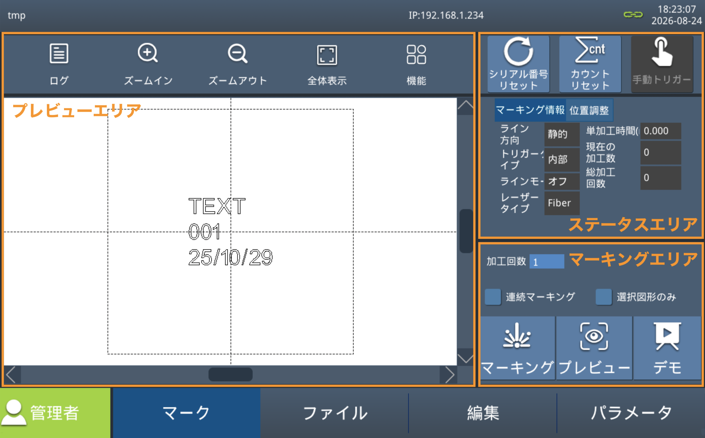

## 7.1 プレビューエリア

* ログ: ソフトウェアの動作ログが取得できます。 不具合が発生した際の確認に使用します。
* ズームイン: プレビューエリアを拡大表示します。
* ズームアウト: プレビューエリアを縮小表示します。
* 全体表示: 加工エリア全体が収まるように表示します。

## 7.2 ステータスエリア

| 項目 | 説明 |
|:---:|-----|
| シリアル番号リセット | シリアル番号機能を使用している場合に、開始番号のリセットや変更を行います。 |
| カウントリセット | 現在の加工数や総加工回数などをリセットします。 |
| 手動トリガー | トリガーモードに「内部トリガー」以外が設定されている場合に使用できます。「マークキング」状態にしてこのボタンをタップすると手動でマーキングを開始します。モードの設定は[6.2.1 トリガーモード](#621-トリガーモード)を参照してください。 |
| マーキング情報 | 各種設定や現在の加工数などが表示されます。 |
| 位置調整 | オブジェクトの位置や角度を調整します。 |

## 7.3 マーキングエリア

| 項目 | 説明 |
|:---:|-----|
| マーキング | タップすることでマーキング状態になり、ボタンが「停止」に切り替わります。 内部トリガーを設定している場合、すぐにレーザー照射が始まる場合があります。 マーキング状態を終了する場合は「停止」をタップしてください。 |
| プレビュー | レーザーポインターで加工範囲を表示します。 |
| デモ | マーキングの順序や動作を確認できます。表示される最大ライン速度を参考に、ライン速度や加工速度を調整してください。 |
| 連続マーキング | 有効にすると、マーキングを連続して行います。無効の場合は、1回のマーキングが終了するとマーキング状態が自動的に解除されます。 |
| 選択図形のみ | 有効にすると、選択した図形のみをマーキングします。 |

# 8. 外部機器との通信

## 8.1 外部からの文字列指定

インラインレーザーマーカーのテキスト機能は外部デバイスからのデータ入力に対応しています。
あらかじめ文字列（QRコードやデータマトリクス等も含む）の位置や大きさを設定したテキストオブジェクトをファイル上に作成しておくことで、加工文字列を外部デバイスから受信して刻印を行うことが可能です。

外部通信は下記の方法に対応しています。
- TCP通信
- シリアル通信（RS232）

### 8.1.1 TCP通信の例

下記の例はコントローラとデバイス（PC）を LAN ケーブルで一対一で接続した場合の設定例です。

事前準備

**[1] LAN ケーブル接続**
1. PCとコントローラをLANケーブルで接続します。コントローラ側のLANコネクタは画面裏にあります。

**[2] コントローラの IP アドレス設定**
1. 「パラメータ」タブ > システム設定 > 高度な設定 > ネットワーク設定 を開きます。
1. IPアドレスやサブネットマスクを設定します。 
例）IPアドレス: 192.168.1.10 / サブネットマスク: 255.255.255.0 / デフォルトゲートウェイ: 192.168.1.1

**[3] 外部通信の設定**
1. 「パラメータ」タブ > システム設定 > 外部通信 を開きます。
1. 「通信プラグイン」に「plugin_tcp 0.0※」を設定します。
1. 「通信プラグイン」の設定を開き、ポート番号を適宜設定します。（例: 45678）
1. 「解析プラグイン」に「stdParser 0.0※」を設定します。 
※プラグインの数字はバージョンによって異なります。

**[4] PC のネットワーク設定**
1. PC側のLAN接続のネットワーク設定を適宜設定します。 
例）IP アドレス: 192.168.1.5 / サブネットマスク: 255.255.255.0 / デフォルトゲートウェイ: 192.168.1.1

**[5] テスト**
1. 「パラメータ」タブ > システム設定 > 外部通信を開きます。
1. 「起動」ボタンをタップします。
1. PCデバイスのターミナルで上記に接続します。 
例）$ telnet 192.168.1.10 45678
1. ターミナル上で「ABC;;」と入力し、エンターキーを押します。
1. コントローラ画面上に「ABC;;」と表示されたら正常に通信ができています。 
※「;;」はデフォルトのデータの区切り文字です。この文字列で入力完了と判断されます。

データ作成と加工

**プロジェクトの作成**
1. 「ファイル」タブ→「新規」をタップし、新しいプロジェクトを作成します。
1. 「編集」タブを開き、「テキスト」「追加」「外部データ」「OK」の順にタップします。
1. フォントや大きさなどの設定を適宜行い、右上の「確定」をタップします。

**プロジェクトの加工**
1. 上記のプロジェクトファイルを開きます。
1. 「マーク」タブを開き、「マーキング」ボタンを有効にします。
1. PC デバイスのターミナルで上記に接続します。 
例）$ telnet 192.168.1.10 45678
1. ターミナル上で文字列（例 :「TEST;;」）を入力し、エンターキーを押します。
1. 「手動トリガー」または IO などから刻印開始指示を行います。
1. 文字列が「TEST」に置き換わり、刻印されます。

### 8.1.2 シリアル通信の例

下記の例はコントローラとデバイス（PC）をシリアル通信ケーブルで接続した場合の設定例です

事前準備

**[1] シリアル通信ケーブル接続**
1. PCとコントローラをシリアル通信ケーブルで接続します。コントローラ側のシリアルコネクタは画面裏にあります。

**[2] 外部通信の設定**
1. 「パラメータ」タブ→システム設定→外部通信を開きます。
1. 「通信プラグイン」に「plugin_com 0.0※」を設定します。
1. 「通信プラグイン」の設定を開き、シリアルポートを「ttyS2」に設定します。必要に応じてボーレート等を適宜設定します。
1. 「解析プラグイン」に「stdParser 0.0※」を設定します。 
※プラグインの数字はバージョンによって異なります。

**[3] テスト**
1. 「パラメータ」タブ→システム設定→外部通信を開きます。
2. 「起動」ボタンをタップします。
3. PC デバイスのターミナルで上記に接続します。 
例）$ screen /dev/ttyUSB0 9600　（デバイス名は環境によって異なります）
4. ターミナル上で「ABC;;」と入力し、エンターキーを押します。
5. コントローラ画面上に「ABC;;」と表示されたら正常に通信ができています。 
※「;;」はデフォルトのデータの区切り文字です。この文字列で入力完了と判断されます。

データ作成と加工

**プロジェクトの作成**
1. 「ファイル」タブ→「新規」をタップし、新しいプロジェクトを作成します。
1. 「編集」タブを開き、「テキスト」「追加」「外部データ」「OK」の順にタップします。
1. フォントや大きさなどの設定を適宜行い、右上の「確定」をタップします。

**プロジェクトの加工**
1. 上記のプロジェクトファイルを開きます。
1. 「マーク」タブを開き、「マーキング」ボタンを有効にします。
1. PC デバイスのターミナルで上記に接続します。 
例）$ screen /dev/ttyUSB0 9600
1. ターミナル上で文字列（例 :「TEST;;」）を入力し、エンターキーを押します。
1. 「手動トリガー」または IO などから刻印開始指示を行います。
1. 文字列が「TEST」に置き換わり、刻印されます。

## 8.2 コマンド制御

コマンド制御機能を有効にすることで、外部通信によるコマンド制御（加工操作やデータの編集）が可能になります。 
※この機能を使用する場合は[6.9.2 外部通信](#692-外部通信)の解析プラグインの設定項目にある「コマンド制御」にチェックを入れてください。

コマンド制御は下記の通信方法に対応しています。
- TCP通信
- シリアル通信（RS232）

コマンド制御機能を有効にした場合でも、外部からの文字列指定機能は利用できます。

### 8.2.1 プロトコル形式

- 送信内容: `開始記号` `内容` `終了記号`
- 受信内容: `開始記号` `内容` `終了記号`

開始記号と終了記号はインターフェース上で設定可能で、デフォルトでは開始記号は空で、終了記号は「;;」です。
以下のプロトコル説明は、すべてこのデフォルトの開始記号と終了記号を例としています。 
また、設定は16進数表示をサポートします。例えば、開始記号がASCIIの02である場合、0x02と設定できます。
<!-- プロトコルの内容は、コマンド制御タイプとデータタイプの2種類に分かれます。 -->

送信されたコマンド形式が正しくない場合、外部データ用の文字列として解釈され「 receive;; 」を返します。

### 8.2.2 コマンド一覧

以下の送信例は、開始記号を「」（空文字）、終了記号を「;;」に設定している場合の例です。

<!-- Original ID: 1 -->

1. コントロールボード接続状態の取得 - GetLinkStatus

コントロールボードの接続状態を取得します。

<table>
<tr><td>コマンド</td><td>GetLinkStatus</td></tr>
<tr><td>送信例</td><td>GetLinkStatus;;</td></tr>
<tr><td>返信例</td><td>1;;</td></tr>
</table>

0：未接続 / 1：接続済み

<!-- Original ID: 2 -->

2. システム動作状態の取得 - GetMarkStatus

現在のシステムの動作状態を取得します。

<table>
<tr><td>コマンド</td><td>GetMarkStatus</td></tr>
<tr><td>送信例</td><td>GetMarkStatus;;</td></tr>
<tr><td>返信例</td><td>0;;</td></tr>
</table>

0：アイドル（待機） / 1：シミュレーション中 / 2：マーキング中 / 3：プレビュー中 / 4：レーザー校正テスト中 / 5：赤色ガイド光校正テスト中 / 6：レーザー強制出力中 / 7：回転マーキング中 / 8：赤色ガイド光フォーカス中

<!-- Original ID: 3 -->

3. マーキングカウントの取得 - GetCount

マーキングに関するカウント情報を取得します。総マーキング数、連続マーキング数、マーキング漏れ回数、直近のマーキング所要時間が含まれます。

<table>
<tr><td>コマンド</td><td>GetCount</td></tr>
<tr><td>送信例</td><td>GetCount;;</td></tr>
<tr><td>返信例</td><td>2,1,0,100;;</td></tr>
</table>

返信値は順に、総マーキング数、連続マーキング数、マーキング漏れ回数、直近のマーキング所要時間（単位：ms）を示します。 
返信例では、総マーキング数：2、連続マーキング数：1、マーキング漏れ回数：0、所要時間：100msです。 
なお、取得前にレーザーテストまたはプレビューを実行した場合は、所要時間などが返されます。

<!-- Original ID: 4 -->

4. 総マーキング数の取得 - GetMarkedCount

総マーキング数を取得します。

<table>
<tr><td>コマンド</td><td>GetMarkedCount</td></tr>
<tr><td>送信例</td><td>GetMarkedCount;;</td></tr>
<tr><td>返信例</td><td>2;;</td></tr>
</table>

返信例の2は、総マーキング数を示します。

<!-- Original ID: 5 -->

5. マーキング漏れ回数の取得 - GetMissedCount

マーキング漏れ回数を取得します。

<table>
<tr><td>コマンド</td><td>GetMissedCount</td></tr>
<tr><td>送信例</td><td>GetMissedCount;;</td></tr>
<tr><td>返信例</td><td>0;;</td></tr>
</table>

返信例の0は、マーキング漏れ回数を示します。

<!-- Original ID: 6 -->

6. カウントのクリア - ClearCount

マーキングに関するカウント情報をクリアします。

<table>
<tr><td>コマンド</td><td>ClearCount</td></tr>
<tr><td>送信例</td><td>ClearCount;;</td></tr>
<tr><td>返信例</td><td>Ok;;</td></tr>
</table>

クリアに失敗した場合は、Failed,ErrorInfoが返されます。ErrorInfoにはエラーの詳細が含まれます。例えば、is marking;はマーキング中のためカウントをクリアできないことを示します。

<!-- Original ID: 7 -->

7. テンプレートのテキスト内容の取得 - GetMarkData

現在のテンプレートに含まれるテキスト、QRコード、バーコードの内容を全て取得します。

<table>
<tr><td>コマンド</td><td>GetMarkData</td></tr>
<tr><td>送信例</td><td>GetMarkData;;</td></tr>
<tr><td>返信例</td><td>DATA1DATA2;;</td></tr>
</table>

DATA1、DATA2の順に、対象となる図形の内容が返されます。対象となる図形がない場合は空になります。 
各文字列は、それぞれの図形で前回マーキングした内容を示します。

<!-- Original ID: 8 -->

8. ライン方向の取得 - GetAssemblyLineDir

現在のライン方向を取得します。

<table>
<tr><td>コマンド</td><td>GetAssemblyLineDir</td></tr>
<tr><td>送信例</td><td>GetAssemblyLineDir;;</td></tr>
<tr><td>返信例</td><td>0;;</td></tr>
</table>

0：右から左 / 1：左から右

<!-- Original ID: 9 -->

9. ライン方向の設定 - SetAssemblyLineDir

ライン方向を設定します。

<table>
<tr><td>コマンド</td><td>SetAssemblyLineDir</td></tr>
<tr><td>送信例</td><td>SetAssemblyLineDir,1;;</td></tr>
<tr><td>返信例</td><td>Ok;;</td></tr>
</table>

0：右から左 / 1：左から右 
設定は次回のマーキングから有効になります。

<!-- Original ID: 10 -->

10. ライン動作方式の取得 - GetAssemblyLineType

現在のライン動作方式（エンコーダ、固定ライン速度、静的マーク）を取得します。

<table>
<tr><td>コマンド</td><td>GetAssemblyLineType</td></tr>
<tr><td>送信例</td><td>GetAssemblyLineType;;</td></tr>
<tr><td>返信例</td><td>0;;</td></tr>
</table>

0：エンコーダ / 1：固定ライン速度 / 2：静的マーク

<!-- Original ID: 11 -->

11. ライン動作方式の設定 - SetAssemblyLineType

ライン動作方式（エンコーダ、固定ライン速度、静的マーク）を設定します。

<table>
<tr><td>コマンド</td><td>SetAssemblyLineType</td></tr>
<tr><td>送信例</td><td>SetAssemblyLineType,0;;</td></tr>
<tr><td>返信例</td><td>Ok;;</td></tr>
</table>

0：エンコーダ / 1：固定ライン速度 / 2：静的マーク 
設定は次回のマーキングから有効になります。

<!-- Original ID: 12 -->

12. パルス間距離パラメータの取得 - GetEncodeParam

現在のエンコーダのパルス間距離を取得します。この設定は、ライン動作方式が「エンコーダ」の場合のみ有効です。

<table>
<tr><td>コマンド</td><td>GetEncodeParam</td></tr>
<tr><td>送信例</td><td>GetEncodeParam;;</td></tr>
<tr><td>返信例</td><td>20.00;;</td></tr>
</table>

返信例の20.00は、現在設定されているパルス間距離を示します（単位：µm/p）。

<!-- Original ID: 13 -->

13. パルス間距離パラメータの設定 - SetEncodeParam

エンコーダのパルス間距離を設定します。この設定は、ライン動作方式が「エンコーダ」の場合のみ有効です。

<table>
<tr><td>コマンド</td><td>SetEncodeParam</td></tr>
<tr><td>送信例</td><td>SetEncodeParam,20.0;;</td></tr>
<tr><td>返信例</td><td>Ok;;</td></tr>
</table>

設定は次回のマーキングから有効になります。

<!-- Original ID: 14 -->

14. 固定ライン速度の取得 - GetFixSpeed

現在の固定ライン速度を取得します。この設定は、ライン動作方式が「固定ライン速度」の場合のみ有効です。

<table>
<tr><td>コマンド</td><td>GetFixSpeed</td></tr>
<tr><td>送信例</td><td>GetFixSpeed;;</td></tr>
<tr><td>返信例</td><td>20.00;;</td></tr>
</table>

返信例の20.00は、現在設定されている固定ライン速度を示します（単位：m/min）。

<!-- Original ID: 15 -->

15. 固定ライン速度の設定 - SetFixSpeed

固定ライン速度を設定します。この設定は、ライン動作方式が「固定ライン速度」の場合のみ有効です。

<table>
<tr><td>コマンド</td><td>SetFixSpeed</td></tr>
<tr><td>送信例</td><td>SetFixSpeed,20.0;;</td></tr>
<tr><td>返信例</td><td>Ok;;</td></tr>
</table>

設定は次回のマーキングから有効になります。

<!-- Original ID: 16 -->

16. トリガー遅延パラメータの取得 - GetTriggerDelay

現在のトリガー遅延設定（遅延方式と遅延値）を取得します。

<table>
<tr><td>コマンド</td><td>GetTriggerDelay</td></tr>
<tr><td>送信例</td><td>GetTriggerDelay;;</td></tr>
<tr><td>返信例</td><td>1,100;;</td></tr>
</table>

1番目の値は遅延方式を示します（0：オフ / 1：距離 / 2：時間）。 
2番目の値は遅延値を示します。遅延方式が1の場合は距離（単位：mm）、2の場合は時間（単位：ms）です。

<!-- Original ID: 17 -->

17. トリガー遅延パラメータの設定 - SetTriggerDelay

トリガー遅延設定（遅延方式と遅延値）を設定します。

<table>
<tr><td>コマンド</td><td>SetTriggerDelay</td></tr>
<tr><td>送信例</td><td>SetTriggerDelay,1,100;;</td></tr>
<tr><td>返信例</td><td>Ok;;</td></tr>
</table>

1番目の値は遅延方式を示します（0：オフ / 1：距離 / 2：時間）。 
2番目の値は遅延値を示します。遅延方式が1の場合は距離（単位：mm）、2の場合は時間（単位：ms）です。 
設定は次回のマーキングから有効になります。

<!-- Original ID: 18 -->

18. ラインパイプトリガー間隔パラメータの取得 - GetPipIntveralDistance

現在のトリガー間隔距離を取得します。

<table>
<tr><td>コマンド</td><td>GetPipIntveralDistance</td></tr>
<tr><td>送信例</td><td>GetPipIntveralDistance;;</td></tr>
<tr><td>返信例</td><td>100;;</td></tr>
</table>

返信例の100は、現在設定されているトリガー間隔を示します（単位：mm）。

<!-- Original ID: 19 -->

19. ラインパイプトリガー間隔パラメータの設定 - SetPipIntveralDistance

トリガー間隔距離を設定します。

<table>
<tr><td>コマンド</td><td>SetPipIntveralDistance</td></tr>
<tr><td>送信例</td><td>SetPipIntveralDistance,100;;</td></tr>
<tr><td>返信例</td><td>Ok;;</td></tr>
</table>

マーキング中に設定した場合は、即時に反映されます。

<!-- Original ID: 20 -->

20. テンプレートリストの取得 - GetDocList

システム内のドキュメントフォルダに保存されているテンプレートリストを取得します。

<table>
<tr><td>コマンド</td><td>GetDocList</td></tr>
<tr><td>送信例</td><td>GetDocList;;</td></tr>
<tr><td>返信例</td><td>1.bpd;2.bpd;;</td></tr>
</table>

返信例の1.bpd、2.bpdはテンプレート名を示します。サブフォルダ内のテンプレートは取得されません。

<!-- Original ID: 21 -->

21. 指定テンプレートを開く - OpenDoc

指定したテンプレートを開きます。このコマンドは編集状態でのみ使用できます。

<table>
<tr><td>コマンド</td><td>OpenDoc</td></tr>
<tr><td>送信例</td><td>OpenDoc,sample.bpd;;</td></tr>
<tr><td>返信例</td><td>Ok;;</td></tr>
</table>

拡張子（.bpd）を含むファイル名を指定します（例：01.bpd）。 
サブフォルダ内のテンプレートを指定する場合は、フォルダ名/ファイル名.bpdの形式で指定します（例：OpenDoc,mydir/03.bpd;;）。

<!-- Original ID: 22 -->

22. テンプレートの切り替え - SwitchDoc

マーキングに使用するテンプレートを切り替えます。このコマンドはマーキング状態でのみ使用できます。マーキング中に実行した場合は、現在のマーキング完了後、次回のマーキングから切り替わります。待機中に実行した場合は、次回のマーキングから切り替わります。
加工パラメータの変更を反映する場合は、一度マーキング状態を終了し、再度開始する必要があります。

<table>
<tr><td>コマンド</td><td>SwitchDoc</td></tr>
<tr><td>送信例</td><td>SwitchDoc,sample.bpd;;</td></tr>
<tr><td>返信例</td><td>Ok;;</td></tr>
</table>

拡張子（.bpd）を含むファイル名を指定します（例：01.bpd）。 
サブフォルダ内のテンプレートを指定する場合は、フォルダ名/ファイル名.bpdの形式で指定します（例：SwitchDoc,mydir/03.bpd;;）。

<!-- Original ID: 23 -->

23. テンプレートの保存 - SaveCurrentDoc

現在のテンプレートを保存します。このコマンドはマーキング状態以外でのみ使用できます。

<table>
<tr><td>コマンド</td><td>SaveCurrentDoc</td></tr>
<tr><td>送信例</td><td>SaveCurrentDoc;;</td></tr>
<tr><td>返信例</td><td>Ok;;</td></tr>
</table>

<!-- Original ID: 24 -->

24. テンプレートを名前を付けて保存 - SaveDocAs

現在のテンプレートを指定したファイル名でローカルディレクトリに保存します。

<table>
<tr><td>コマンド</td><td>SaveDocAs</td></tr>
<tr><td>送信例</td><td>SaveDocAs,sample2.bpd;;</td></tr>
<tr><td>返信例</td><td>Ok;;</td></tr>
</table>

拡張子（.bpd）を含むファイル名を指定します。

<!-- Original ID: 25 -->

25. テンプレートの図形リストの取得 - GetShapeList

現在のテンプレートに含まれる図形オブジェクトの一覧を取得します。図形名はテンプレート内の並び順で返されます。

<table>
<tr><td>コマンド</td><td>GetShapeList</td></tr>
<tr><td>送信例</td><td>GetShapeList;;</td></tr>
<tr><td>返信例</td><td>Shape1;Shape2;;</td></tr>
</table>

返信例では、Shape1が1番目、Shape2が2番目の図形名を示します。 
図形名（オブジェクト名）は、「編集」タブのリストからも確認できます。

<!-- Original ID: 26 -->

26. 指定図形のテキスト内容の取得 - GetShapeData

指定した図形のテキスト内容を取得します（複数指定可）。テキスト、QRコード、バーコードにのみ使用できます。編集状態では現在の内容、マーキング状態では前回マーキングした内容を取得します。

<table>
<tr><td>コマンド</td><td>GetShapeData</td></tr>
<tr><td>送信例</td><td>GetShapeData,Shape1,Shape2;;</td></tr>
<tr><td>返信例</td><td>text1;text2;;</td></tr>
</table>

返信例では、text1が1番目、text2が2番目に指定した図形のテキスト内容を示します。

<!-- Original ID: 27 -->

27. 指定図形の位置の取得 - GetShapePos

指定した図形の位置を取得します（複数指定可）。位置は Rect(x, y, w, h) 形式で、図形の左下座標（x, y）と幅（w）、高さ（h）が返されます。

<table>
<tr><td>コマンド</td><td>GetShapePos</td></tr>
<tr><td>送信例</td><td>GetShapePos,Shape1,Shape2;;</td></tr>
<tr><td>返信例</td><td>Shape1,x1,y1,w1,h1;Shape2,x2,y2,w2,h2;;</td></tr>
</table>

Shape1、Shape2は指定した図形名を示します。 
x、yは図形の左下座標、wは幅、hは高さを示します。 
テキスト、QRコード、バーコード、図形にのみ使用できます。

<!-- Original ID: 28 -->

28. 指定図形の位置の設定 - SetShapePos

指定した図形の位置を設定します（複数指定可）。位置は Rect(x, y, w, h) 形式で、x、yに図形の左下座標、wに幅、hに高さを指定します。

<table>
<tr><td>コマンド</td><td>SetShapePos</td></tr>
<tr><td>送信例</td><td>SetShapePos,Shape1,x1,y1,w1,h1;Shape2,x2,y2,w2,h2;;</td></tr>
<tr><td>返信例</td><td>ok;;</td></tr>
</table>

Shape1、Shape2は指定する図形名を示します。 
x、yは図形の左下座標、wは幅、hは高さを指定します。 
設定に失敗した場合は Failed,ErrorInfo が返されます。ErrorInfoにはエラーの詳細が含まれます。 
テキスト、QRコード、バーコード、図形にのみ使用できます。

<!-- Original ID: 29 -->

29. 指定図形のテキスト内容、位置、角度の設定 - SetShapeData

指定した図形のテキスト内容、位置、回転角度を設定します（複数指定可）。位置と回転を同時に指定した場合は、「移動→回転」の順に処理されます。
テキスト内容の設定は、テキスト、QRコード、バーコードにのみ使用でき、対象の図形に固定テキストが1つ設定されている場合に限ります。

<table>
<tr><td>コマンド</td><td>SetShapeData</td></tr>
<tr><td>送信例</td><td>SetShapeData,Shape1,text1,posx1,posy1,postype1,angle1,cx1,cy1,rottype1;Shape2,text2,posx2,posy2,postype2,angle2,cx2,cy2,rottype2;;</td></tr>
<tr><td>返信例</td><td>ok;;</td></tr>
</table>

Shape1：対象の図形名を指定します。空の場合は、すべての図形が対象となります。この場合、テキスト内容は設定できません。 
text1：図形のテキスト内容を指定します。 
posx1：相対移動の場合はX方向の移動量、絶対移動の場合は図形中心のX座標を指定します。 
posy1：相対移動の場合はY方向の移動量、絶対移動の場合は図形中心のY座標を指定します。 
postype1：移動方式を指定します（0：相対移動 / 1：絶対移動）。 
angle1：回転角度を指定します。 
cx1：回転中心のX座標を指定します。空の場合は図形自体の中心を基準に回転します。 
cy1：回転中心のY座標を指定します。空の場合は図形自体の中心を基準に回転します。 
rottype1：回転方式を指定します（0：相対回転 / 1：絶対回転）。相対回転を行った場合、回転後の角度が0°として扱われます。 
 
各パラメータは省略できます。テキスト内容のみを変更する場合は、text1より後のパラメータを省略できます。 
例1：Shape1の内容をtext1、Shape2の内容をtext2に変更する場合 
SetShapeData,Shape1,text1;Shape2,text2;; 
例2：すべての図形をひとまとまりとして中心点（0, 0）へ移動する場合 
SetShapeData,,,0,0,1;;

<!-- Original ID: 30 -->

30. キャッシュデータを送信して指定図形のテキスト、位置、角度を変更 - PushShapeData

キャッシュデータを使用して、指定した図形のテキスト内容、位置、回転角度を変更します（複数指定可）。カメラを使用した位置補正システムとの連携などに使用できます。
このコマンドは、システムがマーキング状態で、外部通信の「キャッシュモード」が有効な場合のみ使用できます。
位置と回転角度の変更は元データには反映されず、キャッシュデータにのみ適用されます。テキスト内容を変更した場合は、文字列のみ元データにも反映されます。
テキスト内容の変更は、テキスト、QRコード、バーコードにのみ使用でき、対象の図形に固定テキストが1つ設定されている場合に限ります。

<table>
<tr><td>コマンド</td><td>PushShapeData</td></tr>
<tr><td>送信例</td><td>PushShapeData,Shape1,text1,posx1,posy1,postype1,angle1,cx1,cy1,0;Shape2,text2,posx2,posy2,postype2,angle2,cx2,cy2,0;;</td></tr>
</table>

各パラメータについては、SetShapeDataを参照してください。 
変更したテキスト内容がプレビュー画面に反映されるまでに時間がかかる場合は、「パラメータ > 高度な設定 > リアルタイム更新」を有効にしてください。位置および回転角度の変更は、プレビュー画面には反映されません。 
キャッシュサイズは「パラメータ > マーキング方法 > その他」で設定します。 
 
例：すべての図形をX方向に10、Y方向に20相対移動し、その後、すべての図形の中心を基準に90°回転する場合 
PushShapeData,,,10,20,0,,,90;;

<!-- Original ID: 31 -->

31. キャッシュデータのクリア - ClearCache

PushShapeDataで送信されたすべてのキャッシュデータをクリアします。

<table>
<tr><td>コマンド</td><td>ClearCache</td></tr>
<tr><td>送信例</td><td>ClearCache;;</td></tr>
<tr><td>返信例</td><td>Ok;;</td></tr>
</table>

<!-- Original ID: 32 -->

32. 指定ベクター図形の変更 - SetVectorgraphData

指定したベクター図形の内容を変更します。このコマンドは編集状態でのみ使用できます。

<table>
<tr><td>コマンド</td><td>SetVectorgraphData</td></tr>
<tr><td>送信例</td><td>SetVectorgraphData,Shape1,plt,data;;</td></tr>
</table>

Shape1：変更するベクター図形名を指定します。 
plt：ベクターファイル形式を指定します（plt / dxf / ai）。 
data：ベクターファイルのデータストリームを指定します。 
通信速度が遅い場合、データの送信中にタイムアウトが発生することがあります。

<!-- Original ID: 33 -->

33. ペンパラメータの取得 - GetPen

指定したペン番号のパラメータを取得します。

<table>
<tr><td>コマンド</td><td>GetPen</td></tr>
<tr><td>送信例</td><td>GetPen,0,MarkSpeed,Power;;</td></tr>
<tr><td>返信例</td><td>4000,80;;</td></tr>
</table>

送信例の0はペン番号を示します（0～15）。 
MarkSpeed（加工速度）、JumpSpeed（ジャンプ速度）、Power（パワー）、PW（パルス幅）、MopaPW（Mopaパルス幅）、Freq（周波数）、PointTime（ドット時間）などのパラメータを取得できます。 
返信例では、4000が加工速度、80がパワーを示します。

<!-- Original ID: 34 -->

34. ペンパラメータの設定 - SetPen

指定したペン番号のパラメータを設定します。設定は、次回マーキング状態に移行したときに有効になります。

<table>
<tr><td>コマンド</td><td>SetPen</td></tr>
<tr><td>送信例</td><td>SetPen,ID,0;MarkSpeed,4000;Power,80;;</td></tr>
</table>

ID,0：ペン番号0を指定します。 
MarkSpeed,4000：加工速度を4000に設定します。 
Power,80：パワーを80に設定します。

<!-- Original ID: 35 -->

35. マーキング対象図形の指定 - MarkShape

マーキング対象の図形を指定します（複数指定可）。指定できる図形は、テキスト、QRコード、バーコードに限ります。
このコマンドはマーキング状態でのみ使用でき、設定は次回のマーキングから有効になります。

<table>
<tr><td>コマンド</td><td>MarkShape</td></tr>
<tr><td>送信例</td><td>MarkShape,Shape1,Shape2;;</td></tr>
</table>

Shape1、Shape2：マーキング対象の図形名を指定します。 
テンプレート内のすべての図形をマーキングする場合は、MarkShape;;を送信します。

<!-- Original ID: 36 -->

36. マーキング状態の開始 - StartMark

システムをマーキング状態に移行します。

<table>
<tr><td>コマンド</td><td>StartMark</td></tr>
<tr><td>送信例</td><td>StartMark;;</td></tr>
<tr><td>返信例</td><td>Ok;;</td></tr>
</table>

<!-- Original ID: 37 -->

37. マーキング状態の終了 - StopMark

システムをアイドル状態に移行します。

<table>
<tr><td>コマンド</td><td>StopMark</td></tr>
<tr><td>送信例</td><td>StopMark;;</td></tr>
<tr><td>返信例</td><td>Ok;;</td></tr>
</table>

<!-- Original ID: 38 -->

38. プレビューの開始 - StartRedMark

システムをプレビュー状態に移行します。

<table>
<tr><td>コマンド</td><td>StartRedMark</td></tr>
<tr><td>送信例</td><td>StartRedMark;;</td></tr>
<tr><td>返信例</td><td>Ok;;</td></tr>
</table>

<!-- Original ID: 39 -->

39. 手動トリガーの入力 - ManualTrgger

トリガー待ち状態のときに、マーキングを手動で開始します。このコマンドはマーキング状態でのみ使用できます。

<table>
<tr><td>コマンド</td><td>ManualTrgger</td></tr>
<tr><td>送信例</td><td>ManualTrgger;;</td></tr>
<tr><td>返信例</td><td>Ok;;</td></tr>
</table>

<!-- Original ID: 40 -->

40. シリアル番号のリセット - ClearSN

テンプレート内のすべてのシリアル番号を初期値にリセットします。マーキング中に実行した場合は、次回のマーキングから有効になります。

<table>
<tr><td>コマンド</td><td>ClearSN</td></tr>
<tr><td>送信例</td><td>ClearSN;;</td></tr>
<tr><td>返信例</td><td>Ok;;</td></tr>
</table>

<!-- Original ID: 45 -->

41. テンプレート名の取得 - GetCurDoc

現在のテンプレート名を取得します。

<table>
<tr><td>コマンド</td><td>GetCurDoc</td></tr>
<tr><td>送信例</td><td>GetCurDoc;;</td></tr>
<tr><td>返信例</td><td>1.bpd;;</td></tr>
</table>

<!-- Original ID: 53 -->

42. テンプレートを開いてマーキング状態に移行 - OpenDocMark

指定したテンプレートを開き、そのままマーキング状態に移行します。

<table>
<tr><td>コマンド</td><td>OpenDocMark</td></tr>
<tr><td>送信例</td><td>OpenDocMark,file;;</td></tr>
<tr><td>返信例</td><td>Ok;;</td></tr>
</table>

拡張子（.bpd）を含むファイル名を指定します（例：01.bpd）。 
加工設定によってはそのままレーザー照射が始まります。

<!-- Original ID: 56 -->

43. 指定図形の選択状態の設定 - SetShapeSelectState

指定した図形の選択／非選択を設定します。

<table>
<tr><td>コマンド</td><td>SetShapeSelectState</td></tr>
<tr><td>送信例</td><td>SetShapeSelectState,shapeName,mode;;</td></tr>
<tr><td>返信例</td><td>Ok;;</td></tr>
</table>

shapeName：対象の図形名を指定します。 
mode：選択状態を指定します（0：非選択 / 1：選択）。

<!-- Original ID: 57 -->

44. 選択図形のみフラグの設定 - SetSelectMark

選択した図形のみをマーキング対象にするかどうかを設定します。

<table>
<tr><td>コマンド</td><td>SetSelectMark</td></tr>
<tr><td>送信例</td><td>SetSelectMark,mode;;</td></tr>
<tr><td>返信例</td><td>Ok;;</td></tr>
</table>

mode：選択図形のみの有効／無効を指定します（0：無効 / 1：有効）。

<!-- Original ID: 58 -->

45. 連続マーキングの設定 - SetContinueMark

連続マーキング機能の有効／無効を設定します。

<table>
<tr><td>コマンド</td><td>SetContinueMark</td></tr>
<tr><td>送信例</td><td>SetContinueMark,mode;;</td></tr>
<tr><td>返信例</td><td>Ok;;</td></tr>
</table>

mode：連続マーキングの有効／無効を指定します（0：無効 / 1：有効）。

<!-- Original ID: 59 -->

46. 指定図形のテキストサイズ設定 - SetShapeFont

指定したテキストオブジェクトの文字高さと文字間隔を設定します。

<table>
<tr><td>コマンド</td><td>SetShapeFont</td></tr>
<tr><td>送信例</td><td>SetShapeFont,shapeName,height,width;;</td></tr>
<tr><td>返信例</td><td>Ok;;</td></tr>
</table>

shapeName：対象の図形名を指定します。 
height：文字の高さを指定します。 
width：文字間隔を指定します。

# 9. 付録

## 9.1 レンズの交換方法

レンズ交換・焦点の調整方法は、各製品の製品マニュアル「レンズ」に記載されている「レンズ交換」「高さ調整用レーザーポインター調整」の項目をご覧ください。

**製品マニュアル**

LM110C ｜ https://www.smartdiys.com/assets/pdf/fiber-laser-marking-machine-lm110c-manual.pdf
 
LM140R ｜ https://www.smartdiys.com/assets/pdf/co2-laser-marking-machine-lm140r-manual.pdf
 
LM110U ｜ https://www.smartdiys.com/assets/pdf/uv-laser-marking-machine-lm110u-jpt-manual.pdf

レンズを交換した場合は補正ファイルも変更する必要があります。
補正ファイルが存在しない場合は、[9.2 補正ファイルの作成](#92-補正ファイルの作成)を行なってください。

※ レンズを頻繁に取り替える場合などは、ポインター以外の高さ調整方法（実測での運用やZ軸の目盛りの活用等）もご検討ください。

## 9.2 補正ファイルの作成

この設定はパラメータタブの「加工エリア」画面にて行います。

※下記の作業は省略・中断せず、必ず全ての作業を最後まで実施してください。

 

<!--  -->

1. 初期設定

1. **比率補正** の項目をX軸・Y軸ともに **100%** に設定します。
1. **可動エリア・加工エリア** の設定値を確認します。 
※レンズごとに適切な設定値が異なりますので、[6.5.1 ガルバノスキャナ設定](#651-ガルバノスキャナ設定)を参照して値を入力してください。
1. **樽型** の補正値に **X軸: 1.05** / **Y軸: 0.96** を入力してください。

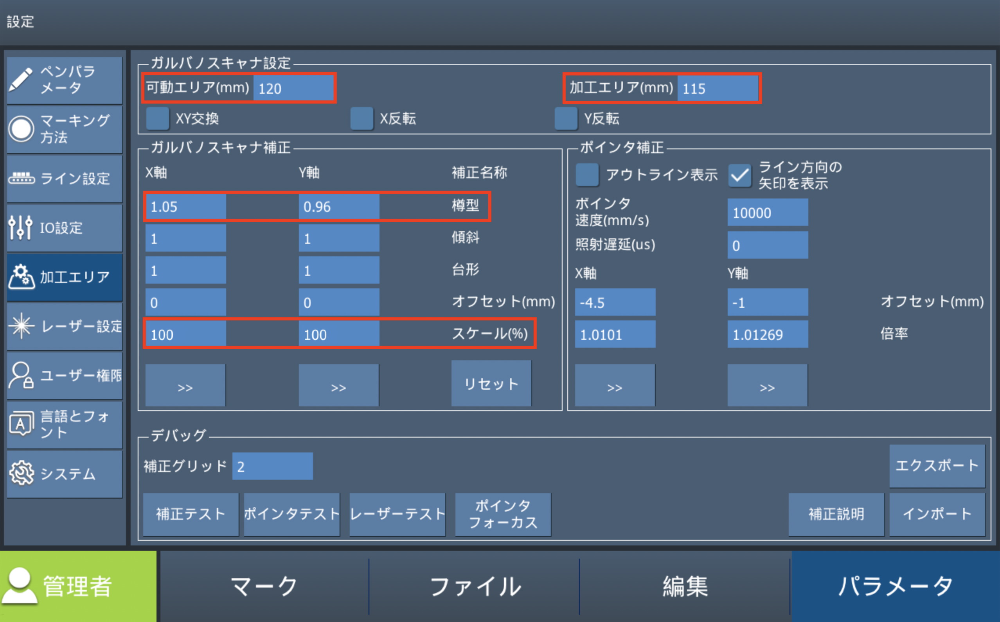

2. 補正値の調整と加工確認

歪み補正

テスト加工を行います。**加工エリアより大きい平な素材**を配置し、高さ調整を行なってください。 
**補正テスト** をタップして加工を行い、現在の歪みを確認します。 
※タップと同時に加工が始まります。必ず保護メガネを着用して操作してください。

テスト加工では下記の画像のような四角が加工されます。四角に歪みが発生している場合は上記の **樽型** の補正値を **±0.01** ずつ変更して補正テストを行なってください。この操作を繰り返し、許容できる範囲まで歪みを低減してください。

<!-- 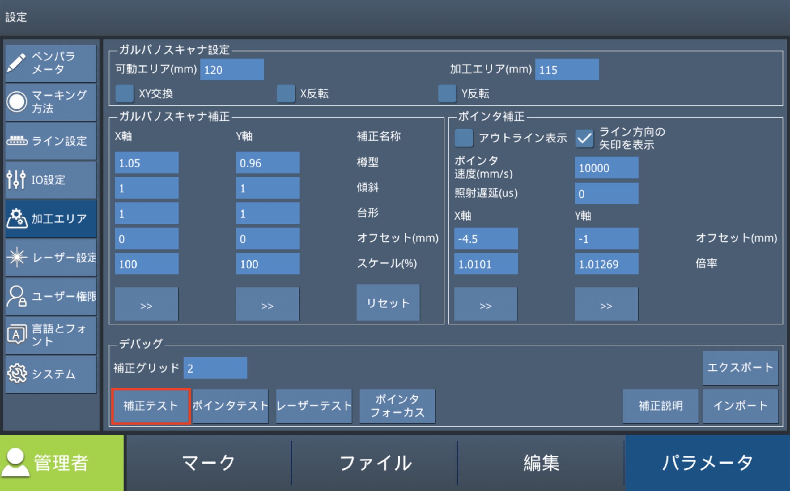 -->

<table class="noframe">
<tr>
<td></td>
<td>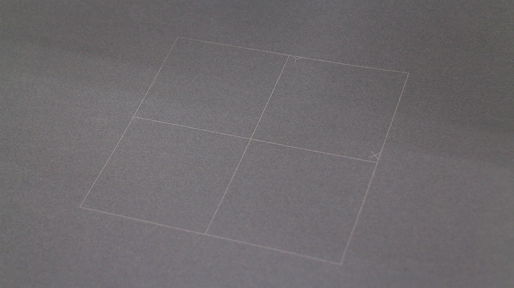</td>
</tr>
</table>

<!--  -->

樽型の補正を行うことで基本的な歪みは補正できます。さらに精度を上げたい場合は[6.5.2 ガルバノスキャナ補正](#652-ガルバノスキャナ補正)を参考に、傾斜・台形の補正値の調整もお試しください。

大きさ補正

歪みがなくなったら、図形の縦幅と横幅を測定します。

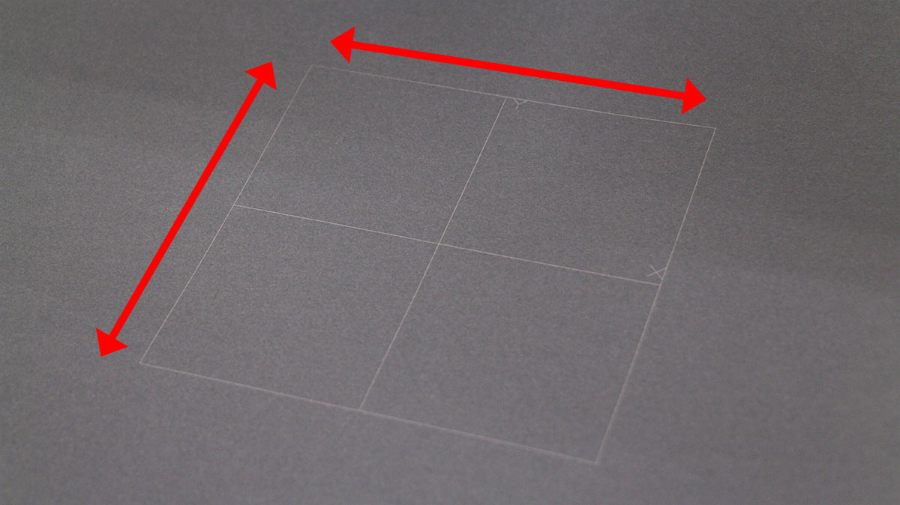

各軸の「>>」ボタンをそれぞれタップし、測定した数値を **「実サイズ」** に入力します。

<table class="noframe">
<tr>
<td>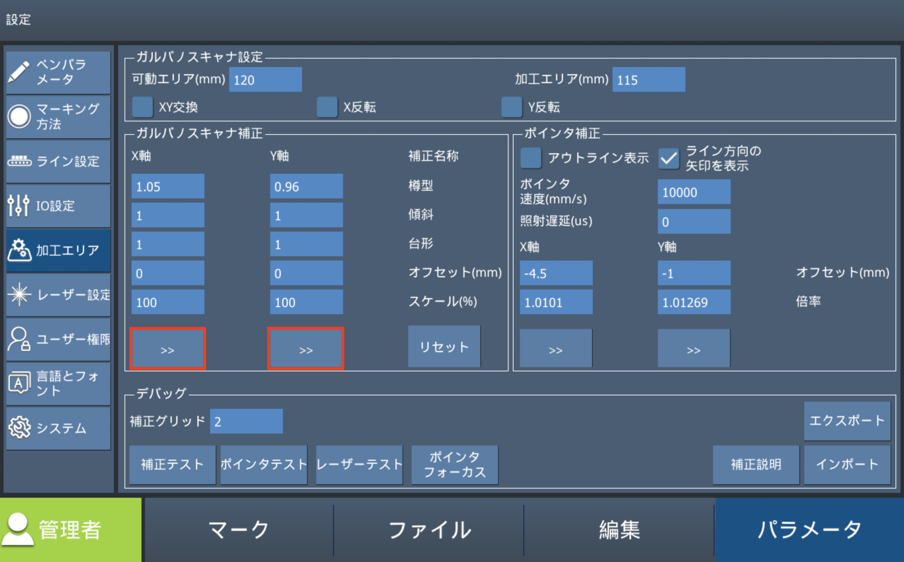</td>
<td>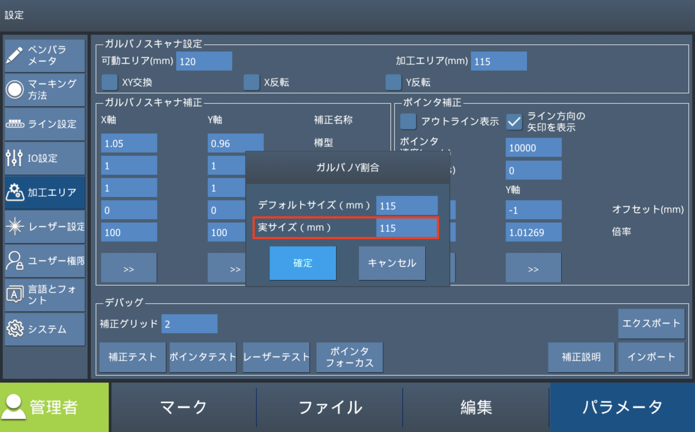</td>
</tr>
</table>

これにより **スケール** の値が自動で修正されます。

再度「補正テスト」を行い、加工された四角のサイズが設定した加工エリアの値（115mm/205mm/305mm）と同じかどうかを確認します。

※レンズとのズレがある場合はスケールを 100% に戻して補正テストを行い、計測および実サイズの入力を再度行ってください。

3. 補正ファイルの保存

補正が完了したら補正ファイルを保存します。
「エクスポート」をタップし、ファイル名を入力し（ここでは「110」としています）、「確定」をタップしてください。

<table class="noframe">
<tr>
<td>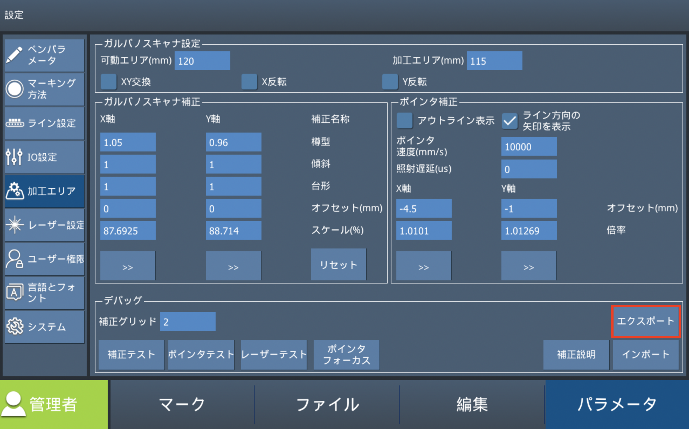</td>
<td>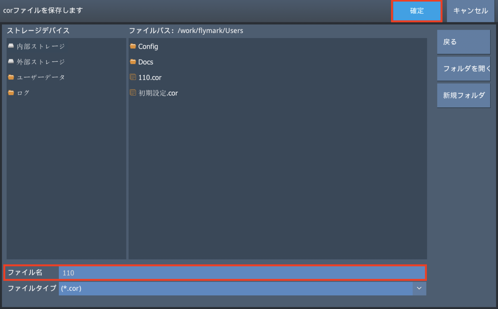</td>
</tr>
</table>

調整ファイルの切り替えを行う場合、「インポート」を選択し、変更したいファイルを選択してください。
<td></td>

## 9.3 ログの操作

### 9.3.1 ログレベルの変更

パラメータタブの「システム設定」画面を開き、「高度な設定」を表示します。
ログレベルを「デバッグ」に設定すると、より詳細なログを取得できます。（ログファイルの容量は大きくなります）
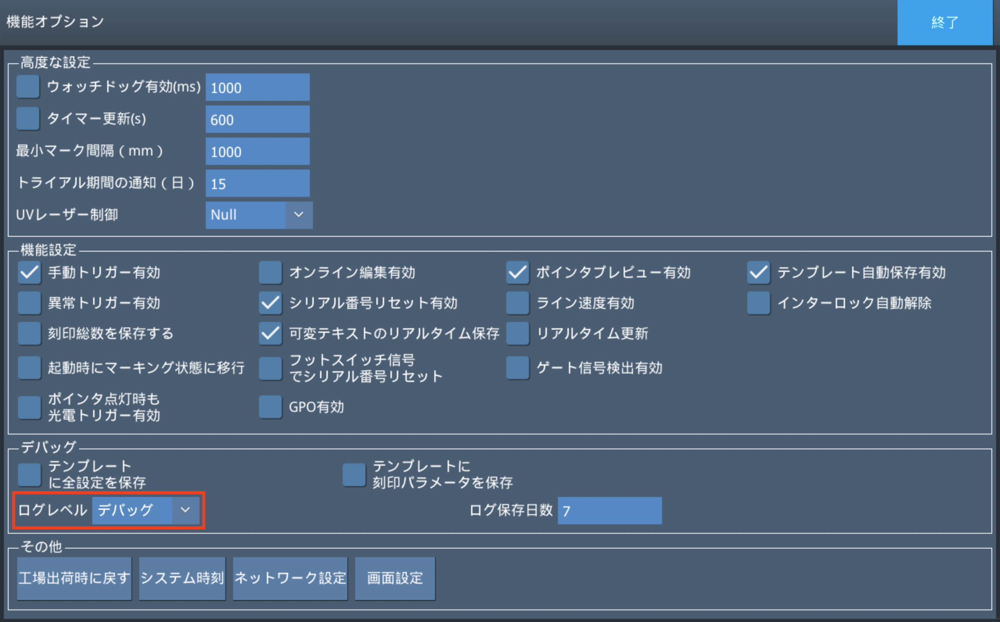

### 9.3.2 ログファイルのエクスポート

あらかじめ USB メモリを本体パネルの USB ポートに接続します。 
ファイルタブの「管理」画面を開き、ログフォルダ内で対象のログファイルを選択して「コピー」ボタンをタップします。
続いて USB メモリのフォルダを選択し、「ペースト」ボタンをタップします。

<table class="noframe">
<tr>
<td>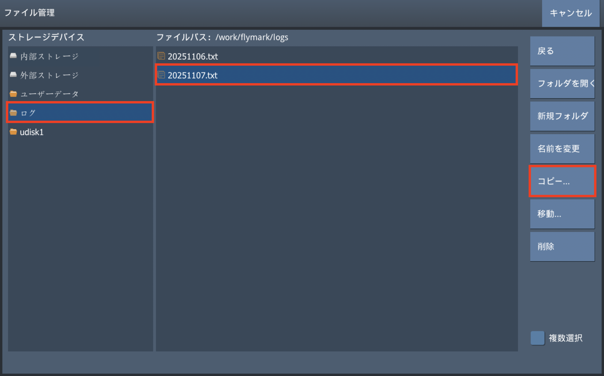</td>
<td>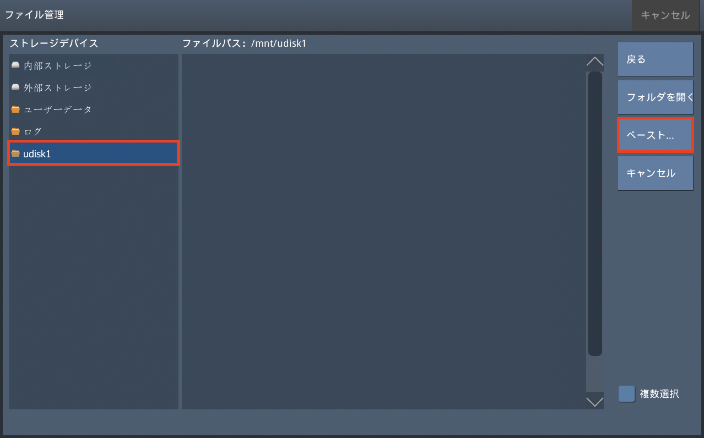</td>
</tr>
</table>

## 9.4 フォントの追加

パラメータタブの「言語とフォント」画面を表示し、画面中央右側の「フォント追加」ボタンから追加してください。
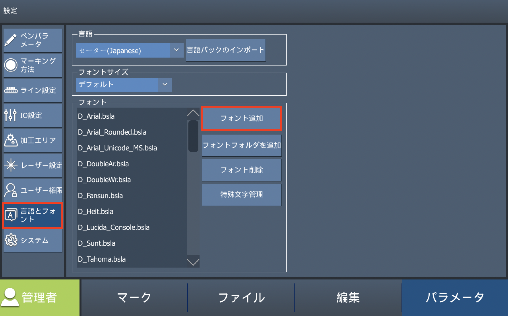

## 9.5 ユーザーデータのバックアップ

あらかじめ USB メモリを本体パネルの USB ポートに接続します。 
ファイル画面を開き、右上のメニューボタンをタップして「ユーザーデータをバックアップします」を選択します。
続いてUSBメモリフォルダを選択し、「確定」ボタンをタップします。

バックアップファイルには加工ファイルやレンズ補正ファイル、ログデータなどが含まれます。

<table class="noframe">
<tr>
<td>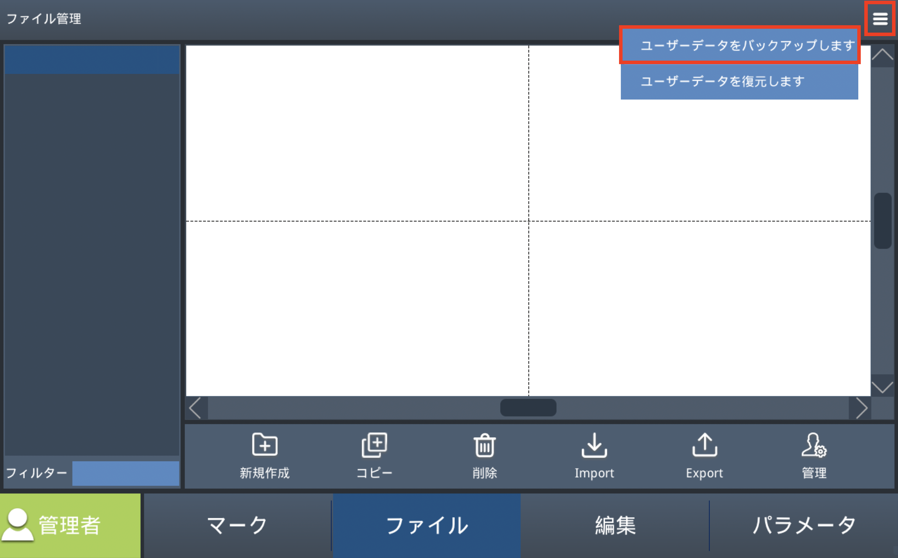</td>
<td>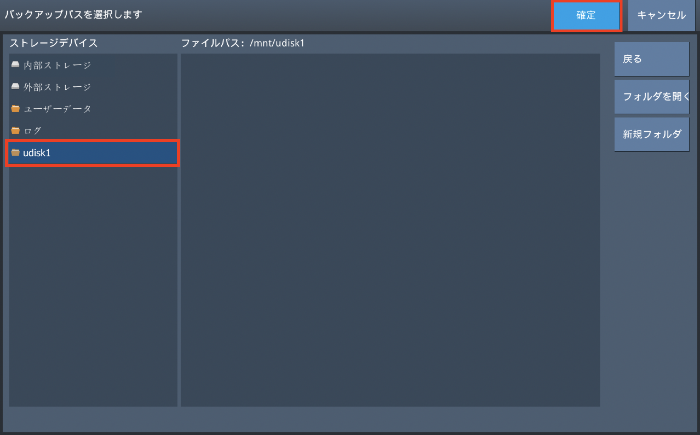</td>
</tr>
</table>

## 9.6 ソフトウェアアップデート

1. 下記URLから最新のアップデートファイルをダウンロードします。 
[https://download.smartdiys.com/inlinelasermarker/update/](https://download.smartdiys.com/inlinelasermarker/update/)
1. 空のUSBメモリにアップデートファイルを保存します。 ※ USBメモリはFAT32形式でのフォーマットを推奨します。
1. USBメモリをタッチパネル背面のUSBポートに挿入します。
1. 「パラメータ」タブから「システム」画面を開き、現在の「ソフトウェアバージョン」を確認します。 
「ソフトウェアアップグレード」→「手動アップグレード」の順にタップします。 
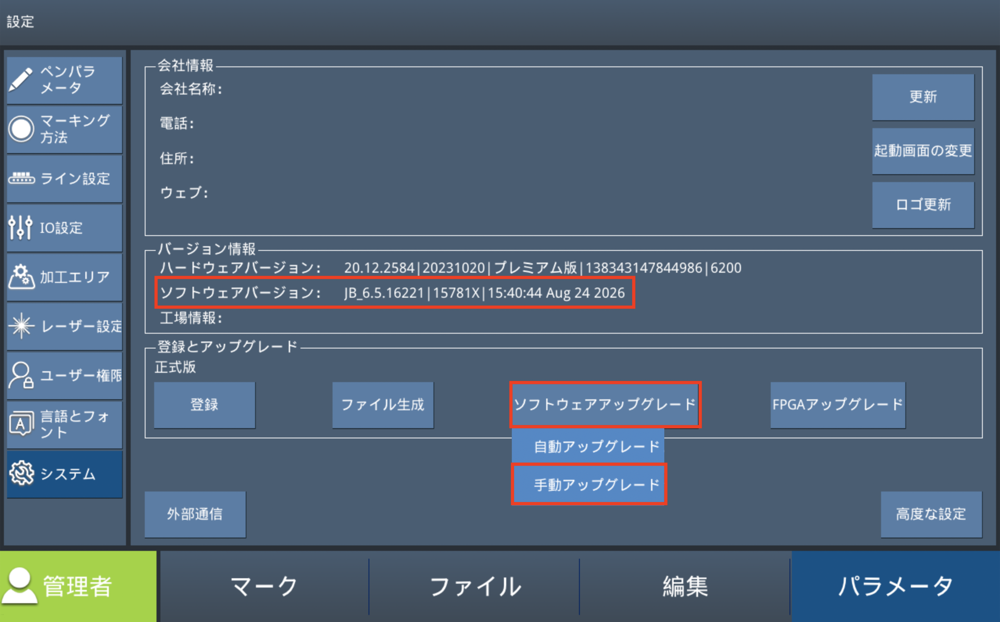
1. USBメモリ内のアップデートファイルを選択し、「確定」をタップします。 
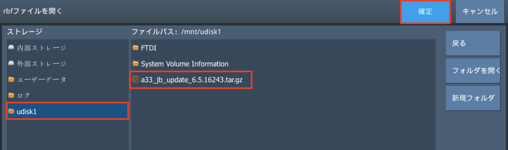
1. 確認画面が表示されたら「はい」をタップし、アップデートが完了するまで待ちます。 
※ アップデート中は、加工機の電源を切ったりUSBメモリを取り外したりしないでください。 
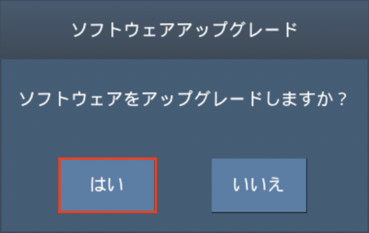
1. アップデートが完了すると、再起動の確認画面が表示されます。「はい」をタップして加工機を再起動します。
1. 再起動後、「パラメータ」タブから「システム」画面を開き、「ソフトウェアバージョン」が、ダウンロードページに記載された最新バージョンに更新されていることを確認します。

<h1>お問い合わせ</h1>

製品を使用する上で不明点や疑問点などありましたらお気軽にお問い合わせください。 

お問い合わせフォーム: <a href="https://www.smartdiys.com/contact/support/">https://www.smartdiys.com/contact/support/</a> 
電話：050-5527-0894（平日 10:00 〜 12:00 / 13:00 〜 17:00）

<!-- **本製品についてのサポート用動画などは下記ページに随時公開しています。参考にご覧ください。**
https://www.smartdiys.com/support/product/slw-robot/ -->
