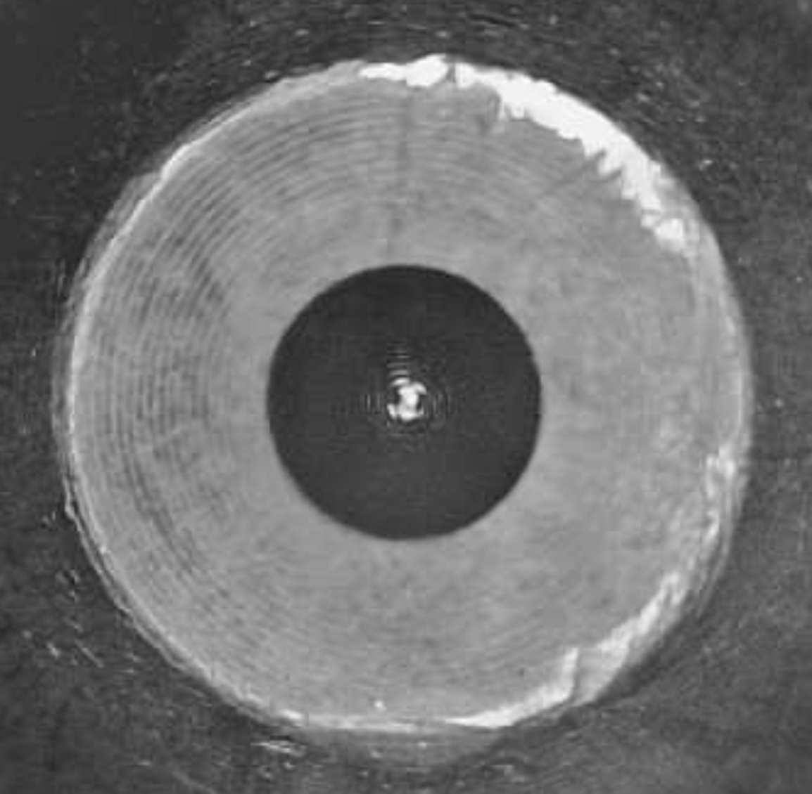
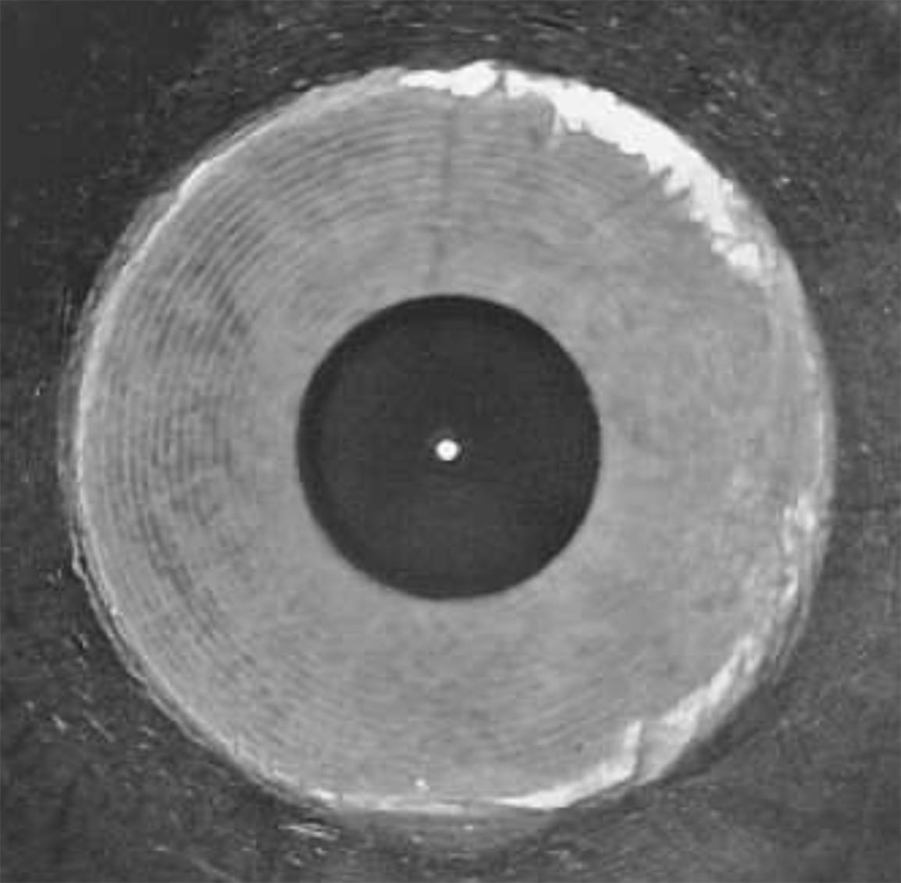

# 使用方法

## 使用前の準備

<!-- 本製品を使用した同軸調整は、以下の手順で行います。

1.  装置の位置合わせ

1.  操作画面へのアクセス

1.  ノズル穴の検出

1.  赤色ガイド光の観測・調整

1.  同軸調整

各工程を正しく行わない場合、同軸調整の精度が低下したり、正しく調整できなかったりする可能性があります。 -->

使用前に、以下の状態であることを確認してください。

- 本製品が正常に起動し、電源ボタンのLEDが緑色に点灯していること。
- 本製品が水平に設置されていること（水平器の気泡が赤い円内にあること）。
- ノズル先端に汚れや損傷がないこと。
- 切断ヘッドの移動およびレーザーの赤色ガイド光の ON / OFF 操作ができること。

本製品を使用した同軸調整では、実際のレーザー光ではなく、赤色ガイド光を使用して位置ズレを確認します。 
レーザー光を照射すると本製品が故障するため、
本製品の使用中は、絶対にレーザーを照射しないでください。

## 操作手順

### 装置の位置合わせ

1. レーザーの赤色ガイド光をONにし、本製品をノズルの真下に置きます。

1. ノズルを保護スライドカバーの上方約20 mmの位置まで移動します。

1. 本製品の位置を手動で微調整し、赤色ガイド光が保護スライドカバーの位置合わせ穴の中心に合うようにします。

1. レーザーの赤色ガイド光をOFFにし、保護スライドカバーを開きます。

切断ヘッドの高さは低速で調整し、ノズルを本製品に衝突させないよう十分に注意してください。

### 操作画面へのアクセス

1.  操作端末のWi-Fi設定を開き、「LVC-COAX01」に接続します。（パスワード:`88888888` ）

1.  操作端末のWebブラウザを開き、アドレス欄に `http://192.168.8.8`と入力して操作画面を開きます。

1.  言語選択メニューから表示言語を選択します。日本語を含む複数の言語に対応しています。

1.  動作モード選択メニューからモードを選択します。

**自動判定モード（Auto）**

同軸調整時に赤色ガイド光の中心を自動で検出し、判定結果を赤色または緑色のアウトラインで表示します。 
また、ノズル穴中心とのズレ量（dx、dy）を表示します。

**手動判定モード（Mid）**

同軸調整時に、赤色ガイド光の自動検出（アウトライン表示およびズレ量の判定）を行いません。

自動判定モードで赤色ガイド光を正しく検出できない場合は、レーザーヘッドの焦点調整ダイヤルの調整をお試しください。
反射などの影響により正しく検出できない場合は、手動判定モードを使用してください。

### 調整作業

#### Step1. ノズル穴の検出

ジョグ操作で切断ヘッドの高さを調整し、画面上のノズル像が鮮明に表示されるようにします。

切断ヘッドの高さは低速で調整し、ノズルを本製品に衝突させないよう十分に注意してください。

<table class="noframe">
<tr>
<td></td>
<td></td>
</tr>
<tr>
<td align=center>NG</td>
<td align=center>OK</td>
</tr>
</table>

操作画面の「Step1：ノズル撮影（赤色光OFF）」をクリックします。ノズル穴が自動的に検出され、検出された円が黄色の十字付き円マークで表示されます。

円マークと実際のノズル穴にズレがある場合は、切断ヘッドの高さを調整してピントを合わせ、再度ボタンをクリックしてください。

<td></td>

#### Step2. 赤色ガイド光の観測・調整

加工機を操作して、赤色ガイド光をONにします。
操作画面の「Step2：赤色光測定（赤色光ON）」をクリックし、赤色ガイド光の表示画面に切り替えます。
画面に表示される赤色ガイド光が集光され、輪郭が明瞭になるように、レーザーヘッドの焦点調整ダイヤルを調整します。

<!-- <td></td> -->

<table class="noframe" style="width: fit-content;">
<tr>
<td></td>
<td></td>
</tr>
<tr>
<td align=center>NG</td>
<td align=center>OK</td>
</tr>
</table>

#### Step3. 同軸調整

操作画面の「Step3：同軸調整」をクリックし、調整画面を表示します。

六角レンチを使用して切断ヘッドの同軸調整ねじを回し、画面を確認しながら、赤色円（赤色ガイド光）の中心と黄色円（ノズル穴）の中心が一致するように調整します。

<!-- ※自動判定モード（Auto）の場合、`dx` と `dy` がともに `0`になれば同軸調整完了です。 -->

<table class="noframe">
<tr>
<td></td>
<td></td>
</tr>
<tr>
<td align=center>NG</td>
<td align=center>OK</td>
</tr>
</table>

#### Step4. 調整完了

操作画面の「Step4：カメラOFF」をクリックし、本製品の電源をOFFにします。

