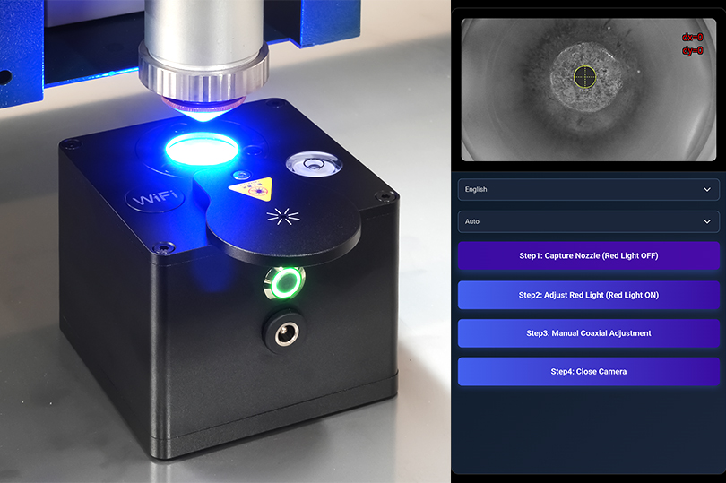
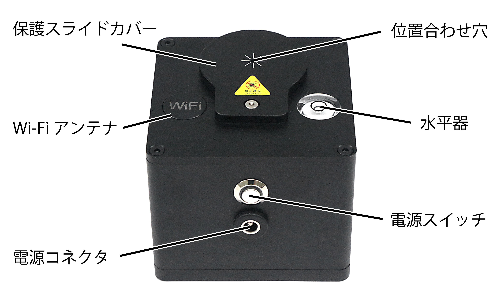
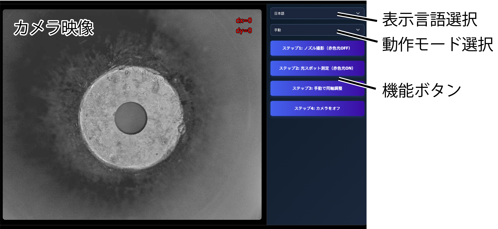
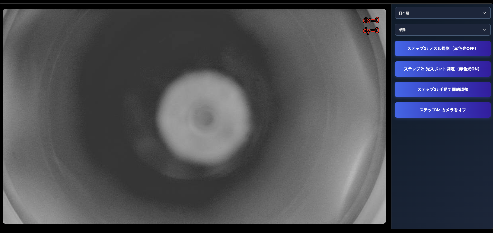
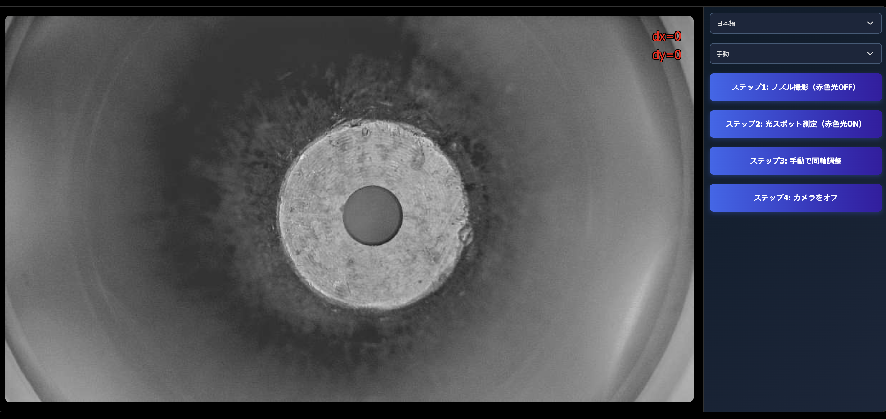
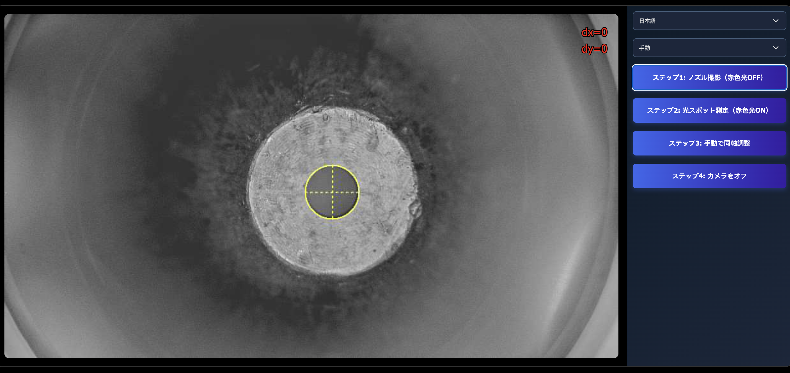
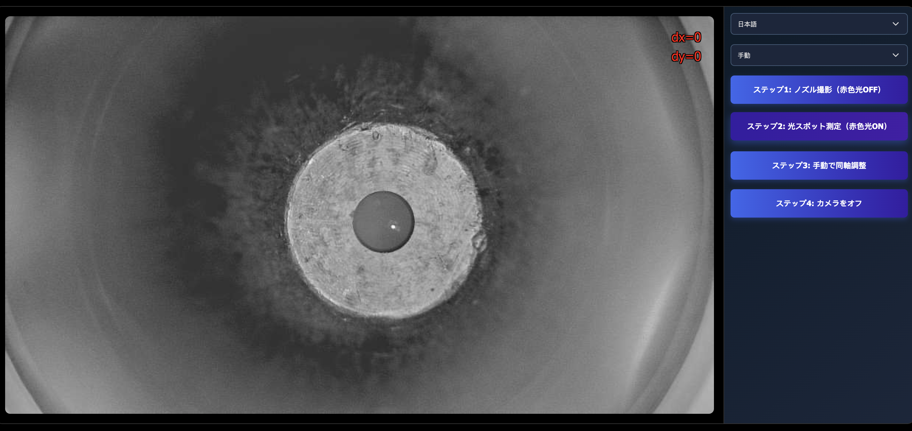
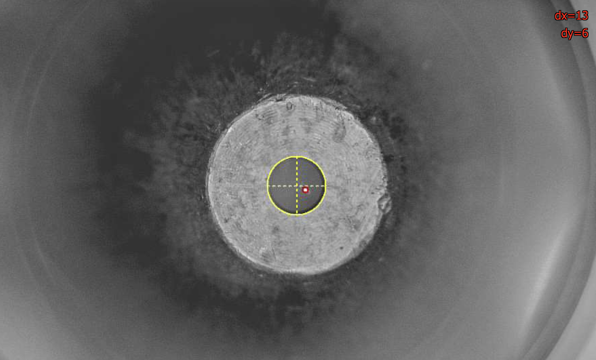
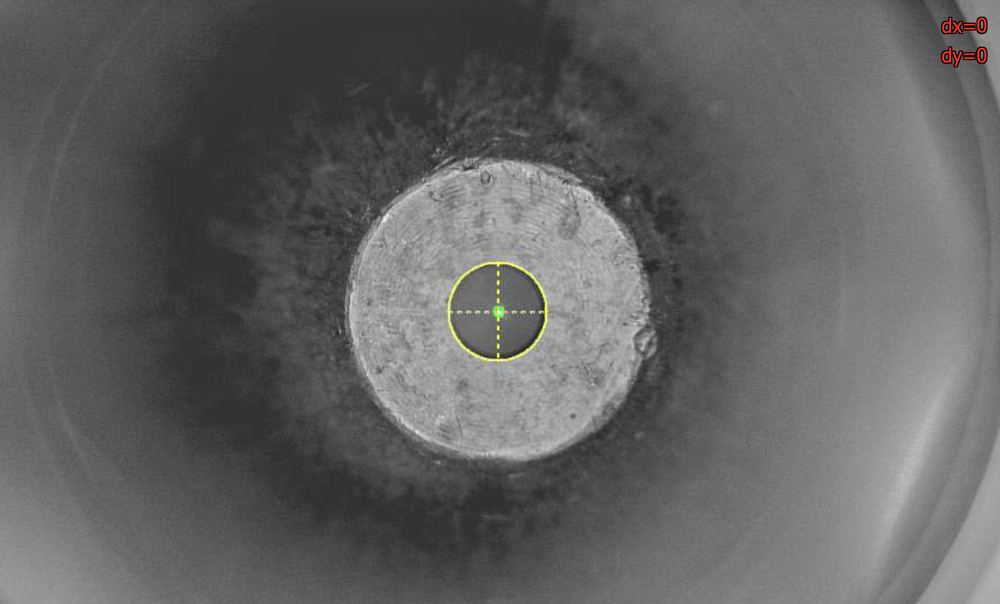

---
puppeteer:
    format: 'A4'
    headerTemplate: '

'
    footerTemplate: '
  
'
    displayHeaderFooter: true
---

レーザーノズルアライナー 
製品マニュアル

第 0 版  
発行日 2026年0月00日 

# 1. 概要

## 1.1 はじめに

この度は レーザーノズルアライナー をご購入いただきありがとうございます。 

本マニュアルでは、製品仕様や操作手順、保守および注意事項などの重要な情報が記載されています。ご使用前に本マニュアルをよくお読みください。
また、安全な操作と製品を最良の状態で使用するため、本マニュアルの注意事項を厳守してください。

## 1.2 使用上のご注意

ご使用前に、本マニュアルを最後までお読みいただき、各機能を十分に理解したうえで操作してください。

- 本製品の使用中は絶対にレーザーを照射しないでください。
- 60 ℃ を超える環境で使用しないでください。
- 水漏れのある環境で使用しないでください。
- 装置を投げたり落としたり、硬い物で圧迫したりしないでください。
- 許可なく装置を分解・組み立てしないでください。無断で分解した場合、アフターサービスの対象外となります。
- 使用後は電源をOFFにしてください。
- 保管時はスライドカバーを閉じて保護レンズの汚れを防止してください。
- 保護レンズに汚れやほこりが付着した場合は、乾いた柔らかい布などで拭き取ってください。
- 導電性のある液体や腐食性の高い液体を多量に付着させないでください。

<!--
## 1.3 製品保証

初期不良・標準保証

<table class="warranty-table">
  <tr class="colthead">
    <td></td>
    <td class="nowrap">期間</td>
    <td class="nowrap">対応修理方式</td>
    <td class="nowrap">検査・修理・部品費用</td>
    <td class="nowrap">往復送料</td>
  </tr>
  <tr>
    <td class="rowhead">初期不良</td>
    <td class="center nowrap">30日</td>
    <td class="center" rowspan="3">お客様にて修理、 または弊社での預かり修理</td>
    <td class="center nowrap">無料</td>
    <td class="center nowrap">弊社負担</td>
  </tr>
  <tr>
    <td class="rowhead">標準保証</td>
    <td class="center nowrap">1年間</td>
    <td class="center nowrap">無料</td>
    <td class="center nowrap">お客様負担</td>
  </tr>
  <tr>
    <td class="rowhead">標準保証経過後</td>
    <td class="center nowrap">2年目以降〜</td>
    <td class="center nowrap">有料</td>
    <td class="center nowrap">お客様負担</td>
  </tr>
</table>

- 消耗品は初期不良を除き保証対象外です。
- 標準保証は、製品の取扱説明書や注意事項に従って使用したにもかかわらず製品に故障・不具合が生じた場合を対象とします。お客様の過失により故障・不具合が生じた場合は、有償での対応となります。
- 製品のメンテナンスやクリーニング、消耗品の交換などは、お客様自身で行っていただきます。
- 故障・不具合が発生した場合は、お客様自身での修理対応となります。修理方法は PDF マニュアルや動画でご案内し、必要に応じてビデオ通話等にてご説明いたします。ただし、お客様にて修理が難しい箇所の故障・不具合の場合は、弊社に返送いただいての預かり修理となる場合があります。
- 弊社スタッフがお客様に訪問して行う修理・メンテナンスは実施しておりません。
- 修理に必要な工具や部品は、標準保証期間内であれば弊社から無料で発送します。標準保証期間経過後の場合は、ご購入いただきます。
- 弊社は、故障・不具合を、写真・動画で確認します。
- 保証期間は、製品がお客様の元へ到着した日から起算するものとします。
- 標準保証期間経過後の検査及び修理費用は、1 時間あたり 4,000 円 ( 税別 ) となります。

-->

## 1.4 免責事項について

本製品の使用を理由とする破損・ケガ・事故・火災につきましては、いかなる責任も負いかねますのであらかじめご了承ください。
また、当社は以下に記載する損害に関して、一切責任を負いません。
- 本製品の使用または部品の不良などから生ずる付随的な損害
- 本マニュアルに記載の「使用上のご注意」を守らないことにより生じた損害
- 本製品の改造、または当社が関与しない機器やソフトウェアとの組み合わせが原因で生ずる損害

## 1.5 製品仕様

| 項目 | 仕様 |
|:--:|---|
| 精度 | < 0.08 mm |
| 重量 | 621 g（バッテリー含む） |
| 外形寸法 | 83 mm（長さ）× 83 mm（幅）× 83 mm（高さ） |
| 電源 | 外部電源（8.4V 1A）または内蔵バッテリー（14500 × 2） |
| 動作モード | 自動判定モード（Auto）／手動判定モード（Mid） |
| 使用温度 | 0～50 ℃ |

# 2. 製品説明

## 2.1 製品外観

主な各部の名称は以下のとおりです。

## 2.2 操作画面

操作画面には、以下の項目があります。

## 2.3 電源

本製品は、内蔵バッテリーと外部電源の2種類の電源方式に対応しています。

本体に電源プラグを接続すると、内蔵バッテリーを充電できます。充電中は、電源アダプタのLEDランプが赤色に点灯します。
電源アダプタを接続した状態でも本製品を使用でき、使用中もバッテリーを充電できます。

充電完了が近づいた場合、電源アダプタのLEDランプの表示（赤・緑）が不規則に切り替わる場合があります。

<!-- ## 電源

本製品は、内蔵バッテリーと外部電源の2種類の電源方式に対応しています。

### 2.3.1 バッテリー

本体底部のバッテリー収納部には、14500充電池が2本取り付けられています。

1.  対応する六角レンチを使用して2本の皿六角穴付きねじを外します。
2.  バッテリーカバーを開けます。
3.  バッテリーのマイナス極を内部のスプリング側に向けて取り付けます。
4.  バッテリーカバーを元の位置に戻します。
5.  ねじを締め付けます。

### 2.3.2 充電方法

本体に電源プラグを接続すると、バッテリーを充電できます。充電中は、電源アダプタのLEDランプが赤色に点灯します。
バッテリーを取り付けたまま電源アダプタを接続し、充電しながら本製品を使用することもできます。

充電完了が近づいた場合、電源アダプタのLEDランプの表示（赤・緑）が不規則に切り替わる場合があります。

 -->

# 3. 使用方法

## 3.1 使用前の準備

本製品を使用した同軸調整は、以下の手順で行います。

1.  装置の位置合わせ

1.  操作画面へのアクセス

1.  ノズル穴の検出

1.  赤色ガイド光の観測・調整

1.  同軸調整

各工程を正しく行わない場合、同軸調整の精度が低下したり、正しく調整できなかったりする可能性があります。

使用前に、以下の状態であることを確認してください。

- 本製品が正常に起動し、電源ボタンのLEDが緑色に点灯していること。
- 本製品が水平に設置されていること（水平器の気泡が赤い円内にあること）。
- ノズル先端に汚れや損傷がないこと。
- 切断ヘッドの移動およびレーザーの赤色ガイド光のON/OFF操作ができること。

## 3.2 操作手順

### 3.2.1 装置の位置合わせ

1. レーザーの赤色ガイド光をONにし、本製品をノズルの真下に置きます。

2. ノズルを保護スライドカバーの上方約20 mmの位置まで移動します。

3. 本製品の位置を手動で微調整し、赤色ガイド光が保護スライドカバーの位置合わせ穴の中央に入るようにします。

4. レーザーの赤色ガイド光をOFFにします。

切断ヘッドの高さは低速で調整し、ノズルを本製品に衝突させないよう十分に注意してください。

### 3.2.2 操作画面へのアクセス

1.  操作端末のWi-Fi設定を開き、「LVC-COAX01」に接続します。（パスワード:`88888888` ）
2.  操作端末のWebブラウザを開き、アドレス欄に `http://192.168.8.8`と入力して操作画面を開きます。
3.  言語選択メニューから表示言語を選択します。日本語を含む複数の言語に対応しています。
4.  動作モード選択メニューからモードを選択します。

**自動判定モード（Auto）**

同軸調整時に赤色ガイド光の中心を自動で検出し、ノズル穴中心とのズレ量（dx, dy）を画面上に表示します。

**手動判定モード（Mid）**

同軸調整時に自動判定機能をOFFにします。

自動判定モードで赤色ガイド光を正しく検出できない場合は、レーザーヘッドの焦点調整ダイヤルを微調整すると改善することがあります。
反射などの影響により正しく検出できない場合は、手動判定モードの使用を推奨します。

### 3.2.3 調整作業

#### Step1. ノズル穴の検出

ジョグ操作で切断ヘッドの高さを調整し、画面上のノズル像が鮮明に表示されるようにします。

<table class="noframe">
<tr>
<td></td>
<td></td>
</tr>
<tr>
<td align=center>NG</td>
<td align=center>OK</td>
</tr>
</table>

操作画面の「Step1：ノズル撮影（赤色光OFF）」をクリックします。ノズル穴が自動的に検出され、検出された円が黄色の十字付き円マークで表示されます。

円マークと実際のノズル穴にズレがある場合は、切断ヘッドの高さを調整してピントを合わせ、再度ボタンをクリックしてください。

<td></td>

#### Step2. 赤色ガイド光の観測・調整

加工機を操作して、赤色ガイド光をONにします。
操作画面の「Step2：赤色光測定（赤色光ON）」をクリックし、赤色ガイド光の表示画面に切り替えます。

画面に表示される赤色ガイド光が、明瞭で安定した光点になるように、レーザーヘッドの焦点調整ダイヤルを調整します。

<td></td>

#### Step3. 同軸調整

操作画面の「Step3：同軸調整」をクリックし、調整画面を表示します。

六角レンチを使用して切断ヘッドの同軸調整ねじを回し、画面を確認しながら、赤色円（赤色ガイド光）の中心と黄色円（ノズル穴）の中心が一致するように調整します。

※自動判定モード（Auto）の場合、`dx` と `dy` がともに `0`になれば同軸調整完了です。

<table class="noframe">
<tr>
<td></td>
<td></td>
</tr>
<tr>
<td align=center>NG</td>
<td align=center>OK</td>
</tr>
</table>

#### Step4. 調整完了

操作画面の「Step4：カメラOFF」をクリックし、本製品の電源をOFFにします。

# 4. トラブルシューティング

ブラウザの操作画面がフリーズして操作できない

操作画面を再読み込みしてください。改善しない場合は、本製品を再起動してください。

ノズル穴を円として認識できない

ノズル先端に汚れや損傷がないか確認してください。汚れている場合は清掃し、損傷がある場合は新品のノズルに交換してください。

カメラ映像の遅延が大きい

Wi-Fiの信号強度を確認し、操作端末を本製品に近づけてください。操作端末と本製品の距離は、1.5 m以内を推奨します。

保護レンズが汚れている

レンズクリーナーと清掃用具（綿棒、無塵布など）を使用して、汚れを拭き取ってください。

接続時にWi-Fiアクセスポイントが表示されない

電源LEDが緑色に点灯していることを確認してください。しばらく待ってから、操作端末のWi-Fiアクセスポイント一覧を更新してください。

改善しない場合は、本製品を再起動してください。

<h1>お問い合わせ</h1>

製品の使用方法や設定について、ご不明な点やご質問がありましたら、お気軽にお問い合わせください。 

お問い合わせフォーム: <a href="https://www.smartdiys.com/contact/support/">https://www.smartdiys.com/contact/support/</a> 
電話：050-5527-0894（平日 10:00 〜 12:00 / 13:00 〜 17:00）

<!--
本製品の最新マニュアルおよびサポート情報は、下記ページに随時掲載しています。あわせてご参照ください。

https://www.smartdiys.com/support/product/lm100p/

-->